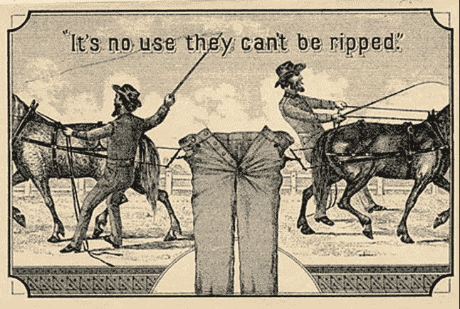
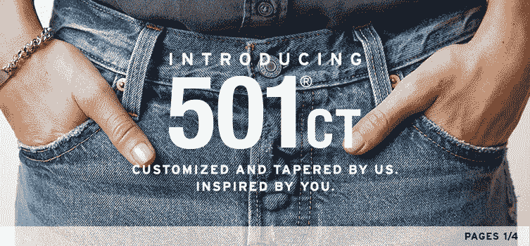
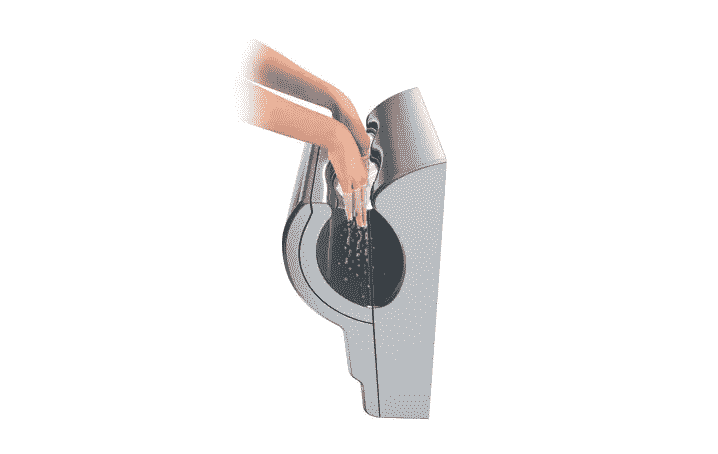
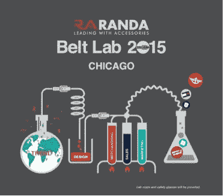
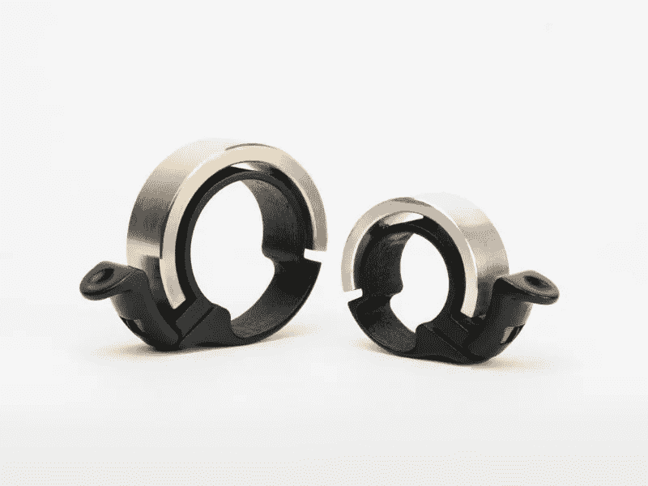
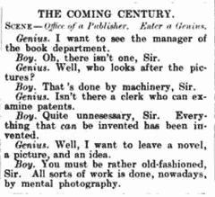

# 能发明的都发明了

> 原文：<https://medium.com/swlh/everything-that-can-be-invented-has-been-invented-49c4376f548b>

1889 年，查尔斯·h·杜尔是美国专利局的专员。人们普遍引用他的话说，专利局将很快缩小规模，并最终关闭，因为…

> “能发明的都发明了。”

*Charles H. Duell*, 1899*

“尤里卡”效应基于一个关于希腊数学家阿基米德的古老神话，阿基米德发现如何测量不规则物体的体积后，据说从公共浴室里跳出来，光着身子跑回家，大喊“尤里卡”(我找到了)。

我们大多数人都会同意，仍然有许多发明和发现。我们倾向于认为这些新的“发明”会比之前的那些更加非凡、先进和创新。这并不完全正确。许多先前的进步是革命性的和非凡的。一项发明不一定是革命性的，甚至是独特的，才是重要的。最后，许多“新”发明是其前辈的衍生物。

从门锁到灯泡，从铲子到马桶，再到经典的捕鼠器，创新以多种形式从多个方向出现，而且往往就在我们的眼皮底下。切片面包？瓶装水？

没有什么东西是如此的基本或如此的伟大，以至于它不能被做得更好。

马蒂·马歇尔是我在哈佛商学院的营销学教授，也是我的私人导师。在我们的第一个案例研究中，他教我们“研究鱼”，然后再仔细研究，你会注意到以前未发现的新的细微差别…然后再一次。这一信息强调，不管已知多少，还有更多的东西需要知道。

不管你认为你对你的产品、品牌和客户了解多少，还有很多东西需要学习。知识带来了相关的创新。

发明引发创新，创新引发变革，然而这些概念却不可避免地纠缠在一起。

**Levi Strauss &公司**研究了他们不断变化的顾客以及他们 1873 年创作的 501 标志性牛仔蓝牛仔裤。李维斯注意到，“世界各地”的裁缝要求最多的修改是对经典 501 的裤腿进行卷边和削尖。因此，今年，李维斯重新发明了内置“定制和渐缩”功能的经典蓝色牛仔裤:[新款李维斯 501ct。](http://www.levi.com/US/en_US/501ct)

Levi’s 501 Blue Jeans

首先是树叶，然后是手巾，然后是人们可以拉出并重复使用的布卷。(想想就恶心……)接下来是“折叠纸巾机”最近，“热风干燥机”取代了毛巾分配器。

现在，**戴森**正在用他们的“空气叶片”[http://airblade.dyson.com](http://airblade.dyson.com/)替换空气干燥器:

> 其他干手器会将病毒和细菌吹到手上，其中一些来自粪便……”

咳咳。

根据维基百科，

> "从青铜时代开始，腰带就被记录为男性服装的标志."大约在公元前 2500 年

**兰达饰品**(【http://www.randa.net】的)是世界男士饰品公司。最近，该公司仔细研究了他们的核心分类之一；皮带；他们每年售出 4000 多万条皮带。兰达挥舞着一把双刃剑；令人羡慕的行业主导地位以及持续两位数增长的巨大障碍。“腰带就是腰带；”有些人把这一类别视为“商品”。对兰达来说，不是；他们研究他们的鱼。需要可能是发明或创新之母。

本月，兰达开设了“腰带实验室”。该实验室的目标是将整个皮带市场的规模扩大一倍。最近的创新包括皮带孔的重新发明——现在用夹在皮革层之间的“工业强度”材料加固，改进的“正在申请专利”的可逆皮带扣技术(黑色到棕色，皮革到织物，连衣裙到休闲装)，新的皮革“拉伸”皮带功能，新的销售点固定装置，新的尺寸和颜色补充模型，等等…(更多信息请阅读新闻稿，[此处](http://www.prweb.com/releases/Randa_Belt-Lab/Chicago/prweb12796165.htm))。

# 【丁】:自行车铃 v2.0

英国发明家约翰·理查德·德迪科特在 19 世纪末设计了自行车铃。他的设想——一个简单的圆形金属片，带有一个小杠杆，发出简单的“叮”声——已经持续了一个多世纪。

> “没有人愿意在一辆价值 8000 美元的碳纤维公路自行车上安装一个价值 5 美元的中国铃铛。”

澳大利亚自行车配件公司 Knog 的联合创始人兼首席设计师雨果·戴维森说。

Oi 是一个看起来或听起来都不像自行车铃的自行车铃。这是一块光滑的钛金属，像手镯一样缠绕在车把上。

**为了获得灵感，**更密切、更频繁地观察你的核心产品、品牌和客户。

*   **多花点时间陪陪你的顾客**。观察他们，倾听他们。
*   **记住，你的客户一直在变化。拥抱变化或忍受变化。**
*   **使用自己的产品和服务。**客户拥有最终的投票权，他们会为优秀的产品和服务投票。
*   **使用有竞争力的产品和服务**。不要目光短浅。
*   研究你的退货和投诉。有一些教训需要吸取。
*   **阅读在线反馈。**
*   通过社交媒体吸引顾客。

> “我们不会停止探索
> ，我们所有探索
> 的终点将是到达我们开始的地方
> ，并第一次了解这个地方。”
> ——艾略特

2018 年，大卫·j·卡茨——纽约市

— — — — — — — —

***岗位脚本:*** *创新=发明+影响。*

— — — — — — — — -

***脚注:***

没有证据表明迪尔先生曾经说过那句臭名昭著的话。然而，有证据表明，1899 年版的《打孔》杂志(Punch Magazine)提供了题为“即将到来的世纪”的评论，其中一位“天才”走进专利局，问道，“没有可以审查专利的职员吗？一个男孩回答道，“完全没有必要，先生。”能发明的都发明了。”

*大卫·j·卡茨，纽约市*

在 Linkedin 上关注我:www.linkedin.com/in/davidjkatz/在 Twitter 上关注我

— — — — — — — — — — -

感谢你的读者。如果你喜欢这篇文章，我希望你点击“关注”按钮，这样我就可以继续与你分享各种话题。我也感谢您的评论和反馈。

— — — — — — — — — — — -

David J. Katz 是行业领先的跨国消费品公司 Randa Accessories 的首席营销官，也是世界上最大的男士配饰公司。

他的专长是与零售商、品牌和供应商合作，在不断发展的市场中创新并取得成功。

大卫被 *LinkedIn* 选为 2017 年度“[顶级声音。](https://www.linkedin.com/pulse/linkedin-top-voices-2017-must-know-people-inspiring-todays-roth)“他被*女装日报*评为[时尚产业领军人物](https://www.google.com/url?sa=i&rct=j&q=&esrc=s&source=images&cd=&ved=0ahUKEwjO-M2y7ITYAhUHKiYKHcheAlkQjRwIBw&url=http%3A%2F%2Fwwd.com%2Fwwd-publications%2Fdigital-daily%2Fmondays-digital-daily-april-3-2017%2F&psig=AOvVaw1UUxt9X_VP2djw_y76zFzB&ust=1513180933315355)，被*先生杂志*评为[男装推动者](http://www.mr-mag.com/menswear-movers-of-2016/)。

他是一名公共演说家，也是畅销书《设计应对:有效的创意直接营销》的合著者。此外，他还登上了*《纽约时报》、《华尔街日报》、《纽约杂志》、《赫芬顿邮报》、《先生杂志》、《T3》和*《WWD》。**

大卫毕业于塔夫茨大学和哈佛商学院。

他是神经生物学、消费者行为和“刺激与反应”的学生巴甫洛夫这个名字听起来很耳熟。

— — — — — — — — — — — — —

## 这篇文章发表在 [The Startup](https://medium.com/swlh) 上，这是 Medium 最大的创业刊物，拥有 295，232+人关注。

## 在此订阅接收[我们的头条新闻](http://growthsupply.com/the-startup-newsletter/)。

