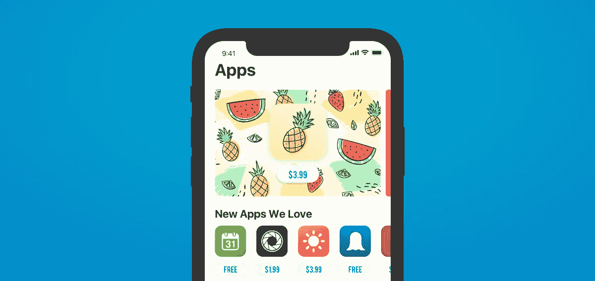
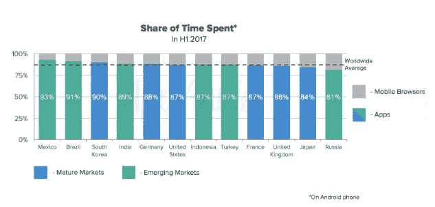
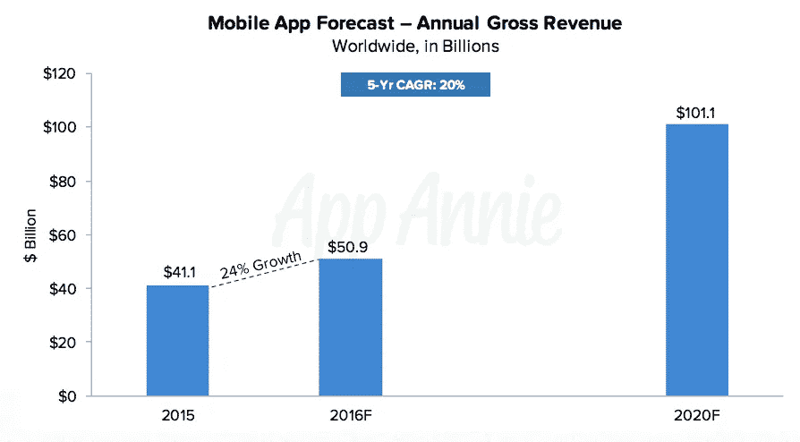
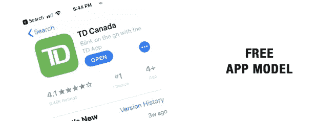
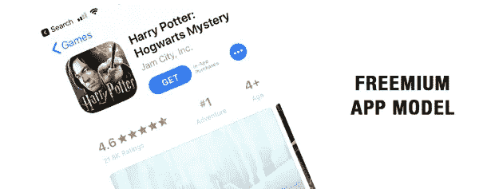
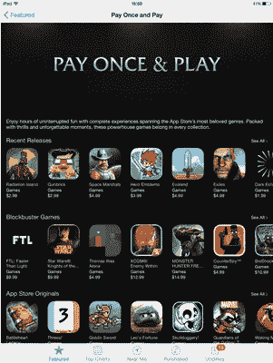
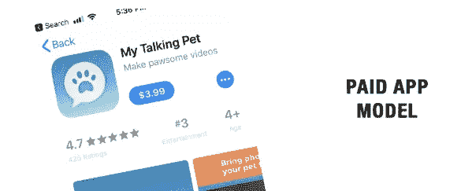
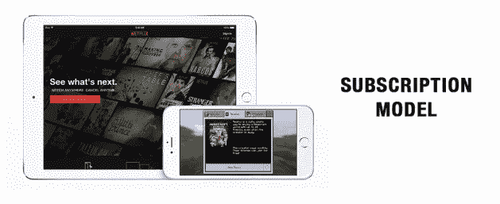
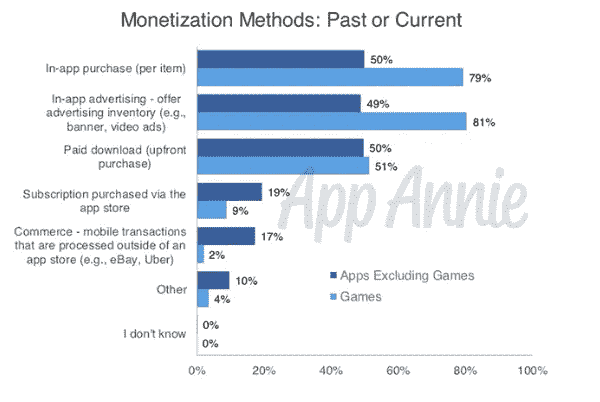
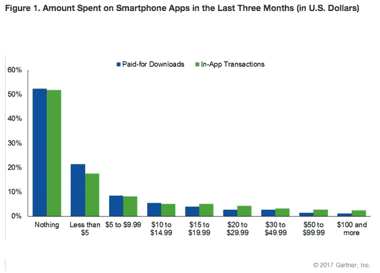

# 关于手机应用定价策略的所有信息

> 原文：<https://medium.com/swlh/everything-there-is-to-know-about-pricing-strategies-for-your-mobile-app-6b2d7dc3d6cb>

说应用行业正在蓬勃发展是一种保守的说法。

数以百万计的应用程序已经存在于苹果应用商店和谷歌 Play 商店中，并且每个月都有数以千计的应用程序发布。由 [App Annie](https://www.appannie.com/en/) 去年进行的一项[研究](https://www.appannie.com/en/insights/mobile-strategy/app-advantages-over-mobile-browsers-engagement/)发现，当人们使用手机时，他们会把大部分时间花在应用上。全世界都是如此:

作为[的应用开发者](https://www.mindsea.com/services/)，我们像吃玉米片一样吃掉这些数据！

我们对应用程序充满热情，喜欢看到我们的应用程序带给人们的快乐。

老实说，我们可以坐在这里研究一整天的移动统计和数据，并从中获得乐趣，但如果我们不理解数字背后的原因和方式，数字在我们的业务中就没有任何意义。今天，我们想看看移动应用定价背后的原因。

免费应用程序、订阅应用程序…交易是什么？顾客被什么吸引？你如何决定如何给一个应用定价？这些都是我们想要回答的问题！

App Annie 提供的另一项研究[预计，2020 年，全球应用商店收入将增长至 1011 亿美元。](http://files.appannie.com.s3.amazonaws.com/reports/App-Annie-02-2016-Forecast-EN.pdf?aliId=117065647)

这是一个巨大的市场。

应用程序对消费者越来越有价值，这也使得市场越来越难渗透。这就是为什么花时间了解消费者心理和定价策略需要成为你商业计划的一部分。

在这篇文章中，我们将探讨移动应用的各种定价策略，以及为自己的应用做出正确决策需要了解的内容。

让我们开始吧。

# 移动定价策略的类型

# 自由的

谁不爱免费？我现在能听到我妈妈说:“这年头免费的东西不多。”这是真的——你不知道！这就是为什么当一些东西被贴上“免费”的标签时，它总是一个令人愉快的惊喜。

但是消费者期望应用程序是免费的吗？

提供免费的应用程序绝对是最有效的模式之一，尤其是如果你的计划是吸引大量用户的话。但是怎么赚钱呢？

好吧，也许这不是你的应用程序的目标——至少不是直接的。有两种免费的定价策略。您选择哪一个取决于您的应用程序的用途:

**完全免费:**这些应用通常作为已有产品或服务的附加产品。我们的目标不是直接从应用程序中赚钱，而是将人们推向其他收入来源。例如，你的应用程序可能会提供优惠券来购买你网站上的产品，促使人们去那里进一步培养。

公司还开发免费应用程序来促进客户服务，并帮助留住客户。例如，银行应用程序让客户在旅途中更容易、更方便地管理自己的财务。在这些应用上，客户通常可以收到或激活额外的优惠，如免费透支或提高信用额度。这些服务最终为银行赚钱(并让客户满意)，即使应用本身没有标价。

**应用内广告:**这些应用是广告收入的平台。广告商在你的应用程序中租用空间，人们在使用你的应用程序时可以看到这些广告，但应用程序仍然可以免费下载。

如果你曾经使用过游戏应用，你可能使用过带有应用内广告的应用。[天气网络应用](https://www.theweathernetwork.com/weather-apps)是另一个以在整个界面显示广告而闻名的应用。

*记住什么*

有了免费的 app，通常可以快速获得用户。一个好的免费应用可以迅速提高消费者的认知度和参与度，并保持下去。但是，如果你没有获得你想要的用户群——并且你依赖于应用内的广告收入——你的应用将很难保持运行和盈利。

下载免费应用的用户通常希望处理广告，但他们仍然希望广告与他们和应用相关。确保你的应用程序中的广告有趣且无破坏性是让用户开心的好方法。 [Google AdMob](https://www.google.com/admob/index.html) 是一种向 Android 和 iOS 开发人员提供的服务，允许您根据用户相关性和广告格式(即横幅、整页等)过滤应用程序的广告。定制和监控是不激怒用户并让他们放弃应用的关键。

# 免费增值

在免费增值定价模式下，应用程序可以免费下载，但应用程序中有额外的层级、功能或激励措施，用户可以选择付费。

免费增值应用主要有三种类型:

1.  用户可以免费下载该应用，但必须付费才能升级、使用高级功能、获得支持(例如额外的生命)或使用应用内货币。这些都是游戏 app 中常见的。
2.  该应用程序免费提供所有特性和功能，但时间有限。之后，用户必须付费才能继续使用该应用程序。
3.  该应用程序是免费的，包含广告，但用户可以选择支付一次性费用来删除广告。

免费增值应用的一个很好的例子是 [HoursTracker](http://www.hourstrackerapp.com/) ，它的功能是一个移动时间表。App Store 中的基础应用[是免费的，但用户可以付费升级到个人版或专业版。](https://itunes.apple.com/us/app/hourstracker-time-tracking/id336456412?mt=8&ign-mpt=uo%3D4)

*记住什么*

一款免费增值应用可能会很受欢迎，也可能不太受欢迎，这取决于它的定位。一些人期望免费应用程序拥有完整的功能，当他们的访问受到限制时，他们会感到失望。

这个问题[在 2015 年引起了轩然大波](https://www.macworld.com/article/2883923/apple-highlights-games-without-in-app-purchases-in-the-app-store.html)。因此，苹果在其应用商店中专门开辟了一整块区域来销售没有隐藏的应用内购买的游戏。他们称之为“一次性付费游戏”

如果做得好，免费增值应用可以成为你公司的无限收入来源；但是，就像免费应用一样，当你的目标是吸引大量用户时，免费增值效果最好。然而，与免费应用不同的是，如果你的用户希望你的应用升级，他们会对你的应用有更多的要求。

对于开发人员来说，这种定价模式可能需要大量的工作，因为您不得不在管理用户购买的同时不断添加升级和改进。

提供足够数量的免费功能，不要用升级通知淹没你的消费者(尽管你确实想展示付费功能的价值)，这是保持你的免费增值应用良好声誉的两个好方法。

# 有报酬的

这种定价模式是最简单的:人们支付一次下载应用程序，然后就可以免费使用。

App 价格通常在 0.99 美元到 9.99 美元之间。一旦用户付费，他们就拥有了这款应用及其所有功能。

一个成功的付费应用的例子是超级流行的绘画游戏应用 [Draw Something](https://itunes.apple.com/ca/app/draw-something/id488627858?mt=8) 。在写这篇文章的时候，它的价格是 3.99 美元，但在苹果应用商店的单词分类中仍然排在第 19 位，并且有 4.5/5 星的评级。

*要记住什么*

付费是一种相当常见的应用定价策略，但也是最低效的策略之一。想想看:在被要求付钱之前，你的用户通常无法对应用程序有所感觉。

当人们除了 app store 中的描述之外，几乎没有做出购买决定的依据时，你的营销努力格外强大就显得更加重要了。一个潜在的消费者会想知道他们通过下载和使用你的应用到底得到了什么，是什么让它比免费的同类产品更好。

许多品牌向潜在长期用户定位其应用的一种方法是提供 7 天或 14 天的免费试用期，试用期结束后，用户必须付费才能继续使用该应用。允许人们在没有购买压力或承诺的情况下试用该应用程序，是鼓励用户尝试并了解你的一个很好的方式。

用户对你的应用的期望也会比免费应用高得多。如果你设法吸引了一个用户，他们很可能是一个忠实的用户。他们更有可能对你的应用进行评分和评论，但如果他们不喜欢自己的体验，这可能是一件坏事。

# 付费增值

如果你理解免费增值和付费，那么你应该理解这种模式——这只是两者的融合。

用户为应用程序付费，但需要额外付费才能使用其他功能。

如果人们如此热爱免费，为什么他们会选择为一个应用支付多倍的费用呢？

很高兴你问了！如果你的应用很棒，它也很棒——你也可以利用它的吸引力。

艾伦·德杰尼勒斯(Ellen Degeneres)的流行派对游戏 Heads Up 是一款成功吸引人们的付费增值应用。不管你有没有看 Ellen，你都知道 Ellen 是谁，你要么拥有这个应用，玩过这个应用，要么听说过这个应用。它的最低价格是 0.99 美元，但你只能玩这么多种类的卡。在这个应用程序中，你可以购买几十种卡片类别…而且因为这个游戏很有趣，你通常会购买一些。截至 5 月 2 日，它在 iOS 付费应用排行榜上排名第一。

*记住什么*

当应用程序的价值来自其内容时，这种定价模式最有效。你不仅要展示获得应用的好处，还要展示为额外的层级和功能付费的好处。

人们熟悉的游戏，如 Mindcraft，The Game of Life 和 NBA 2K18，在付费增值战略方面做得很好。他们的优势来自出色的营销和强大的声誉。

这是最不常见的策略之一，但确实有可能为您的企业带来巨大的收入流。建议你提前和用户说清楚，以避免造成挫败感。

与免费增值应用一样，付费增值应用需要开发团队的持续参与，以保持相关性、最新性和参与性，从而吸引用户再次购买。高质量的设计、内容和功能是最重要的。

# 签署

最后一个要考虑的定价策略是基于订阅的模型。用户需要支付月费或年费(有时是自动续订)才能继续使用你的应用。

使用这种策略的一些应用程序类别是报纸应用程序、约会应用程序和音乐流媒体应用程序，如 [Apple Music](https://www.apple.com/ca/apple-music/) 。

这种模式还没有普及，但在过去几年里，它的势头越来越大。举例来说，苹果公司完全同意订阅，甚至为追求这种定价模式的公司提供激励。

通常情况下，苹果从 App Store 购买中获得 30%的分成，但对于订阅，[他们提供](https://www.theverge.com/2016/6/8/11880730/apple-app-store-subscription-update-phil-schiller-interview)只拿一半——15%的分成——一旦订阅者超过一年大关。这意味着订阅应用程序开发者的目标是找出如何让用户在一年以上的时间内保持在线——老实说，这应该是每个应用程序开发者的*目标。*

*记住什么*

显然，使用这种策略比其他任何策略都有机会赚更多的钱。你总是在赚钱，即使你没有持续获得更多的用户。订阅也是一种比直接付费更温和的方式，因为它让用户觉得只有他们继续在应用程序中找到价值，他们才会付费。

那些选择订阅你的应用程序的人表明了对你的产品的承诺。这种模式提供了一个建立长期忠诚客户的机会——只要你继续提供留下来的理由:相关的更新和定期添加的新功能。

# 选择哪种定价策略

所以现在是最困难的部分。

很明显，在应用程序市场上可以获得可观的收入，但是让你的应用程序赚钱的最好方法是什么呢？你选择哪种定价策略？

像对待其他产品一样看待应用程序。它们都遵循同样的供求规律。合适的价格是人们愿意支付的任何价格。你必须为市场而战。

应用程序与其他产品的不同之处在于，纯粹的市场饱和导致[非常短的保质期](https://techcrunch.com/2009/02/19/pinch-media-data-shows-the-average-shelf-life-of-an-iphone-app-is-less-than-30-days/)。人们可能会下载应用程序，但让他们日复一日、周复一周地重新打开应用程序是主要的挑战。你真的需要努力让你的用户参与进来，并回来获得更多。

错误的价格可能会在下载开始前就破坏交易。潜在客户可能会因为他们认为令人震惊的成本而放弃，或者他们可能会在收到太多弹出窗口后删除他们下载的应用程序，或者只是觉得他们的钱不值。

最终，在做出选择之前，您必须考虑许多不同的因素，包括:

*   你的应用程序的目的
*   您的业务目标
*   你的用户是谁
*   市场需求
*   构建和维护应用程序的成本
*   你的竞争对手在做什么
*   你的应用是 iOS 还是 Android

在进一步做出定价决定之前，您需要回答这些问题。

那不是吓唬你；这是为了在进入市场之前充分认识到这一点的重要性。

# 一般来说…

你的应用程序的价值应该永远大于价格。

如果你选择给你的应用分配一个成本，要知道用户的期望值会更高。你的界面符合标准吗？你正在修复漏洞吗？用户希望他们购买的任何应用程序都能提供卓越的质量，即使只有 3.99 美元。

如果你有一个免费的应用程序，想想你期望获得多少用户。它能仅靠广告运行吗？你的产品或服务允许额外的功能，你可以附加费用吗？

或者，如果你有很多应用，也许你会考虑一个[应用捆绑包](https://developer.apple.com/app-store/app-bundles/)。

# 其他人在做什么

App Annie [去年年底调查了 1200 名应用开发者](https://www.appannie.com/en/insights/app-monetization/app-marketers-developers-survey-2/)，以了解公司目前如何为他们的应用定价。结果显示，应用内购买和应用内广告领先:

与此同时，这些开发者透露，如果他们要改变策略，他们会对基于订阅的模式感兴趣。

在选择正确的价格策略之前，你可能需要测试多种价格策略。但是请记住:提供一个带有付费附加功能的免费应用程序，或者从一个较高的价格开始，然后降低价格，会比以后试图提高价格好得多。

# 消费者如何回应

Gartner 在 2016 年进行的一项消费者[调查显示，平均应用内支出比上一年增长了 26%，平均支出为 11.59 美元，而前期支出仅增长了 4%，平均支出为 7.67 美元。](https://www.gartner.com/newsroom/id/3583817)

这表明用户愿意在应用内消费。这对应用程序开发商来说是个好消息，因为在升级和附加产品上有更多的赚钱空间。

更多值得思考的问题:调查还发现，25 岁至 34 岁的千禧一代在这两种交易上的花费往往是所有其他年龄组中最高的，总体而言，女性在应用上的花费较少。

# 结论

应用程序市场正在快速增长，而且没有很快放缓的迹象。

对于应用程序来说，打入市场、脱颖而出并保持相关性比以往任何时候都更具挑战性。

紧跟潮流和用户期望是确保你的应用出现在成千上万人眼前的首要任务。

你选择的定价策略要体现应用的价值，符合市场预期，实现你的商业目标。

当你进入应用程序的开发阶段时，请将这些信息保存在身边。[立即下载这篇文章的 PDF 版本](https://www.mindsea.com/wp-content/uploads/2018/05/Everything-There-Is-To-Know-About-Pricing-Strategies-For-Your-Mobile-App.pdf)!

*原载于 2018 年 5 月 24 日*[*【www.mindsea.com*](https://www.mindsea.com/mobile-app-pricing-strategies/)*。*

## 这篇文章发表在 [The Startup](https://medium.com/swlh) 上，这是 Medium 最大的创业刊物，有 333，253+人关注。

## 在此订阅接收[我们的头条新闻](http://growthsupply.com/the-startup-newsletter/)。

