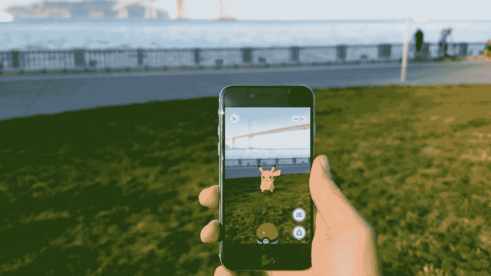

# 5 分钟内你需要了解的所有关于 AR 的知识

> 原文：<https://medium.com/swlh/everything-you-need-to-know-about-ar-in-5-minutes-8d33b5a8f2e5>

增强现实正处于拐点。

研究人员预测，到 2020 年，这将是一个 1500 亿美元的产业。出版界称电话已死。就连苹果也开始向前看了。

增强现实已经做好了颠覆桌面和移动计算的准备——当它真的颠覆时，世界将会变得非常不同。

这篇文章将让你为那个世界做好准备。

# 2d 到 3d 计算

从微软对全息透镜的更新，到[脸书相机特效](https://www.facebook.com/fbcameraeffects/home/)、[谷歌透镜](https://techcrunch.com/2017/05/17/google-lens-will-let-smartphone-cameras-understand-what-they-see-and-take-action/)和[苹果的 ARKit](https://developer.apple.com/arkit/) ，过去的两个月代表了人机交互历史上一个极其重要的转变。

虚拟现实的最新进展已经开始了娱乐(电影和视频游戏)向三维的过渡，不久 AR 将开始影响我们与计算机交互的所有其他方式。

理解向虚拟现实和增强现实转变的关键是他们共同推动人们更自然地与计算机互动——通过简单地看、做手势、交谈和*成为—* 而不是处理干扰和不自然的界面，如鼠标、键盘和平板屏幕。

更少的干扰意味着更多的沉浸感。更多的沉浸意味着更多的人性、同理心和我们经历中的潜在转变——既与计算机相关，也与彼此相关。

# AR 的简史和近代史

伊凡·苏泽兰在 1968 年开发了第一个头戴式显示系统，向用户展示简单的线框。

更多的创新随之而来，但直到 45 年后的 2013 年，世界才第一次看到 AR: [谷歌眼镜](https://en.wikipedia.org/wiki/Google_Glass)。

作为一种消费产品，谷歌眼镜失败得很惨，因为它价格昂贵，缺乏功能，甚至能让世界上最漂亮的人看起来像是超凡脱俗的人。

2015 年 9 月，Snapchat 悄悄推出了[镜头](https://support.snapchat.com/en-US/a/lenses1)，通过让我们呕吐彩虹和变成小狗，让 AR 成为主流——从那以后，我们一直在愉快地扩大面孔。

尽管镜头的广泛采用和吸引力，许多人并没有意识到 Snapchat 是一款 AR 产品。直到 2016 年《口袋妖怪 Go》的推出，AR 才成为消费者应用的前沿和中心。Pokemon Go 成为有史以来第一周下载量最多的应用程序，超过 1000 万用户，在不到一个月的时间里，全球下载量超过 1 亿次。

# 移动增强现实

手机并不是增强现实的最佳平台。有多少有用的应用程序出现在它上面还有待观察，但这很重要，因为它代表了世界上最大的公司对该技术的承诺，以及建立一个基本的操作系统/开发者生态系统，该生态系统可以在未来自然地转移到基于眼镜的解决方案。

苹果的 ARKit 是最新也是最重要的公告，它为开发者提供了为 iPhone 及其超过 7 亿消费者无缝构建 AR 应用的工具。它还为苹果发布轻量级 AR 眼镜增加了一个不可或缺的部分，搭载了联网 iPhone 的计算能力，以及 Apple Watch 和 Airpods 的接口([点击此处了解更多](/swlh/the-future-of-apple-ar-aad3db66db67))。

脸书 Camera Effects 旨在为脸书生态系统(脸书、WhatsApp、Instagram)做类似的事情，将相机变成一个平台，供开发者为目前持续使用其产品的 20 多亿人创造体验。

Google Lens 让 Android 开发人员很快也这样做，更重要的是，明确强调了 AR 创新的另一个有趣部分——不仅仅是我们通过 AR 看到和解释的东西使它变得如此有前途，而是相机现在变得非常智能，能够分析他们看到的东西，并将这些信息传递给彼此和我们([在此阅读更多信息](/swlh/tv-good-reading-bad-cd9f405fa76e))。

# AR 透过眼镜(HUD /平视显示器)

AR 的自然进化将我们引向隐形眼镜，在此之前，是一副看起来正常的(魔法驱动的)眼镜。

与此同时，我们有微软的 Hololens 一个 3000 美元的开发工具包，目前针对企业解决方案，如[教授工程师有关喷气发动机的知识](https://www.youtube.com/watch?v=vei9hax0s5s)和[设计太阳马戏团舞台布景](https://www.youtube.com/watch?v=vNz5Rw6TwCw)。

(有希望)很快推出，并被大肆宣传的[Magic Leap](https://www.magicleap.com)——一家在发布消费产品之前已经筹集了 14 亿美元的公司。

# 其他 AR 公司

AR 生态系统已经在路上了，正如来自[超级风险投资公司](http://www.superventures.com/)(一家致力于增强现实的投资公司)的这张图表所证明的那样。

需要注意的几个大牌:[英伟达](http://www.nvidia.com/)(GPU)[Leap Motion](https://www.leapmotion.com/)(手动追踪) [Blippar](https://blippar.com) (创作&出版)[Meta](https://www.metavision.com/)(HUD)[Doppler](https://hereplus.me/)(智能耳塞) [Eyefluence](https://www.youtube.com/watch?v=TYcrQswVcnA) (眼球追踪，acq。由谷歌)。

# 参与其中

要开始在 AR 中开发的**，请查看 [Unity](https://unity3d.com/) (最近主要用于游戏开发的强大产品，现在用于 AR/VR)[Vuforia](https://www.vuforia.com/)(使 AR 开发更加容易的平台)，以及 ARKit。**

要开始在 AR 中设计的**，请查看 [Blender](https://www.blender.org/) (一个免费的 3d 建模程序)，以及 [Turbosquid](https://www.turbosquid.com/) (一个 3d 模型库)。**

要在 AR 获得**投资**，请查看[罗森伯格风险投资](https://www.rothenbergventures.com/)、[助推风险投资](https://www.boost.vc/)、[风险现实基金](http://www.thevrfund.com/)、[在场资本](https://www.presencecap.com/)、 [Colopl](http://coloplnext.co.jp/en/coloplvrfund/) 、[英特尔投资](http://www.intelcapital.com/)和[超级风险投资](http://www.superventures.com/)。而[这张图](https://cbi-blog.s3.amazonaws.com/blog/wp-content/uploads/2017/06/Chart-Final.png)。

要参加 AR 的**会议**，请查看[增强世界博览会](http://www.augmentedworldexpo.com/)和[视觉](https://visionsummit2017.com/)。

为了保持 AR 中**新闻**的更新，查看我最近开通的账户，覆盖在[推特](https://twitter.com/overlay_ar)或[脸书](https://www.facebook.com/thinkoverlay)上。

我希望你喜欢这篇文章。如果你觉得缺少什么重要的资源，请在评论中提出来，我会根据你的建议进行更新。

> 如果你喜欢读这篇文章，请点击页脚的♥按钮，这样更多的人可以了解 AR！

大家好，我是[丹尼尔](http://www.danieleckler.com)。我创办了一些公司，包括 Piccsy (acq。2014)和 EveryGuyed (acq。2011).我目前对新的职业和咨询机会持开放态度。通过[电子邮件](mailto:hi@danieleckler.com)联系。

# 你可能也会喜欢:人性化设计

我写的一篇互动文章，探索了拟人化设计的过去、现在和未来。此外，[还可用作会议、活动等的演讲](http://designforhumanity.danieleckler.com/)。