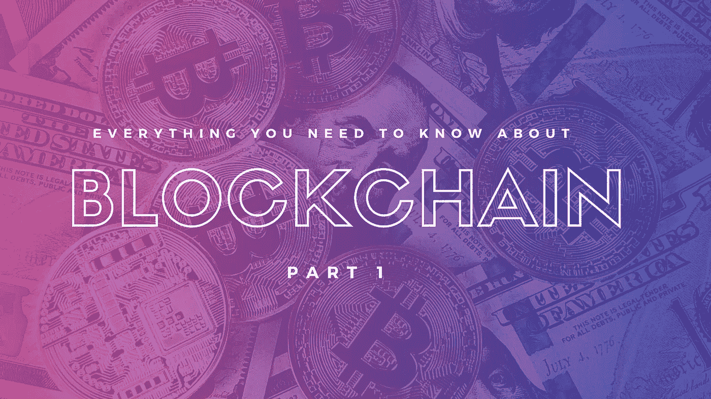
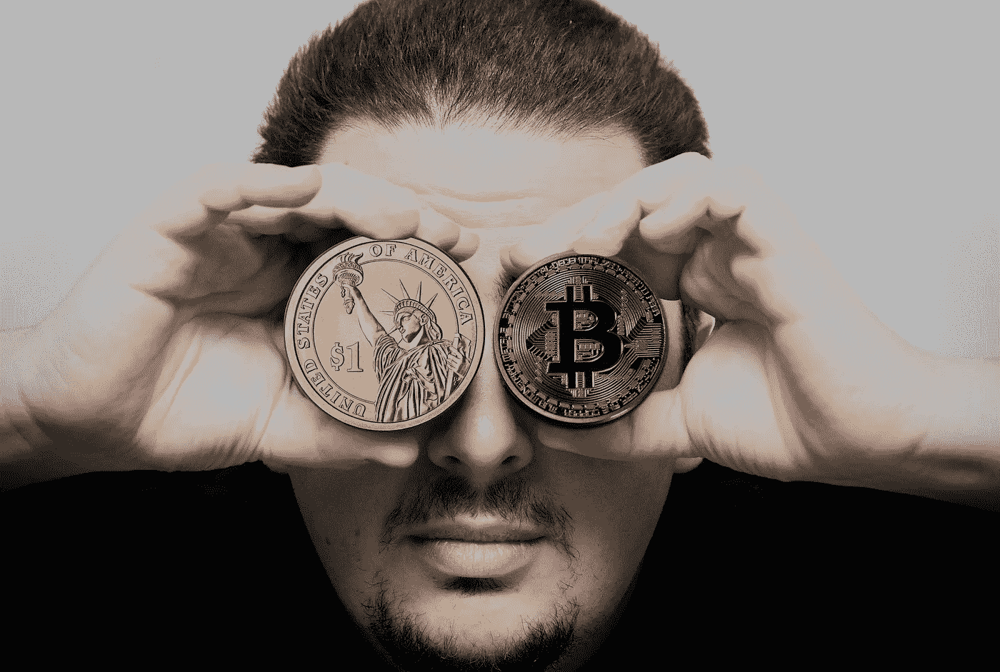

# 关于区块链你需要知道的一切:第一部分

> 原文：<https://medium.com/swlh/everything-you-need-to-know-about-blockchain-part-one-d66552425d15>

区块链之于比特币，就像互联网之于谷歌。它们是支撑比特币、以太坊以及区块链、谷歌、脸书等的技术。说到互联网。但是区块链的潜在用途远远超出了数字货币的范畴。现在，让我们从我们所理解的开始。比特币是一种资产的数字版本，很像黄金，被称为加密货币。区块链是其背后的技术，有可能改变世界的运作方式。

# **什么是区块链？**

几乎我们做的每一件事都涉及到数据的创建和移动，无论是医院账单、房屋租金、使用公共交通还是信用卡记录。区块链是一种存储和移动数据的新方法，它不是将数据保存在一个地方，而是将信息传播到网络中的数千个节点上，所有这些节点都在密码术的帮助下锁定在一起。这样，通过用分散的计算取代集中的权力，区块链允许我们绕过银行等传统的集中权力机构，以一种新的方式进行交易，目前几乎所有人类交易的核心。区块链给了我们一个去中心化的数据库，或者一个网络上任何人都可以看到的交易的数字账本，使用加密技术来保证交易的安全。现在，在一个交换可以被验证和记录之前，这个网络，基本上是一串计算机，都应该给出它的批准。

# **分布式数据库到底是如何工作的？**

想象一个电子表格在计算机网络上被复制了无数次。现在这个网络被设计成定期更新电子表格。这样，保留在区块链中的信息就像一个不断协调和共享的数据库。再说一次，区块链的数据库不仅仅保存在一个地方，这意味着它保存的记录是真正公开的，并且可以很容易地验证。没有一个版本的数据被集中起来供黑客篡改。对互联网上的任何人来说，它的数据都是由多台计算机同时托管的，是可以访问的。

# 但是我们现在储存信息的方式有什么问题呢？

传统上，我们会向收件人发送一个 Word 文档，要求他们对其进行修改。这样做的问题是，你必须等到你得到一个返回的副本，然后才能看到和修改它，因为你被锁定不能编辑它，直到另一端的人完成了它。这就是今天数据库的工作方式。两个所有者不能同时处理同一个记录。因此，对于维护转账和资金余额的银行来说，他们在进行转账时短暂地锁定访问，然后更新另一端，然后打开访问或再次更新。使用 Google Docs，双方可以同时访问同一个文档，并且双方都可以访问同一个版本的文档。这是一个共享文档，但它的工作方式类似于共享账本。当分享不仅仅涉及两个人的时候，分配的部分就出现了。

想象一下可以以这种方式使用的法律文件的数量。所有的业务文档都可以共享，而不是来回传送，而不是互相传递、失去版本跟踪和不同步。今天，支配我们生活的数据大部分都保存在一个地方，无论是图书馆或档案馆的纸张上，还是私人服务器上，还是云中。这适用于大多数情况，但是容易受到攻击。发生了很多数据泄露事件。这些违规行为会带来可怕的后果，让成千上万的人容易遭受身份盗窃和欺诈。现在区块链不一定能阻止这种情况发生。如果你的管理员密码恰好是你的出生日期，区块链就无法阻止黑客进入你的电脑系统。但其他时候，当黑客依靠蛮力，即强大的计算能力来攻击系统时，区块链使这几乎不可能。

# **增强的安全性**

区块链通过跨网络存储数据，消除了集中存储数据带来的风险。这样，网络就没有任何集中的易受攻击的地方，计算机黑客可以利用这些地方。这么想吧。互联网的诞生是为了传递信息。这些信息需要存储在某个地方，所以现在，我们地球上的所有人都必须拥有数量惊人的数据库。把它们想象成储存信息的房子。破门而入很难，但并非不可能。网络安全是保护房子的在线锁。区块链技术将数据库分成许多微小的片段，然后将其传播到许多计算机上。这样，你就不必闯入一个单独的家庭，而必须闯入整个城市。这是它的分布式部分。该结构的每一部分，无论是自动驾驶汽车的导航系统，还是比特币等货币单位，甚至是你的投票或健康记录，都分布在一个由相互交织的数据链接组成的网络上。它越复杂，系统就越安全。如果一个黑客成功地闯入了一个街区，他所做的改变将会永久且立即可见。而这仅仅是开始。它还会在自检后进行自我修复。

今天的互联网有我们都熟悉的安全问题。我们所有人都依赖用户名和密码方法来保护我们的在线资产和身份。区块链的安全依赖于加密技术。这样做的基础是私钥和公钥。生成的公钥是一个长的随机数字串，它是区块链上的用户地址。通过网络发送的比特币被记录为该地址的财产。私钥是一个密码，让你可以访问你的比特币或其他数字资产。存储在区块链上的任何数据都是不会被破坏的。诚然，保护您的数字资产也需要通过将它打印成纸质钱包来保护您的私钥。

# 现在，聪和这有什么关系？

中本聪来自一场名为“密码朋克”(cypherpunks)的运动，这是一个由程序员、密码学家和其他各种思想家组成的团体，在二十世纪末，他们开始质疑是否有更好的方式来处理信息、隐私和权力。Nakamoto 认识到，在正确的激励下，一个网络建立在加密证明的基础上，让人们直接相互交易，而不需要中间人，可以有机地发展。随着网络成员的增长，它需要更多的能量来维持自身。今天，挖掘比特币区块链的计算机每秒运行大约五万亿次加密程序，即所谓的“哈希”。这已经很多了。这项技术也消耗了惊人的电量。为了激励成员自愿提供处理能力，包括比特币在内的各种基于区块链的系统都提供了类似代币的激励措施。这就是比特币，一种作为计算能力回报的价值象征。这被称为“挖掘”，这个想法是由比特币的发明者中本聪提出的。

聪的身份已经困扰我们一段时间了。这些年来，很多人都自称是他，但没有一个人真正符合要求。也有人推测他可能是一群人。现在人们对他或她，甚至对他们的身份充满了好奇，也许最好不要知道。

Who is Satoshi Nakamoto

# 从这里我们能学到什么？

区块链的吸引力不仅仅是因为它安全。其中蕴含着完全规避我们作为一个社会的运作方式的潜力。自 20 世纪 80 年代以来，加密货币就以这样或那样的形式存在，但它们是集中管理或创造的。Satoshi 的洞察力，简单而优雅，是分散整个事情。你不必再相信政府或银行了。这种情绪与赛弗朋克梦想中近乎无摩擦的世界经济产生了共鸣，在这种经济中，资金在全球流动，而不必通过垄断企业或政府控制的瓶颈。

当然，大银行并没有完全同意。一些人认为，比特币价格的上涨是一个泡沫，最终会破裂。然而，今天区块链到处都是嗡嗡声，银行也不例外。新加密货币推出的 ico 或最初的硬币发行已经疯狂激增。然而，并不是所有的都是合法的。像任何技术一样，区块链的安全性取决于它的用户。人们可能会认为，有了区块链，在数据泄露的情况下，人们只需检查账本就可以找到黑客。理论上，我们可以。在早期，比特币因帮助洗钱或毒品等犯罪活动而闻名。这是基于对什么可以匿名，什么不可以匿名的基本误解。如果你有能力和资源传唤加密货币交易所，找出哪些地址对应于哪些用户，你可以比跟踪纸币更准确地跟踪比特币的路径。简单来说，比特币不会对非法活动有所帮助。它不是匿名的。

*原载于* [*产品洞察博客*](https://www.cognitiveclouds.com/insights/) *来自 cognitive clouds:Top*[*Web App 开发公司*](https://www.cognitiveclouds.com/custom-software-development-services/web-application-development-company)

## 这个故事发表在 [The Startup](https://medium.com/swlh) 上，这是 Medium 最大的企业家出版物，拥有 291，182+人。

## 在这里订阅接收[我们的头条新闻](http://growthsupply.com/the-startup-newsletter/)。

