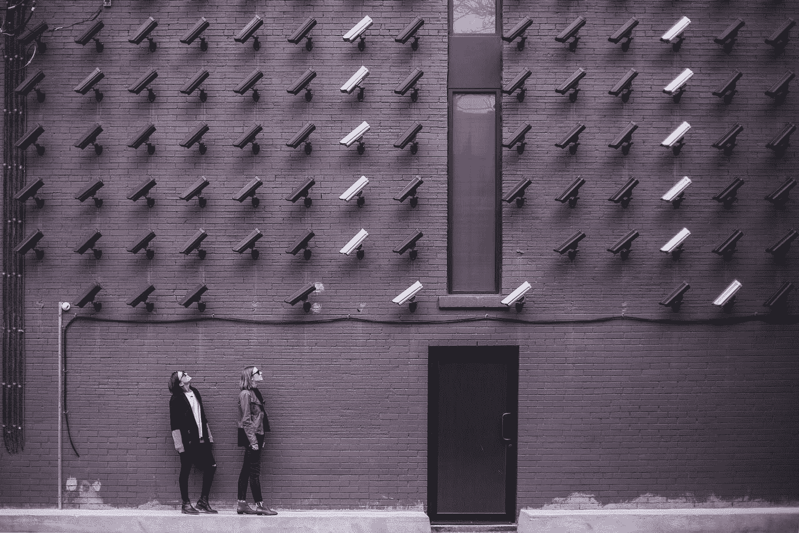
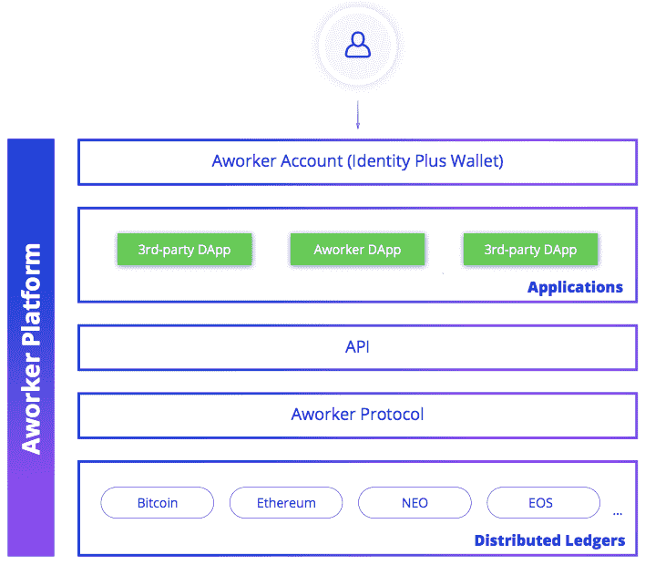

# 关于 GDPR 你需要知道的一切

> 原文：<https://medium.com/swlh/everything-you-need-to-know-about-gdpr-f5761c093fc6>

## 是的，你至少要了解一点 GDPR。

从 [Unsplash](https://unsplash.com/photos/fPxOowbR6ls)

[通用数据保护条例](https://gdpr-info.eu/) (GDPR)是欧盟在 2016 年通过的一项规则，为公司如何管理和共享个人数据设定了新的规则。理论上，GDPR 只适用于欧盟公民的数据，但互联网的全球性质意味着几乎所有在线服务都受到影响，随着公司争相适应，该法规已经给美国用户带来了重大变化。

亮点:

*   GDPR 为获取个人数据设置了前所未有的门槛。默认情况下，任何时候公司收集欧盟公民的个人数据，都需要该人明确和知情的同意。*用户还需要一种撤销同意的方式，他们可以要求公司提供所有数据，以此来验证同意。*
*   其次，GDPR 的处罚非常严厉，足以引起整个行业的关注。每一次违规的最高罚款被设定为公司全球营业额的 4%(或 2000 万美元，以金额较大者为准)。

# 什么变了？

最明显和最直接的变化是在服务和其他警告方面。GDPR 的同意概念比以前的法规要求更多，这意味着公司需要更多的许可来收集你的数据。

也有更多的机会下载一家公司关于你的所有数据，一些公司已经开始推出了。这在两个方面有所帮助:它让你可以检查公司在收集什么，它可以让你在网络之间传输数据，从而有助于解除平台主导地位。如果你想把你的脸书信息导出到 Ello，新的可移植性要求将确保有办法做到这一点。

# 真的会有帮助吗？

现在说还太早。我们大致知道合规是什么样子，但我们仍然不知道执法会是什么样子，也不知道欧盟监管者会有多积极。最简单的结论是，入侵的成本将会高得多，而且这种成本将会在网络中扩散得更远。分享用户数据将变得更加昂贵，网站可能会尝试与更少的合作伙伴合作，从隐私的角度来看，这肯定是一个胜利。像这样的法规往往对小公司的打击最大，所以 GDPR 也可能会进一步向谷歌和脸书这样的大公司倾斜，即使整个数据库在缩小。

# 区块链数据协议时代

[Aworker](https://aworker.io/) 是一个多链验证数据协议，用于创建应用程序，其中**人控制他们的信息**。我们通过为企业和个人提供分散的声誉网络，将区块链技术与现实世界联系起来。该协议使得基于验证的数据和信誉分数来创建和管理应用程序变得容易。人们可以在一个地方控制他们的信息并加以利用。一个工作区块链框架与公共区块链一起工作，并且有能力为不同的应用程序定制它。

根据应用程序的要求，我们在区块链公共场所使用数据存储，以便根据不同国家的法律保存信息。通过使用多个区块链，我们可以在某些国家本地存储数据并保证信息保护。

Aworker 是一个多链解决方案，由第三方应用程序的数据协议、人员识别系统、数据交换、P2P 工作市场、验证系统、支付和信誉组成。总之，这些特征形成了用于创建统一信誉系统的多功能基础设施。

要了解更多关于 Aworker 项目的信息，请访问官方 [Aworker 网站](https://aworker.io/)、[电报频道](http://t.me/aworkerio)或[推特页面](https://twitter.com/aworkerio)。

## 这篇文章发表在 [The Startup](https://medium.com/swlh) 上，这是 Medium 最大的创业刊物，拥有+365，763 名读者。

## 在此订阅接收[我们的头条新闻](http://growthsupply.com/the-startup-newsletter/)。

