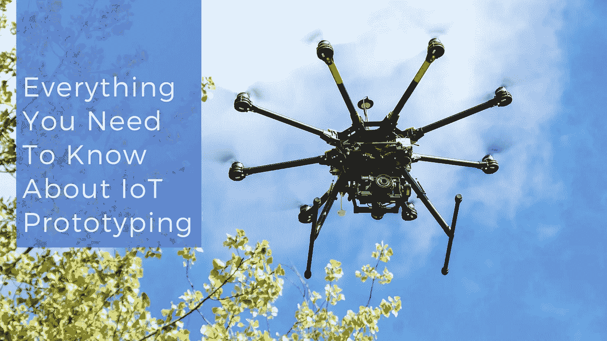
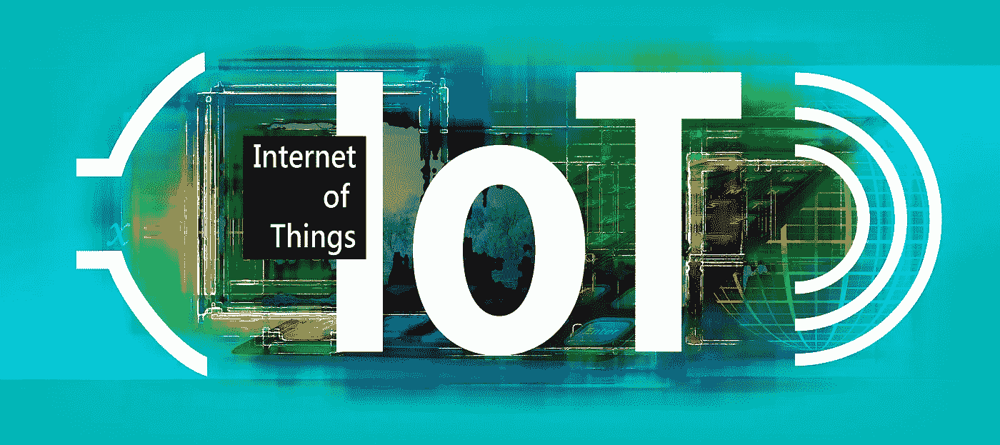

# 关于物联网原型设计，您需要了解的一切

> 原文：<https://medium.com/swlh/everything-you-need-to-know-about-iot-prototyping-e4ad2739bc6a>

互联技术计划不仅在英特尔、微软和 SAP 掀起波澜，而且也在篮球场、农田和厨房等意想不到的日常场所迅速找到了自己的位置。在我们知道之前，物联网将渗透到我们日常生活的方方面面，管理我们的家园，打理我们的花园，甚至监控我们的邮箱。很快，[物联网产品](https://www.cognitiveclouds.com/custom-software-development-services/internet-of-things-iot-application-development-company)将像今天的手机一样无处不在，所以现在是参与其中的好时机。

您的物联网原型用于了解夹点，并为您的物联网产品部署制定必要的参数。原型必须是端到端的，包括通过设备、网络、云、最终用户界面和企业集成连接传感器的细线。然而，事实是，构建物联网(IoT)原型虽然有回报，但也是一个令人沮丧的挑战性工程过程。习惯于听到“打开它，这一次一切都应该工作！”就在打开原型的电源之前，只看到它以一种非常明显的方式壮观地失败，或者不太壮观但更常见的是，什么也不做。

# 什么是物联网(IoT)？

我相信这对您来说并不陌生，然而，确保我们在同一页上并无大碍，因为有几个定义考虑到了物联网的不同方面。物联网通常被定义为无线技术、微控制器、服务和互联网之间的融合。物联网的首要因素是设备和互联网。您可以从任何能够连接到网络的设备开始。设备是智能手机、智能手机、微控制器、灯具、可穿戴设备、传感器等等。互联网是您连接设备的手段。这里的共性是所有设备都可以连接到网络，以便交换数据和信息。这种信息交流通过互联网进行。此外，通过使用传感器，他们可以收集周围世界的信息。然后，所有这些信息被发送到能够存储这些信息的其他设备或平台。所有连接到网络的对象都可以是这个信息流的来源或目的地。你必须密切注意安全部分来保护信息。很快，物联网将对我们的日常生活产生巨大影响。

# 什么是原型？

它是使用许多现成的组件(如传感器、电路板和微控制器)构建物联网硬件和设备的过程，这些硬件和设备通过智能传感器和嵌入式系统得到增强。终端消费者很容易获得许多现成的解决方案。以 Arduino 板为例。你可以在网上订购，并在 24 小时内送货上门。此外，原型绝不是市场现成的产品。这只是您的互联解决方案的试用版，证明您的创新想法将按照您的设想发挥作用。

# 物联网产品原型有何不同？

开发一个新产品，尤其是在未知领域，是有风险的。这就是为什么我们从原型开始这个过程。即便如此，物联网产品的原型制作将被证明与您的团队习惯的原型制作流程不同。如果这是你第一次涉足这个领域，你会有什么样的期待。

**你的原型不需要已经可以生产了。**如果你以前做过移动产品或网络应用的原型，无论你做了什么样的原型，都离生产不远了。但是物联网产品要复杂得多。您在原型制作时使用的硬件，很可能不会是您在大规模生产物联网产品时使用的硬件。软件也将更具挑战性。此外，还要考虑大量第三方集成。

**准备构建你自己的组件。**说到物联网，还没有太多的路线图可循。你需要铺平道路。所以与大多数传统软件的原型不同，你不能依赖于预先存在的架构和库。今天，您的开发人员将需要几乎从零开始，但随着物联网的发展，越来越多的预构建组件将变得可用。这意味着，更长的反馈循环和测试周期。物联网产品涉及软件和一个硬件层。这意味着你可能需要向你的测试用户发送物理设备来获得反馈。此外，用户还不熟悉物联网技术，所以你必须提供详细的设置和使用说明。底线是，测试和反馈循环将比传统的软件产品更长更复杂。

不要低估生产成本。大多数项目不会因为一个糟糕的想法而失败，而是因为大多数项目倾向于过度承诺有限的资源。大规模生产硬件的成本让许多企业家措手不及，超出了预算。不要在硬件上过度承诺，要想得简单，试着从软件中取胜。

软件仍然是真正的英雄。物联网的魅力并不像大多数人想象的那样是一种令人眼花缭乱的技术，而是明显缺乏技术。物联网应该让产品显得天衣无缝。然而，所有这些物联网设备都连接到智能手机或网络，多步设置让用户想放弃。创建可靠的连接需要几次尝试，但没有一个物联网设备可以在没有连接的情况下工作。看，你的软件将是用户体验的一大部分，努力使硬件易于理解，用软件来支持它。

**不要为了留下印象而建造，要为了服务而建造。**在设备中植入芯片并将其连接到网络并不能使其成为物联网。许多人尝试过，但都失败了。更确切地说，要对所有关于消费者行为的假设进行测试，并创造出一款真正能创造价值的设备。这不是创造惊人的技术，而是为您的客户构建有用和必要的技术。

> *用户测试一切。你的原型并不是用来吸引用户的，所以不要害羞，因为把你的产品放到用户的手中以尽早和经常地获得反馈是至关重要的。很容易在工作中投入感情。不要害怕分享一个不完美的产品。你将收集的信息将被证明是有价值的，值得你为之烦恼。*

# 结论

有了所有可用的平台，所有的教程和信息视频，几乎任何人都可以在几个小时内创建一个快速原型。但是把你的原型带到一个可以商业化的地方需要很多努力、计划和专业知识，而这些是大多数公司内部所没有的。您将面临许多关于硬件的决策，这些决策反过来又会推动关于软件的决策。所以请记住，原型制作你的第一个 [*物联网产品*](https://www.cognitiveclouds.com/custom-software-development-services/internet-of-things-iot-application-development-company) *就像跑你的第一场马拉松。任何漫长的未知旅程的第一步都将是令人生畏的，一路上会有擦伤和颠簸。你的公司必须继续努力，因为有一个终点线。*

*原载于 cognitive clouds’*[*物联网 App 开发*](https://www.cognitiveclouds.com/custom-software-development-services/internet-of-things-iot-application-development-company) [*博客*](https://www.cognitiveclouds.com/insights/iot-prototyping-everything-you-need-to-know/)

## 这个故事发表在 [The Startup](https://medium.com/swlh) 上，这是 Medium 最大的企业家出版物，拥有 298，432+人。

## 订阅接收[我们的头条](http://growthsupply.com/the-startup-newsletter/)。

