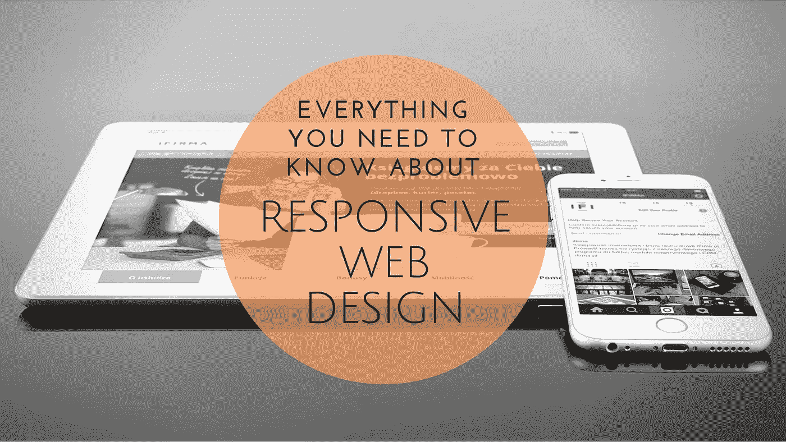

# 关于响应式网页设计，你需要知道的一切

> 原文：<https://medium.com/swlh/everything-you-need-to-know-about-responsive-web-design-54c2059a7e99>

Everything You Need To Know About Responsive Web Design

如今，几乎每个企业都需要一个移动版本的网站。毕竟这是必要的:iPhone 的一种设计，越来越多的 Android 设备、iPad、Kindle 的几种设计，而且所有的屏幕分辨率也必须兼容。在未来几年，我们可能不得不为更多的新发明而设计。这种疯狂什么时候才会停止？当然不会。我们很快就要到达这样一个点，我们无法跟上层出不穷的新设备。对大多数人来说，为每个分辨率和每个新设备建立一个网站版本是不切实际的。我们是否应该选择忽略某些设备，而选择那些给我们带来更多访客的设备，即使我们在市场上错过了那些我们忽略的设备？我们有选择吗？

# 什么是响应式网页设计？

web 开发面临着很大的压力，需要根据笔记本电脑、平板电脑和智能手机等设备的移动浏览的流行做出相应的响应和调整。起初，最好的解决方案似乎是为不同的屏幕尺寸创建多个样式表。现在，通过响应式设计，一个样式表可以在多个设备上为一个站点提供服务。需要关注的代码更少。响应式设计消除了为每个设备提供单独样式表的需要，但它仍然使用首先检测用户设备的标准实践。

[响应式网页设计](https://www.cognitiveclouds.com/custom-software-development-services/responsive-web-design-company)是一种方法或途径，设计者创建一个网页，该网页根据它所看到的设备类型来调整自身的大小。在这种方法中，开发和设计基于用户的行为和环境做出响应。该实践包括图像、灵活的网格和布局的混合，以及对 CSS 媒体查询的巧妙使用。当用户从笔记本电脑转移到 iPhone 时，网站应该立即切换以适应图像大小、分辨率和脚本能力。基本上，网站应该有自动响应用户偏好的技术。这消除了为市场上的每一个新的小工具进行不同的设计和开发的需要。

# 响应式网页设计是什么样子的？

响应式设计的要点是有一个网站，但有不同的元素，当在不同大小的设备上观看时，会有不同的响应。让我们以一个传统的固定网站为例，当在较小的平板电脑上查看时，可能会迫使你水平滚动，或者某些元素可能会隐藏起来，或者它们可能看起来失真，换句话说，就是用户不喜欢的东西。这种影响更加复杂，因为许多平板电脑可以在横向或纵向模式下观看。在小小的智能手机屏幕上浏览网站可能更具挑战性。网站加载速度可能会很慢，如果图片过多，大图片可能会破坏智能手机的布局。

现在，如果一个网站使用响应式设计，平板电脑版本可能会自动调整为只显示两列。这样，内容是可读的，易于导航。在智能手机上，可能垂直堆叠的内容可能会显示为一列。或者用户可以滑动鼠标来查看其他列。图像会调整大小，而不是被剪掉或扭曲布局。简单地说，有了响应式设计，网站会根据浏览者看到的设备自动调整。

Responsive Web Design

# 响应式网页设计是如何工作的？

响应站点使用流体网格。所有页面元素都是按比例调整大小，而不是像素。因此，如果你有三列，你应该定义它们相对于其他列的宽度，而不是每个列的宽度。媒体，就像图片一样，也可以相对地调整大小，这样图片就可以保持在它的列或相关的设计元素中。

# 使用响应式网页设计的优势

在理想的情况下，所有开发人员都需要额外的人手和时间来建立一个单独的网站，完全针对移动设备进行优化。对于我们这些不是谷歌或脸书的人来说，我们需要找到最好的方式，一种不需要投入大量劳动力的方式，来给用户提供优化的体验。

*   对开发人员来说，使用响应式设计的最大优势在于节省了多少时间和精力。
*   响应式设计意味着，对于后端开发人员来说，网站只有一个版本需要更新。所有的内容可以放在同一个地方，整个项目变得简单多了。
*   对于前端开发人员来说，这个过程几乎肯定是比创建多个样式表更好的选择，尽管要做出一个流畅的、响应性强的设计需要做很多工作。想象一下，所有的 CSS 代码都放在一个地方，不需要为一次调整进行多次编辑。

# 使用响应式网页设计的缺点

*   这是否是一个避免响应式设计的好理由还值得商榷，但总的来说，这是有效的。用户不会发现任何加载时的好处。即使用户因为使用智能手机而看不到网站的所有元素，也不意味着这些元素没有在后台加载。流畅的图像，缩放到适合屏幕大小的图像可能会对加载时间造成最大的问题。一旦下载了适合台式机的图像文件，调整图像文件大小以便在平板电脑或智能手机上显示的过程会给移动设备有限的电源带来压力。
*   某些移动浏览器不支持媒体查询。这主要是一个暂时的问题，定期的移动操作系统更新和日益流行的响应式设计正在解决这个问题。不过，就目前而言，这可能是值得考虑的事情。

# 为什么需要转行做响应式网页设计？

检查你的流量，你的大多数访问者必须通过移动设备访问你的网站。响应式网页设计并不意味着成为终极救世主，保护你免受不断变化的移动世界的影响。响应式网页设计是一个概念，当以正确的方式实现时，可以改善用户体验，但不能完全解决用户面临的所有问题。为此，随着技术的不断发展，我们需要不断使用新的分辨率、设备和技术来不断改善用户体验。

除了让我们免受挫折，响应式网页设计也为用户服务。我们可以使用响应式 web 设计在更广泛的设备上为更广泛的用户构建定制解决方案，每个定制解决方案都有助于改善用户体验。网站可以为使用旧笔记本电脑或设备的人量身定制，也可以为使用当前流行小工具的绝大多数人量身定制，同样也可以为现在和未来拥有最先进小工具的少数用户量身定制。通过这种方式，响应式网页设计为每个人提供了良好的定制体验。作为网页设计师，这是我们一直努力实现的目标。

*最初发表于 CognitiveClouds 的产品洞察博客:Top* [***网络应用开发公司***](https://www.cognitiveclouds.com/custom-software-development-services/web-application-development-company)

## 这篇文章发表在 [The Startup](https://medium.com/swlh) 上，这是 Medium 最大的创业刊物，拥有 294，522+读者。

## 在这里订阅接收[我们的头条新闻](http://growthsupply.com/the-startup-newsletter/)。

