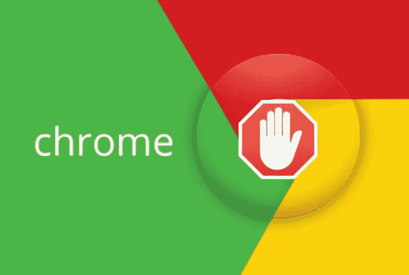
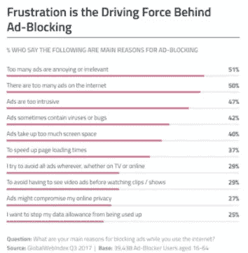
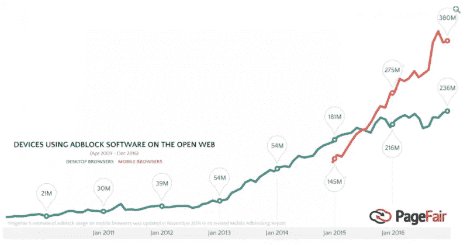
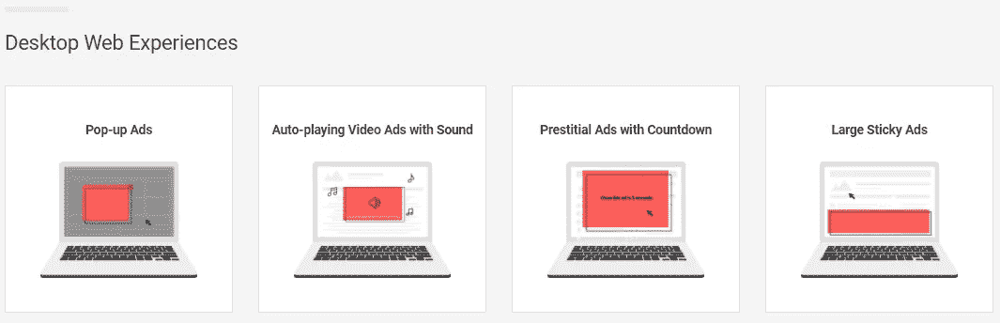
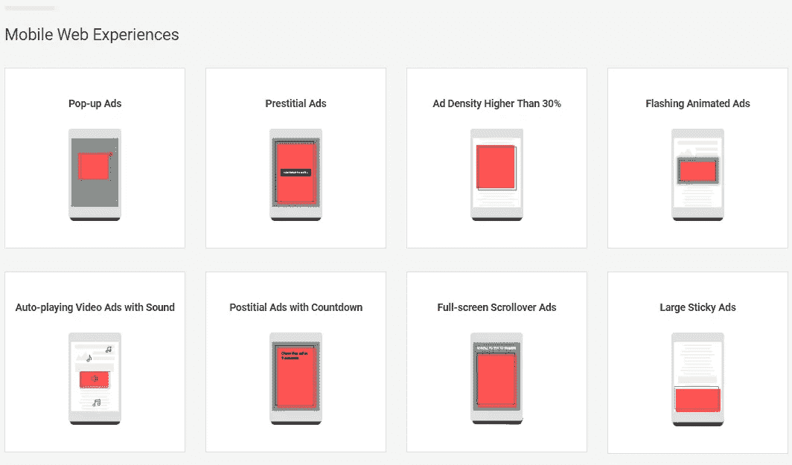
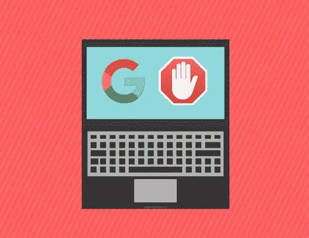

# 关于谷歌浏览器广告拦截器你需要知道的一切

> 原文：<https://medium.com/swlh/everything-you-need-to-know-about-the-google-chrome-ad-blocker-e8ed007a5013>

## 谷歌今天(2 月 15 日)发布了新版本的 Chrome 网络浏览器，它将包括一个内置的广告拦截器，试图从浏览体验中消除干扰性广告。

关于这种新方法，有一些明确的标准和一些尚未解答的问题，那么营销人员到底需要知道什么呢？

谷歌去年宣布，某些广告类型将在 Chrome 中被自动屏蔽。这个看似地震般的更新将于今天在世界上最流行的网络浏览器的最新升级中上线。

然而，在谷歌 Chrome 中集成广告拦截器只是提高在线广告质量这一更大运动的一小部分。

这是由消费者推动的，他们对打断和分散他们想看的内容的广告越来越失望。随着人们在移动设备上花费更多时间，广告商在视频上投入更多，这种紧张只会加剧。

上图中的调查结果与谷歌自己的研究结果相吻合。Axios 最近透露，谷歌在分析 Chrome 用户行为时发现了两个令人担忧的趋势:

1.  五分之一的 Chrome 反馈报告提到了恼人的/不想要的广告
2.  2017 年，使用谷歌“屏蔽此广告”功能的人有 50 多亿次屏蔽

当然，这导致了广告拦截器在过去几年中的广泛应用。消费者发现这是一个简单方便的解决方案，但这不是一个永久的立场。

人们普遍认为，如果广告商能为消费者提供一些价值，后者将更容易接受广告信息。

令广告商和出版商担忧的是，移动广告拦截器的使用增长非常显著，过去 12 个月，这一趋势在亚太地区尤为明显。

许多出版商实施了“广告拦截墙”，不允许安装了广告拦截器的用户访问他们的内容。然而，这种方法只是权宜之计，并没有触及问题的核心。

风向很明显，所以谷歌的目标是对主流趋势进行一点控制，而不是完全忽视它。毕竟，第三方广告拦截器最终也可能会拦截来自谷歌展示网络的广告。

此外，Chrome 占移动浏览器市场的 62%,占桌面浏览器市场的 59%,所以它当然有影响力做出改变。

然而，在允许推动数字经济发展的广告，同时排除那些过度侵扰的广告之间，这里有一个微妙的平衡。当然，如果谷歌采取过分热情的方式，它会损失很多，但如果它能成为数字广告正确标准的仲裁者，它会受益匪浅。

# 哪些广告会受到影响？

Chrome 广告拦截器运行的标准是基于 T2 更好广告联盟制定的指导方针。谷歌是制定这些法规的董事会成员，但其他许多有影响力的机构也是如此，包括全国广告商协会、联合利华和脸书。

这个集体着手查明消费者在浏览时发现的过于负面的广告体验。这项研究(在这里可以看到)揭示了某些类型的广告最典型地与负面经历联系在一起。

将受到影响的桌面 web 体验包括:

而将受到影响的移动广告类型有:

当然，这些都是宽泛的类别，每个类别都有不同的复杂程度。

> 谷歌增加了一项规定，即出版商在广告被屏蔽前有 7.5%的违规门槛。

这里还有一个常识性的因素。我们都受到了这一倡议所针对的各种广告的影响，无论是全屏自动播放视频还是感觉无法关闭的弹出广告。

# 谷歌将如何执行这一点？

值得注意的是，谷歌估计只有 1%的出版商会在短期内受到新广告拦截器的影响。公平地说，剔除劣质广告的方法更像是一把手术刀，而不是斧头。

毕竟，谷歌比任何人都清楚，广告支撑着我们在网上看到的绝大多数内容。

马林软件公司市场部的 SVP 韦斯·麦克拉根对《搜索引擎观察》评论说:

> *这些新标准旨在为消费者创造更好的用户体验，并最终鼓励更少的广告拦截安装。在短期内，我们会看到一些广告形式和广告商关闭。这些广告商和出版商将需要投资于更高质量的广告，而出版商将不再能够依靠侵入式格式赚钱。*

谷歌还会提醒那些处于“警告”或“失败”级别的网站，提供清理广告的机会。这家搜索巨头报告称，37%最初违反标准的网站已经做出改变，以提高广告质量。

违反新标准的网站将被给予 30 天时间从网站上删除违规广告，否则谷歌将屏蔽其广告。

# 这将如何影响广告商和出版商？

这是一个标志，表明该行业已经发生了多大的变化，这不完全是几年前对许多人来说的末日情景。

驱动众多出版商的商业模式受到威胁已经有一段时间了。只有基于数字广告的收入模式才能真正支持向数字优先出版世界的转变，但不幸的是，事实证明，要让这一转变符合消费者的最大利益非常具有挑战性。

通过 Chrome，谷歌的最终目标既雄心勃勃又理想主义:与出版商和广告商合作，创造以客户为中心的浏览体验。更好广告联盟对此有一些明确的声明，包括以下内容:

> *该联盟鼓励广告商、出版商和广告技术提供商审查其研究和最初的更好的广告标准，作为他们在市场上改善在线广告体验的努力的一部分。*

*   *广告商*可以使用初始的更好的广告标准来通知广告活动的开发和执行
*   *出版商*可以使用最初的更好的广告标准为他们的观众开发更好的体验
*   *广告技术平台*可以在新广告体验的开发过程中使用最初的更好的广告标准
*   *测量技术的提供商*可以使用最初的更好的广告标准来开发新的方法，以评估消费者偏好的广告体验的市场流行程度

Marin Software 的 Wes McLaggan 对广告商有一些进一步的建议，因为他们正在评估这一更新可能会对他们产生什么影响:

> 高质量、相关的广告总是比那些吸引用户注意力的广告表现得更好。营销人员应该利用所有定位选项，将正确的广告放在正确的人面前。广告也应该反映用户在这个平台上的心情。对于脸书上的流媒体视频、Instagram 上的故事和网站上的展示广告，没有一种放之四海而皆准的方法。简而言之，数字广告商应该让用户参与度、相关性和广告质量成为他们的指南。

虽然最初影响 1%出版商的内置广告拦截器本身不会推动数字消费者-广告商关系的根本转变，但它无疑是朝着正确方向迈出的一步。

*原载于 2018 年 2 月 15 日*[*【searchenginewatch.com*](https://searchenginewatch.com/2018/02/15/everything-you-need-to-know-about-the-google-chrome-ad-blocker/)*。*

## 这篇文章发表在 [The Startup](https://medium.com/swlh) 上，这是 Medium 最大的创业刊物，拥有 297，332+人关注。

## 在此订阅接收[我们的头条新闻](http://growthsupply.com/the-startup-newsletter/)。

