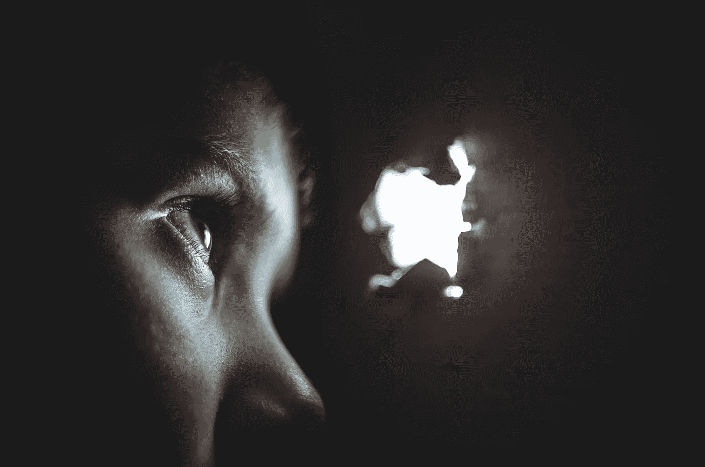

# 你想要的一切都在恐惧的另一边

> 原文：<https://medium.com/swlh/everything-you-want-is-on-the-other-side-of-fear-92b03ff0728>

此时此刻，想象一下如果你努力去做，你会取得什么样的成就。任何你想做的事情，都会被完成。当然，这伴随着挣扎和挑战。你还记得你非常想实现的某件事或你为自己设定的目标吗？接着你会想到“我做不到”、“如果我失败了怎么办”或“我不够好”吗？

首先，当你为自己设定远大目标时，产生这些想法是人类的自然反应，这些目标将使你作为一个个体成长，并拓展你目前的思维方式。其次，只要知道那些恐惧的感觉是完全自然的，发生在每一个取得伟大成就或做出非凡成就的人身上。然而，不管有多艰难，千万不要让同样的感觉阻止你采取大规模行动并不断前进。

因此，理解控制恐惧本身的必要性是至关重要的。你可能想知道“为什么？我现在的生活很好。”这里有三个主要原因:

# **1。恐惧限制了你的全部潜力**

被恐惧驱使会阻止你在生活中成长和进步。根据大卫·霍金斯博士在《权力与力量》一书中的说法，他开发了“[意识地图](https://personalexcellence.co/blog/map-of-consciousness/)”，并描述说，恐惧意味着你被阻止向更高层次的勇气、接受、爱、快乐、和平以及最终的开悟发展。

> *“当你让你的想法、感觉和决定被恐惧所驱使时，你就沦为了恐惧的奴隶。”*

我遇到过一些人，他们的生活以恐惧为主题。他们的恐惧如此驱动着他们的思想、感觉、决定和行为，以至于他们的生活变成了恐惧的结果，而不是他们自己的欲望。他们被困在安全的幻觉中保护自己的生命。他或她生活在对恐惧的反应中，而不是积极地过自己的生活。如果他们只是对恐惧做出反应，他们就不可能发挥出最大的潜力。

# **2。你永远无法完全逃避恐惧**

如果你逃避而不是处理它，它会一直在那里，在你做的每一件事上都萦绕着你。逃避只会给你一种安全感的错觉。你可能会有短暂的安全感，但那只是那短暂的片刻。你跑得越多，恐惧就越会追上你。当这种情况发生时，你要么学会处理它，要么永远畏缩在它面前，成为你可能成为的人的一部分。

既然你必须在某个时候处理恐惧，你不妨现在就学会克服恐惧，而不是一次又一次地避免恐惧，只是为了最终处理它。否则就没有意义了——你不仅在消耗自己的情感，还在浪费时间和精力来逃避恐惧。时间是你生命中最宝贵的财富，不要浪费它。

# **3。恐惧会耗尽你的精神力量**

你在恐惧中畏缩的每一刻，你都在喂一颗种子，它会引发类似的想法。你做得越多，恐惧就越多。你没有冷静地处理这种情况，并找出解决办法继续前进，而是把精力投入到一些破坏性的事情中。想想看，如果你不花费精力来对抗恐惧及其后遗症，你还能做多少事情。

此外，请记住，你在恐惧中度过的每一分钟，你就少了一分积极想法和感受的时间，而这些想法和感受可能会发展成积极后果的另一个春天。选择你更愿意如何度过你的时间——是积极快乐，还是消极恐惧？

# **找回你的勇气**

从现在开始，我向你发出挑战，不断扩展你的视野，看看你的生活中有哪些可能。我们越能看到自己胜利了，没有被恐惧所麻痹，就越能促使我们行动起来。

梅尔·罗宾斯(Mel Robbins)是美国有线电视新闻网(CNN)的评论员、电视主持人、生活教练、作家和励志演说家，她解释了“ [*背后的科学，她提出的 5 秒规则*](https://www.youtube.com/watch?v=2Lz0VOltZKA) ”是一种元认知形式，击败了你的大脑对你玩的每一个导致犹豫、压倒、拖延和过度思考的恐惧把戏。

我希望能激励你改变你的生活。变化不一定要大。变化总是从一小步一小步的变化中显现出来。下次恐惧出现时，鼓起勇气，站起来，开始行动，离开。你生来就是伟大的，所以活得更伟大吧！

*原载于 2017 年 12 月 21 日*[*ye-chen.com*](https://ye-chen.com/everything-you-want-is-on-the-other-side-of-fear/)*。*

## 这个故事发表在 [The Startup](https://medium.com/swlh) 上，这是 Medium 最大的企业家出版物，拥有 290，182+人。

## 在这里订阅接收[我们的头条新闻](http://growthsupply.com/the-startup-newsletter/)。

