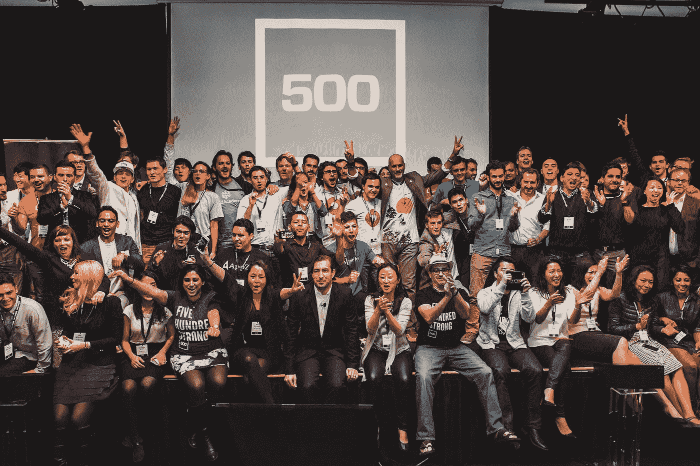

# 申请 500 家创业公司加速器时你需要知道的一切

> 原文：<https://medium.com/swlh/everyting-you-need-to-know-when-applying-to-500-startups-accelerator-6e95b26d6bbe>

自从我上个月发表了《我们是如何获得 500 家初创公司的资助的》 之后，一些创始人就开始寻求进入加速器的建议。因此，我为所有申请 500 创业加速器的人创建了这个指南列表。

[**500 家创业公司**](https://angel.co/500startups) 是硅谷风险投资种子基金&创业加速器。已经在 50 多个国家投资了 1500 多家公司，并且每个季度都会收到数千份来自初创公司的申请，这些公司会在加速器中争夺 30 个席位。500 家创业公司运行一个加速器项目，强调设计&用户体验、分销&客户获取和精益创业实践&指标。 [**投资团队**](http://500.co/team) 和 mentor network 拥有 PayPal、Google、YouTube、雅虎、AOL、Zynga、LinkedIn、Twitter、苹果&脸书等公司的运营经验。

500 Startups 种子基金通常在第一次检查时投资 2.5 万至 10 万美元，在随后的检查中投资 10 万至 50 万美元。

500 Startups accelerator 是一个快节奏的项目，在旧金山和山景城举办，为期 4 个月。旧金山和山景城加速器的标准条款是 12.5 万美元交换 5%，并收取 2.5 万美元的费用参与加速器计划。

参加 500 家创业公司加速器项目的最大好处之一是可以接触到知识渊博的**。作为通过该计划的创始人，您将有机会接触 500 名合作伙伴、经验丰富的企业家、经验丰富的投资者或在各自领域拥有丰富专业知识的个人，为您提供反馈和指导。这些导师包括重要主题的顶级领域专家，如分销、设计、数据、筹款等。**

**每周，你都会接触到一些精彩的演讲、办公时间、活动，以及在分销、客户获取、指标、设计和 UX、筹款、公关、业务发展等方面的实践指导。以下是每周通常发生的事情，但不限于**

*   **每周总结会议所有人一起报告输赢。**
*   ****直接联系点**与指定的 500 家创业公司合作伙伴或 eir 联系，寻求建议和指导。**
*   **每周炉边讨论、合作午餐和头脑风暴会议。**
*   ****每周灵感对话**与成功科技公司(Box 和 Mailchimp 等)的创始人和首席执行官交流。**

**500 家创业公司通过 [**AngelList**](https://angel.co/500startups) 接受申请。**

****常见问题解答&申请流程****

*   **[500 个常见问题](http://500.co/500-faq)**
*   **[如何申请 500 家创业公司？](http://www.quora.com/How-do-I-apply-to-500-Startups)**
*   **[如何不申请 500 家创业公司？](http://www.quora.com/How-not-to-apply-to-500-Startups)**
*   **[如何申请 500 创业加速器？](http://www.quora.com/How-do-you-apply-for-the-500-Startups-Accelerator)**
*   **[加入我们下一批加速器的 10 个技巧。](http://500.co/batch-11-ten-tips-for-getting-in)**
*   **[进入 500 家创业公司的 3 个技巧(视频)](https://www.youtube.com/watch?v=ULLiRS0nE1E)**
*   **[500 在寻找什么样的创业公司？](http://kevinwilliamdavid.com/blog/the-ultimate-guide-list-for-startups-applying-to-500-startups-accelerator/www.quora.com/What-kinds-of-startups-is-500-looking-for)**
*   **[你申请进入 500 家创业公司的清单](http://jonathanchizick.com/2013/11/05/checklist-applying-500-startups/)**
*   **[成功 500 家创业公司申请的备忘单](https://www.linkedin.com/pulse/article/20140830204221-2655535-the-cheat-sheet-for-successful-500startups-applications)**
*   **[500 创业公司在想法阶段投资创业公司创始人吗？](http://www.quora.com/Does-500-Startups-invest-in-startup-founders-at-the-idea-stage)**
*   **[500 家创业公司投资竞争公司吗？](http://www.quora.com/Does-500-Startups-invest-in-competing-companies)**
*   **[500 创业公司是否应该对类似的创业公司进行投资？](http://www.quora.com/Should-500Startups-make-investments-in-similar-startups)**
*   **[500 startups 接受来自另一个加速器项目的创业校友吗？](http://www.quora.com/Does-500-startups-accept-startups-alumni-from-another-accelerator-program)**
*   **[500 家初创企业如何确定接触他们的加速器项目团队的可信度？](http://www.quora.com/How-does-500-start-ups-determine-the-credibility-of-the-team-approaching-them-for-their-accelerator-program)**
*   **[创业公司从 500 的加速器项目中获得了什么？](http://www.quora.com/What-do-startups-get-out-of-500s-accelerator-program)**
*   **[500 强最大的出口是什么？](http://www.quora.com/What-are-some-of-500s-biggest-exits)**
*   **[什么是 500 家创业公司投资论文？](http://www.quora.com/What-is-500s-investment-thesis)**
*   **[500 Startups 如何组织投资？](http://www.quora.com/How-does-500-Startups-structure-its-investments)**
*   **[500 启动费 vs 初期投资，什么时候发生？](http://www.quora.com/500-startup-fee-vs-initial-investment-when-it-happens)**
*   **[500 创业公司的商业模式是什么？](http://www.quora.com/What-is-500-Startups-business-model)**
*   **[我要怎样才能引起戴夫·麦克卢尔或 500 家初创公司的注意](http://www.quora.com/What-do-I-have-to-do-to-get-noticed-by-Dave-McClure-or-500-Startups)**
*   **[如果我们在 500 家创业公司内部没有任何人脉，又不住在硅谷，我们如何走在 Dave McClure/500 家创业公司的前面？](http://www.quora.com/How-do-we-get-in-front-of-Dave-McClure-500-Startups-if-we-dont-have-any-connections-within-500-Startups-and-dont-live-in-Silicon-Valley)**
*   **[我如何受邀参加 500 家初创公司展示日？](http://www.quora.com/How-do-I-get-invited-to-a-500-Startups-Demo-Day)**
*   **[每批 500 家创业公司面试多少家公司？](http://www.quora.com/How-many-companies-500-Startups-interviews-for-each-batch)**
*   **如果我被 500 Startups 计划接受，它会支付我的差旅费吗？**
*   **500 家创业公司对 10 万美元的要价很高吗？**
*   **[500 Startups 如何用 10 万美元和建议帮助比特币初创公司](/zapchain-magazine/how-500-startups-helps-bitcoin-startups-with-100k-and-advice-3f41947e53ea)**
*   **[戴夫·麦克卢尔关于从 500 家初创公司筹集资金的建议](http://exitevent.com/article/dave-mcclures-expletive-filled-tips-for-raising-money-from-500-startups-14528)**
*   **[迄今为止，最成功的 500 家创业公司有哪些？](http://www.quora.com/What-have-been-the-most-successful-500-Startups-companies-so-far)**
*   **[500 家创业公司的口碑如何](http://www.quora.com/What-is-the-reputation-of-500-Startups)**
*   **[被 500 家创业公司投资过的创业公司成功率有多少？](http://www.quora.com/Whats-the-success-rate-of-startups-that-have-been-funded-by-500-Startups)**

****面试****

*   **[准备 500 家创业公司面试的最好方法是什么？](http://www.quora.com/What-is-the-best-way-to-prepare-for-a-500-Startups-interview)**
*   **[被 500 家创业公司面试](/@laurabehrenswu/being-interviewed-by-500-startups-f497d274d1e4)**

****导师****

*   **[500 家创业公司导师计划是如何运作的？](http://www.quora.com/How-does-the-500-Startups-Mentor-program-work)**
*   **谁是最有帮助的 500 家创业公司的导师？**
*   **[入选《500 家创业公司》的非美国公司创始人是如何被导师们注意到的？](http://www.quora.com/How-did-founders-of-non-US-companies-selected-to-500-Startups-get-noticed-by-the-mentors)**
*   **[500 家创业公司有哪些典型的顾问股权安排？](http://www.quora.com/What-are-typical-advisor-equity-arrangements-for-500-startup-companies)**

****一般建议和经验****

*   **[我在 500 家创业公司学到的 50 件事](http://www.adventuresinstartupland.com/)**
*   **[SoundBetter 在考虑 500 Startups 申请时的 4 条建议](http://tech.co/4-tips-applying-to-500-startups-batch-10-soundbetter-2014-05)**
*   **[成败在此一举:500 家初创公司是什么感觉](http://500.co/sink-or-swim-what-its-like-being-at-500-startups)**
*   **[身处 500 家创业公司是什么感觉？](http://www.quora.com/What-is-it-like-being-in-500-Startups)**
*   **[我希望在 500 家创业公司之前知道的 5 件事](http://e27.co/5-things-i-wish-i-knew-before-500-startups/)**
*   **[如何进入创业加速器，500 家创业公司](http://www.forbes.com/sites/scottallison/2012/05/11/how-to-get-in-to-500-startups/)**
*   **[创业 500 后的生活。我的公司从加速器中学到了什么。](http://www.biztechmagazine.com/article/2013/08/life-after-500-startups-what-my-company-learned-being-accelerator)**
*   **[500 家创业公司打开美食之门的十大方式](http://aihuiong.com/post/29821677129/top-10-ways-500-startups-open-doors-for-love-with-food)**
*   **[反思我在 500 家创业公司的夏天](http://www.tawheedkader.com/2011/09/reflecting-on-my-summer-at-500startups/)**
*   **[加入 500 家创业公司时我希望知道的事情](http://thuymuoi.com/join-500-startups/)**
*   **[Farmeron 的故事:AngelList，500 家创业公司&独角兽](http://www.eastist.com/2011/11/the-story-of-farmeron-angellist-500-startups-and-unicorns/)**
*   **[我从 500 家创业公司学到的 15 件事](http://webapplog.com/15-things-i-learned-from-500-startups-aka-fail-factory/)**
*   **[回顾 500 家创业公司加速器项目第一周](http://www.techfounder.net/2013/04/21/recapping-week-1-at-500startups-accelerator-program/)**
*   **[500 家创业公司:好的、坏的和丑陋的](http://spinnakr.com/blog/start-ups/2011/10/500-startups-the-good-the-bad-and-the-ugly/)**
*   **[Popbasic 的 500 家创业公司之旅](http://fromlittlethings.co/2013/12/10/popbasics-500startups-journey-and-the-insider-tips-on-moving-to-sf/)**
*   **莎拉·佩吉讨论 500 家创业公司**
*   **500 家创业公司的编年史[第一周](http://andysparks.co/post/33249118120/chronicles-of-500-startups-week-1-get-better)**
*   **[为什么以及如何申请 500 家创业公司](http://www.techfounder.net/2013/08/06/post-mortem-why-and-how-you-should-apply-to-500startups/)**
*   **[学习曲线:30 天加速。](http://www.utekkare.com/post/86021875751/learning-curve-30-days-of-acceleration)**
*   **[为什么印度公司进入 500 强的门槛更高](http://www.utekkare.com/post/86988197181/why-the-bar-is-higher-for-indian-companies-to)**

****我们如何进入 500 家创业公司——骗局故事****

*   **[两个大学生如何挤进 500 家创业公司](http://kevinwilliamdavid.com/blog/how-2-college-kids-hustled-into-500-startups/)**
*   **如何成功应聘 500 家创业公司[第一部分](https://www.kibin.com/kibin-business-blog/how-to-successfully-apply-to-500-startups-part-13/) [第二部分](https://www.kibin.com/kibin-business-blog/how-to-successfully-apply-to-500-startups-part-23/) [第三部分](https://www.kibin.com/kibin-business-blog/how-to-successfully-apply-to-500-startups-part-33/)**
*   **[喧嚣——500 家创业公司的故事](http://diesellaws.com/the-hustle-a-500-startups-story/)**
*   **[我们如何进入第九批 500 家创业公司，以及我们预期的困境](http://chloealpert.com/blog/500-startups-got-500-startups-batch-9-unexpected-dilemma/)**
*   **[Gorefi 如何闯入 500 家创业公司](http://blog.lenda.com/2014/04/23/how-gorefi-hacked-its-way-into-500-startups-batch-9-in-four-easy-steps)**
*   **[闯入 500 家创业公司](http://blog.safeshepherd.com/17/startup-chaos-and-crashing-our-way-into-500-startups/)**
*   **进入 500 家创业公司[第一部分](http://www.theschwingofthings.com/getting-into-500-startups/) [第二部分](http://www.theschwingofthings.com/getting-into-500-startups-part-2/)**
*   **[我们进入 500 家创业公司的道路](http://andysparks.co/post/32674907293/our-path-to-500-startups)**
*   **[推介戴夫·麦克卢尔并进入克罗地亚 500 家初创公司的背后故事](http://duskic.com/blog/the-story-behind-pitching-dave-mcclure-and-getting-into-500-startups-from-croatia/)**
*   **[我们如何成为首批进入 500 家创业公司的阿根廷公司之一](https://www.linkedin.com/pulse/article/20140716205733-24940599-buenos-aires-to-san-francisco)**
*   **[如何进入 500 家创业公司，来自 500 家创业公司创始人的建议](http://www.forbes.com/sites/scottallison/2012/05/11/how-to-get-in-to-500-startups/)**
*   **[我们是如何进入 500 家初创公司的，学到了什么](http://blogs.orrick.com/totalaccess/2012/11/why-networking-matters-how-i-got-into-500-startups-and-lessons-learned/)**

****演示日/预览日****

*   **[创业公司在演示日通常能筹集多少资金？](http://www.quora.com/How-much-money-do-startups-typically-raise-on-a-demo-day)**
*   **[预演日如何教会我做人](http://500.co/how-preview-day-taught-me-to-be-human)**

****事件****

**500 Startups 每年都会组织大量的活动，这是认识 500 Startups 合伙人、创始人和导师的好方法。**

*   **[暖枪](http://warmgun.com/)**
*   **[大规模杀伤性武器分布](http://wmd.co/)**
*   **MamaBear**
*   **[商业](http://commercism.co/)**
*   **[收件箱爱](http://inboxlove.com/)**
*   **[前期资金](http://premoney.co/)**
*   **[彩虹圆](http://rainbowround.com/)**
*   **[飞机上的极客](http://geeksonaplane.com/)**

****其他资源****

*   **[什么是创业 500 强？](https://www.youtube.com/watch?v=xg1Mw0ySdP8)**
*   **[什么是 500 家创业公司加速器计划？](http://www.youtube.com/watch?v=fprPAliT1LQ#t=11)**
*   **[500 家创业公司——加速器](https://www.youtube.com/watch?v=b2AWVcuKryM)**
*   **[推动 500 家创业公司的 5 大价值](http://thenextweb.com/insider/2013/04/27/the-5-values-that-drive-500-startups/)**
*   **[为什么社区是 500 的秘制酱](http://500.co/hacking-vc-why-community-is-500s-secret-sauce)**
*   **[创造# 500 强](http://500.co/creating-500strong-part-1)**
*   **[创建# 500 强零件](http://500.co/creating-500strong-part-2)**
*   **[面向初创公司创始人和投资者的免费法律文件](http://500.co/kiss)—[Kiss Docs](https://500startups.app.box.com/kiss)**
*   **[往届 500 创业活动视频库](http://www.livestream.com/500startups)和[存档讲座](https://new.livestream.com/500SAcc)。**
*   **[Youtube 频道](http://www.youtube.com/user/500startups)**
*   **500 家创业公司[播客采访](https://soundcloud.com/500startups)全球创业社区的创始人、投资者和其他有影响力的人。**

**如果你正在申请 [**500 家创业公司**](https://angel.co/500startups) ，希望这对你有所帮助并祝你好运。如果你写过任何博客，谈论你的 500 家创业公司的经历，对申请的建议或者关于面试过程，请在下面的评论中告诉我。**