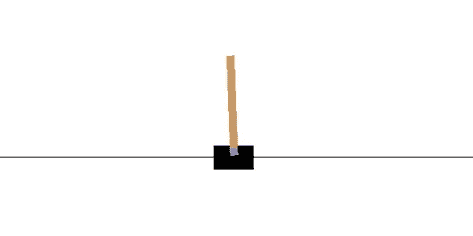
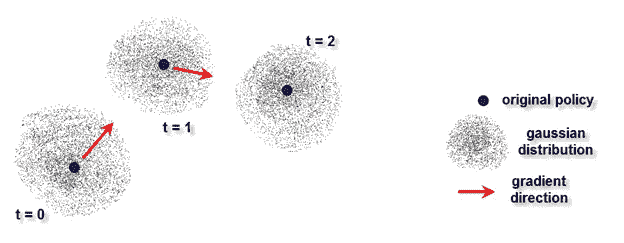
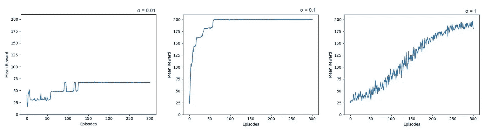

# 进化策略

> 原文：<https://medium.com/swlh/evolution-strategies-844e2694e632>

如此简单，却又如此强大

如果你最近一直在玩强化学习(RL)算法，你肯定会注意到正确实现它们是多么的棘手:计算梯度，添加目标网络，体验回放…

当然，你总是可以使用第三方实现，例如 [OpenAI Baselines](https://github.com/openai/baselines) ，但是这违背了学习的目的。如果你不从头开始实现一个算法，你将永远无法完全掌握它。

所以在纠结了一会儿 DQN、DDPG 和 A3C 的细节之后，当我发现进化策略是一个有效的选择时，我异常兴奋:【https://arxiv.org/abs/1703.03864】T2

在这里，我将尝试用简单的术语解释 ES，并展示这种技术的实现，以解决体育馆中的标准横竿环境。



CartPole environment on Gym

ES 与其他策略搜索算法非常相似:

1.你有一个代表策略的神经网络，即一个决定在给定当前状态下采取什么行动的函数

2.你需要改进这个政策，使总回报最大化

区别在于你如何改进政策。其他 RL 方法通过尝试不同的随机动作来探索动作世界，并从本质上加强好的动作，而 es 方法直接作用于网络的参数，并随机抖动它们，希望找到好的结果。

ES 通常被称为“黑盒”优化:我们不需要知道任何关于策略如何工作的信息。这是一个有输入(状态)和输出(动作)的盒子，我们围绕着旋钮(权重)移动，直到我们找到一个更好的解决方案，希望是最优的解决方案。

给定一个初始策略(随机的或通过监督学习预先学习的)，我们总是可以通过对其权重应用随机扰动来围绕它生成相似策略的群体。然后，我们评估所有这些新政策，并估计梯度，也就是说，我们检查哪些方向的事情看起来更有希望。最后，我们更新初始权重，以准确地向那个方向移动，并从那里重新开始。我们不断循环，直到对结果满意为止。



Evolution follows the best path

你看，这个算法是如此的难以置信的简单，仅仅是一个循环中的三个动作，然而它是如此的强大。

一些优点是:

1.不需要反向传播，这使得实现非常容易，执行非常快。

2.不需要差异化策略；你可以使用任何你想要的函数近似值，甚至是二进制的，因为在网络上不需要计算复杂的梯度。

3.不需要大量内存来存储所有剧集以备将来更新，例如体验回放。

4.不需要任何值函数，只需为策略定义一个网络即可。

5.比其他策略搜索技术更好的探索行为。显然，直接调整权重比调整动作能产生“更随机的行为”。

6.鉴于其简单性和缺乏大量的内部数据交换，它是非常可伸缩的，这意味着它可以很容易地并行化，并在大量的 CPU 上非常快地执行。

7.与观察的采样时间无关，也就是说，动作执行的频率和奖励计算的频率无关。

也有缺点，例如，通常需要更多的数据，特别是环境的回报需要随着不同的网络权重足够快地变化，否则策略会停留在某个地方，永远不会学到任何东西(尽管您总是可以增加高斯分布的方差，正如我们将在后面看到的)。

现在，让我们看看如何将 ES 放入代码中:

*   我们需要一个具有正向传播功能的策略网络。对于我们的简单示例，我们选择了一个小型网络(1 个具有 20 个节点的隐藏层)，但是您可以根据策略的复杂性快速更改网络的容量。

```
import numpy as np
import gym#neural network to store state to action policy
#add hidden layers or nodes according to needs
IL = 4 #input layer nodes
HL = 20 #hidden layer nodes
OL = 2 #output layer nodes
w1 = np.random.randn(HL,IL) / np.sqrt(IL)
w2 = np.random.randn(OL,HL) / np.sqrt(HL)
NumWeights1 = len(w1.flatten())
NumWeights2 = len(w2.flatten())#forward propagation
def predict(s,w1,w2):
    h = np.dot(w1,s) #input to hidden layer
    h[h<0]=0 #relu
    out = np.dot(w2,h) #hidden layer to output
    out = 1.0 / (1.0 + np.exp(-out)) #sigmoid 
    return out
```

*   接下来，我们加载环境并定义一些超参数。策略的数量决定了围绕原始策略生成和评估的随机变量的数量。如果设置得太高，运行时间会太长；如果设置得太低，将无法充分探索环境。适马决定了我们将探索的与原始政策有多远(见下面的解释)。

```
#load environment
env = gym.make('CartPole-v0')#parameters
NumEpisodes = 50
NumPolicies = 10
sigma = 0.1
learning_rate = 0.001Reward = np.zeros(NumPolicies)
```

*   现在我们开始主循环，并生成一组随机分布在原始策略周围的新策略:

```
#start learning
for episode in range(NumEpisodes): #generate random variations around original policy
    eps = np.random.randn(NumPolicies,NumWeights1+NumWeights2) #evaluate each policy over one episode
    for policy in range(NumPolicies): w1_try = w1 + sigma * eps[policy,:NumWeights1].reshape(w1.shape)
        w2_try = w2 + sigma * eps[policy,NumWeights1:].reshape(w2.shape)
```

*   这些新策略中的每一个都需要评估，即我们在环境中运行代理并收集奖励:

```
 #initial state
    observation = env.reset() #observe initial state Reward[policy] = 0 while True: Action = predict(observation,w1_try,w2_try)
        Action = np.argmax(Action) #execute action
        observation_new, reward, done, _ = env.step(Action)

        #collect reward
        Reward[policy] += reward #update state
        observation = observation_new #end episode
        if done:
            break#calculate incremental rewards
F = (Reward - np.mean(Reward))
```

*   最后，我们朝着提供最佳结果的方向更新原始策略。这是一种梯度上升，除了梯度不是精确计算的，只是作为值的平均值来估计，并且权重不是通过反向传播来更新的，而是递增的。

```
#update weights of original policy according to rewards of all variations
weights_update = learning_rate/(NumPolicies*sigma) * np.dot(eps.T, F)w1 += weights_update[:NumWeights1].reshape(w1.shape)
w2 += weights_update[NumWeights1:].reshape(w2.shape)
```

**注 1** :这个技术跟*进化*有什么关系？好吧，你可以把你的政策想象成一个生命体，它的参数的抖动就像它的 DNA 随时间的随机突变。每一次突变都会产生一个新的生命，它会比原来的“更好”或“更差”，更好或更差意味着一生中从环境中获得或多或少的回报。该算法突出了积累更大回报的突变，并将下一代生物推向那个方向。这是自然法则，强者生存，弱者灭亡。

**注 2** :适马重要吗？是的，所有超参数都在决定算法学习的效果方面发挥作用。我们生成随机分布在原个体周围的新个体。适马决定突变有多强，换句话说，我们围绕参数世界探索了多少。由于适马非常低，新政策的行为本质上与以前的政策相同，这意味着根本学不到什么。由于适马非常大，新政策彼此之间相隔太远，很难决定下一步该何去何从，从而导致改进缓慢。下图显示了适马= 0.01 时 10 次不同运行的平均学习曲线(几乎没有学习)；0.1(学的非常快)；1(学习非常慢)。



Too little vs. too much exploration

**注 3** :虽然将策略网络的输入设置为原始观察状态是完全可能和正确的，但是将输入值标准化并加速学习过程总是一个好主意:

```
 #normalize inputs
                observation[0] /= 2.5
                observation[1] /= 2.5
                observation[2] /= 0.2
                observation[3] /= 2.5
```


## 这篇文章发表在[《创业](https://medium.com/swlh)》上，这是 Medium 最大的创业刊物，有 295，232+人关注。

## 在这里订阅接收[我们的头条新闻](http://growthsupply.com/the-startup-newsletter/)。

