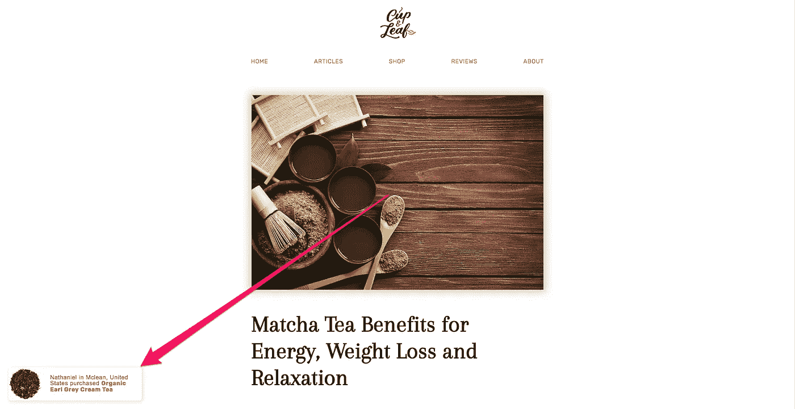

# 确切地说，如何在 3 周内开始一项电子商务业务:循序渐进

> 原文：<https://medium.com/swlh/exactly-how-to-start-an-ecommerce-business-in-3-weeks-step-by-step-116d2cbdd6f>

三周前，我在健身房，突然想到一个主意:

“算了，我们开个茶叶公司吧。”

多年来，我一直有开办自己的茶叶公司的想法:

*   自从 Evernote 创建以来，它就一直在我的“生活目标”列表中。
*   在我的一些[最佳营销文章](https://www.yourgrowthmachine.com/blog/wiki-strategy)中，我提到了创办一家虚构的茶叶公司。
*   我拥有域名“natlikestea.com”已经 3 年了。
*   我[以前在这个网站上写过关于茶的文章](https://www.nateliason.com/bulletproof-tea-recipe/)。
*   我们经常在[喝一些新的混合茶，让你想到](https://madeyouthinkpodcast.com/)。

但我从未认真追求过。我总是有另一个项目正在进行，没有时间，或者我不觉得我有资源奉献给它。

几周前，我意识到情况不再是这样了。我们启动了[杯&叶](http://www.cupandleaf.com/)博客，作为[增长机器](https://www.yourgrowthmachine.com/)项目，为我们提供一个可以在案例研究中免费使用的网站，并作为新员工的培训基地。内容已经在一个很好的时间表上，我们在等待游戏，看看它什么时候会开始排名。

但是没有销售额的流量并不特别有价值。**如果你的博客每月 10 万访客什么都不买，他们有什么好处？**只有当我们能够证明我们不仅获得了流量，而且流量也转化为销售额时，growing the Cup & Leaf 博客的案例研究才会有用。

因此，尽管对电子商务、实体产品、分销或任何与肉类空间工作相关的棘手问题毫无经验，他还是开始了创办茶叶公司的旅程，以补充博客的不足。

三周后，[杯&叶店的](http://shop.cupandleaf.com/) [v1 上线](http://shop.cupandleaf.com/)并完成了第一笔销售。由于 Twitter 上有人对我所做的一切感兴趣，我想我应该在这里更深入地了解细节。

作为快速概述，我将介绍:

1.  找到供应商并得到我们的茶叶
2.  建立网上商店
3.  包装和准备初始产品
4.  设计博客以推动销售
5.  发射

# 1.找到供应商并得到我们的茶叶

这里有一个小秘密:大多数茶叶公司不种植自己的茶叶。

一些大品牌，比如 Teavana，*可能拥有自己的茶园，但你遇到的大多数茶叶品牌都是从中间商那里批发茶叶，这些中间商从世界各地的茶园大量购买茶叶。*

*如果你想知道为什么大多数便宜的茶尝起来奇怪地相似…这就是原因。当你进入优质层时，你会得到更多的差异化，但大多数廉价茶都来自同一批分销商。*

*因此，虽然我很想与茶园建立直接关系，甚至购买我们自己的茶园，但总有一天，从那里开始是没有意义的。找到一家茶叶批发商是最有意义的，我可以从那里大量购买，重新包装，然后出售。*

*找到一个就像在谷歌上搜索“茶叶批发商”一样简单，然后点击直到我找到一些看起来合法的。谢天谢地，他们有很多。*

*我主要感兴趣的是:*

*   *总部在美国*
*   *有一个小的初始购买需求*
*   *储备了大量的茶叶*

*基本上，我想要的是那些能让我便宜快速起步，同时还能一起成长的公司。然而，当我开始调查批发商时，很明显我需要一个企业来解决所有这些问题。*

*你不能像从亚马逊购买一样，直接从大多数批发商那里购买。大多数批发商都想要一个 EIN(雇主识别号)来记录他们的销售，而我没有一个好的来使用。我本来可以使用生长机器的，但这似乎不太正确，所以我决定继续进行合并杯叶。*

# *公司*

*如果我不需要 EIN，我会推迟这一步，但因为它看起来很重要，我继续前进，并建立了一个有限责任公司杯叶。*

*我过去用过 Incorporate.com 的[和](http://partners.incorporate.com/88558/5288)，它们很棒。他们花了大约 10 分钟在网上填写了创建有限责任公司所需的一切，而且费用也不算太高。他们也只花了两天时间就给我弄了一个 EIN。*

*有趣的是，在我提交了 Incorporate.com 的信息后不久，我试图申请一个没有 EIN 的批发商联系我，他告诉我，我被批准使用我的社会安全号码注册一个商业账户。所以我根本不需要 EIN，但将来拥有它还是很好的。*

# *选择茶*

*现在我有了一个商家账户，我需要弄清楚买什么茶。*

*我决定搭配一些我非常喜欢的有趣的茶:*

*   *[牛奶乌龙](https://shop.cupandleaf.com/products/milk-oolong-tea)*
*   *[伯爵霜](https://shop.cupandleaf.com/products/earl-grey-cream)*
*   *[正山搜宠](https://shop.cupandleaf.com/products/lapsang-souchong-black-tea)*
*   *[普洱](https://shop.cupandleaf.com/products/pu-erh-3-year)*

*以及一些人们认可的“标准”安全茶*

*   *[森茶绿](https://shop.cupandleaf.com/products/sencha-fuji-green-tea)*
*   *[抹茶](https://shop.cupandleaf.com/products/jasmine-green-matcha-tea)*
*   *[英式早餐](https://shop.cupandleaf.com/products/english-breakfast-black-tea)*
*   *[根脉茶](https://shop.cupandleaf.com/products/genmaicha-green-tea)*

*我还想确保我有一种茶来替代我的防弹茶配方中的每一种成分，这意味着我还需要一种巴拉圭茶。*

*点了茶之后，我在产品方面所能做的就是等待它的到来。所以与此同时，我开始着手建立网上商店。*

# *2.建立网上商店*

*获得基本的商店设置是最容易的部分之一。Shopify 让整个过程变得非常简单，没有痛苦，我不认为它花了一个多小时就让商店的基本框架建立起来并运行起来。一旦一个基本的版本建立起来，[珂赛特](http://www.cosetteesnes.com/)，她写了杯子和叶子的博客，也能参与设计商店。*

*我继续使用其他网站的照片作为产品图片的占位符来添加产品，但我仍然需要弄清楚我将如何给所有东西定价。*

# *定价*

*我根据两个指标来定价:*

1.  *我的目标毛利*
2.  *还有哪些优质茶叶网站在收费*

*对于给定的茶，我从购买它的成本开始，在我决定提供的三个尺寸(2 盎司、4 盎司、8 盎司)下。*

*比方说，我可以花 10 美元买一袋 1 磅重的伯爵茶。那么我不同尺寸的成本是:*

*   *2 盎司:1.25 美元*
*   *4 盎司:2.5 美元*
*   *8 盎司:5.00 美元*

*假设我的目标利润率是 60%。然后，我需要将每项成本除以 0.4(1–0.6)，算出它的价格应该是多少:*

*   *2 盎司:3.13 美元*
*   *4 盎司 6.25 美元*
*   *8 盎司:12.50 美元*

*然后我选择了最接近这个数字的价格，这样网站上的所有东西看起来都是一致的，通常都是四舍五入。在这种情况下，我会说:*

*   *2 盎司:2.99 美元*
*   *4 盎司:5.99 美元*
*   *8 盎司:11.99 美元*

*我想我可以随时更新这个，它给了我一个足够好的起点。当然，我在一个大的电子表格中做了这些，看起来像这样:*

**

*一旦定价完成，我需要添加几个我认为能帮助我马上卖出更多东西的应用程序。*

# *复习*

*这一点很简单:人们喜欢在购买前看到评论，以提供一些社会证据，证明你是一个真正的网站，人们喜欢你的产品。*

*显然，这些在开始时风险更大，因为*而不是*拥有它们会产生相反的效果，但我认为我越早发布评论，我就能越早开始收集它们。*

**

*为此，我使用了 [Shopify 的内置评论应用](https://apps.shopify.com/product-reviews)。*

# *Fomo*

*下一步是[安装 Fomo](https://www.usefomo.com/ref/df74a6803f97) ，这个工具会在屏幕边缘给浏览你网站的访问者一些提示，让他们知道其他人也在做同样的事情:*

**

*我已经看到了他们的一些幕后数据，所以我可以说，通知对于增加转化率和购物车大小真的很有效。当我的流量很低时，它不会在开始做很多，但类似于评论，我希望它尽快出现在那里。*

# *交叉销售*

*我还想尽快建立交叉销售，因为[我已经看到了一些数据](http://growthrock.co/ecommerce-upsell-cross-selling/)显示它对于增加购物车大小是多么有效。*

*这正是您所期望的:在每个产品页面和购物车中添加相关商品，以吸引购物者购买更多商品。对于茶，我发现这种方法在过去对我非常有效，因为我很难拒绝尝试至少一种我以前没有喝过的茶。*

*[交叉销售应用的](https://www.csell.co/)团队让这变得极其容易。我刚刚从 Shopify 应用商店安装了应用程序，然后他们进去根据我的主题定制了它。令人印象深刻的客户支持 20 美元/月的产品。*

**

# *充值订阅*

*接下来是添加订阅。让人们选择定期打折购买是有道理的，因为如果你每天喝一杯茶，你会在 15、30 或 60 天内喝完大部分数量。*

*[Recharge](https://rechargepayments.com/) 是一款很挑剔的应用，我最难把它做好，但是一旦它被设置好了，任何人都可以很容易地订阅一款非样品包装的茶:*

**

# *免运费*

*接下来是免费送货服务。有一个非常受欢迎的 Shopify 应用程序让这个过程变得非常简单，它被称为“[免费送货栏](https://apps.shopify.com/free-shipping-bar?utm_content=contextual&utm_medium=shopify&utm_source=admin)”，你可以在这里为免费送货设定价格，然后屏幕顶部的小栏会随着人们向购物车中添加更多商品而自动更新:*

**

*很简单，也是增加购物车容量的一大动力。此外，由于茶的重量很轻，利润开始也不错，这并不是一个荒谬的提议。*

# *克拉维约*

*在后端，我设置了 [Klaviyo](https://www.klaviyo.com/) 来处理电子邮件营销，因为它在整合 Shopify 和跟踪你商店发生的一切方面做得非常好，这样你就可以发送超针对性的电子邮件。*

*首先，我为以下人员设置了电子邮件:*

*   *废弃的手推车*
*   *感谢新客户*
*   *跟进新订户*
*   *征求评论/交叉销售*

*但这也让我发送一封电子邮件，让我欢迎和接纳新的博客订阅者，让我做销售渠道，等等。它非常强大，似乎是我的大多数电子商务商店朋友的首选电子邮件营销工具。*

# *个人的*

*最后一步是添加 [Privy](https://privy.com/) 来处理退出意图弹出窗口，当人们开始离开商店时，为他们的第一个订单提供 10%的折扣。这在我看过的一些其他商店中有很高的转换率，是比得到一些关于茶的愚蠢的免费电子书更有价值的 CTA。*

**

*所有的应用程序都给了我一个网站的良好开端，现在我需要弄清楚物理包装。*

# *3.包装和准备初始产品*

*首先，我决定做一个简单的包装，类似于 Teavana 过去在网上订购的方式:贴上标签的箔袋。我将来想要漂亮的罐头，但是现在，这是一个好的 MVP。*

*我在亚马逊上买了 100 个密封的铝箔袋，大概是我认为我需要的尺寸，一个热封机，运输标签，运输套，以及我可以用来装茶叶袋的粘性标签。然后我上了[贴纸](https://www.stickermule.com/unlock?ref_id=9416320701)网站，订购了 100 个标签，我可以用在锡箔袋上，给它们一些品牌。*

*我不得不猜测这一步的尺寸。我还没有茶，也不想花太多的时间来改变袋子的尺寸，所以我选择了看起来合适的尺寸，这是基于我放在家里的其他茶叶袋的尺寸。谢天谢地，我终于答对了。*

*从批发商那里订购一周后，茶叶就到了！它装在这些凉爽的真空密封砖里:*

**

*然后我和女朋友花了一下午的时间尝试包装，把餐桌弄得有点乱:*

**

*但在结束时，我们已经包装好了第一批茶，准备送给第一个付钱的顾客(可能是我妈妈)，还有设计这个标志的艾米丽。*

**

*也是在这个时候，我需要拍一些产品照片。幸运的是，我已经有了一个来自摄影实验的 DSLR，我从亚马逊订购了一个便宜的[可折叠“lightroom”](https://amzn.to/2IzyZTe)来拍摄照片:*

**

*然后我将这些照片上传到商店，以取代我“借用”的产品照片*

*此外，Twitter 上的一位朋友建议我为不确定茶是什么的人提供“样品”包，我认为这是一个很棒的主意，所以我补充道:*

*   *[八大名茶采样器](https://shop.cupandleaf.com/collections/tea-bundles/products/our-top-8-favorite-teas)*
*   *[排名前四的茶叶采样器](https://shop.cupandleaf.com/collections/tea-bundles/products/our-top-4-favorite-teas)*
*   *[顶级红茶采样器](https://shop.cupandleaf.com/collections/tea-bundles/products/top-black-teas-sampler)*

*并且随着产品库的扩展，可能会添加更多的采样器。*

*实体产品和商店方面的一切都准备好了，现在我只需要整合博客来展示我们的产品。*

# *4.设计博客以推动销售*

*Shopify 的博客平台不是特别强大，Webflow 也不适合电子商务，所以我想把两者分开。根 www.cupandleaf.com 域名的博客和 shop.cupandleaf.com 的商店。*

*但这样做的缺点是，博客不能像内置在 Shopify 中那样自然地推动销售，所以我必须有点创意。*

*第一步是将 [Fomo](https://www.usefomo.com/ref/df74a6803f97) 添加到博客中，引入 Shopify 销售数据，这样阅读博客的人也能获得 CTA:*

**

*我还在每篇[文章](http://www.cupandleaf.com/blog/)的末尾添加了一个部分，推荐一些他们可能想尝试的茶:*

**

*茶评现在倾向于推荐我们的茶，而不是其他茶:*

**

*就这样，一切似乎都准备好了！最后一步是启动商店。*

# *5.发射*

*我让发布开始相当简单。我不想冒险破坏太多东西，所以，现在，我只关注我已经拥有的资产。*

*我写了这篇文章，虽然信息丰富，但也是一个巨大的广告*

*我开始在[让你思考](https://madeyouthinkpodcast.com/)播客上推广 Cup & Leaf。*

*我在我的[周一综合时事通讯](https://www.nateliason.com/join/)中介绍了这次发布。*

*现在…我们等着看会发生什么。假设一切顺利，我将在未来带着更多关于 Cup & Leaf 的帖子回来，并更新这最后一节！*

**

## *这篇文章发表在《T4》杂志《创业》(The Startup)上，这是 Medium 最大的创业刊物，拥有 329，974+读者。*

## *在这里订阅接收[我们的头条新闻](http://growthsupply.com/the-startup-newsletter/)。*

**