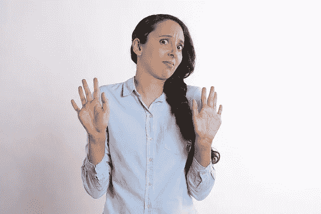

# 打扰一下。你是？

> 原文：<https://medium.com/swlh/excuse-me-and-you-are-88d5ed6afac4>

陌生人警报。你在社交上失败的最大原因。

很多次我看到个人品牌在脸书和 Instagram 上发布他们的服务或产品，却没有产生太多的参与度。

很多时候，我发现自己没有被强迫去点击，也没有被强迫去了解更多，即使这个主题至少是我非常感兴趣的。为什么会这样呢？

我问自己:“为了得到他们想要的回应，那个人遗漏了什么或者没有做什么？”

如果我没有被强迫点击、订阅或购买，那么其他人可能也不会。为什么？

**答案就在我开始问的问题中:**

是题目吗？没有
是服务吗？:没有
是他们帖子的质量问题？:不
是因为这个人不讨人喜欢吗？:没有
是因为他们缺乏信用吗？:没有。

那会是什么呢？
在很多情况下，**我们在建立关系方面是失败的**。我们被迫做出承诺，但我们甚至还没有开始约会。
记住，**一开始你是个陌生人。**

**先约会。第二次提交。**就是这个顺序。

前几天，我在 IG 上收到了一个关于某人新发布的播客的更新帖子。我对这个话题很感兴趣。但是我不想订阅。

原因如下:

**我 DONT 认识她。
陌生人预警。
认购=承诺。**

我甚至还没有决定要不要承诺，因为，

**我还是 DONT 认识她的。**

我没有时间，也不想听一两个小时的播客来开始对她产生好感。在我承诺之前，我需要确定。是的，我在 IG 上关注她，但是我仍然对她一无所知。是的，她有简历。是的，很清楚。是的，我明白。是的，她定期发帖。好的好的好的。

**和**不，我还是不认识她。

让我们看看建立关系的心理学以及某人如何选择承诺。

在关系方面，在我们决定要承诺之前，我们经常花时间去了解对方。节奏自然地展开，我们最终在许多不同的场景和许多不同的环境中越来越多地暴露出我们的内心。

我们可能会一起喝咖啡，然后吃饭，然后远足，然后邀请对方去家里，参加工作聚会或家庭活动。它是分阶段发生的，在许多其他事情发生之前，我们不会在你的家庭活动中结束。这同样适用于社交。

所以，如果你不是一个家喻户晓的名字，那么我们就不认识你。
**还是那句话，你是陌生人。**我们需要了解你。
如果你没有给我们时间与你建立关系，我们为什么要订阅你的网络系列、播客、阅读你的 7 分钟博文、购买你的书或你的 1000 美元节目？
你的家人和配偶可能会认为你是自切面包以来最伟大的人，他们应该这样认为。但你妄想我们其他人会马上以同样的方式看待你。

拥有一个产品或服务，以及几个社交媒体账户，并不足以让你获得社交媒体社区的即时承诺。

在人际关系中，在各种不同的环境中见过对方一段时间后，我们最终会同意我们已经看够了，可以做出选择进入一段关系或完全结束约会。但是我们确实选择了**一些东西。**

让我们把它应用到你的个人品牌产品或服务中。许多人有才华，可爱，有信誉和经验。

然而很少有人真正成功。

我们在社交上的注意力持续时间越来越短。我最后听到的是 3 秒钟。也就是说，你没有太多的时间来留下一个好的第一印象。如果在 3 秒钟内，你说服我们去了解你，比我们开始约会时更多。记住，我们只是在这个阶段约会。

你会制作一些内容，让我们了解你并喜欢你一段时间，然后如果你已经迫使我们足够信任你，我们会选择进入一段关系。这就是你开始销售的时候。

从那个阶段开始，你的听众将准备好聆听你所提供的深入、冗长或昂贵的内容。

谎言是:“你好，我们就在你身边。”

不，你没有。

你必须努力，要有耐心，对约会过程要现实。

我曾经点击了一个网上研讨会的链接，是关于一个我认为可能有用的主题。这位女士对我来说是个陌生人。记住那个词，“陌生人”。她人到中年，富有，事业有成，在使用她服务的大公司中，她在自己的专业领域很出名。她现在就在这里，想要通过社交媒体与普通人联系。一个星期六的下午，我浪费了一个多小时，再也找不回来了，我发誓再也不浪费时间了。她是一个糟糕的沟通者，她不迷人也不暴露，尽管她试图推销她的产品，这可能是好的，但一个小时后我仍然对她一无所知，这意味着，**我不信任她。她仍然是一个陌生人。**

我怀疑她的竞选惨败，因为从那以后我再也没有在任何地方见过或听说过她。

我是詹姆斯·阿尔图彻和他的产品的忠实追随者的原因是，通过他的内容，他让他的观众了解并展示了他是谁。他对自己的失败以及从中吸取的教训直言不讳。那里有信任和关系的建立，不管他是否知道。

我为他的时事通讯付费，买他的书，订阅他的播客，因为我是在一个约会阶段第一次通过他的内容认识他的。**关注我行为背后的** **心理，追随，付出，订阅。** 对我来说没关系，他的播客嘉宾大部分都是顶尖的表演者，或者是著名的、广为人知的成功故事。我不喜欢他的客人，尽管他们很棒。他可以采访他的管家，如果他有的话，我才不管呢。神奇之处在于，他在促进对话的同时，还能让听众参与进来。他真正提供的产品是他自己和他的生活经历。这很好卖。

总之。我们最不擅长客观地对待自己。我最近开始发消息和评论人们的帖子，提供我认为来自我的洞察力和智慧的价值。是的，很大胆。然而，我可以清楚地看到他们的目标是什么，以及它是如何糟糕地展示。我给他们自由的建设性的批评，他们可以选择接受或不接受。如果实施了一个策略，改变了他们的生活和生计，会怎么样？

我认为保持沉默是一个错误。我们身边有太多唯唯诺诺的人。我希望看到人们成功，我的意图是提供帮助。所以，我不打算沉默，我会继续，即使有一两个人接受我的建议。

最后，我强烈建议你做出决定，让自己更具启发性，并与你的听众建立联系。用短小、巧妙、高质量的短片记录你的生活，他们会因此而喜欢你。实事求是地说，利用 IG 故事和 IG 生活，以及 FB 故事和 FB 生活，如入无人之境。视频内容销售第一，音频第二，然后是文字。事实上，视频或音频内容可以用于启动书写单词。

仔细选择你想如何给人留下第一印象。

记住。一开始你是一个陌生人。不要跳过阶段。

我们先约会，再承诺。

透过那个镜头过滤一切，你就有了一个好的开始！

你真诚的，坦尼娅。

## 如果你喜欢这个故事，请分享！你可以在[媒体](/@TanyaHQ)和[脸书](https://www.facebook.com/TanyaHeadquarters/)和 [Instagram](http://www.instagram.com/tanya.hq/) 上关注我

## 这个故事发表在 [The Startup](https://medium.com/swlh) 上，这是 Medium 最大的企业家出版物，拥有 275，554+人。

## 订阅接收[我们的头条](http://growthsupply.com/the-startup-newsletter/)。

