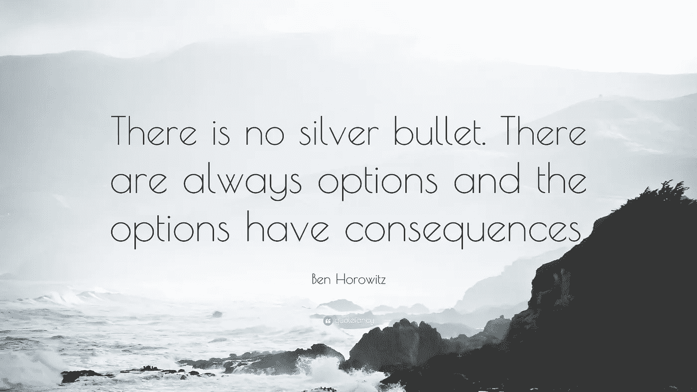

# 执行让我的创业安乐死的决定

> 原文：<https://medium.com/swlh/executing-the-decision-to-euthanize-my-startup-1e77043aabba>

唯一比组建一个由 8 名出色的人组成的团队更难的事情是解雇他们，他们会帮助你达到每月 5 万美元的收益率。

Photo by [Arnold Exconde](https://unsplash.com/photos/vjvcE-X2pWs?utm_source=unsplash&utm_medium=referral&utm_content=creditCopyText) on [Unsplash](https://unsplash.com/search/photos/brink?utm_source=unsplash&utm_medium=referral&utm_content=creditCopyText)

识别和执行艰难的决定是你不能也不应该避免跨越的唯一桥梁。

在成功运行了 2 年之后，我的创业突然陷入低迷，我可以看到我们的船在自己的重量下下沉。

如果我们不采取任何措施，在接下来的几个月里，我们都会身无分文。摆在我面前的有两个艰难的选择:

1.  **削减每个人的薪水+承诺在此期间搞点快速黑客技术**
2.  解雇所有人+为重新思考整个企业赢得时间

当面临一个艰难的决定时，一个人必须直面它！即使是轻微的犹豫也会导致很多困惑。

高科技企业家、风险投资公司 [**a16z**](https://a16z.com/) 的联合创始人本·霍洛维茨(Ben Horowitz)在他的书**中写道，关于困难的事情**

> 如果你要吃屎，不要啃！

因为我们是一家咨询公司，所以我们所有的工作都来自客户。有了帮助我达到我所见过的最高高度的团队，*选项 1* 似乎更加人性化。

但是 ***选项 1*** 相当于一种完全没有工作的情况。另外，获得任何新客户估计需要 7-9 个月的时间。

[https://pixabay.com/en/users/Alexas_Fotos-686414/](https://pixabay.com/en/users/Alexas_Fotos-686414/)

## 识别困难的决定

我们大多数人都不愿做出艰难的决定。这是人之常情。我们是逃避现实的建筑。但是任何人一生中最关键的时刻都是你需要表明立场的时候。人们向你寻求清晰。

选项 1 会产生以下后果:*低工资* *几个月没有工作*。这不会在金钱上对员工造成太大伤害，但确实会影响他们的工作体验。

在这个节骨眼上，如果不认识到是时候做出艰难的决定了，我们就会自动进入选项 1。然而，这些员工中有些是应届毕业生。要求应届毕业生在职业生涯的前 8 个月不工作似乎非常傲慢，也是一个太大的要求。

尽管选项 2 看起来有点懦弱，更自私，而且在短期内伤害了我们的员工，但选项 1 是一个长期的负面影响。

> ***有时候一个组织不需要解决方案；它只需要清晰——本·霍洛维茨***

问:你如何识别“艰难的选择”？
**答:**当决策的风险太高，或者就解决方案而言没有明确的赢家时。

**避免决策瘫痪**

不确定决策的成本可能太高。在失去所有客户后的两个月里，我们仍然向每个人支付全额工资，却不能给他们很多工作。两个月来，我们确信自己会成功的。两个月来，我们避免做出决定。

不仅员工能够感觉到空气中的紧张，而且缺乏客户互动也导致了信心的下降。

## 执行艰难的决定

## …并支付它要求的价格

一旦确定，艰难的决定应该迅速付诸实施。

在这个关键时刻，一个好的领导者的直觉证明是有用的。你可以试着计算一下，但是如果这真的是一个艰难的决定，你的预测和数学只能帮到这么多

> 本能是我们偷偷摸摸的大脑学习没有明确告诉它的东西的结果。

在我的直觉、其他企业家的建议、书籍和 TED 演讲的综合影响下，我决定选择第二种选择。

也许那天是星期四。周五公布大规模裁员的消息意味着他们可以在周末消化这个消息。

我想起了本的口头禅:人>产品/创新>利润。永远以人民为重。工作第二，利润第三。我花了很多时间思考我的每个员工会有什么感受。我试着想象他们的个人生活会受到怎样的影响。

> 一想到要宣布他们大学一毕业就选择的公司倒闭的消息，我就感到害怕。

我寻求解决方案的大脑立即开始工作。

> **缓解冲击的方法:**想想你能做些什么来减轻/缓和你的决定对近期的影响。

我知道我们竞争对手的意图(他们也挖走了我们的客户)。他们也会很乐意雇佣我们的员工。我已经准备好了。很难想象把我们的员工交给那个把我们搞得焦头烂额的竞争对手。

> 但这是做出这个艰难决定的代价。这保障了他们的未来，并保证他们有工作。

[https://quotefancy.com/ben-horowitz-quotes](https://quotefancy.com/ben-horowitz-quotes)

那天是星期五，人们心情愉快。我把每个人都召集到会议室。

有那么一会儿，我真希望还有别的办法。但是没有！

有喘息声和眼泪，但也有许多人想要无偿工作的回声。房间里充满了让公司重振旗鼓的热情。

所有提出的解决方案都是某种形式的**选项 1** 。

> 我知道解决问题的大脑总是在寻找解决方案，即使是在最困难的时候。

我泰然自若地说，我们无疑要倒闭了。我答应给他们一笔遣散费，并建议他们加入竞争对手的公司。

那些不想加入那家公司的人会得到一份丰厚的推荐信，我们会把他们和业内人士联系起来。

这是我做过的最艰难的决定之一。快进到未来，仅仅一个月后，我们所有的员工都被安排到了某个公司。他们很高兴，终于理解了我们的决定。

无论采取哪种方式，都是一个艰难的决定。但只有通过接听电话，我才明白了接听电话的重要性。你可能不知道所有的答案，但是当形势需要的时候，你不应该回避选择一个方向。

毕竟敢于梦想的人才是成功的人！

> “困难的事情之所以困难，是因为没有简单的答案或方法。它们很难，因为你的情绪与你的逻辑不一致。这些问题很难回答，因为你不知道答案，你无法在不示弱的情况下寻求帮助。”
> ― **本·霍洛维茨**，**艰难的事情:在没有简单答案的情况下创业**

## 这篇文章发表在 [The Startup](https://medium.com/swlh) 上，这是 Medium 最大的创业刊物，有 325，521+人关注。

## 在这里订阅接收[我们的头条新闻](http://growthsupply.com/the-startup-newsletter/)。

