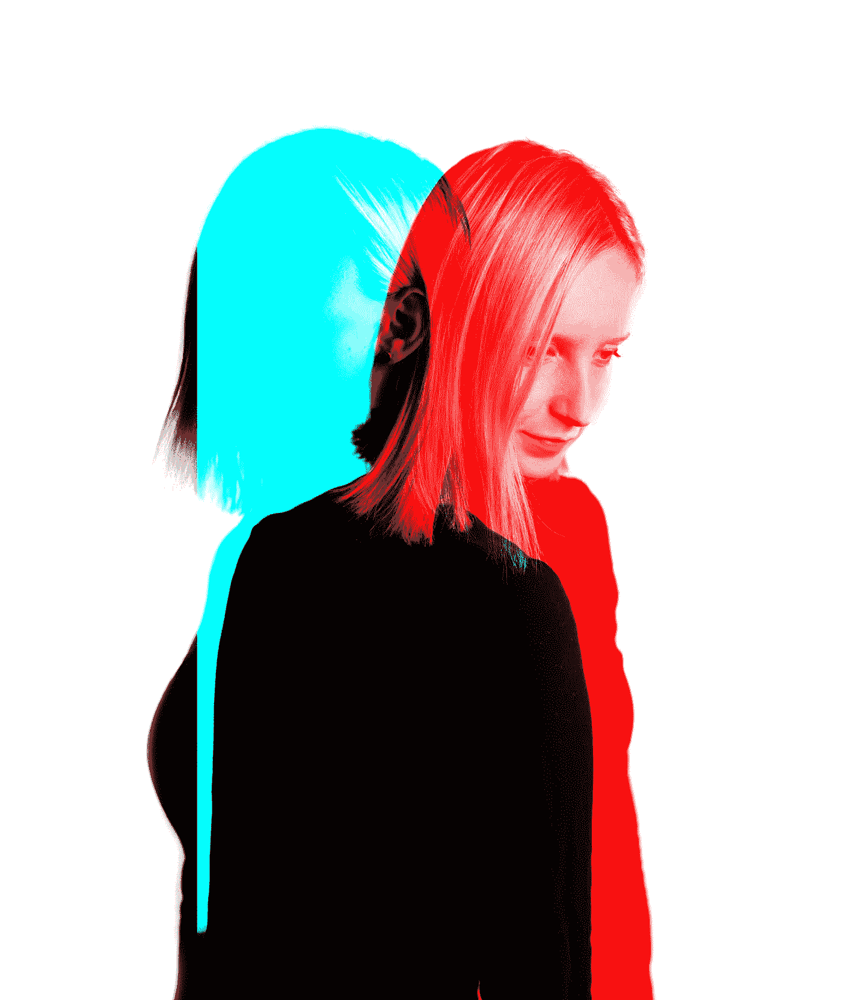

# “经验是创造性的反义词”(并消耗你的思维)

> 原文：<https://medium.com/swlh/experience-is-the-opposite-of-being-creative-and-taxes-your-thinking-72ffdaa425ea>

[Jurica Koletić](https://unsplash.com/photos/RcVzx4burTY?utm_source=unsplash&utm_medium=referral&utm_content=creditCopyText)

## 有经验会影响你的思维

> 当死亡的时候，让我们不要发现我们从未活过 —亨利·大卫·梭罗
> 
> "经验是创造力的对立面。"—保罗…