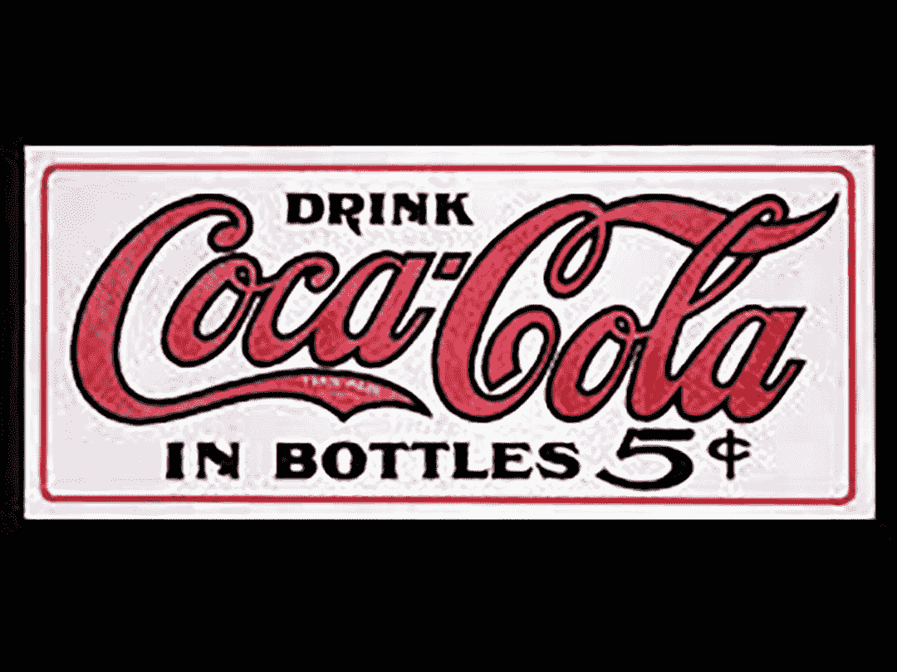
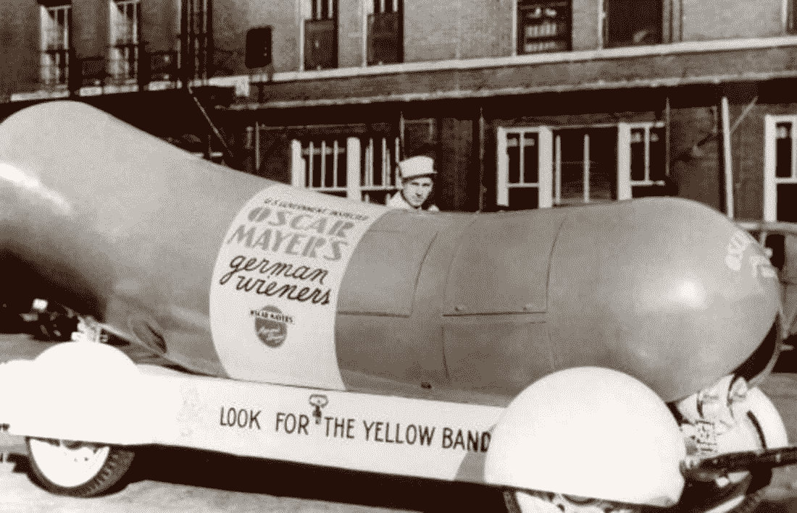
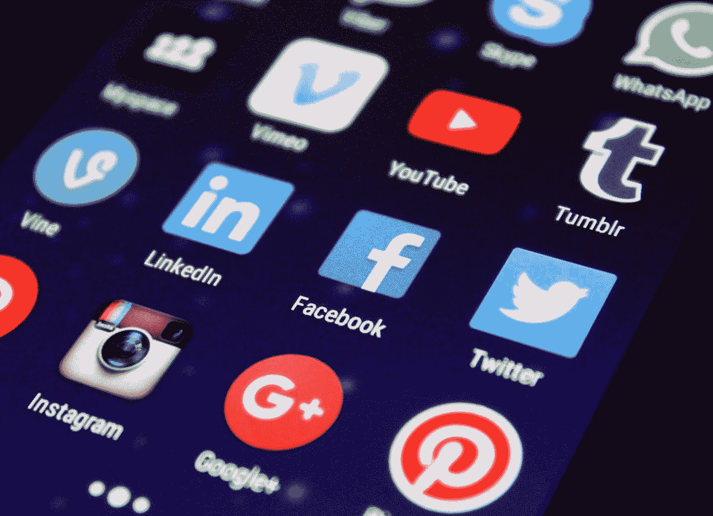

# 今天的体验营销:事件营销的演变

> 原文：<https://medium.com/swlh/experiential-marketing-today-the-evolution-of-event-marketing-c9b473f28eea>

虽然体验营销并不总是像今天这样的形式，事件营销的演变可以追溯到使用的策略如此简单以至于今天它们甚至可能不被认为是“体验”的时候，但近年来，技术为营销人员打开了大门，使品牌的存在远远超出了横幅广告。

例如，消费品公司过去常常严重依赖免费样品，当时他们的策略是让消费者感受到产品的好处，并希望激发潜在的店内购买。

当技术成为大多数体验式营销策略的核心时，大约 15 年前的成功故事似乎正在褪色，特别是随着脸书和 Twitter 的增长，每个病毒视频都涉及高科技激活，如弹出式商店或互动展示。营销不再仅仅是分发产品，而是围绕产品给消费者一种难忘的生活方式体验。

# **19 世纪**

## **体验式营销和产品抽样**

早在 1886 年，可口可乐就首次开始应用体验营销和产品抽样的概念，当时他们开始分发样本优惠券，到 1900 年，可口可乐从一家南方城市的小型饮料公司转变为美国各州都可以买到的品牌。

他们会向主要的商会或教会发送数百张优惠券，并要求他们在他们的领导人之间分发。然后，他们会送去(当时非常流行的)当地的冷饮柜，里面有足够的糖浆，可以买到与之前相同数量的优惠券。1886 年至 1914 年间，十分之一的可乐是免费赠送的。

# **1900 年代**

## **移动营销之旅**

第一次也是最令人难忘的移动营销之旅是奥斯卡·梅尔的 Weinermobile。事实上，它已经巡回演出了将近一百年。韦纳莫比尔是奥斯卡的侄子卡尔·g·迈耶的心血来潮。这一大块牛肉迅速赢得了全国顾客的心和关注。

今天，司机们仍然被称为“热狗”，因为他们在开车时会发出模仿韦纳汽车的迷你玩具哨子，名为“维也纳哨子”。在这篇博文中，你可以读到一些现代[移动营销之旅](https://www.pspmediainc.com/single-post/2018/02/15/Great-Mobile-Marketing-Tour-Activations)的好例子。

## **游击营销**

1984 年，当 J [ay Conrad Levinson 的《游击广告》登陆书店时，这种标志性且经常引起争议的广告形式首次出现。这本书展示了小企业成功的成本效益技术的秘密，其中包括一些独特的、令人震惊的、有趣的、聪明的和创造性的策略和活动，客户将记住这些策略和活动，并且不会停止谈论它们。](https://www.amazon.com/Guerrilla-Advertising-Jay-Conrad-Levinson-ebook/dp/B001QFYPU4)

莱文森的方法多年来一直被用来帮助小企业压制他们的大型竞争对手，改变了当时广告游戏的方式。开创性的广告公司，如 Kirshenbaum 和 Bond，显然是这一理念的追随者，他们在广告中把水果和内衣贴在人行道下水道的格栅上。

# **2000 年代**

## **社交媒体**

社交媒体彻底改变了品牌与消费者沟通的方式，以及消费者与世界分享内容的方式。这种影响从过去参观某个活动的特定人群扩展到全世界的人都在观看的虚拟场所，每一个体验式营销机构都注意到了这一点。

如今，许多品牌激活都包括社交分享元素，如摄影比赛，或使用#标签。

## **沉浸式事件**

通过模拟器、游戏、无人机直播、全息技术和虚拟现实等各种互动元素，创造一种真正沉浸于观众的体验，这是当今品牌在超级碗、SXSW 或 Coachella 等重大活动中所做的事情。身临其境的活动创造了难忘的情感体验，带来了持久的印象，并使消费者感到彼此之间以及与品牌本身的联系更加紧密。

## **弹出事件**

没有什么比一个令人敬畏的弹出式活动更能吸引眼球的了，它在一个临时的空间有限的时间内展示品牌的产品或服务，在一个“似乎没有计划的”或临时的事件中建立品牌知名度并给新的观众留下深刻印象。

# 行动起来！

**感谢**听完这个故事。如果你喜欢这个故事，点击👏按钮，并与他人分享！

## 这个故事发表在 [The Startup](https://medium.com/swlh) 上，这是 Medium 最大的创业刊物，拥有 319，931+人关注。

## 在这里订阅接收[我们的头条新闻](http://growthsupply.com/the-startup-newsletter/)。

