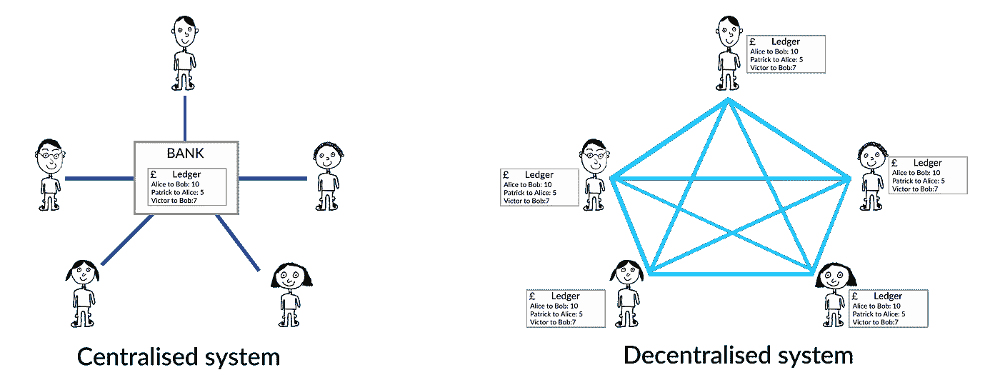
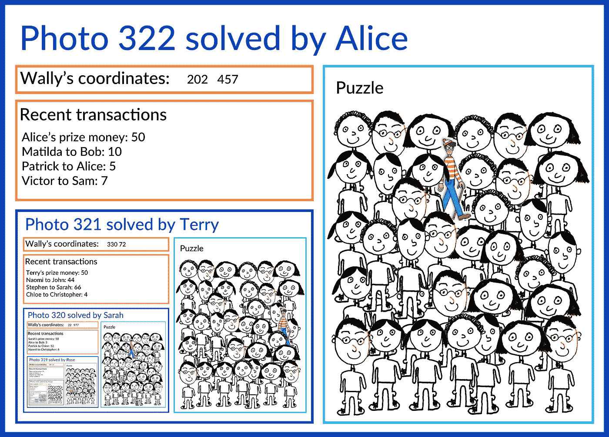

# 用《沃利在哪里》和一台相机解释区块链📸

> 原文：<https://medium.com/swlh/explaining-blockchain-with-wheres-wally-and-a-camera-79e860a05815>

## 一个针对初学者的博客，寻找区块链技术直观易懂的讲解。

Wally image from [http://waldo.wikia.com/wiki/File:Character.Waldo.jpg](http://waldo.wikia.com/wiki/File:Character.Waldo.jpg)

# 背景

区块链的故事始于 2008 年，一个名叫中本聪的神秘人发布了一篇名为

> “比特币:一种点对点的电子现金系统”。

## 那么神秘的中本聪是谁呢？

像之前的斯巴达克斯、佐罗和班克斯一样，许多人声称自己是伟大的聪，然而没有人知道他或她到底是谁。在比特币的兴起以及随后区块链技术的兴起过程中，他一直保持匿名。

已经有很多人试图通过分析他的帖子和信件来找到 Satoshi，但是还没有找到确凿的证据。

我们对 Satoshi 的了解是，在 2008 年，他熟悉密码学的最新研究，他不喜欢银行。

2009 年 1 月初，比特币区块链的第一个*区块*被创建(*开采*)。它包含了信息

> "《泰晤士报》03/1/2009 财政大臣濒临第二次银行救助."

这个报纸标题提供了第一个街区的时间戳，就像人质在人质视频中举起当天的报纸，以显示他们在某一天仍然活着。

这条消息也是特意选择来强调比特币旨在解决的问题。

# 所以这条消息是在第一个块中…但是什么是块，为什么会有一连串的块呢？

要回答这个，首先要讨论一下 Satoshi 创造比特币的根本原因。从本质上讲，它是将“可信任的第三方”从金融交易中剔除。我们所说的可信第三方是指银行。

## 当前的银行系统

为了清楚起见，让我们将当前的“中央化”银行系统简化为一个只有一家银行供所有人使用的基本系统。这家银行的作用只是记录付款人和收款人之间的所有交易。

一个事务可能读起来像“爱丽丝付给鲍勃 10 英镑”。

然而，我们在网上进行的每一笔交易并不只是从付款人到收款人。它从付款人到银行，然后到收款人。

Financial systems

银行允许并记录我们进行的每一笔金融交易，因此，它对我们的财务有完全的控制权。该银行还从许多交易中抽取佣金。

控制这份被称为*总账的交易清单*赋予了银行控制用户财务的权力。如果银行决定更改分类账，谁能阻止他们？

基于此，Satoshi 最初的目标是创建一个没有银行的金融体系。

# 没有银行的金融体系

将银行从我们简化的金融系统中移除的第一步是从银行中取出交易分类账并将其公之于众。

所以，让我们把账本给系统的用户…但是给多少用户呢？

好吧，账本必须给任何想要的人，因为我们如何从系统中删除一个可信任的第三方？想想看，如果一半的用户控制着账本，而另一半没有，那么前一半就处于权力的地位。

为了完全消除任何类型的可信第三方，唯一的解决方案是允许金融系统的每个用户维护和更新分类账。

好吧…但是如果每个人都有一本的话，那看起来会有很多本。我们现在就开始吧。

这行得通吗？嗯……我们马上会遇到一个问题。

如果每个人都有一本账本，我们如何确保每个人的账本都在说同样的事情，也就是说，他们都在*共识*？

假设发生了一笔交易，比如说‘内奥米付给约翰 10 个硬币’，它会在网络上传播。一些用户在收到该交易后，将其添加到他们的分类帐中。但是，由于连接问题，少数用户收不到此交易。

在这种情况下，需要有某种方法来就分类账的“最正确”版本达成一致，但这会导致许多问题。

其中一个问题叫做*双重消费问题，*其中骗子可以利用账本的许多副本之间的差异，将他们的一些数字硬币消费两次！

要了解更多关于双重支出的问题，请阅读我的关于这个问题的[博客](/swlh/explaining-blockchain-with-coconuts-and-pineapples-e44edcbe2e0f)(即将推出！).

除了这些“达成共识”的问题，还有另一个问题。为什么人们首先会费心去照看这个分布式共享的分类账呢？这似乎是一个好主意，但更新和维护它是一项艰巨的工作。(在电力上)要花很多时间和金钱。对许多人来说，他们对银行的厌恶仅限于此。

需要激励用户正确维护共享账本。否则，他们只会回到使用旧的中央银行系统。

概括地说，我们对这种*去中心化的*共享分类账的想法有一些问题。

1.  **大量的总账复印件。**
2.  **双重支出问题(** [**博客**](/swlh/explaining-blockchain-with-coconuts-and-pineapples-e44edcbe2e0f) **)。**
3.  我们如何激励网络用户维护账本？

在这一点上，我们需要一个好主意，而 Satoshi 正好提供了这一点。在他的比特币白皮书中，他提出了一个革命性的想法，同时解决问题 2 和问题 3。这个想法被称为区块链。

# 区块链

为了解释区块链技术，我们将与爱丽丝聊天，她使用更加直观和简化的区块链与她的 99 个其他朋友一起管理她的财务。她的网络的区块链被称为“照片链”，它是基于“沃利在哪里”和一台相机📸！

你好，爱丽丝，请告诉我你和你的 99 个朋友是如何管理彼此的付款的。

**答:**嗨，是的，我是一个 100 人的金融网络的一部分，不涉及任何银行！我们的网络使用照片链技术而不是银行来管理我们的财务。

**PW:** 酷，你能解释一下你这么说是什么意思吗？

A: 当然，所以网络上的其他用户和我彼此都有一份我们交易的共享账本。

**PW:** 那么，当一个新的事务在网络上广播时，你会怎么做？

答:我的收件箱里刚收到一笔新交易。你能看到上面写着“马蒂尔达付给鲍勃 10 个数字硬币”吗？

然而，我没有简单地把它添加到我的账本中，而是等待。在我们的照片链中，交易仅按套添加到分类账中。并且**我** **想成为在将下一组交易发布到共享分类账的竞争中获胜的人。**

哦对了…为什么？

答:我们的照片链本质上是一种竞争。我与其他 99 名用户竞争成为下一个将一组交易发布到账本上的人，我之所以不厌其烦地竞争，是因为像所有好的竞争一样，获胜者会获得奖励。

这场比赛的获胜者可以获得一些数字硬币。

PW: 酷，那竞争是什么？

**答:**所以我的网络的竞争和比特币的竞争略有不同，但本质上是一样的。

看这本书。这是我们网络中 100 个人都有的一本沃利在哪里的书。现在，沃利的谜题**在哪里**很难解开。此外，没有捷径或巧妙的技巧来解决沃利在哪里的难题。你只需要开始寻找，通过系统地检查整个画面来找到 Wally(在文献中，这被称为*暴力搜索)*。

让我们打开书，检查当前的难题。

这是一个难题，我扫描了沃利的难题，希望第一个找到他，因此，第一个向网络广播解决方案。

我们称自己为搜寻者，我们相当于其他区块链人称之为*的矿工。*

现在当我在搜索的时候，看看我的收件箱，注意最近的网络交易是如何进来的，列出交易清单。

Where’s Wally?

哦，是的，我看到了。维克托刚刚付给萨姆 7 英镑…

他在那里，沃利在那里！他在那里，我敢肯定！

**PW:** 哦耶，看起来像他，干得好！还是告诉网络吧！我们，我是说你，可以赢得一些硬币！

没错，现在我有点行政工作要做。我需要让网络中的其他搜索者相信我已经找到了解决方案，这就是我所做的。

我记下沃利的坐标，作为我知道他在哪里的证据(*工作证明*)。然后，我打印出一份清单，列出了自从我开始在这个谜题中寻找 Wally 以来收到的所有交易。我还在列表中添加了另一个(非常重要的)交易。就是一个给我创造一些硬币的(*代交易*)。这是我第一个解决当前难题的奖励，也是我第一个参与的原因。事实上，我在照片中放入的每笔交易还会收到一小笔费用！

然后我安排拼图，沃利的坐标和交易清单，我拿起我的相机📸。你能把相机递过来吗？它就在你身后。

当然，在这里。

**答:** Arghh！我忘了最后一件事。之前的照片！

**PW:** 什么意思？

嗯，我不是第一个解开谜题的人。解决了前一个 Where 's Wally 谜题的 Wally-searcher 拍下了前一个谜题的照片，Wally 的前一个坐标，前一组交易，以及前-前一张照片并分发出去，就像我现在做的一样。我必须将这张照片包含在我的照片中，以便建立一个照片链。(*这一段也许值得再读一遍！*

这样，从照片链中第一张照片的第一笔交易开始，每一笔交易都包含在这张照片中…如果你仔细想想的话！

哇，是的，我明白你的意思了。

**答:**那么让我快速地把前面的照片换了镜头，拍下我的照片📸并分发给网络……搞定！

Alice’s photo

所以…你的照片已经被分发了…但是其他人会接受你的照片有效吗？

答:好问题。其他 Wally-searcher 检查我打印出来的所有交易都是有效的，这意味着每个人的账户上都有足够的钱来进行这些交易。然后他们检查之前的照片在我的照片里，Wally 的坐标(我的*工作证明*)是正确的。

幸运的是，很快就能确认我是否找到了沃利。其他寻找沃利的人只需要检查坐标是否显示了沃利的位置。如果是这样，他们接受了这张照片，并开始下一个沃利在哪里的谜题。整个比赛又重新开始了。

我在照片中包含的交易现在是照片链的一部分。

就是这样。竞争还在继续，一张又一张照片，新的交易被加入到照片的账本中。

哇，谢谢爱丽丝。我还有一个问题。你怎么知道要解决你书中的哪个难题？

**答:**嗯，我们的《沃利在哪里》这本书其实很特别。我目前的难题对我来说是独一无二的，我试图解决的确切难题取决于许多因素。

这取决于我在网络中的账号，链条中最后一个谜题的答案，甚至是当我试图解决它时进入我收件箱的交易！

**PW:** 哇！这听起来很复杂，但是也许我可以下次再来了解更多。一次消化掉很多东西。回头见！谢谢！

不客气。回头见，帕特里克。

# 将这一切都链接回区块链

Alice 的照片链是一个有趣的想法，但它与真正的区块链有什么关系呢？

在比特币世界里，搜索者被称为*矿工*。Wally-searcher 搜索 Wally，而比特币矿工则搜索小于某个阈值的哈希函数的*输出。*

在这里，我将爱丽丝的术语与比特币区块链中使用的术语相关联…

1.  沃利-搜寻者:*矿工*
2.  Wally 的坐标: *nonce(或工作证明)*
3.  Wally book 在哪里:*基于哈希函数的定价函数*
4.  摄像头:*哈希函数*
5.  图片:*区块(或哈希摘要)*
6.  图片链:*区块链*

# 这样的竞赛如何解决我们发现的问题？

因此，爱丽丝和其他 Wally-searcher 可以赢得一些数字硬币，所以他们被激励参与。在比特币世界里，矿工们通过挖掘比特币和解决比特币网络上的等价谜题，已经赚了*数百万美元*。但区块链式的竞争真的能解决我们之前发现的系统性问题吗？(我们现在更普遍地谈论区块链，而不仅仅是爱丽丝的照片链)。

**大量的总账复印件。没有。我们还有很多账本。**

**双重支出问题？**是的。要了解这种类型的竞争是如何解决双重支出问题的，请看我关于双重支出的博客。

更重要的是，区块链不仅仅解决了双重支出问题，它还创建了一个*不可变的*账本。为了充分理解为什么区块链是不可变的，需要更深入地了解它们是如何建立的，但从以下观察中很容易想象它可能如何工作。

1.  在每个区块(或照片)中，您都有在该区块之前的链中发生的每个单个交易的残余。
2.  每个谜题都唯一地依赖于搜索者的账号、前一个区块的解决方案以及自上一个区块被挖掘以来收到的所有交易。这意味着即使改变区块链中的单个交易，也会改变后续的每个难题！
3.  解谜需要时间。

用户受到激励？是的。(这个已经讲过了)。

*如果你喜欢这个故事，请👏请与其他想了解区块链的人分享。*

*如果你对更多区块链相关的东西感兴趣，那么请查看我的博客* [*零知识证明*](/pilcro/zero-knowledge-proofs-a-tale-of-two-friends-d7a0ffac3185) *，同样深入浅出。*

*如果你想读我的一篇关于生产力的博客，可以看看* [*棉花糖方法:一种提高生产力的新技术*](/swlh/the-marshmallow-method-a-new-technique-to-increase-productivity-80bd085b9d95) *。*

也请到 www.pilcro.com*查看我公司* [*。Pilcro 帮助初创公司在所有不同的营销渠道中保持品牌一致性。你会喜欢我们所做的！*](https://www.pilcro.com/?utm_source=medium&utm_medium=blog6&utm_campaign=awareness)

## 这个故事发表在《创业》上，263，100 多人聚集在一起阅读 Medium 关于创业的主要故事。

## 在这里订阅接收[我们的头条新闻](http://growthsupply.com/the-startup-newsletter/)。

