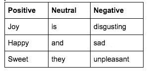
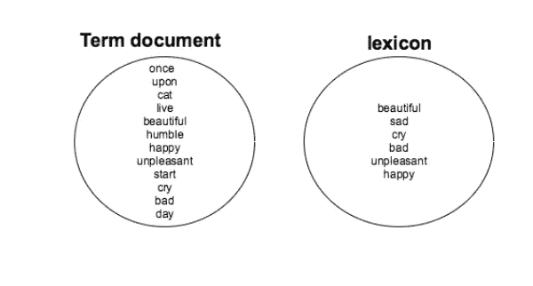
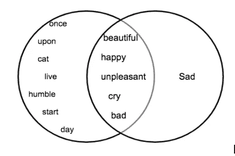
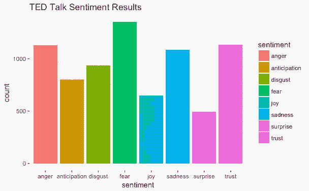
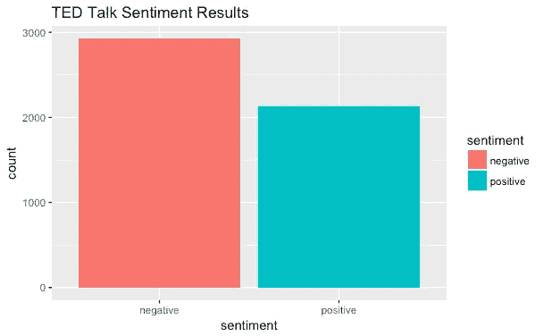

# 探索情感分析

> 原文：<https://medium.com/swlh/exploring-sentiment-analysis-a6b53b026131>


Photo credit : [Pixabay](https://pixabay.com/en/display-dummy-board-face-technology-915135/)

## 理解文本挖掘-第 2 部分

## 介绍

本文是理解文本挖掘的第 2 部分。如果你刚登陆这里，第一部分可在[这里](/@rblog/understanding-and-writing-your-first-text-mining-script-with-r-c74a7efbe30f)获得。

文本挖掘的应用之一是情感分析。为了让我们继续对挖掘出的文本进行情感分析，我们需要清理和准备我们的数据集，正如我们在第 1 部分中看到的。

## 理解情感分析

情绪分析:对提取的信息进行研究，以识别反应、态度、背景和情绪。作为文本挖掘的应用之一，情感分析揭示了挖掘文本中的态度。

它基于词的极性，它考虑积极或消极的词，中性词被解雇。



Table showing word polarity examples

情感分析是基于词汇完成的。比如说英语词典，用更简单的术语来说，词典就是词汇。在这种情况下，词典是具有两种极性的词的选择，可以用作情感分析中的度量。

根据您正在处理的数据的上下文，可以使用许多不同类型的词典。也有可能创建一个自定义词典，这取决于我们希望对您的数据进行多少自定义。

在本文中，我们将使用 [**syuzhet**](https://cran.r-project.org/web/packages/syuzhet/vignettes/syuzhet-vignette.html) 包。虽然 CRAN 上有许多用于情感分析的包，但 syuzhet 包非常适合学习，因为它是最常见词汇的组合，如 **nrc** 、 **bing** 和 **afinn** 。

我们还利用 [**ggplot2**](https://www.rstudio.com/wp-content/uploads/2015/03/ggplot2-cheatsheet.pdf) 来进一步可视化我们的情感分析结果。

## 情感分析是如何工作的？

简而言之，情感分析是作为术语文档(从挖掘的文本构建)和选择的词典的交集来执行的。



The first step is to have a term-document and a lexicon of your choice.



Then form an intersection between the two sets.

## 实践情感分析

**例子一**:这是一个简单的例子，我们从一个句子中提取情感。我们加载句子，使用 strsplit()函数拆分每个单词以形成一个字符向量，并使用 syuzhet 库中的 get _ NRC _ invision()函数。该函数接收 new_sentence 并将其与 nrc 情感词典进行比较，以返回如下所示的分数。

```
library(syuzhet)sentence <- "i love cats such a bundle of joy."
new_sentence <- as.character(strsplit(sentence," "))get_nrc_sentiment(new_sentence)#This is the outputanger anticipation disgust fear joy sadness surprise trust negative
   0          0       0    0   2       0        0     0        0
positive
     2
```

**例子二:**第二个例子使用了从 [Kaggle](https://www.kaggle.com/rounakbanik/ted-talks/data) 下载的 TED 演讲数据集，名为**抄本. csv** 。按照本文第 1 部分中的步骤，使用 **tm 包**对其进行了清理，并在第 2 部分中继续进行情感分析。

```
#load the libraries
library(syuzhet)
library(tm)
library(ggplot2)#mydataCopy is a term document,generated from cleaning #transcripts.csv mydataCopy <- mydata#carryout sentiment mining using the **get_nrc_sentiment()**function #log the findings under a variable **result**result <- get_nrc_sentiment(as.character(mydataCopy))#change result from a list to a data frame and transpose it result1<-data.frame(t(result))#rowSums computes column sums across rows for each level of a #grouping variable.new_result <- data.frame(rowSums(result1))#name rows and columns of the dataframenames(new_result)[1] <- "count"
new_result <- cbind("sentiment" = rownames(new_result), new_result)
rownames(new_result) <- NULL#plot the first 8 rows,the distinct emotions
qplot(sentiment, data=new_result[1:8,], weight=count, geom="bar",fill=sentiment)+ggtitle("TedTalk Sentiments") #plot the last 2 rows ,positive and negative
qplot(sentiment, data=new_result[9:10,], weight=count, geom="bar",fill=sentiment)+ggtitle("TedTalk Sentiments")
```



Plot 1: Shows distinct emotions



Plot 2: Shows the combination of emotions under two polarities.

这个例子中的代码可以从这个[库](https://github.com/lornamariak/Sentiment-Analysis)中访问。

## 结论

我们已经将我们的情感分析技巧应用于挖掘的文本，以得出对附加到文本数据的情感的明显描述。

这可能是一个完整的项目，可以帮助你了解如何以及何时与你的听众交谈，他们对某个话题/产品/服务的感觉，以及你可以用什么更好的方式与他们互动。

现在，继续选择一篇文章/数据集/活动，并按照步骤进行情感分析。
快乐编码，我永远在这里帮忙< - [@lornamariak](http://twitter.com/lornamariak)


## 这个故事发表在 [The Startup](https://medium.com/swlh) 上，这是 Medium 最大的企业家出版物，拥有 288，884+人。

## 在这里订阅接收[我们的头条新闻](http://growthsupply.com/the-startup-newsletter/)。

