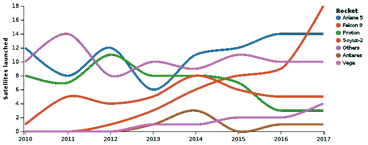
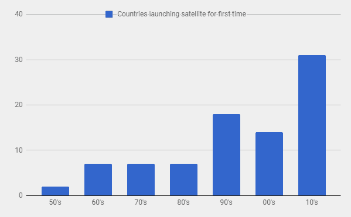
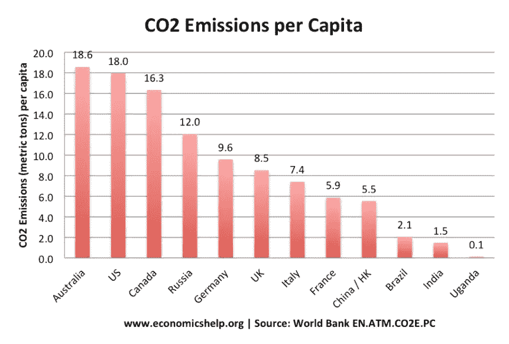
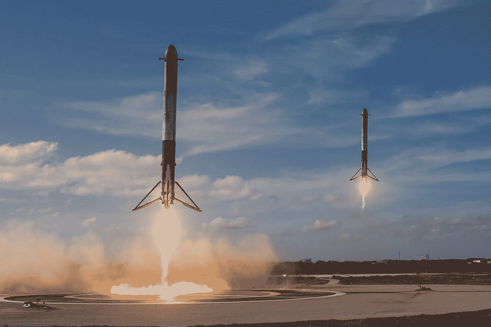

# 探索 SpaceX、特斯拉和埃隆·马斯克之谜

> 原文：<https://medium.com/swlh/exploring-spacex-tesla-and-the-enigma-of-elon-musk-7e74fabd11cd>

## 除了喷火器和异想天开的推文，还有事实和数字

有人问了一个关于人们对埃隆·马斯克的看法的问题。虽然大多数人都相当积极，但也有少数人说他“虚情假意”，被过度炒作，作为风投的宠儿，正在做任何他想做的鸡毛蒜皮的事情。不幸的是，对过度奉承和奉承的嘲笑，这让人想起名人是如何被对待的，会非常令人恼火。通常，它掩盖了他的公司多年来产生的重大影响，这是大多数人倾向于忽视的，而不是更喜欢绒毛。

为了澄清事实，我想我应该快速浏览一下他在 SpaceX、特斯拉和 SolarCity 的工作。我相信这些公司是激进的，有潜力改变世界。暂时不说其他项目:Hyperloop，Boring Company，Open.ai 或者 Neuralink。

我会试着回答:

1.  埃隆·马斯克的公司正在改变世界吗？
2.  他正在构建似乎更侧重于发达国家的解决方案。它是如何帮助穷人的？

# 特斯拉和 SpaceX 如何改变世界

## 电动汽车&无限能源

特斯拉不仅仅是一家电动汽车制造商，它还是一家大规模生产电池的公司。Gigafactory-1 可能是世界上最大的制造工厂，它只生产锂离子电池，主要用于拟议的每年 50 万辆汽车的交付。该工厂仅部分可运营，仍在建设中，满负荷生产时将拥有年产 [35 GWh 锂离子电池](https://electrek.co/2017/08/08/tesla-gigafactory-battery-cell-production-elon-musk/)的能力。

虽然电动汽车摆脱了低效的内燃机，转而采用了更高效的配电系统，但它们更清洁，但仍不环保。现在，将 SolarCity 加入其中，你会看到将房屋从电网中移除并使个人交通绿色化的潜力。他们已经在南澳大利亚执行了一个[项目](http://fortune.com/2018/02/04/tesla-australian-homes-solar-power/),安装了一个 139 兆瓦的备用电池系统，另外还有一个为 5 万所房屋安装太阳能屋顶和特斯拉电力墙的交易。想象一下，特斯拉汽车使用 SolarCity 屋顶玻璃产生的太阳能为特斯拉电池存储系统充电。

我喜欢早晨清洁能源的味道！

Artists rendition of a solar rooftop and Tesla Powerwall. Credits: [Tesla](https://www.tesla.com/powerwall)

## 让空间变得经济实惠

在 SpaceX 之前，大多数卫星是由[联合发射联盟(ULA)](https://www.ulalaunch.com/) 、[阿丽亚娜航天公司](http://www.arianespace.com/)和俄罗斯火箭(由阿丽亚娜航天公司的子公司运营)发射的。实际上，这是一个双头垄断，ULA 还垄断了几乎所有的美国政府卫星发射需求，而阿丽亚娜航天公司负责欧洲政府发射，同时保持近 50%的私人发射市场份额。阿丽亚娜航天公司的阿丽亚娜 5 型火箭(10 吨有效载荷到 [GTO](https://en.wikipedia.org/wiki/Geostationary_transfer_orbit) )专门发射的起始价格约为 1.4 亿美元，联盟号(3.3 吨到 GTO)将花费约 5000 万美元——这些数字都是猜测。

进入 SpaceX 的[猎鹰 9](http://www.spacex.com/falcon9) (8.3 吨至 GTO)定价为 6200 万美元，有效地将竞争对手赶出了公园。此外，猎鹰 9 号的发射频率远高于世界上任何其他火箭。下图说明了一切。在 6 年的时间里，SpaceX 是市场领导者(按发射次数计算)。此外，从图表中可以明显看出，其他公司的发射数量并没有大幅下降，这意味着 SpaceX 也扩大了市场。2018 年，SpaceX 将进行总共 30 次发射，包括猎鹰重型任务。

Source: [Wikipedia](https://en.wikipedia.org/wiki/Space_launch_market_competition)

卫星改变了我们的生活方式。阅读《星球日报》首席执行官威尔·马歇尔的这篇文章，了解它如何让我们的生活变得更好。试着不使用依赖 GPS 的服务:谷歌地图、优步、订餐服务等。SpaceX 已经大幅降低了发射卫星的成本，并将继续降低进入太空的成本。

# 这些对发展中国家的穷人有什么好处呢？

## 用于天气预报、遥感的空间

太空技术改善了印度数百万农民的生活。我有幸花了一个小时采访了印度空间研究组织(ISRO)的前主席 Kasturirangan 博士，我可以写一整篇文章，讲述 ISRO 的卫星是如何帮助气象学、地球观测、通信和遥感——直接帮助农民、渔业、勘测等。虽然印度已经成功建立了一个近乎自力更生的强大空间计划，但大多数其他国家，包括发达国家和发展中国家，都没有发射卫星的能力。

随着 SpaceX 通过降低成本打开了进入太空的大门，发展中国家现在可以发射自己的卫星，利用太空技术造福人民。下面的图表显示，在这十年中，31 个国家通过现有的发射服务提供商发射了他们的第一颗卫星。其中至少有一小部分来自发展中国家，它们是猎鹰 9 号上的次要有效载荷——蒙古、加纳、孟加拉国和土库曼斯坦。虽然大多数新卫星都是实验性有效载荷，但随着时间的推移，它们将发展成为为特定用途设计的更大卫星。像[火箭实验室](https://www.rocketlabusa.com/)这样的新玩家正带着小型卫星发射器进入市场，这些发射器能够以较高的价格快速发射。市场只会越来越大。

Data Source: [Wikipedia](https://en.wikipedia.org/wiki/Satellite#First_satellites_of_countries)

## 减少碳足迹和可再生能源的增长

当谈到特斯拉正在建造的可再生能源解决方案时，有两件事需要考虑。首先，这项技术还处于商业化的早期阶段。因此，成本相当高，但随着更多的人采用清洁技术，生产成本将会下降。激增的需求将允许建造更多的巨型工厂，以前所未有的规模生产清洁技术，随着时间的推移，为发展中国家提供负担得起的解决方案。这里有些东西需要思考。当特斯拉开始时，埃隆首先利用现金流为富人制造了一辆汽车，然后开发了一款价格更实惠的高级汽车，随后又推出了一款量产汽车。可悲的是，首先为穷人建造并不是最容易的。

第二，发达国家的[人均碳足迹](https://www.theguardian.com/environment/datablog/2009/sep/02/carbon-emissions-per-person-capita)是发展中国家的数倍。这里有一个例子:美国(19.8 吨)、澳大利亚(20.6 吨)、英国(9.7 吨)、中国(4.6 吨)、印度(1.2 吨)、肯尼亚(0.3 吨)的人均碳足迹。让发达国家的人们使用更清洁的能源更有意义。

注:由于图表数据来自 2012 年，上述数字和图表中的数字不一致。值得探究 economicshelp.com 的详细数据，它列出了大多数国家及其人均二氧化碳排放量。另外，看看[世界资源研究所对全球十大排放国](https://wri.org/blog/2014/11/6-graphs-explain-world%E2%80%99s-top-10-emitters)的研究。

Source: [Economicshelp.com](https://www.economicshelp.org/blog/6131/economics/list-of-co2-emissions-per-capita/)

> 从环境角度来看，让消耗肮脏能源的富人远离电网是一件好事。

# 火星等轻浮呢？

让我们面对现实吧。火星听起来令人兴奋。我的真实想法是，埃隆·马斯克利用火星作为诱饵，让每个人再次对太空感到兴奋。他让这成为了一个普通的话题，也在新闻中获得了大量的报道和辩论。对最近猎鹰重型发射携带特斯拉跑车的批评是没有根据的。用于测试发射的典型有效载荷通常是不起作用的，通常只是作为质量假人的混凝土块。

这次发射引起了一次激动人心的拍照，并成为全世界的头条新闻。这个世界再一次意识到我们已经沉睡了一段时间。对我们来说，成为一个多星球物种很重要，但这不会在一夜之间发生。人类于 1969 年登上了月球，但从那以后就再也没去过。世界上最强大的火箭是在 20 世纪 60 年代建造的，我们今天没有接近的火箭——提醒一下，现在是 2018 年。在很多方面，我们已经放开了油门。是时候有人大胆梦想并迈出第一步了。如果你很好奇，请阅读这篇由 Medium 顶级太空作家之一[贾坦·梅塔](https://medium.com/u/7b8fb40c2a02?source=post_page-----7e74fabd11cd--------------------------------)撰写的关于[猎鹰重型飞机将如何在未来十年推动科学](/teamindus/how-spacexs-falcon-heavy-could-enable-fantastic-science-in-the-outer-solar-system-a051d65a2b0a)的文章。

Source: [SpaceX](https://www.flickr.com/photos/spacex/25254688767)

埃隆已经成为一个受崇拜的人物，主要是因为他所做的事情的大胆和他的交付能力，尽管有多次延迟。通过巧妙融合吸引大众的异想天开的极客风格，人们开始喜欢这个超乎寻常的人物。人们喜欢他们的超级英雄，他们在漫画和电影中的大受欢迎就证明了这一点。历史上，我们总是把各种各样的人物放在基座上；这是人类与生俱来的东西。但也正是这种将马斯克提升为“弥赛亚”或“人类救世主”的做法让人们望而却步。

说埃隆的公司没有为世界做任何事情是完全错误的。我希望他的诽谤者能够退后一步，看看他已经取得了什么成就，以及他如何继续推动人们认为可能的界限。然而，如果主要问题是不断的赞美，这是叙述的一部分，最好忽略它，专注于他所做的工作。但如果你感到无聊，马斯克的 Twitter 账户肯定会提供很好的娱乐，因为他给了我们一剂纯粹的冷漠。

我很想在下面的评论中听到你的想法。如果你喜欢这篇文章，与可能喜欢的人分享。**你可以在** [**LinkedIn**](https://www.linkedin.com/in/justin-alva-933a6726/) **或者**[**Twitter**](https://twitter.com/kosmischemusik)**上找到我。**

*披露:在过去的两年里，我与一家专注于月球探索的航空航天公司合作。我的观点是个人的，并不代表我前雇主的观点。*

## 这篇文章发表在 [The Startup](https://medium.com/swlh) 上，这是 Medium 最大的创业刊物，有 319，283+人关注。

## 在这里订阅接收[我们的头条新闻](http://growthsupply.com/the-startup-newsletter/)。

