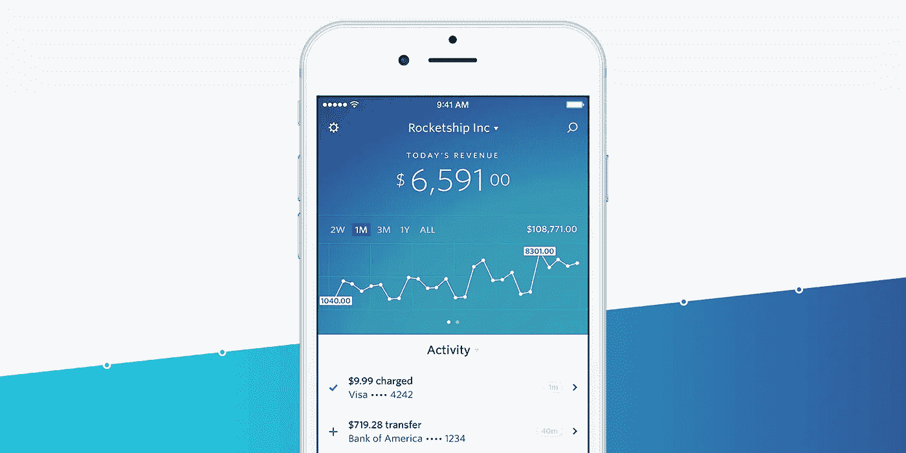
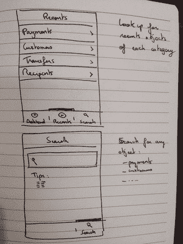
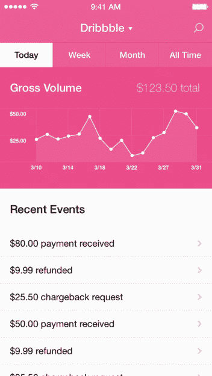
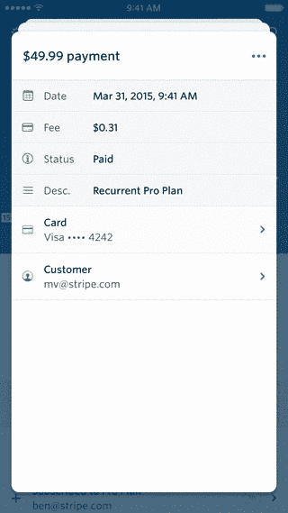
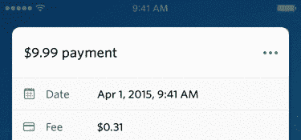
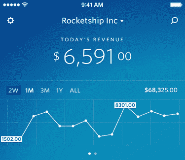
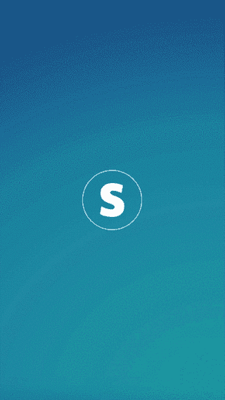
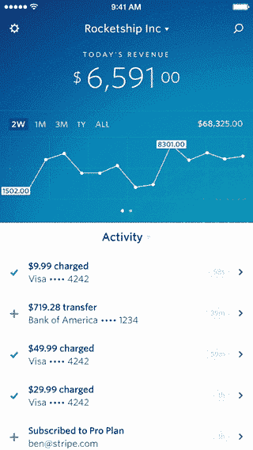

# 探索 iPhone 条纹仪表盘的产品设计

> 原文：<https://medium.com/swlh/exploring-the-product-design-of-the-stripe-dashboard-for-iphone-e54e14f3d87e>

## 本杰明和我如何制造产品的幕后观点

由于它提供的服务，Stripe 并没有像如今的许多其他创业公司一样，成为一家移动优先的公司。核心业务是支付 API，允许公司在几分钟内设置好接受支付。web dashboard 使团队中的每个人都可以轻松地跟踪和管理订阅、支付、客户和转账。然而，它是为大屏幕设计的，因此在手机上几乎不可用。在发布了最新版本的 Checkout 后，我们决定从 iPhone 开始，专注于开发手机应用程序。

这篇文章是关于应用程序的创建过程，更一般地说，是关于[本杰明](https://twitter.com/bdc)和[我](https://twitter.com/michaelvillar)如何设计产品。这不一定是一种新的做事方式，但我想分享给好奇的人。

设计任何产品都可能让人感觉势不可挡，但通过将其稀释到基本的用户体验，你可以让它变得平易近人、切实可行。

## 视力

我们在概念化阶段花了很多时间。尽管这只是第一步，但产品设计永远不会真正结束，应该随时重新审视。

我们的第一次会议从白板开始，我们首先确定核心体验的所有特征，正如我们定义的那样。对于 iPhone 的 Dashboard 应用程序，我们设想它是一个配套的应用程序，并专注于两个主要的用例，而不是让它成为 web dashboard 的全功能版本:

1.  早上第一件事就是打开一个应用程序，快速查看昨天的数据
2.  一种能够快速查找客户、付款和转账信息的方法

## 线框

在定义了特征之后，我们开始处理线框。我们有额外的困难工作与 9 小时的时区差异。为了解决这个问题，我们在纸上画东西，拍照，并记录线框的解释。我们互相发送，然后等待响应。这里有一个例子(法语):[http://bit.ly/1GSByqd](http://bit.ly/1GSByqd)

我们的线框很粗糙。没有视觉上的精致；这实际上是关于流量和整体用户体验。它们帮助我们定义我们的期望，提醒我们在每个屏幕上想要什么。

## 视觉设计

当我们的线框完成后，我们开始视觉设计。在这个阶段的开始，我们紧密合作，寻找最符合我们愿景的正确方向。例如，主页经历了许多不同的迭代。我们知道我们希望最近的活动成为焦点，但是决定哪些*不需要*在那里是很困难的。人们很容易认为数据越多越好，但我们必须决定哪些是最重要的，哪些值得关注，而不是它们有趣但不必要的表亲。

当我们都同意视觉设计的方向，本杰明开始敲定一切。当然，一路上有很多反馈，但主要是本杰明在这里主持大局。

## 相互作用

交互是在整个视觉设计过程中被考虑的，但是只有当我们对视觉设计有一个清晰的概念时，我们才开始原型化它们。在原型阶段，我们可以确认我们最初的交互想法是否正确。

对于 Dashboard 应用程序，最主要的是 cards 范型。我们决定实现它的一个网络原型，这个原型有很多可笑的错误，但是它让我们相信这个想法是值得追求的。

让这个用户界面感觉直观和简洁是很复杂的。

*   你希望新卡以一种向用户展示如何操作的方式打开:用轻微的弹簧从侧面滑开，因为这是移动和解散它们的方式
*   当你拖动一张牌时，你想要一个额外的阴影来强调你正在控制那张特定的牌
*   当你拖动一张牌时，你想将它后面的牌向前移动，以显示它们的进度
*   你想让卡片被扔掉的速度与卡片组向前移动的速度相匹配，这样很明显这些动作是有联系的
*   你想让后面的牌更暗，就像它们在现实生活中一样

对于动作菜单，我们想要一个上下文菜单，而不需要打开一个大的、侵入性的本地弹出菜单。我们想出了这个有趣的动画，它很适合我们，因为我们每张卡没有超过两个动作。如果你不感兴趣，你甚至不需要关闭菜单。

Toggling the actions menu (we did a HTML/CSS prototype)

您可以切换收入/客户图表中显示的时间段。我们制作这个动画的方式有助于用户理解以前的时间段在新的时间段中的位置。如果您仔细观察，您会发现随着单位从天到周的变化，我们在缩放时淡化了图形。

Changing time periods in the graph view

当一个应用程序依赖于互联网时，你可以显示一个登陆屏幕或者一个有很多微调器的空应用程序。我们最终选择前者结合动画，因为在加载期间，应用程序无论如何都没有响应。这里有一些我们想出来的启动动画原型:

For the startup animation, we did a few prototypes in HTML/CSS and After Effects.

在应用程序启动时，我们等待数据被加载，以显示第一个屏幕，并立即显示用户界面，没有额外的微调或用户界面闪烁。如果网络太慢，我们还是会在几秒钟后用 spinners 显示 UI。

我们还添加了一个点击动画(灵感来自于[材料设计](https://www.google.com/design/spec/material-design/introduction.html)),当你点击应用中的任何一行时。我们在打开卡之前增加了 100 毫秒的延迟，原因有两个:1)数据需要加载，显示空卡没有帮助，2)用户有时间看到他们点击了哪里。

## UI 实现

我实现应用程序的策略非常简单:我总是从实现用户界面开始。UI 是应用程序最重要的部分，应该是 iOS 应用程序开发者的主要关注点。从用户界面开始，不绑定任何数据或使用 API，这将有助于确保 UI 尽可能平滑。它还使我们更容易理解为什么在实现新特性时性能会下降，并允许我们更快地解决这些问题。

## 推送通知

这是我最喜欢的应用程序功能之一。目前，我们将推送通知用于一些不同的事情(更多内容将会推出):

*   每日总结:早上醒来时，快速浏览一下昨天的销售和新客户。
*   新的支付方式和新的客户:对于小企业来说，看到你的业务增长真的很令人兴奋。
*   失败的传输:我们希望确保我们的用户注意到他们的传输失败，并解释如何修复它们。
*   帐户更改:我们让用户知道他们的密码或银行帐户一旦更改就已经更改。这使他们能够在未经授权的情况下做出反应并联系支持人员。

对于非紧急通知，我们确保根据用户的时区在工作时间发送。没人愿意半夜被吵醒！

今天，iOS 团队([本](https://twitter.com/benzguo)和[杰克](https://twitter.com/jflinter))正在开发一系列新功能和改进，将我和本杰明开创的产品推向了一个新的高度。

我想了很多，为什么本杰明和我能如此好地一起推出新产品。拥有一个技能互补的团队是关键。我们开始一起进行产品设计，然后他专注于视觉设计，而我专注于代码。这是一个很好的组合——我们两个人能够一起创建完整的应用程序。一切都进行得飞快，如果成员们意见一致，你花在开会和阐明愿景上的时间就会更少。当然，如果你在过去的 5 年里和同一个人一起工作，也会有所帮助。

感谢 [Kat](http://twitter.com/kitchenettekat) 重写了我的英语，让它变得人类可读。

我现在正在做 [Height，一个新的一体化项目管理工具。](https://height.app/?ref=medium1)

发表于*[**# SWLH**](https://medium.com/swlh)**(***《创业》、《流浪癖》、《生活黑客》)**

******