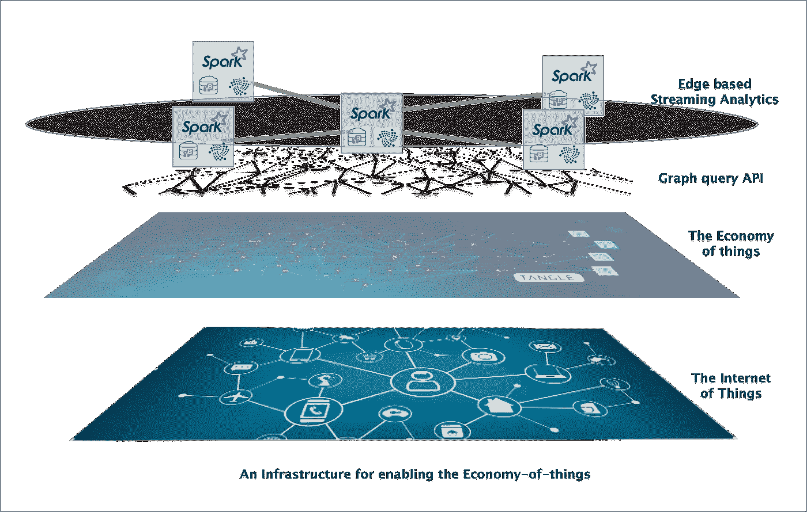
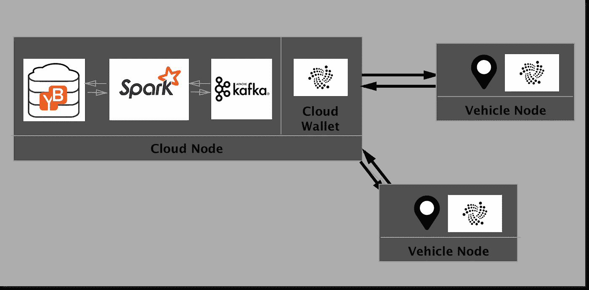
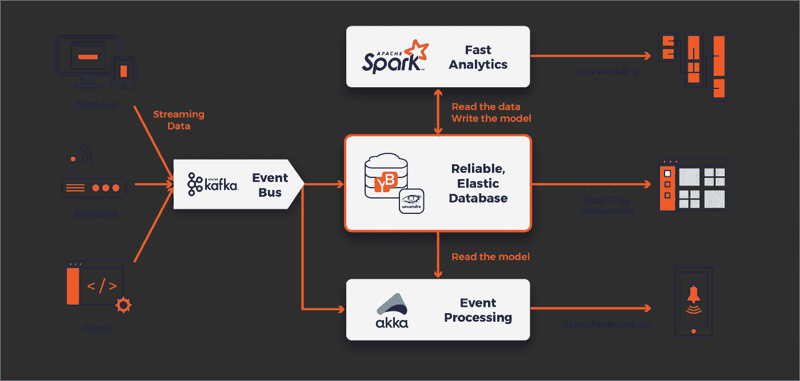
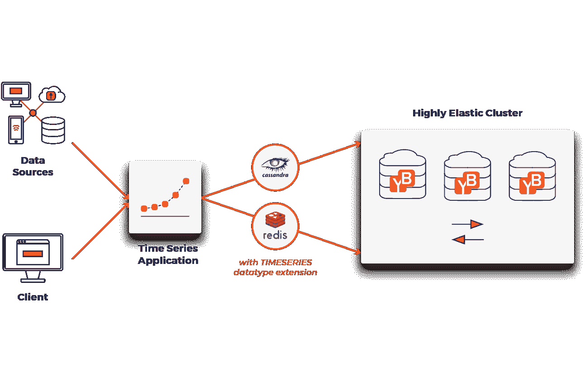

# 将 Tangle 网络扩展到分布式云

> 原文：<https://medium.com/swlh/extending-the-tangle-network-to-a-distributed-cloud-2f5857db02f5>

## 关于机器经济的技术和社会结构的一些思考。


What is needed for the future to happen? [[ImgSource](https://www.linkedin.com/pulse/more-connected-future-meg-whitman/)]

由数字货币支持的数据市场的想法已经流传了一段时间。本文讨论了构建这种数据市场所需的软件基础设施，以及使用 IOTA 协议作为数据交换的假想“货币”时，这种市场会是什么样子。

*在整篇文章中，我们可以将 IOTA 理论化为握手协议和机器对机器交易的不变分类账，而不是运行智能合同的平台或投机货币。*

运行机器经济的货币应该具有以下特征—**支持微交易。**
单机交易可能比典型的人工交易低几个数量级，而在数量上要高得多，理想情况下网络费用应该非常接近于零才能实现任何规模的微交易。
**支持规模交易**。
当引入任何市场时，机器交易将更加频繁，并将很快超过人工交易，例如，使用公共 API 在任何交易索引处检查订单簿。
**为网络提供安全保障。** 通过 IOTA 握手生成的加密哈希可用于保护数据。在某种意义上，交易协议将是这种网络的主干，也是安全毯。

当这种网络扩展到包括运行专用存储/处理软件的高性能云节点时，我们可以通过机器智能实现实时决策的新生态系统，利用网络的本地化决策与云的集体智慧相结合。

## 一个基于激励的社会实时奖励优秀的演员。


**The future of governance will likely be incentive based..**

治理的未来可能是为行为者创造负责任的经济激励。如果你在限定范围内开车，系统会奖励你小额付款，你的保险费率会实时下降..最终，反对该系统并拒绝分享其数据的唯一行为者将是坏行为者，博弈论和市场均衡将推动社会进入这个机器经济。

# 但是等等..我们需要云做什么？

## 或者 IOTA 不应该驱动完美的网络系统吗？

好的，让我们想象一个完美的[雾网络](https://www.cisco.com/c/dam/en_us/solutions/trends/iot/docs/computing-overview.pdf)，其中每台机器都被赋予了相等的权重(计算能力),工作负载被平均分配到所有节点上。
**但是..现实世界不是这样的！！** 一点不错..你的 Mac 电脑的计算能力比你的冰箱还强，而你的 Mac 电脑的计算能力比 AWS 数据中心里的一台 c 3.4x 大型机器还要弱。

手机通常不想运行繁重的计算工作，你也不想下载软件来运行。

***即使在有雾的场景中，某些种类的计算会比其他的更适合某一类机器，因此即使在完美的雾中也会出现云..***

在这种情况下，云是网络中的一个节点，具有运行数据存储过程的合理存储量和运行计算集群过程的处理能力，并假定位于给定的“基础架构即服务”中。云机器也有自己的钱包，通常运行一个完整的节点，并在大规模执行微交易，同时对数据执行分布式存储和分析过程。

在未来，所有权的概念将被淘汰，我们使用的设备和公共领域的传感器将基本上成为由公司运营的车队，公司需要整合来自各种来源的数据。这就是为什么蜂群必须与不可信的云互动来运行更广泛的商业决策。每个节点都有自己对世界的看法，并提供独特的见解，这也可能形成更深层次学习模型的基础。

本讨论试图比单纯的术语更深入一点，探索这种数据驱动经济将创造的可能性以及适合这样做的[基础设施](https://blog.yugabyte.com/yugabyte-db-architecture-diverse-workloads-with-operational-simplicity-cdf82483a1fb)，讨论使用 [SKY Stack](https://www.yugabyte.com/solutions/use-cases/fast-data/) 构建这种基础设施的可能性，SKY Stack 是一种分布式流数据纯软件堆栈。

# 那么，这种“机器经济”将支持哪些用例呢？

IOTA 目前是一种[古怪的](https://coinmarketcap.com/currencies/iota/)加密货币，除了币安和 Bitfinex 之外没有太多的用例，但是在未来，大规模机器的综合使用可以创造网络化智能，结合[快速数据技术](/swlh/why-fast-data-is-suddenly-everywhere-3bb25bfff3b9)，可以实现大规模的数据市场，使今天的数据库相形见绌。你的机器(你)将实时出售相关的设备数据，这一事实能够(将会)实现很酷(或令人毛骨悚然)的用例，比如你的个人(设备)数据被带来和出售的数据市场。


In this universe people sell their data for a living

但你会问，为什么有人会对我的苹果手表的 pings 感兴趣..不仅仅是你，还有你在某一时刻是谁..您的智能建筑可能希望知道您何时在附近，以便它可以统计人数并调整建筑温度，这将有助于它降低成本，并为您的设备支付流式 pings。

你去的餐馆可能想知道他们以前是否见过你，这样就可以提供推荐，实时订购供应品等..你的情境数据，加上在特定时间形成复杂关系的网络中其他人的意愿，可以帮助企业做出决策或实现目标，他们会为此向你的设备付费..在基于使用的微支付的持续流中，交易费用没有任何损失。

# 软件栈呢？

处理互联城市规模的软件堆栈的要求将是大规模并行化、分布式实时计算和存储。

1.  数据流必须是密码安全的。这是通过工作类型系统的证明来实现的，其中源和接收器都必须执行一些工作(在这种情况下，批准另外两个事务)来保护网络。
2.  计算层必须是分布式的，并支持非循环数据流。为了在大规模公共 IOTA 网络上实现快速分析，计算层应该是基于[内存的](https://www.infoworld.com/article/3014440/big-data/five-things-you-need-to-know-about-hadoop-v-apache-spark.html)，并运行基于优化存储 DAG 的查询。
3.  IOTA 网络通过 Gossip 协议的实现来传播数据，并且因此[最终一致](https://www.tangleblog.com/2017/01/25/the-tech-behind-iota-explained/)。数据模型需要具有很强的一致性，以便成为事务性用例的真实来源，支持[分布式 ACID 事务](https://docs.yugabyte.com/explore/transactions/#nav_bar)，并能够处理[各种工作负载](https://blog.yugabyte.com/yugabyte-db-architecture-diverse-workloads-with-operational-simplicity-cdf82483a1fb)。你可以在这里阅读CAP 定理[的精彩描述。还有一篇有趣的论文是通过棒球学习最终的一致性。你可以在这里阅读](https://blog.yugabyte.com/a-for-apple-b-for-ball-c-for-cap-theorem-8e9b78600e6d) [RAFT 协议](https://web.stanford.edu/~ouster/cgi-bin/papers/raft-atc14)的介绍。你也可以在这里阅读，YugaByte 具体实现细节[。](https://docs.yugabyte.com/architecture/concepts/replication/)
4.  数据和计算模型需要是不可信的、大规模分布的、可扩展到数百个节点的，并且能够支持大容量并发读写[。](https://blog.yugabyte.com/scaling-yugabyte-db-to-millions-of-reads-and-writes-fb86cea5ff15)
5.  数据层必须支持多种 API，以支持不同种类的模型，这些模型对于给定的机器经济用例来说是最直观的。基于纠结网络的业务需求可以通过图形 API 最直观地建模。当我们不想实时执行昂贵的连接并且重复是可接受的时，大规模并行计算和实时流分析的需求更容易在非规范化 SQL 或 CQL 模型中建模。对超高速缓存读取的需求最好在 Redis 类 API 中建模。



Architecture of a machine-economy

## **我们如何为连接的机器建模？**

您如何为一个拥有成千上万个节点、每个节点都执行成千上万个微交易的公共 IOT 车队建模..这是图的问题还是时序的问题？纠结图上的用例建模可以通过[图形 API](https://docs.yugabyte.com/develop/ecosystem-integrations/janusgraph/) 最直观地建模，其他更以数据查询为中心的视图或面向时间序列的视图可能需要通过 [CQL API](https://docs.yugabyte.com/api/cassandra/) 建模。传感器数据发射也可以建模为时间序列问题。虽然一些模型在 SQL 中表现得更好，但其他模型(如那些对流数据进行快速分析的模型)在柱状 CQL 模型中表现得更好。

**数据不能存在于孤岛中** IOTA 链支持分区，因此允许离线事务，在大型公共网络中，节点可以跨越主要的公共云和本地数据中心。连接 IOTA 节点的数据层必须是基础设施不可知的。网络作为一个整体必须能够更新它的世界状态。

# 体系结构的自下而上视图



The view from the Cloud

## 阿帕奇火花

阿帕奇 Spark 和 Tangle 有什么共同点？他们都使用[有向无环图](https://stackoverflow.com/questions/25836316/how-dag-works-under-the-covers-in-rdd)来执行他们的计算。Spark 网络可以在边缘执行分析查询，并将数据传输到接收器或写回存储。然后，这些经过清理的实时分析数据可以通过第三方数据市场进一步传输给客户端，第三方数据市场可能会在客户端执行类似的握手。



Spark Streaming models with the SKY stack.[[Source](https://www.yugabyte.com/solutions/use-cases/fast-data/)]

这是一个典型的 [SKY stack](https://www.yugabyte.com/solutions/use-cases/fast-data/) 架构的样子。“网络感知”Spark 架构可以通过 Cassandra API 与 YugaByte 存储引擎无缝对接。

## [YugaByte 数据库](https://github.com/yugabyte/yugabyte-db)

[YugaByte](https://www.yugabyte.com/) 是一个[快速](https://blog.yugabyte.com/achieving-sub-ms-latencies-on-large-data-sets-in-public-clouds-bf38d13ac42d)、强一致性、分布式、横向扩展的数据库，旨在处理不断增长的数据网络，如 tangle。



Elastic data cluster with support for Redis and CQL APIs

它使用 [RAFT 协议](https://raft.github.io/)的修改版本在节点间达成共识。

所做的[设计选择](https://blog.yugabyte.com/practical-tradeoffs-in-google-cloud-spanner-azure-cosmos-db-and-yugabyte-db-ce720e07c0fd)是放弃可用性，以利于故障发生时的一致性，同时也将可用性的损失限制在新的平板电脑领导者当选前的几秒钟内。它支持开箱即用的 [Cassandra](https://docs.yugabyte.com/api/cassandra/) 和[Redis](https://docs.yugabyte.com/api/redis/)API，并且可以插入到[图形 API](https://docs.yugabyte.com/develop/ecosystem-integrations/janusgraph/)中，这些 API 允许适合各种流事务数据用例的模型具有强大的一致性保证。存储引擎[在 YCSB 基准测试中击败了开源的 Cassandra](https://blog.yugabyte.com/building-a-strongly-consistent-cassandra-with-better-performance-aa96b1ab51d6) ，在网络环境中提供了亚毫秒级的延迟，并在 AWS、GCP 或 OnPrem 上开箱即用。您可以在这里看到与其他分布式 SQL 和 NoSQL 数据库[的比较。](https://docs.yugabyte.com/comparisons/)

## JanusGraph

[JanusGraph](https://github.com/JanusGraph/janusgraph) 是用于 OLTP 和 OLAP 系统的图形查询层，可以很好地处理分布式横向扩展数据库。它是 Gremlin 协议的一个实现，为存储大量顶点而优化。图可以为自然表示网络的关系提供强大的直观查询模型。您可以在此阅读有关生态系统与存储层[集成的更多信息。](https://docs.yugabyte.com/develop/ecosystem-integrations/janusgraph/)

## **阿帕奇卡夫卡**

[Apache Kafka](https://github.com/apache/kafka) 是一个分布式流媒体平台，用作流媒体设备的数据收集器。正是在这一层中，将执行数据的解密，并将进行 IOTA 事务。

## IOTA API

IOTA 事务可用于加密签名和验证流数据的正确性。你也可以在这里阅读更多关于屏蔽认证信息协议[的信息。IOTA 适合生态系统，因为它是事实上的货币。该事务还将生成一个访问密钥，该密钥将用于加密保护这些流。](https://blog.iota.org/introducing-masked-authenticated-messaging-e55c1822d50e)

# 模拟机器经济

## **未来城市的交通管理**


**Your Mustang’s wallet was just charged 1k MIOTA and here’s your ticket..**

在兼容车辆具有 GPS 发射器和多签名钱包的世界视图中。城市交通系统实时监控所有行驶的车辆。该系统将 IOTA 发送到车辆钱包，以换取在固定时间段内具有 json 有效载荷的心跳。这些数据可以用于实时形成复杂的模型，并回答许多关于世界在任何给定时间点的状态的分析和一般查询。

## 前提

每一次车辆发射都包含车辆的坐标和发送时的时间戳。它被收集到 Akka 水槽中，并被喂给一个 YugaByte 节点。YugaByte 可以在数据库所在的节点上运行 Spark。

## 握手

握手可以通过一种类似于我们今天拥有的开放认证协议的协议来完成。每一次传输将创建一个访问令牌和一个刷新令牌，每隔 *X* 秒，访问令牌将到期，并且新的令牌将通过 *n* 微支付生成。

## 数据模型

让我们创建两个简单的 CQL 数据模型，并展示一些我们可以运行的强大查询。(生产时序模型可能需要分区和集群感知，查看本[教程](https://www.datastax.com/dev/blog/advanced-time-series-data-modelling)了解更多信息)

```
// CQL can be used for transaction hash models and business models // based on device metadata use-cases.// A simple model of vehicle emissions by time-stamp
CREATE TABLE vehicle_emissions
 (vehicle_id varchar,
 event_ts timestamp,
 vehicle_lat float,
 vehicle_long float,
 location text PRIMARY_KEY (vehicle_id, event_ts));// Another model of vehicle emissions by street
CREATE TABLE vehicle_on_street_events
 (vehicle_id varchar,
 event_ts timestamp,
 street_id varchar PRIMARY_KEY(event_ts, street_id));
```

## 实时智能

一旦我们有了车辆发出的一串纬度，我们就可以用它来接近实时地估计速度。我们可以将它与历史数据读取相结合，提供给 Spark 流。

由 Spark、Kafka 和 YugaByte 组成的 [SKY stack](https://www.yugabyte.com/solutions/use-cases/fast-data/) 可用于对此类用例建模。

用 uuid CA1234 给我过去 20 分钟的车速。

```
SELECT lat, long, location
FROM vehicle_emissions
WHERE vehicle_id='CA1234'
  AND event_time > ’2026-06-03 07:01:00′
  AND event_time < ’2026-06-03 07:21:00′;// Between any two pings
// distance = √((*x2*-*x1*)^2 + (*y2*-*y1*)^2)
// velocity = distance / interval_between_pings
```

如果你的访问模式要求你在这之后做一个类似-

获取车辆 id 为 CA1234 的车辆的详细信息，然后更新您的 CQL 模型以包含新数据，而不是在应用程序层进行连接(前提是存储成本低廉，只要我们能够减少寻道，复制数据是可以的)。

## 发信号

聚集的流位置数据可以导致强大的推论。

```
SELECT lat, long, location
FROM vehicle_emissions
WHERE vehicle_id='CA1234'
  AND event_time > ’2026-06-03 07:01:00′
  AND event_time < now();> Pipe result-set to inference-engine to compare vehicle movement patterns against normal vehicle movement patterns on the road.*ALERT: Erratic Driving patterns observed on Highway 280\. Possible DUI.*
```

## 第三方数据-市场

1.  保险
    该系统可以通过管道将数据传输给保险提供商，保险提供商可以在保险索赔中做出推断，例如在一定时间范围内以一定速度行驶的汽车碰撞。

```
SELECT lat, long, location
FROM vehicle_emissions
WHERE vehicle_id='CA1234'
  AND event_time > ’2026-06-07 09:01:00′
  AND event_time < ’2026-06-07 09:04:00′;// Calculate second-order derivative of rate of change(Deceleration) of vehicles between continuous heartbeats.
// Infer whether the car in-front suddenly braked to cause the car behind to bump into it.
```

2 **。法医** 该系统可以将数据传输给法医和侦探，他们可以用这些数据来调查案件。

给我 11 月 12 日周六凌晨 1 点到 2 点之间从多洛雷斯左转的所有车辆的 UUID。

```
SELECT vehicle_uuid
FROM vehicle_on_street_events
WHERE street_id='CA4433'
  AND event_time > ’2026-06-07 09:01:00′
  AND event_time < ’2026-06-07 09:04:00′;
```

## **还有更多的“ETL 类”查询**

*给我过去 1 个月内所有时速超过 60 英里的车辆的交易记录。*

*给我 uuid CA1234 的车辆过去一个月去过的所有地方。*

## 那么，我们该何去何从呢？

最后，这些思考通过激发我们想象力的开源项目和努力使之成为可能的开发者而成为可能。
看看这些很酷的软件集成，看看你是否能想出一些有趣的、未来的、你自己的用例。:)

[**YugaByte DB**](https://github.com/YugaByte/yugabyte-db) —分布式真实源数据库【高可用性 CP 数据库】。([单据](https://docs.yugabyte.com/))

[**Apache Spark**](https://github.com/apache/spark)—使用 Dag 执行非循环顺序计算的分布式计算集群。([文档](https://spark.apache.org/docs/2.2.0/))

[**IOTA JS**](https://github.com/iotaledger/iota.lib.js)—IOTA 库的 JS 实现。

[**阿帕奇卡夫卡**](https://github.com/apache/kafka) —实时处理、存储、发布、订阅事件。([文档](https://kafka.apache.org/documentation/))

有趣的相关阅读—

[分布式 ACID 事务](https://docs.yugabyte.com/architecture/transactions/distributed-txns/)

[示例天空堆栈集成](https://docs.yugabyte.com/develop/realworld-apps/iot-spark-kafka/)

[屏蔽认证消息](https://blog.iota.org/introducing-masked-authenticated-messaging-e55c1822d50e)

[卡珊德拉的一位原创作者解释的 CAP 定理](https://blog.yugabyte.com/a-for-apple-b-for-ball-c-for-cap-theorem-8e9b78600e6d)。

我也已经开始努力实际模拟一些模拟。github 可以在这里找到。
记住，如果你喜欢这个故事，有 50 种方式来表达你的欣赏。；)


## 这篇文章发表在 [The Startup](https://medium.com/swlh) 上，这是 Medium 最大的创业刊物，拥有 297，332+人关注。

## 在此订阅接收[我们的头条新闻](http://growthsupply.com/the-startup-newsletter/)。

