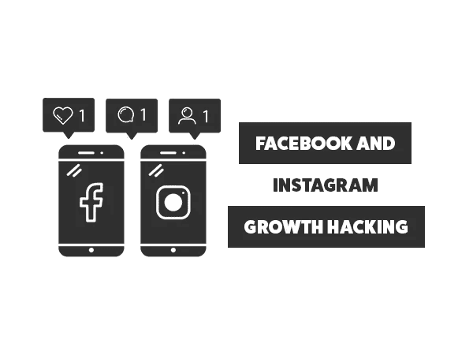
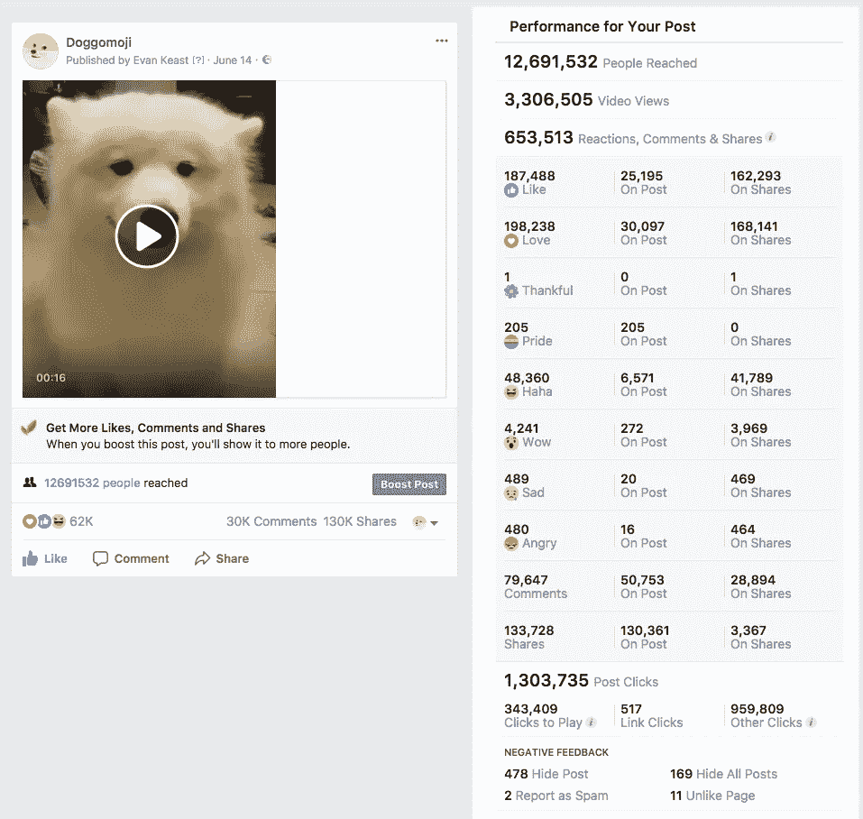
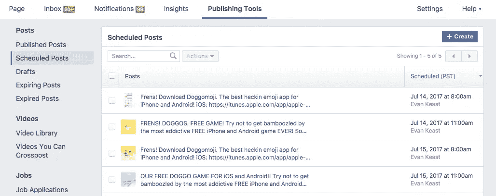
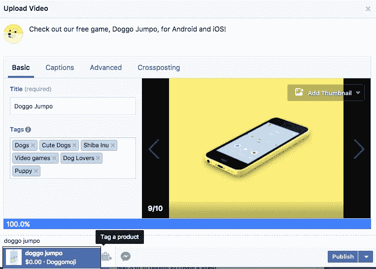
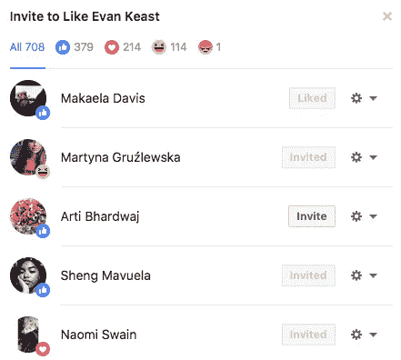
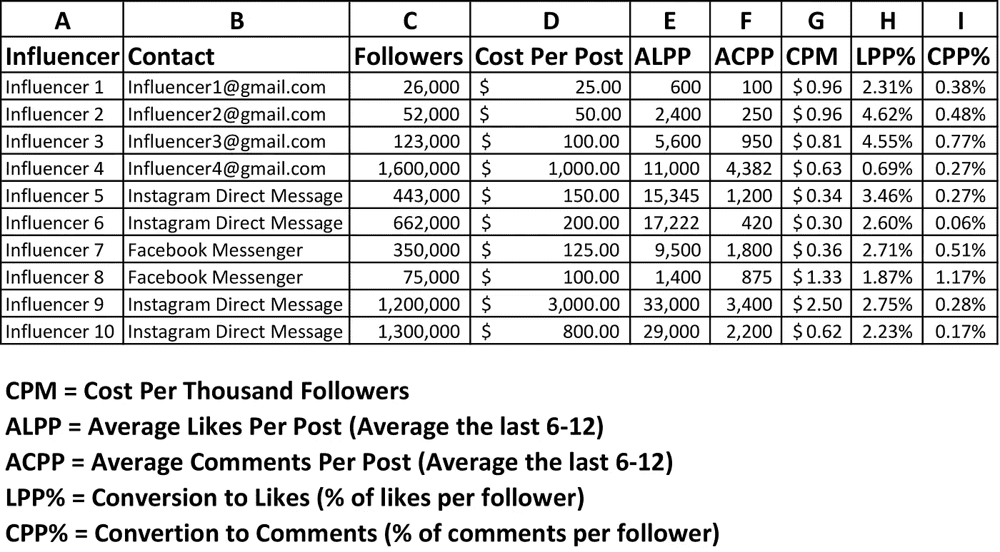
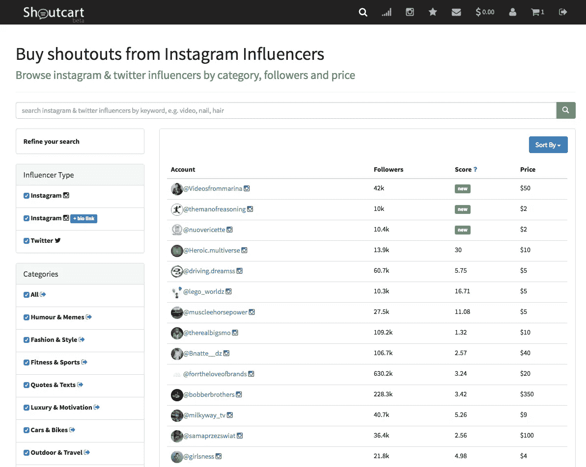
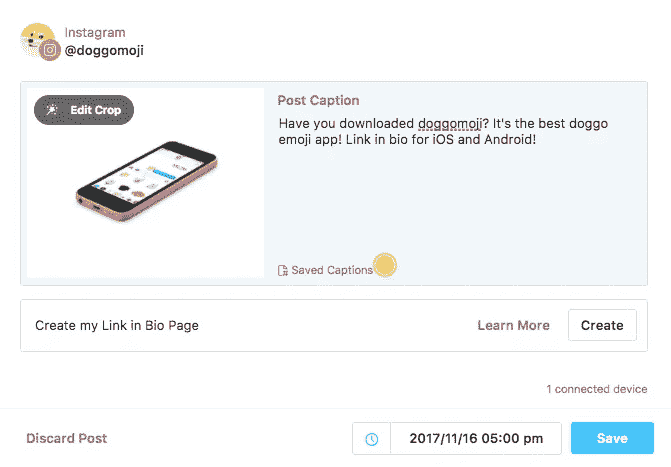
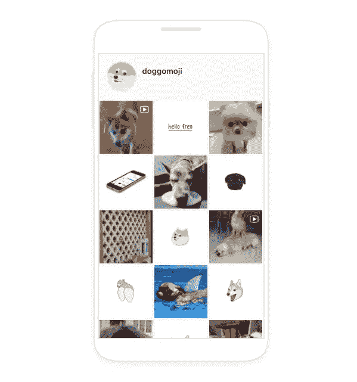
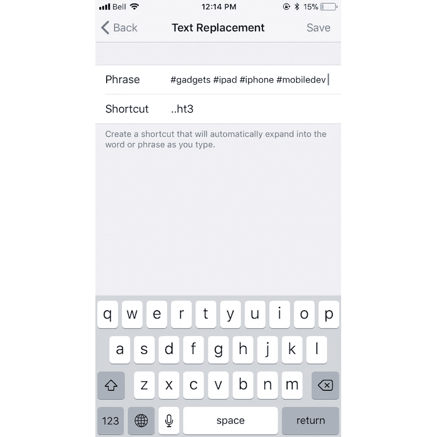

# 脸书和 Instagram 增长黑客

> 原文：<https://medium.com/swlh/facebook-and-instagram-growth-hacking-1eb057f34f6f>

指数级社交增长比你想象的要容易。

数字空间中的品牌意识、销售和社会影响力；建立你的品牌或企业的社交追随者比你想象的要容易和便宜得多。

在过去的两年里，我一直在测试如何通过利用内容、增长黑客方法和利用社交影响者来成倍增长页面。

脸书月访问量达到峰值**3500 万**独立用户，一天之内页面增长**40000**独立用户，我将分享一些我学到的经验。

下图是我的热门帖子之一，有 1200 万人访问了**。这个视频是在狗主人的许可下分享的，我们给了他们的页面信用。**

我将先介绍一下脸书，然后深入 Instagram，关注 5 个关键方面**:**

1.  ****内容创作****
2.  ****调度****
3.  ****社会影响者****
4.  ****社交朋友****
5.  ****算法黑客****

# **脸谱网**

**就内容而言，视频无疑是“入侵”脸书内部算法的发电站。如果你有一个静止图像要分享，试着用静止图像制作一个 10-30 秒的视频短片，即使它只是音乐或字幕。**

**如果你缺乏内容，分享你认为你的观众会喜欢的其他页面的内容。这也可能开始获得一些“社交朋友”，他们可能会分享你的内容。**作为一名影响者，最糟糕的事情莫过于收到一条未经通知的“您能分享我的内容吗”消息，甚至没有打招呼。在请求帮助之前建立关系。****

**通过发送消息给相似的品牌、内容创建者或处于相似追随者数量阶段的企业来寻找社交朋友。**

**创建一个社交朋友群消息是与相似品牌和企业一起成长的好方法。请你的社交朋友在你每次发布帖子后交流以下( **S/C/L** )流程，或者安排一个时间进行这些交流:**

*   ****分享**他们的一篇文章，以免费获得你的一篇分享文章**
*   **对彼此的帖子发表评论以提高绩效**
*   **喜欢你的社交朋友的帖子也能提高你的表现**

**为了确保尽可能多的有机接触，我见过大多数成功的人每 3 到 4 个小时发布一次。如果你想在国际上发展，这是一个 24 小时的周期。如果你只想在北美发展，迎合东海岸，东部时间早上 8 点开始你的第一篇文章，东部时间晚上 8 点结束。**

**脸书上的时间表是所有社交渠道中最慷慨的内容发布平台。**在您页面的“发布工具”部分，提前**安排多达 **6 个月的内容。要安排共享内容:复制所需的帖子或视频 URL，粘贴到新的帖子字段，然后删除 URL，留下嵌入的内容，并点击安排帖子。****

****

**安排帖子时，请考虑以下选项:**

1.  **如果你在帖子中展示产品，请在帖子中附上脸书店铺的产品(**帖子中的链接会降低有机可及性，因此请使用产品标签或让用户查看评论中的链接****
2.  **利用流行的标签进行有机接触**
3.  **吸引人的标题还是精确的标题**
4.  **有趣的缩略图必不可少**

****

**发帖后，你成长黑客的关键就在你的社会朋友和社会影响者中。如果你的预算很低，坚持依靠社交朋友分享你的帖子，作为分享他们帖子的回报。**

**脸书有一个惊人的功能，任何对你的帖子有反应(喜欢，喜爱，甚至愤怒反应)的人都可以被邀请关注你的页面。仅用这种方法，我的脸书网页每天就有超过 500 名粉丝。**

****

**如果你有脸书广告的预算，最糟糕的投资是脸书的“Boost Post”。这是到目前为止最昂贵的方式来增加到达率、帖子点击率和页面增长。我只建议使用脸书广告，如果你有一个代理为你这样做，或者如果你有一个销售渠道，脸书像素，并做了广泛的规划和研究。利用更具成本效益的社会影响者路线。**

# **社会影响者**

**我利用社交影响力来实现两个目标:页面增长/品牌知名度，以及创造销售。下面的步骤适用于这两个目标，然而，没有产品导向的有机内容无疑会给你的页面带来更多的流量。**同样，使用你的脸书商店中的产品**是将产品附加到更随意的视频中以产生有机销售线索的好方法。**

**首先确定你的用户，然后为一个帖子付费。我个人使用人工方法来选择我的社会影响者。尝试使用[社交刀片](http://www.socialblade.com/)，浏览标签，或者使用已知账号。**

**一旦你确定并选择了你的影响者，创建一个如下所示的成本表。我更重视评论而不是喜欢，因为这意味着更积极的追随者。如此表所示，将钱花在小账户上可能会更好，因为他们参与度更高。在这张表中，我会选择影响者 5，因为他们每千名追随者只需 0.34 美元，有 3.46%的追随者喜欢每篇帖子，还有相当数量的评论活动。**

****

**我在 Instagram 的产品帖子上获得了 400%的投资回报率，并且可以从高影响力的社会影响者那里找到许多交易。有一些拥有 5000 名粉丝的影响者收取 5000 美元的帖子费用，也有一些我发现拥有 20 万名粉丝的影响者收取 100 美元的费用。总是货比三家，并制定一个 CPM 表，以了解哪个客户将产生最大的影响。**

**你的影响者简历(Instagram)或帖子(脸书)中的链接是必要的。没有多少用户会因为你被标记而跳过你的账户，但是他们会打开你的影响者提到的链接。也试着在你的影响者的故事(Instagram)中发布一个带有向上滑动链接的帖子。**

**如果你不喜欢手动联系影响者和安排帖子的想法，有许多不同的自助式影响者连接网站。我曾经用过并且成功的一个方法是 [Shoutcart](https://shoutcart.com/) 。它允许你联系有影响力的人，支付广告费用，甚至请求他们简历中的链接。同样，我更喜欢手动，因为有些影响者甚至不知道他们是影响者，而你可以达成交易。**

****

# **照片墙**

**Instagram 拥有 8 亿用户，是一个无限和即时接触潜在客户或粉丝的好地方。如果你想节省时间和精力，同时还能发布适量的内容，稍后的是绝对必要的**。****

**后来是一个用于脸书、Instagram、Pinterest 和 Twitter 的日程安排网络/移动应用程序。您可以连接多个社交句柄，并添加多个团队成员。安排您的媒体后，稍后会为 Instagram 帖子发送移动通知。**

****

**由于 Instagram 是一个连续滚动式的订阅源，帖子只有大约 24 小时的影响窗口，所以越少越好。我建议每天最多只发 3 个 Instagram 帖子。大多数人在上班前、午餐时间和下班后都在打电话。我最喜欢的发布时间是美国东部时间上午 8 点，下午 12 点和晚上 7 点。**

# **内容**

**我问过我的粉丝，他们更喜欢 Instagram 上的视频还是图片。大约是五五开。如果你喜欢发布视频，并且你不是一个视频专用帐户，我建议每 6 个帖子只发布一个视频。如果你想混合生活方式内容和产品内容，3:1 的比例在你的 Instagram feed 上看起来非常干净。**

**下面是我如何以 1:1 的比例安排 [Doggomoji](http://instagram.com/doggomoji) 的一个例子，发布有趣的狗媒体，并每隔一个帖子发布一个产品帖子，提到我们在 bio 中的链接。**

****

# **标签**

**每当我阅读其他社交网络策略帖子时，他们总是提到总是使用标签的重要性，以及使用像#男孩#理发店#咖啡这样的通用标签。老实说，我对这种标签说 MEH。他们可能会给你一些额外的喜欢，但这都是空话。它们在你的帖子底部看起来也很糟糕。你会收到一堆来自其他品牌的机器人账号评论表情符号和类似“太棒了帖子”的通用机器人回复你真的想要吗？**

**在我利用社交媒体的人际网络中，我也听到了一些有趣的算法建议，一些标签实际上阻碍了你的影响力，因为它们是经常被用户滥用的标签。一个宽泛的标签唯一能帮到你的时候就是你的帖子被广泛传播的时候。如果你认为你可以进入一个广泛标签的“热门帖子”部分，那么你会看到很多新的关注者和评论。所以，如果你有下一个“背包小子”或“男人不性感”的帖子，那么尽一切可能使用#滑稽标签。**

**如果你想使用标签，要具体。此外，把你的标签放在文章的评论部分(它们仍然在这里工作),而不是放在标题中，这样文章标题会更简洁明了。**

**当您使用多个标签时，iOS 文本替换可以帮助您。30 个标签是你可以使用和尝试使用的最大数量"..ht1 "，"..ht2”等作为手机中的文本替换，这样可以节省时间。您可以在手机的“设置—常规—键盘—文本替换”部分找到它。**

****

# **Instagram 增长黑客**

**RIP Instagress。我用过最好的 instagram 成长聚合和成长 bot。不幸的是，它违反了 Instagram 的使用条款，被关闭了。**

**Instagress 利用了强大的流程来为帖子点赞、评论帖子，以及关注/取消关注与您在 web 应用程序中定义的一组参数相匹配的用户。你可以手动操作，或者使用另一个机器人(**使用机器人可能会违反 INSTAGRAM 的使用条款——要小心。)****

# **用手**

**我的 Instagram 账户增长最快的时候是一周内有 5000 名用户。我通过实现喜欢、评论、关注/不关注流程来做到这一点。确定你的竞争对手、影响者以及你的潜在客户/粉丝正在关注的页面。列出所有这些账户。**

**打开你认为你的潜在客户/粉丝正在关注的账户，并开始关注那些账户的关注者。这是一个艰苦的过程，但它的工作。此外，进入你刚刚关注的新账户，喜欢他们的帖子，并可能对他们的帖子发表评论。3 天后，取消关注这些帐户，并重复这个过程。同样，我用这个过程在一周内创造了 5000 个新的追随者，但这并不是一段有趣的时光。这些步骤总结如下:**

1.  ****确定在你的领域拥有大量追随者的账户****
2.  ****关注这些账户的用户****
3.  ****喜欢这些用户的帖子(我写了他们最近的 3 篇帖子)****
4.  ****评论这些用户的帖子****
5.  ****大约 3 天后解除跟随****
6.  ****重复该过程(建议每 3 天 500 个用户)****

**另一种增长黑客方法与脸书使用的方法相同:**S/C/L 流程。****

**创建一个社交朋友群消息是与相似品牌和企业一起成长的好方法。请你的社交朋友在你每次发帖后交流以下( **S/C/L** )流程，或者安排一个时间进行这些交流:**

*   ****分享**他们的帖子，以获得你的免费分享帖子**
*   ****对彼此的帖子发表评论**以提高绩效**
*   ****喜欢**你的社交朋友的帖子也能提升表现**

# **使用机器人**

**同样，这是一个灰色地带，可能会让你的账户被暂停或删除，但很多品牌都在使用机器人，这一点非常明显。如果你使用机器人自动关注/取消关注，比如评论，我强烈建议**不要评论**。它看起来真的很俗气，你的机器人可能会错误地发表评论说“很棒的帖子！”关于某人的个人内容，这是一个更敏感的主题或个人帖子。**

**一个很好的替代方法是社会增长(T21)。该工具允许您输入参数，如您希望机器人从帐户中提取追随者信息，何时活跃，每小时申请多少喜欢等。**

**有许多关于其他成长机器人的伟大文章，你也可以雇人来做手工过程，然而，过程总是保持不变。识别，关注，喜欢，评论，取消关注。**

**最后，在 Instagram 上保持活跃和真实就好。消息用户，与他们的内容互动，并享受吸引现有粉丝的乐趣。竞赛非常有助于扩大影响力，激发你现有的粉丝。**

# **最终注释**

**如果你的目标是扩大你的页面，你绝对不需要使用付费的脸书和 Instagram 活动来实现。通过实施这些方法以及利用社会影响者以比投放广告更少的成本获得更多的接触，有机接触非常容易获得。**

**你的社交朋友是你最大的财富，因为这让你的帖子有可能像病毒一样传播。使用**的惊人的脸书功能邀请**与你的内容互动过的用户到你的页面(直到你的关注者超过 100，000。)**

**使用关注/取消关注、喜欢、评论方法识别竞争对手的关注者并与之互动，以快速扩大 Instagram 关注者基础，但不要过于疯狂地使用机器人评论。**

**这些方法让我可以在基本不存在广告预算的情况下将页面扩大到巨大的尺寸。 [Doggomoji](https://www.facebook.com/doggomoji/) 和 [Memeoji](https://www.instagram.com/memeoji/) 是我创立的两个品牌，并为其制作每日内容。他们在没有使用脸书/ Instagram 广告的情况下成长，一直依赖有机和社交影响力流量。**

**祝你的网页好运，并随时给我发送问题或评论。**

****

## **这篇文章发表在[《创业](https://medium.com/swlh)》上，这是 Medium 最大的创业刊物，有 292，582+人关注。**

## **在这里订阅接收[我们的头条新闻](http://growthsupply.com/the-startup-newsletter/)。**

****