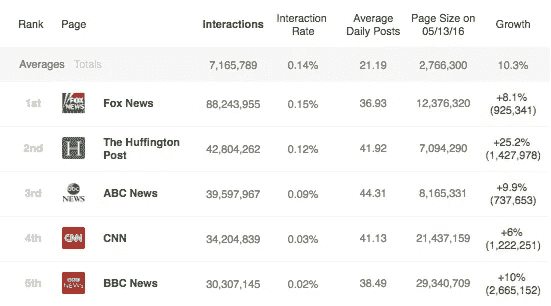
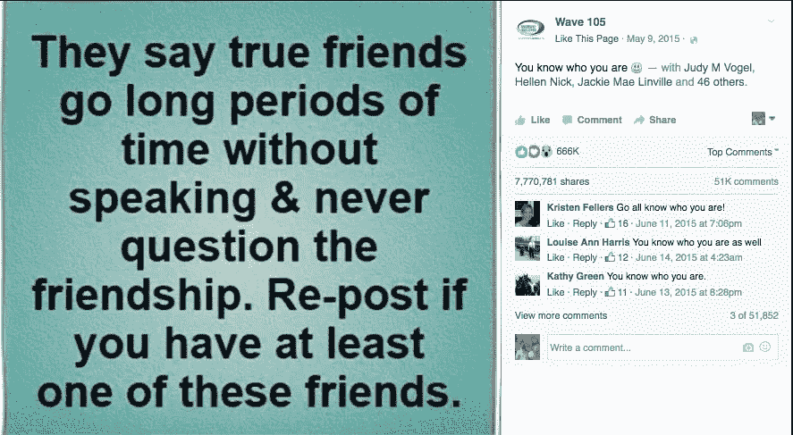

# 脸书，保守新闻和你如何达到 15 亿用户

> 原文：<https://medium.com/swlh/facebook-conservative-news-and-how-you-get-to-1-5-billion-users-54a40ebbd7cd>

作为一家监控脸书内容的公司的首席执行官，我一直在密切关注本周所有关于热门话题和新闻的讨论。

多亏了我们在 CrowdTangle 的工作，我们有了很多关于脸书什么可行什么不可行的数据。我想分享一些我认为值得参与讨论的数据点，以及一些关于更广泛的对话的观察和思考。

## **福克斯新闻频道在它的脸书页面上带动了比世界上任何其他新闻媒体更多的互动(这还远远不够)**

下面我们来看看 2016 年在脸书页面上引发最多互动(赞、分享和评论)的新闻媒体。

福克斯新闻频道不仅互动次数是名单上其他人的两倍，而且他们发布的帖子也比其他人少……而且他们拥有 CNN 和 BBC 新闻一半的观众。

如果你只是将它们与其他主要新闻媒体进行比较，它们的内容在脸书获得了大量关注，这意味着它不断出现在许多人的新闻订阅中。

## **保守媒体通常和进步媒体做得一样好**

我们列出了 10 大保守网页和 10 大进步网页(如下所示),以及它们在过去 6 个月的表现。以下是一些发现:

*   它们的平均交互率大致相同(. 17%-.18%)
*   它们的平均增长率大致相同(14%)

一般来说，它们的内容表现基本相同。

## 这是什么意思？

上面的数据并不意味着否定或证明任何关于趋势话题如何工作的事情，甚至当涉及到政治时，新闻提要算法中可能存在或不存在什么人类驱动的算法权重。相反，我认为它确实说明了一件事:来自保守的脸书版面的新闻报道和进步的一样好，如果不是更好的话。

## 事实是，脸书最大的新闻不是政治性的

我认为值得指出的是，在新闻媒体中(甚至在政治新闻媒体中)，最受关注的故事往往是与政治无关的事情。例如，这是 2015 年福克斯新闻频道发布的最大的帖子:

我们知道，美国政治已经变得非常两极化，许多新闻通过我们和我们朋友的政治偏好被过滤掉了，但最终，我真的认为最让我们感动的事情往往是关于我们潜在的共同人性的故事，而不是我们的政治意识形态，这一点非常重要(也令人放心)。

## 还会有偏见吗？

也许…只有少数人能确切知道。但是在我们与脸书的所有互动中，以及在被脸书的数据埋没了几年之后，我所看到的最常见的偏见是脸书试图给用户他们想要的。

然而，很容易低估这有多难。

脸书有 15 亿用户。他们每秒记录的数据量绝对是惊人的。此外，这些数据不一定容易转化为用户偏好。例如，这是 2015 年最吸引人的帖子之一:

这是否意味着所有这些人都希望他们的饲料中有相似的迷因？大概不会。

## 如何获得 15 亿用户

现在，脸书[正在向直播视频](https://www.buzzfeed.com/mathonan/why-facebook-and-mark-zuckerberg-went-all-in-on-live-video)投入大量资源，这部分是因为他们看到数据显示用户花在直播视频上的时间比其他内容多得多。

脸书也在大力发展即时文章，这在很大程度上是因为它提供了更快的加载速度和更好的链接消费体验。(说到这里，即时文章的一个有趣且鲜为人知的方面是，它应该会对帮助脸书提供更好的新闻源产生巨大影响。脸书现在将获得更多用户点击链接后所做的输入，希望在这个过程中，能更好地传递用户想要看到的链接。

关键是，如果你看看脸书多年来的产品和用户体验决策，最统一的一条线索是，他们试图让更多的用户花更多的时间在他们的平台上。

或者换句话说，为尽可能多的人创造最好的体验。

## 这一切意味着什么？

人们已经解释了为什么趋势新闻框远不如新闻本身有意义，所以我将简单地指出，在一个一半人口经常投票给共和党候选人的国家，很难想象任何一家像脸书这样有着巨大使命的公司会因为意识形态原因而危及那么多的市场份额。

此外，确实影响其庞大用户群的事情……即其主要产品创意，或许最重要的是，关于哪些内容实际上在 feed 中，哪些内容不在 feed 中的公开可用数据……指向一个试图服务于大量不同受众(包括大量保守用户)的中立平台。

最后，脸书是一家规模惊人的公司，这对它在世界上的角色有着极其重要的意义……这些意义应该公开讨论；然而，它之所以能走到这一步，很大程度上是因为它是一家致力于制造用户喜欢花时间来使用的产品的公司……不管他们的政治信仰如何。

—

## 我们的数据

关于我们数据的一个简短说明。我们正在测量脸书页面。所以，上面的数据显示了这些脸书页面上的公开帖子的表现。这不包括有针对性的文章，也不包括没有在页面上发布的文章。这意味着这不是一个全面的分析，但希望仍然有趣。

## 什么是 CrowdTangle？

好问题！你可以在 crowdtangle.com 了解更多，或者发邮件到 brandon@crowdtangle.com 给我。