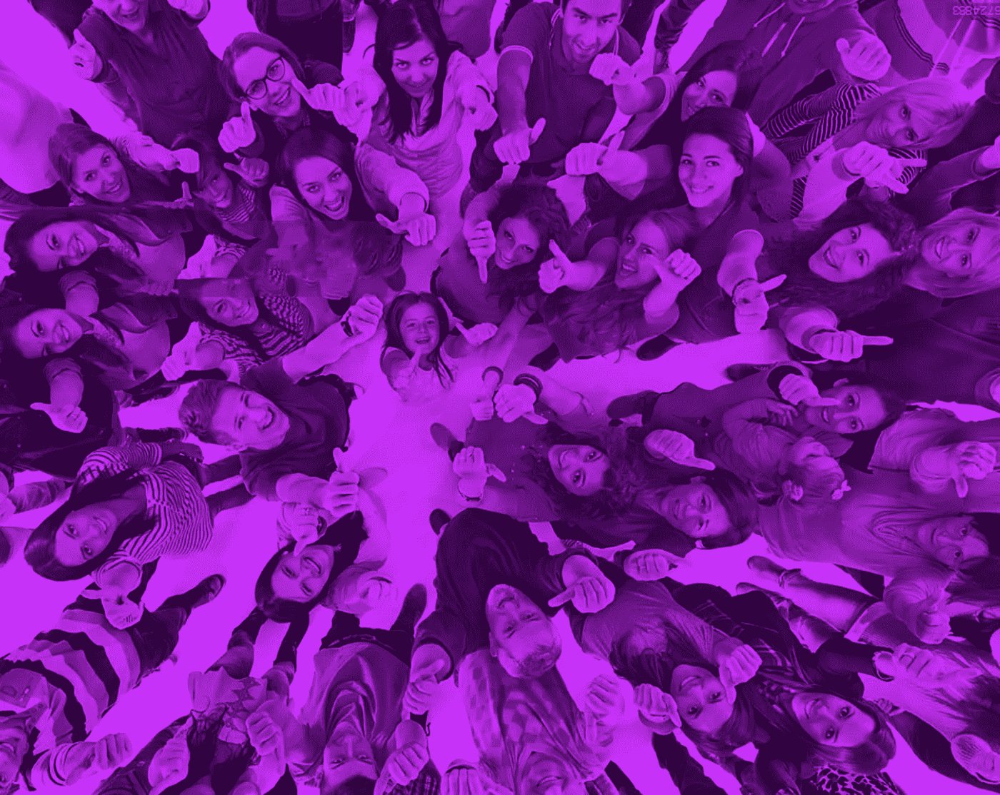

# 脸书步履蹒跚，但我们其余的人会没事的

> 原文：<https://medium.com/swlh/facebooks-faltering-but-the-rest-of-us-will-be-alright-eab3dadd17ec>

在过去的几周里，有很多人对脸书的状况、脸书的影响以及脸书的未来感到绝望；正如我在之前的一篇文章中所写的，它的商业模式越来越多地被揭露为扯淡。而且，正如[蒂姆·库克正确观察到的](https://arstechnica.com/tech-policy/2018/03/tim-cook-says-apples-customers-are-not-its-products-unlike-facebook/)，脸书唯一真正提供的似乎是用户的个人信息。换句话说，如果你有一个脸书账户，这并不意味着你就是客户。意思是你就是产品。

当然，围绕脸书的许多丑闻都与隐私和个人信息共享的概念有关。值得注意的是，在网络隐私方面，美国和世界其他地方似乎有很大的文化差异。欧盟已经在[迅速采取行动](https://gdpr-info.eu/)实施更严格的隐私保护，甚至给予其公民“被遗忘的权利”——这在美国要难得多。

但这不仅仅是文化差异，也是代际差异。在我为各种创业公司工作的过程中，我花了大量的时间和 24-35 岁年龄段的人一起工作。我雇佣过他们，解雇过他们，和他们一起吃饭，和他们一起参加过无数个周五下午的啤酒聚会。(我可能会注意到，他们选择的啤酒质量总是高得令人难以置信——但我跑题了！)

暂且抛开对脸书商业模式的任何疑问，我可以告诉你，信息共享是年轻一代的精髓。这只是他们与世界互动的方式。他们不承认界限或边界:除了他们的个人经历和数据点，他们渴望并准备分享他们的时间和资源。与我遇到的其他任何人相比，这些年轻的工人都是*社区*的成熟学生。

分享信息是他们与生俱来的，但我不认为他们对分享信息的网络有任何特别的忠诚。我们都知道普通大众离开 MySpace 的速度有多快，脸书也完全有可能遭遇同样的离开。那是因为脸书只是一个媒介。它不是一个产品，而是一个渠道，年轻一代可以通过这个渠道分享他们的信息并参与社区活动。但是这些事情他们可以在其他地方做——如果他们需要找到一个替代脸书的媒介，他们会的。就这么简单。

顺便说一句，我认为年轻消费者对设备比对媒体更忠诚。比如说，他们与他们的 iPhone 有着切实的联系 iPhone 实际上是一种实体产品，因此比脸书这种短暂的东西培养了更多的忠诚度。脸书只是达到目的的一种手段。

因为年轻用户感受到分享东西的强烈自由，他们享受在其他地方分享东西的自由*—*这对脸书来说不是好消息。我要重申我的怀疑，脸书的商业模式是站不住脚的，因为他们唯一能提供的是个人信息——一旦这些信息被转移到其他地方，脸书就什么都没有了。

尽管年轻一代在任何他们想去的地方*分享任何他们想分享的东西的自由对脸书来说是个坏消息，但我认为这对整个世界来说是个好消息。让我举一个例子:你可能已经看过最近辛克莱广播主持人的拼贴画，他们都以一种怪异的宣传方式机械地重复着相同的话题。*

传统媒体中正在进行的精神控制可能令人担忧，但请注意，曝光这种黑幕做法并立即传播的视频剪辑是由一些(在此插入低数字)岁的人拼凑而成的，他们知道如何审查和辨别最好的在线资源；一个在使用网络媒体方面很老练的人，足以让他或她能够立即看到那些胡说八道是什么，并做出相应的评论。

互联网带来的社区意识培养了年轻一代，让他们成为更聪明、更有洞察力的数据消费者。他们清楚地知道信息共享可以让他们做什么，他们知道他们并不特别需要脸书来与更广阔的世界联系或理解向他们提供的数据。我不认为这对马克·扎克伯格来说是个好兆头，但对于整个世界来说，我认为我们会好起来的。

## 这个故事发表在 [The Startup](https://medium.com/swlh) 上，这是 Medium 最大的创业刊物，有 320，924+人关注。

## 订阅接收[我们的头条新闻](http://growthsupply.com/the-startup-newsletter/)。

