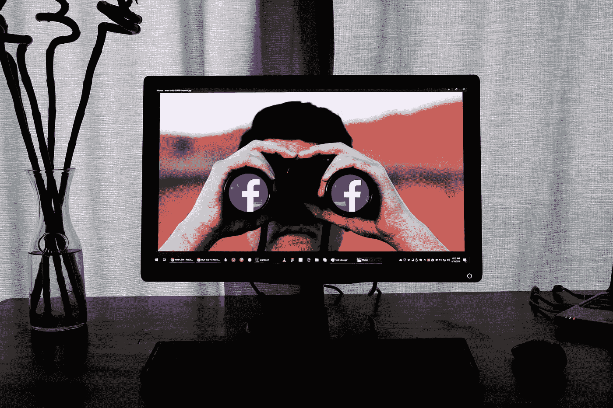

# 脸书的隐私推动是粗略的，这里是为什么…

> 原文：<https://medium.com/swlh/facebooks-privacy-push-is-sketchy-here-s-why-b880c6ddd1ab>

“television showing man using binoculars” by [Glen Carrie](https://unsplash.com/@glencarrie?utm_source=medium&utm_medium=referral) on [Unsplash](https://unsplash.com?utm_source=medium&utm_medium=referral)

2018 年 7 月，脸书宣布其收入增长在 2018 年第二季度放缓。It [还表示](http://www.openmic.org/news/2018/6/18/following-pressure-from-shareholders-facebook-board-adopts-new-focus-on-privacy-and-data-use-community-safety-and-cybersecurity-risks)预计“下降趋势将持续到今年下半年”,因为该公司正在努力改善其用户隐私保护。

声明发布后，[脸书的股票](https://www.vox.com/business-and-finance/2018/7/28/17625218/facebook-stock-price-twitter-earnings)“经历了历史上最大的单日跌幅”，价值损失了 1190 亿美元。据 [MarketWatch](https://www.marketwatch.com/story/want-to-delete-facebook-read-what-happened-to-these-people-first-2018-07-27) 报道，7 月，“脸书报告称，自第一季度以来，欧洲每日用户减少了 300 万”。

虽然“删除 facebook”运动似乎主导了我们的 Twitter 和其他社交媒体，但它似乎来来去去都没有太大影响。然而，技术和媒体研究公司 Tech.pinions 的一项调查发现，大约 9%的用户彻底删除了他们的账户。

# 用户隐私对脸书不利…也许？

如果用户隐私对脸书的商业模式构成如此大的威胁，那么他们投资于更好的用户信息隐私保护是没有意义的。原因是人们现在分享的信息越来越少，而且对交给脸书的信息更加谨慎。

***所以脸书需要人们觉得他们的信息是安全的……***

虽然脸书可以以以前的形式运营，并继续使用从用户那里收集的所有信息，而不关心他们的安全，但它需要用户对共享信息感到舒适。

剑桥分析公司的惨败是一个巨大的例子，说明当粗心与数百万人的信息结合在一起时会出什么问题。脸书最新的违规涉及另外 5000 万或更多用户，这表明脸书仍未清理其行为。

 [## 怎么回事，脸书？

### 脸书使用你的私人信息来定向投放广告……即使你没有给他们——搜索加密博客

medium.com](/swlh/what-the-heck-facebook-d686d8a81aa8) 

# 虚假隐私可能比没有隐私更糟糕

如果脸书彻底修改其隐私和数据安全做法，只是为了利用它收集的信息，我们可能会比以前更糟。

想象一下，人们突然相信脸书正在尽最大努力保护所有用户的信息，不管是不是隐私。因此，人们可能会比以前更愿意分享更多的信息。脸书没有在隐私上投资，因为它相信隐私，并看到用户安全的价值。

该公司需要用户有一定程度的感知安全和隐私，这样他们就可以分享他们曾经觉得很舒服的信息。如果脸书和该公司的营销可以让人们相信他们是安全的，即使他们并不安全，我们可能会陷入更糟糕的境地。

随着安全级别的提高，人们愿意分享更敏感的信息。但这只会增加脸书的风险。最终，脸书可能会遭受另一次重创，如果在“改善”他们的隐私后，他们又有了另一次*数据泄露。人们的信任度将再次下降，但下降幅度会更大，因为他们正在使用或失去控制的数据更加敏感。*

# 隐私是必要的(也是可能的)

互联网在很大程度上是由广告支撑的。这是毫无疑问的。但是，当使用人们的信息开始变得比向这些人提供价值和效用更重要时，它就成了一个问题。

如果我们在网上使用的每个网站和服务都只是收集用户数据的幌子，那么我们真正得到的是什么？我们成为广告商的产品，而不仅仅是寻找信息的用户。

**阅读更多:** [***真的可以私自使用互联网吗？***](/swlh/is-it-really-possible-to-use-the-internet-privately-af6a697deef1)

在这种模式下，互联网可能看起来像一个可怕的地方，有时确实如此。但是通过一点努力和正确的工具，保护你的身份和其他私人信息是可能的。

 [## 互联网隐私指南——保护您的在线数据安全

### 为什么隐私很重要？

hackernoon.com](https://hackernoon.com/internet-privacy-guide-keeping-your-data-safe-online-be3d823f05f5) 

***感谢阅读，祝好运！***

## 这篇文章发表在 [The Startup](https://medium.com/swlh) 上，这是 Medium 最大的创业刊物，拥有+ 374，357 名读者。

## 在这里订阅接收[我们的头条新闻](http://growthsupply.com/the-startup-newsletter/)。

