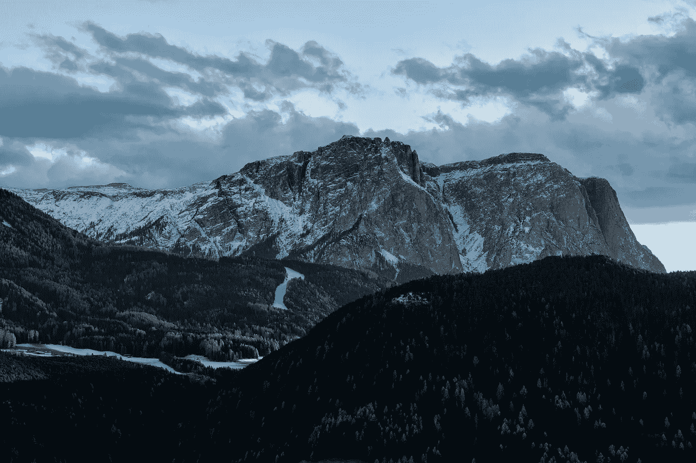

# 面对你的巨人

> 原文：<https://medium.com/swlh/facing-your-giants-2cbec56665f>

pexels.com

我们每个人，在生命中的某个时刻，都会遇到一个看似不可战胜的对手。也许是糟糕的态度，艰难的家庭环境，破裂的友谊，压倒性的目标，或者可能只是代数作业。当我们感觉自己是大卫在与歌利亚战斗时，我们该怎么办？我们如何让神在我们的生命中工作，带领我们进入应许之地？

每当我们面临挣扎，上帝就在那里。无论我们是否允许他进入我们的生活，他都在看着我们，他知道在他的帮助下，我们如何取得胜利。然而，我们很多人都没有意识到他不可思议的存在和他对我们的承诺。

今天信息的重点不是我们永远不会面对挑战，而是在上帝的帮助下，我们可以面对并战胜生活中的每一个巨人。

# **1。找到你的山**

如此多的人像懦夫一样度过一生。他们不敢做任何事，不敢成为任何人。他们不想成为大人物——他们宁愿像其他人一样，成为一个模仿者。他们无时无刻不在思考梦想和潜在的目标，但从不满足于去追求。

作为基督徒，神呼召我们要有目标。他告诉我们让他带领我们进入一个美好的生活，在那里我们像基督的使者一样生活在我们的各行各业。

设定目标让你知道你想去哪里。每天早上醒来，我知道为什么我在做我正在做的事情。我每天都写作，因为我有一个出版一本书的目标。我每天都学习，因为我希望我所有的课都得 A。我每天都读圣经，因为我想在一年内读完它。设定目标可以让你知道自己的前进方向。最近我有机会去爬阿拉斯加安克雷奇的平顶山。当我们爬山时，我们可以注意到这些小山丘。

我需要一些外力来告诉我那不是我要去的地方。

不要漫无目的地闲逛。找到一些努力追求的东西。设定目标。现在就拿起笔记本，开始写下你的人生目标。没有一个人没有一个计划就不会有任何重要的成就。选择你的山。

开始攀爬。

面对你的巨人。

# **2。相信你能成功**

目标有一个问题——仅仅有目标是不够的。一张写着你的梦想和目标的纸什么也做不了。它们需要行动，但在行动之前，需要信念。你要做的第一件事是相信你能做到。如果你写下某件事，但认为它不可能，那它就永远不会发生。永远记住，如果这是上帝的旨意，并且你寻求他的帮助，一切皆有可能。

> ***“我听说过一个故事，两个农民祈求上帝下雨。两人都祈祷，但只有一人准备了土地。你认为谁更相信上帝会下雨？”***
> 
> ***——面对巨人***

这个故事是我最喜欢的电影之一中的一个伟大的故事。如果我们不相信上帝会坚持到底，并按照这个信念行动，那么向上帝祈祷成功又有什么好处呢？

最近学习约书亚书让我学到了很多关于成功的知识。约书亚和以色列人必须相信上帝的应许，他们将接管迦南地并取得胜利，这是最重要的事情。事实上，策划他们的攻击并不是他们的出发点。首先，他们必须相信这是可能的。

前几天，我参加了一场辩论赛。对许多人来说，这是本赛季的第一场辩论赛，我一如既往地做好了准备。这是我辩论的第二年，我正与一些傲慢作斗争。我比其他人准备得更充分，也比去年准备得更充分，但我必须保持谦逊。然而，谦逊并不意味着你不想赢。

嗯，我想赢。我想做好——毕竟，我付出了这么多，总有回报的，对吗？

确实如此。

我们在当天结束时到达了颁奖典礼，我获得了第二名，只输给了我最好的朋友之一(更不用说我的辩论小组组长)。不过，还有一件事让我更加自豪，那就是 6 比 0 的记录。这意味着我赢了每一轮，每一轮！我的最好记录是 3 胜 3 负，只赢了一半。我对这次锦标赛的期望，我的最低目标，是取得 4-2 的记录。在上帝的帮助下(以及很多朋友的鼓励下)，我远远超过了那个。)

但问题是——我不得不相信这是可能的。这不是偶然或意外发生的，因为这不是辩论的方式。

不，在我打开日记的前一天晚上，我用占了整页的大字挑战自己要赢得锦标赛。尽管我没有把自己放在那个标准上，但我完全相信这是可能的。

结果，我赢了我参加的每一轮比赛。

当你相信你将到达山顶时，会发生令人惊奇的事情。相信上帝已经给了你胜利，你只需要执行工作来实现它。接管上帝给你的土地。

# **3。爬山**

知道你的目标并相信你有可能实现这些目标是不够的。需要采取行动。在旧约中，上帝给了他的子民土地，但他们仍然必须占有它。上帝已经给了你巨大的胜利，你只是还没有步入其中。上帝可能会召唤你成为美国总统，但如果你从不竞选公职——那就永远不会发生。

如果说我在爬山中注意到了什么，那就是不努力就不会成功。如果不需要努力，当你到达山顶看到美丽景色的那一刻就不会那么美好了。

上帝在召唤你行动。按照你的目标行动。履行他的诺言。没有人不经过一番努力就能登上珠穆朗玛峰的顶峰。

现在你在爬什么山。相信登顶是可能的。开始攀爬。

> 约书亚记 1:6-7“你当刚强壮胆，因为你必使这百姓承受我向他们列祖起誓应许赐给他们的地。只要刚强壮胆，照着我仆人摩西吩咐你的一切律法谨守遵行。不可偏离左右，使你无论往那里去都可以顺利。」

上帝对你有一个计划。不要满足于停滞不前。快点，动起来。上帝带你进入应许之地，你将会胜利。不要害怕，他与你同在。永远不要认为这是不可能的，因为它不是。永远不要怀疑——因为那样你将永远不会成功。

> "勇气不是没有恐惧，而是判断出有比恐惧更重要的东西。"
> 
> 梅格·凯博特

上帝希望你服从他，他挑战你，命令你与众不同。

面对你的巨人。

与歌利亚相比，大卫是一只蚂蚁。他有点紧张吗？是的。所有人都怀疑他吗？是的。上帝答应帮助他了吗？是的。他获胜了吗？是的。我们也可以。

攀登最大的山峰始于足下。击败歌利亚始于一块石头。你今天会采取什么行动？背上背包，穿上鞋子，开始爬山。

你不知道顶端有多么美丽的展示在等着你。

***更多类似的消息，请订阅并帮助支持我，因为我会继续努力通过写作来丰富你的生活。谢谢凯蒂。***

## 这篇文章发表在 [The Startup](https://medium.com/swlh) 上，这是 Medium 最大的创业刊物，拥有 277，050 多名读者。

## 订阅接收[我们的头条新闻](http://growthsupply.com/the-startup-newsletter/)。

