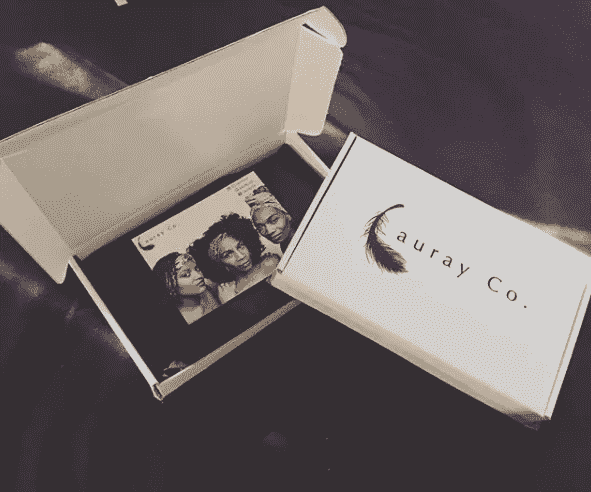

# 我从两次失败的好生意中学到了什么

> 原文：<https://medium.com/swlh/failed-a-good-business-twice-6c93a86a972a>

## 第三次会有魅力吗？？

不久前，我分享了一个故事，讲述了我是如何在兼职 3 个月后赚了 800 美元，然后辞职的。

几年前，我在 Etsy 上做发饰生意。我有一点运气，一些低竞争的关键词和一个不饱和的发带市场，并最终能够在第三个月赚到 800 美元。

我最初写这个故事的时候，是从分析我第一次尝试的时候出了什么问题的角度出发的。对，没错，*第一次*。

我实际上又重操旧业了。对于第一篇帖子来说，这是一个太长的故事，所以我用一些陈述结束了第一篇帖子，这些陈述包含了我对这两个失败的感受。

[LaurayCo. Instagram](https://www.instagram.com/laurayco/)

我第二次去那里是在我去哥斯达黎加的几个月前。

我认为在旅行时有一点额外收入会很好，并雇佣了我的姐姐来帮我(这是她在我们的 Instagram 上制作的一个头带)。

第二次，我把它正式化了。我从独资企业变成了有限责任公司，购买了自己的域名，开了一个商业银行账户。

当时我还在会计部门工作，我觉得如果能在管理社交媒体和将产品运出去方面得到一点帮助就好了。我妹妹有空，所以我们开始工作。

这一次我确实外包了生产。我最初在阿里巴巴筛选供应商，但我接触的每个供应商都要求比我愿意购买的最低订单量更高的订单量。我想有各种各样的发带，我不想在能够测试市场之前被大量库存所困。

因此，我没有在阿里巴巴上进行首次购买，而是在 Craigslist 上发布了一个“合同缝纫职位”的广告，提供 2.5 美元的头带完成费。我很惊讶收到了几封回信。我挑选了一些看起来不错的候选人，寄给他们一个包裹，里面有一个完成的样品头带和布料，让他们给我缝一个复制品。

一旦我开始收到包裹，我就能马上分辨出哪些承包商是好的。一个回来闻起来像烟味，针脚掉了，一个候选人把它拼错了，其他几个没问题，但有一个真的很突出。

它做得非常完美，甚至比我寄出的样品还要好。

我安排了与候选人的会面。这是一位年长的绅士，他是一位退休的设计师，正在寻找一份额外的工作来打发时间。我解释说，在我准备好扩大规模之前，我需要有人临时缝制，他说这非常适合他的情况。

所以在承包商都准备好了的情况下，我去了我最喜欢的网上面料店 *Girl Charlee* ，挑选了 30-35 种面料图案。我每样订购了 2-15 码，这取决于我是否认为它会卖得出去。

布料一到，我就在客厅里坐了 3 天，裁剪布料，并为我的承包商做准备。我把所有东西都运出去给他，两周后他把几百个成品头带还给我。

事情开始变得明朗起来。我第一次在 Etsy 上卖发带时，我用手机在白色背景上拍了照片，然后用 Adobe 编辑。他们不是最差的，但也没那么好。

这一次，我决定更进一步，再次去 Craigslist 寻找解决方案。我找到了一位经验丰富的摄影师，他愿意花 300 美元拍 60 张照片。

看看这些照片！

*我姐姐和她的朋友在我帮忙指导拍摄时，做了一个漂亮的头饰造型。*

*我还设计了一些非常酷的产品包装和传单。*

我们的照片完成后，是时候摇滚了。我姐姐开始在 Instagram 账户上工作。

我并不特别喜欢我们使用的方法，但是我们跟踪了一次。3-4 个月后，我们的粉丝人数接近 10，000 人。如果你现在[看](https://www.instagram.com/laurayco/)，你会看到它略低于 9000。自从我们停止以来，我们已经失去了相当多的东西。

# 那么这次又发生了什么？

我将尽可能简要地总结一下。

# 我有太多的活动部件。我应该在 3 个月后从中国购买库存，并将商品发送到订单执行中心。

我旅行的头几个月，一切都很顺利。还记得我说过，在把布料送给我的缝纫承包商之前，我在我的客厅里裁剪了 3 天。那是因为他对裁剪不感兴趣，但他擅长缝纫，所以我选了他。

在我回家的一次访问中，我采访了一些对裁剪布料感兴趣的人。当他们真正动手的时候，每个人都放弃了。

因此，我不得不要么回到美国自己裁剪布料，要么设法在美国找到另一个来自哥斯达黎加的人，要么通过吸取教训并与海外供应商合作来绕过所有这些麻烦，他们可以管理整个过程(裁剪、缝纫、包装)。

我想选择后者，但唯一的问题是:

# 我雇得太早了

开始时，我每周只付给我姐姐 100 美元多一点，但那是我自己掏腰包。第三个月，销售额包括了我支付给她的工资，但是我没有其他的收入了。如果我自己管理社交媒体，节省我的个人资金和生意中的钱，我可能会在第 3 或第 4 个月有一些明显的畅销书时选择来自中国的供应商。

我一直很喜欢和家人一起做生意的想法，我现在仍然很喜欢，只是我招得太早了，而且是在没有必要的时候。

# 最后，我在最糟糕的时候重新开始了努力

我知道我的发带在过去卖得很好，所以我重新开始一切，以为这将是小菜一碟，是我旅行时额外现金的好缓冲。尽管理论上这很好，但我最终错了。当我意识到所有这些额外的细微差别时，我再次关闭了这项业务，并决定在我旅行回来后处理它。

也许第三次会成为一种魅力？

我不知道。我现在给自己一些时间远离它，但在某个时候，我很确定我会再试一次。毕竟，糟糕的不是业务本身，而是我对它的管理。

感谢您的阅读！❤

如果你喜欢这篇文章，请随意**拍拍**你的心满意足——这将有助于其他人找到这篇文章。

*我每天都写作。*

## 如果你想看更多，请在 Medium 上[跟我来。](/@AleeshaLauray)

# 你愿意一起工作吗？

*访问我* [**这里**](http://www.aleeshalauray.com/)

## 这个故事发表在 [The Startup](https://medium.com/swlh) 上，这是 Medium 最大的企业家出版物，拥有 302，119+人。

## 在这里订阅接收[我们的头条新闻](http://growthsupply.com/the-startup-newsletter/)。

