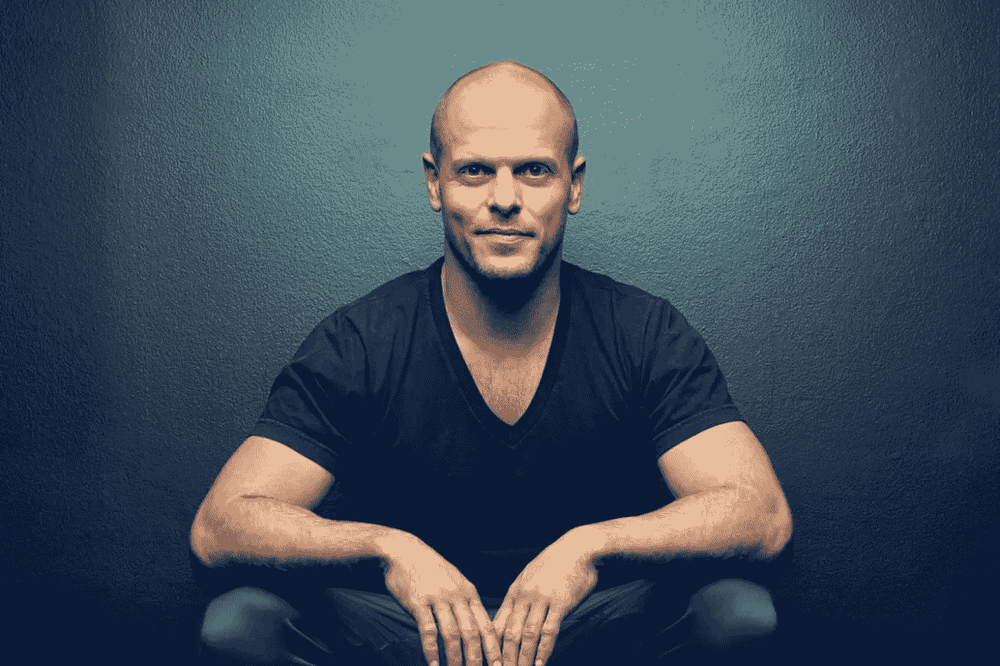
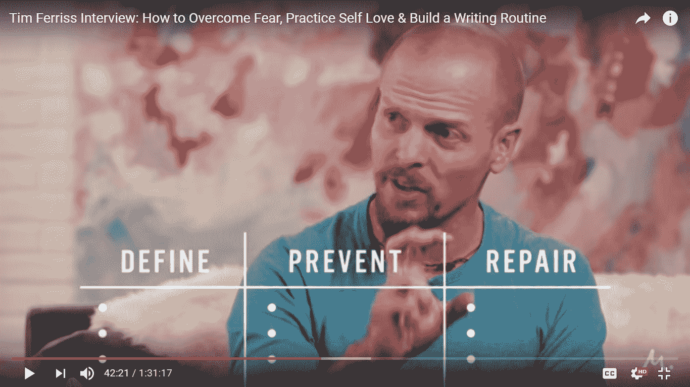
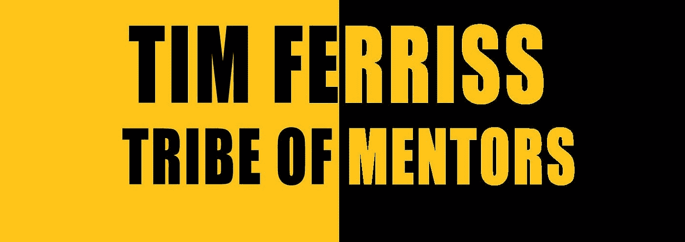

# 失败是不可避免的:如何防止烧坏

> 原文：<https://medium.com/swlh/failure-is-inevitable-how-to-prevent-burn-out-910f7513bb1>

耐力中有力量。但前提是它值得忍受，否则你会无谓地让生活变得痛苦。

我开始感到不知所措，因为我承担了很多责任。我开始相信，如果我没有感到筋疲力尽，我实际上是没有效率的。我想每个人在某种程度上都相信这一点。

这是我们常见的误解。如果有什么不同的话，筋疲力尽是生活效率低下和不平衡的表现。

我最近听到了对 Timothy Ferris 的采访，Timothy Ferris 是《纽约时报》畅销书作家，题为《T2:如何克服恐惧，练习自爱》，建立写作习惯(T3)。我将在这篇博文中引用那次采访。它包含了一些我想分享的令人难以置信的见解。他在信中说:

> “谈论黑暗、失败和艰难时期非常重要。
> 
> 当我采访别人的时候，我总是试着把它带出来，因为这很容易，就像你说的，听一个采访，或者看到杂志封面上的人，然后对自己说哇，我真的希望我能做那样的事情，但是我就是我，他们就是他们。
> 
> 他们已经搞清楚了。他们总是在早上 6 点醒来，就像精神上的空手道斩来征服没有不安全感的一天——这只是胡说八道。"

Timothy Ferris

在过去的两周里，我意识到能够说我们需要休息，我们需要做我们自己是多么重要，不管文化说什么，或者想要我们做什么。

这很重要:**我们需要休息。不要相信加里 v。他是一个现象，不是每个人都像他一样。在漫长的犯错过程中你成为了 V 星人。**

> “如果你脑海中的声音是你永远不会对你最在乎的人使用的声音和语气，那就不要对自己使用它。”

# **你如何定义风险？**

erris 说，我们容易感到的许多焦虑是由于使用了没有很好定义的词语。

例如，这包括像成功这样的词。如果你想成功，你需要有一个非常清晰的定义。或者想想这个词:幸福。幸福到底是什么？快乐的状态是怎样的？没有人真正知道。风险是这种性质的另一个词。

> "风险是不可逆转的负面结果的可能性."

Ferris 说人们认为他是一个冒险家。相反，他会说他根本不这样看待自己。相反，他认为自己是在制造*可计算的风险*。那些最终看起来完全不是那样的。

# **目标设定**

目标必须具体、可衡量，否则你就没有目标。除非你的目标很明确，否则你不会实现它们。

同样，除非你的恐惧没有被清楚地定义，否则你无法克服它们。

> “除非你的目标明确，否则你无法实现它们。除非你的恐惧被非常明确地定义，否则你无法克服它们。”

# **要做的事情防止害怕冒险**

在采访中，费里斯给出了一些切实可行的建议来防止对失败的恐惧。对失败的恐惧使我们无法做出重要的决定和计算风险。

他采用了早期希腊斯多葛派哲学家的一种做法，即在地板上吃饭，吃他们能得到的最便宜的食物，并且长时间穿同样的衣服。

在穿同样衣服的情况下，我们认为人们会思考，人们会注意到，这削弱了我们的欲望。观察我们对他人对我们的看法的空洞关注是至关重要的。

费里斯建议穿同样的衣服，这样你的头脑就会习惯于为那些真正重要的事情感到羞耻。你的衣服不重要，你开的车不重要，你吃的食物不重要，你的手机不重要。

因此，当你失败时——你将会失败——你将能够谦卑自己，可以说，一种更简单的生活方式。

当你在小事上训练自己时，你就有机会在需要做大事时变得勇敢。你不能仅仅等待大事，你必须在这些小事上练习。

当你将要做一笔改变你一生的交易时，是不是就是你想练习谈判的时候？

“你疯了吗？”

你可以从较小的层面开始谈判。例如，去星巴克，试图让人们给你打九折。这样你就能习惯拒绝，练习谈判的艺术。

# **恐惧设定**

这就是费里斯的建议变得非常实用，甚至更有趣的地方。

采取一项你一直在拖延的行动。

那可能是约某人出去，你的第一次大采购，你的第一次大型演出，你的书，你的博客，你的第一次海外旅行，可能是任何事情。

你拿一张纸。在顶部你写下你的恐惧。然后你写三栏。

# 规定

第一列是**定义**，你可以具体描述可能发生的最坏情况:“公司倒闭还不够具体。”问:“那又怎样？那又怎样？那又怎样？”比如:“我付不起房租。”不管是什么。写下来，但是一定要具体。可能有 40 种情况，20 种，但至少有 10 种结果。

# 预防

T 何第二纵队是**防**。这包括你可以打电话、发邮件、联系的人，以防止失败。如果是学者，你可以考虑奖学金。对于每一个最坏的情况，写一个答案。

# 修理

F 或者第三栏写**修复**，你会怎么修复伤害。哪怕是 1%。任何可能的小修理在这里都是有用的。你能搬进你朋友的卧室吗？你能接受一份临时的酒吧工作吗？一颗子弹接一颗子弹。

> 不要着急。

这至少需要半个小时。

# **燃料**

> "我至少在生活中的几乎每一个重要时刻都使用过这个方法."

他提到了他的书，这本书被翻译成 35 种语言，连续 5 年名列畅销书排行榜。这本书被出版商拒绝了 27 次，有时甚至不太好。他说:“保留那些拒绝信。”

《心灵鸡汤》遭到了近 100 次拒绝，但却卖出了 1 亿本。“你可以用它做燃料，”费里斯说。

国际畅销书，*自我是敌人，*四次被出版社拒绝。J. K .罗琳的《哈利波特》系列也有类似的问题。

失败是必然的。但是，如果你已经着手定义，寻找防止崩溃的方法，并尽一切努力修复损害，你的失败将看起来更有形。

你可以选择继续下去。它不会像对许多其他人一样，使你残废。拒绝是必然的。失败就会发生。在这个帮助下做好准备。

在过去的一个月里，我从 Timothy Ferris 那里收获了很多。我打算写一篇关于他最新著作的评论。我特别喜欢他是斯多葛派哲学家的粉丝，我也是(一个真诚的哲学系学生)。

如果你想在这附近，一定要跟着我。我写关于宗教、哲学和幸福的文章。

我希望你能参与我对生活的探索。

直到下一次，继续反思。

## 这个故事发表在 [The Startup](https://medium.com/swlh) 上，这是 Medium 最大的企业家出版物，拥有 277，994+人。

## 在这里订阅接收[我们的头条新闻](http://growthsupply.com/the-startup-newsletter/)。

