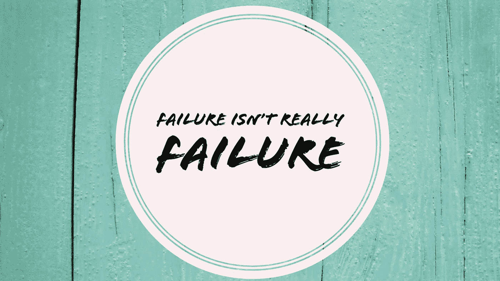

# 失败并不是真正的失败

> 原文：<https://medium.com/swlh/failure-isnt-really-failure-a03445edaf0b>

## 只是一点小挫折…

你好，我叫迈克尔。我是个失败者。也不止一次！无数次！我在一些没人知道的小事上失败了。我在一些需要我多年才能克服的重大事情上失败了。我仍在生活的许多方面努力提高，但我发现自己每天都在失败。尽管如此，我发现 [***的失败并不是真正的失败*** 。](http://www.michaelehenson.com/blog/tosucceedfail)直到你彻底走开，那只是一次挫折。

我是一名热爱写作的摄影师。几年前，我的摄影开始从一种更容易归类为爱好的东西转变为一种商业。我开始为人们拍摄重要时刻的照片，为当地时尚精品店提供店内标志，为一个非常受欢迎的摄影网站写稿，一切似乎都很顺利。这是一种幻觉。虽然一些业内人士开始从我的作品中认出我，但我的摄影业务几乎不存在。我觉得自己在各方面都是一个失败者，而我的“生意”也支持了这种失败感。很多时候，我只想认输，卖掉我的大部分装备，继续我的生活。但我没有。我坚持下来，继续成长为一名摄影师，并努力与欣赏我作品的人建立联系。快进大约四年，虽然我不是独立富裕(甚至不接近！！！)，事情在发展，我一直很忙，机会越来越频繁地出现。

# 坚持不懈

在我的摄影生涯中，把我带到这一步的东西，正是我目前应用于写作的原则。当你追逐你的创造性梦想时，它们是你需要应用到你的情况中的同样的概念。它们是什么？你必须坚持不懈，你必须始终如一。棘手的地方在于，你必须带着激情而不是义务来处理这件事。如果你真的对你的工作充满热情，并且想要成功，你就必须以一定的勇气和毅力去追求它，这种勇气和毅力并不总是与生俱来的。尽管你可能会发现自己在追求一件你想用余生去做的事情，但总会有失败的时候。有些时候你必须做一些你不想做的事情。你的成功将取决于你如何处理这些时间。

我保证会有你掉下马车的时候。你将错过 30 天写作挑战中的一天，你将陷入写作瓶颈，你将被出版商或同事拒绝。有时候，人们会忽视你，说一些难听的话，并积极地与你作对。想成功吗？处理好它。

我知道这听起来有点残酷，但如果你想进入创造性的领域，过上全世界人都喜欢的生活，这就是你需要接受的残酷事实。这里有几个小贴士，当挫折最终出现时，可以帮助你应对…

# 承认你的错误

第一步，弄清楚事情是如何出错的。大多数时候，尤其是对于创造性的追求，失败直接归因于某人(或许多人)拒绝我们。我们的作品没有发表，我们没有得到那份创造性的工作，我们发布一篇文章或分享一本电子书，而我们倾注了数小时的鲜血、汗水、金钱和眼泪，却什么也没有发生。没有人喜欢它，没有人分享它，更糟糕的是，似乎没有人注意到我们发表了它。

当这种情况发生时，只有一个有效的回应——继续前进。确定你的下一步，写下你的下一篇文章或故事，安排你的下一次摄影会议，给你的下一个联系人发电子邮件…继续前进。毅力。一致性。面对失败也要去做。 ***异常顽强且始终如一。***

# 让你自己休息一下

当然，有时你会在创造性上错失目标。你可能会分享一张失败的照片或帖子。你可能会彻底搞砸一个项目什么的。你必须接受这一点。历史上充满了失败，一次又一次的尝试，却没有成功的希望。问题是，如果你继续尝试，你会越来越接近那一件或一系列起飞的“事情”。莱特兄弟的第一次尝试没有成功。爱迪生发明电灯泡失败了令人尴尬的多次。我拍了几十万张照片，在我删除它们之前几乎没见过我相机的背面，因为它们太糟糕了。即使是一个伟大的摄影师也只会保留大约 10-20%的照片，而那些他们完全拥有的照片可能只有 1%。当事情没有完美解决的时候也没关系。对自己和你的创造力负责。继续努力……这个世界需要你给自己一个喘息的机会！

# 拥抱冲突

像审视一个故事一样审视你的生活。想象一个没有冲突的故事。如果《指环王》中的鹰人某天突然出现，拿走了戒指，然后在去佛罗里达或其他地方的路上把它扔进了那个熔岩坑，会怎么样？那会是什么样的故事？它会把一部超过 12 小时的史诗三部曲变成一篇简短的 Twitter 帖子。

> "老鹰扔下戒指，拯救了世界。"

没那么刺激，对吧？一切美好的事物都需要冲突。你越早接受这一课，越早开始将进入你生活的冲突视为成长的机会，你的观点就会越早改变，你就会开始成长为你想要成为的成功人士。

# 你能做到的！

抬起你的下巴，拥抱你的挫折，审视它们，寻找你可以改进的方法，然后继续前进！这就是成功和失败的区别，我相信你能做到！你知道吗？

## 你还在做什么？你在纠结什么问题？下次你想让我写什么？

# 行动呼吁

我写了一本关于如何克服阻碍你成功的障碍的电子书。每个人内心深处都有创造力，都有与之匹配的梦想。如果你想开始或重振你的创意之旅，看看我的免费电子书: ***《创意之旅——入门指南》*** *。*

## [点击此处免费获取！](http://www.michaelehenson.com/opt-in)

## 这个故事发表在 [The Startup](https://medium.com/swlh) 上，这是 Medium 最大的企业家出版物，拥有 276，798+人。

## 在这里订阅接收[我们的头条新闻](http://growthsupply.com/the-startup-newsletter/)。

