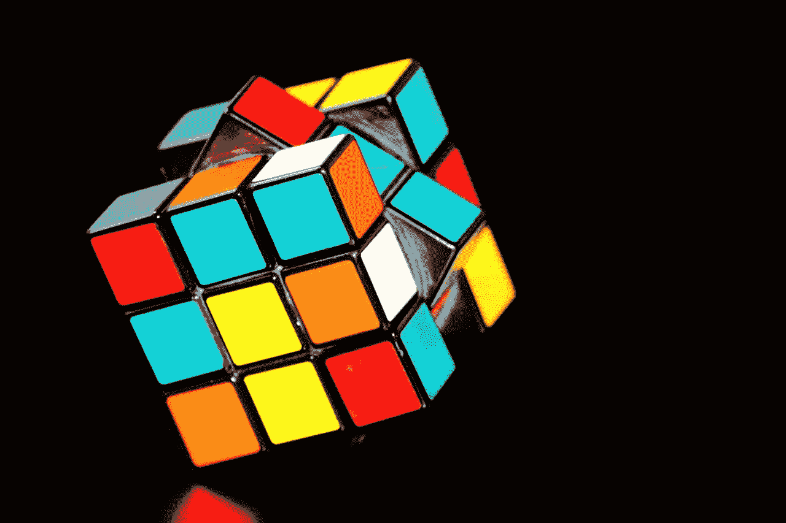

# “跌倒七次，站起来八次。”

> 原文：<https://medium.com/swlh/fall-down-seven-times-stand-up-eight-647e8acb427c>

Just another puzzle to be solved… (Credit: pixabay.com)

# 不断尝试的必要性

生活中的任何事情都很难开始。我们拖延，我们等待条件变得完美，并认为如果我们明天而不是今天开始，我们会准备得更好或更熟练。

有时是恐惧让我们退缩；害怕令人失望的结果或我们不冷不热的接待…