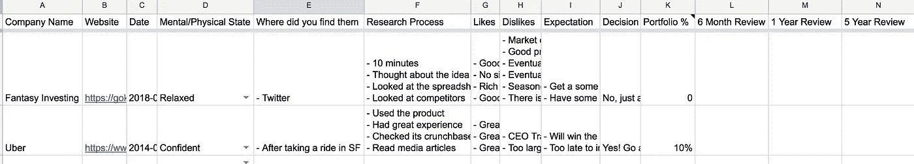
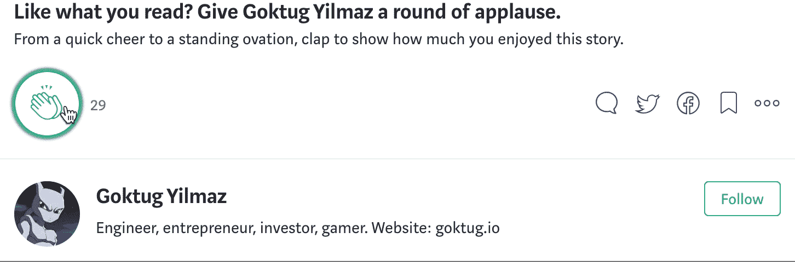

# 幻想天使投资

> 原文：<https://medium.com/swlh/fantasy-angel-investing-2d4ae94c96ad>

2018 年初，[矛头](http://www.spearhead.co/)创建了一篇关于天使投资课程的[博文。](https://blog.angel.co/11-angel-investing-lessons-79b1aeeeeaf6)

其中一个教训是:

> 10.玩梦幻足球
> 
> 通过观察没有投资的创业公司来建立你的直觉。这会增强你的直觉，这是你做投资决定的依据。你需要大量的数据来建立你的直觉。
> 
> 在过去，你必须在风投公司工作才能看到 dealflow。在做出正确的判断之前，你不得不做一些投资和赔钱。约翰·杜尔登称之为“[撞毁战斗机](https://www.forbes.com/forbes/2005/0704/039.html#14bd69604fe0)”首先你损失了 2500 万美元，然后你有了一些判断。
> 
> 现在你可以在不撞毁战斗机的情况下得到判断。你可以从你的朋友，你的孵化器，演示日，和 AngelList 看到 dealflow。写下每笔交易中你喜欢和不喜欢的地方，看看你的判断是如何随着时间的推移而发展的。

Wish your angel investor was as badass as this?

自 2014 年以来，我一直在通过跟踪初创公司并在 Apple Notes 上写下我的决定来建立自己的虚拟投资组合。在过去的几年里，我想系统地为每一个最近从顶级孵化器毕业的创业公司做这件事。看完矛头的博文，我决定是时候了。

因为孵化器有太多的毕业生，很难继续在苹果笔记上玩这个游戏。我在网上找了找，找不到任何跟踪虚拟投资的资源，所以我决定创建一个 [Google Sheets 文档](https://docs.google.com/spreadsheets/d/1WIDDIqFKAFe1quQ4ooBzMJERYLsKhQqxcUbPqU1tXX4)。[1]我从[法南街的决策日志](https://fs.blog/2014/02/decision-journal/)中得到了一些启发。

以下是我在电子表格中包含的信息:

*   公司名称
*   网站(全球资讯网的主机站)
*   日期
*   精神/身体状态(观察你的情绪及其对你决策的影响)
*   你在哪里找到他们的(跟踪你的最佳交易来源)
*   研究过程(寻找 2 分钟对比与创始人一起生活一个月)
*   喜欢
*   厌恶
*   期望(该公司可能会发生什么情况？)
*   决策(投资:是？没有吗？为什么？)
*   投资组合(占年度投资基金的百分比)
*   6 个月回顾(发生了什么？他们长大了吗？死掉？获得 a16z 资助？退出？)
*   1 年回顾
*   5 年回顾

## [电子表格 URL](https://docs.google.com/spreadsheets/d/1WIDDIqFKAFe1quQ4ooBzMJERYLsKhQqxcUbPqU1tXX4)

> 你的产品是决策。总的来说，你的成功将是你在职业生涯中所做决定的总和。问题是要更好地做决定并不容易。[来源:法南大街](https://fs.blog/2013/11/your-product-is-decisions/)

我加入了 2 个例子，并输入了 YC 2018 年夏季批次中所有已推出的公司。

我对之前跟踪的初创公司和孵化器批次使用不同的电子表格标签。我从玩这个游戏中学到了很多，我将分享它们来设定期望。

# 你可以获得的洞察力的例子

以下是我从 2014 年开始玩这个游戏后的一些关键见解:

*   *“哇，这些家伙是世界上最幸运的人！”* —每当我有这种想法时，这家初创公司就会继续做伟大的事情。作为一名企业家，我知道分销你的产品有多难，所以当我通常认为某人很幸运时，他们碰巧找到了一个获得客户的好方法。如果他们实现了产品与市场的契合，并找到了一种分销方式(不管是不是运气好)，那么这是一笔巨大的投资。
*   *“哇，我永远也不可能做到！”* —每当我有这种想法时，这意味着创始人要么是铁杆粉丝，要么是打造了一款极具挑战性的技术产品。这通常是一个好投资的标志。但是对于硬技术产品，我应该反复检查市场需求，因为通常没有市场需求。
*   *“我每天都在使用这个产品，所以我应该投资”* —这通常听起来是个好主意，但有时创始人只是想把它作为一种生活方式的业务，而不想让业务增长太多。
*   *“我所有聪明的朋友都在狂热地使用这个产品”* —有时我可能不明白，有时我可能需要几年才能理解一个产品，但如果我聪明的朋友正在使用一个产品，投资通常是个好主意。根据我的经验，如果不是生活方式业务，这一类别会产生巨大的回报。
*   *“之前创业失败的伟大创始人正在开创新的事业”* —所有的创始人都致力于糟糕的想法，甚至因为好想法而失败，但伟大的人可以在他们的下一个想法中突然获得成功。
*   *“我对市场一无所知，但这个产品看起来很酷！”我认为投资这些创业公司都是糟糕的选择。但是在我能力范围之外的虚拟投资几乎和我能力范围之内的一样成功。这是怎么回事？我需要更多数据吗？这里还有其他力量在起作用吗？*

我意识到的另一件有趣的事情是，我从 2014 年开始玩这个游戏，我的虚拟投资还没有一个退出。这是对需要多长时间才能看到回报的严肃认识。[2]

# 浏览所有 YC 2018 夏季创业公司的示例

我设置了一个计时器，给自己 2 分钟来评估每一次创业。这就是创业推介在演示日所花的时间。然后，我研究了这家初创公司，并记下了我在电子表格的“研究过程”部分看到的地方。一些例子:

*   阅读 TechCrunch 文章
*   查看了网站
*   查看他们的产品搜索
*   查看了他们的 AngelList
*   查看了他们的 LinkedIn
*   查看了他们的 Github
*   查看了他们的推特
*   检查应用评论/安装

两分钟的时间不足以检查所有初创公司的所有材料。我通常会根据初创公司的情况挑选出前 3-4 个相关的。

以下是我在检查了 46 家初创公司后，对自己的判断过程所做的一些观察:

*   饥饿感、饱腹感和一次性工作的时间对我的判断能力有严重影响。
*   有些产品创意、市场和创始人类型我无法认同，我也不想投资它们，即使它们看起来业务很好。[3]
*   我对投资在我非常熟悉的市场中运营的初创公司不太感兴趣，因为我可以准确预见它们将如何消亡。但是，如果这是一个我了解的市场，并且看到了很大的潜力，我会进行高%的投资。
*   我对我不了解的市场更乐观，因为我不知道市场带来的挑战。这种乐观可能是一种巨大的力量，也可能是一种巨大的弱点。我们将会看到结果如何，我会在稍后的更新中分享我的结果。
*   2 分钟的时间似乎足以抓住一家创业公司的要点，并决定你是否感兴趣。但这还不足以做出最后的决定。我经常需要对创始人进行筛选，使用产品，向知识渊博的朋友询问产品或市场。[4]
*   一个更好的投资过程应该是这样的:2 分钟屏幕，10 分钟详细检查网站，10 分钟检查创始人在线状态，10 分钟使用产品。

以下是我对 46 家公司的投资结果:

*   我了解市场，我会使用产品，我能提供价值，我认为他们会成功:3 家创业公司——5%
*   看起来不错，但我不是很有信心:12 家初创公司——2%
*   看起来不错，但我没有信心:10 家初创公司——1%
*   不，不会投资:21 家初创公司——0%

投资 46 家公司中的 25 家似乎是糟糕的投资比率，但是:

*   我还没有做足够的检查来发现他们的危险信号
*   我还没有所有的信息，比如已经筹集的金额或市值。很多交易可能都过于昂贵，无法投资。
*   我不太可能为我选择投资的所有公司达成交易。与大多数天使投资者相比，创始人更喜欢红杉。

考虑到以上 3 点，实际上我只能投资大约 20%或这一批中的 3-5 家公司。

我希望这个概念，电子表格，我的例子能对任何想进入天使投资的人有所帮助。

对如何改进电子表格或对我的流程的反馈有什么想法吗？请通过评论、 [twitter](https://twitter.com/Esqarrouth) 或电子邮件联系我。[5]

## 笔记

*   [1]所有的专业投资者大概都有自己的私人版本的这份文件。如果他们中的一些人能够给出反馈来改进这个工具，那就太好了。
*   [2]这是我目前投资加密货币的原因之一。
*   【3】投资人如何对不喜欢的创始人说不？重影？我们不合适？诚实？
*   [4]无论如何，我在每次创业时都会做出 2 分钟的决定。或者这个过程可能需要几个星期。
*   [5]我没有开源我自己的充满数据和评论的电子表格。原因是我希望能够通过在网上分享我的观点来自由地发表评论，而不用考虑可能的反响。但是如果你伸出手，我可能会给你看一部分。或者大部分如果我们见面的话。

## 这篇文章发表在[《创业](https://medium.com/swlh)》上，这是 Medium 最大的创业刊物，有+368，366 人关注。

## 订阅接收[我们的头条新闻](http://growthsupply.com/the-startup-newsletter/)。

