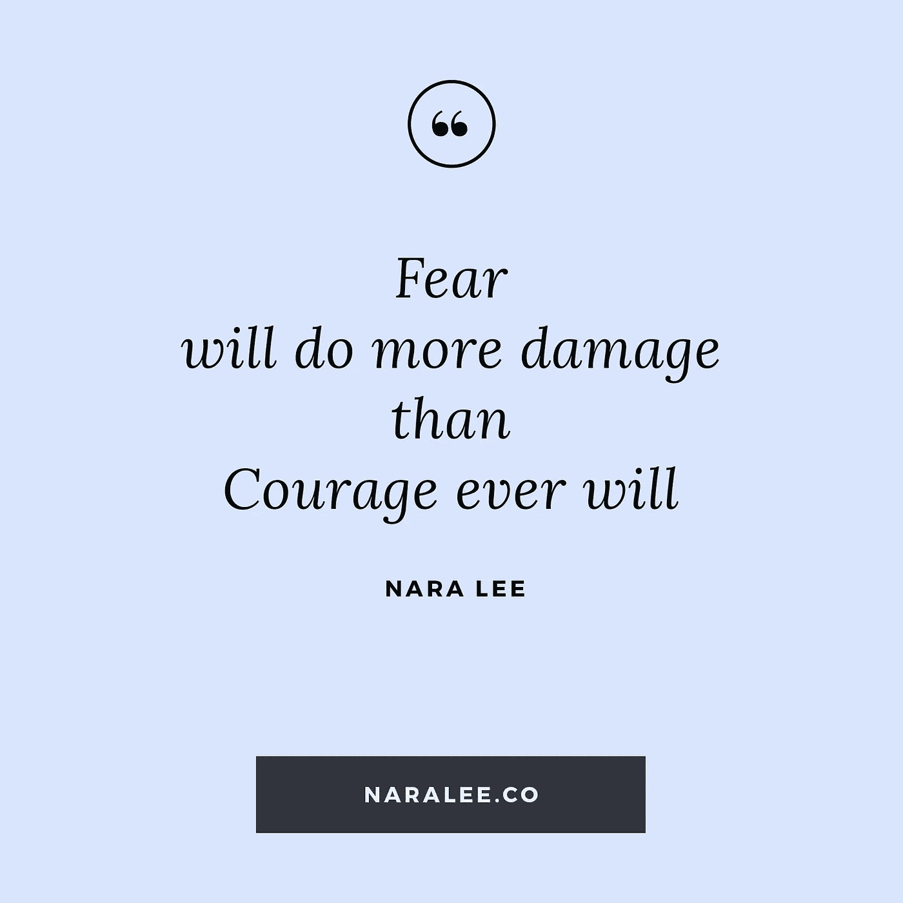

# 恐惧:克服恐惧的 1 分钟方法

> 原文：<https://medium.com/swlh/fear-a-1-minute-fix-to-overcome-your-fears-aa0f28576e64>

在生活中，我们在任何时候都只有两种选择:恐惧或爱；恐惧还是勇气。

我不认为每个人都免于恐惧，但是当我们因为恐惧而行动时，我们必须学会观察自己，抓住自己。

因为在你的生活中，恐惧会比爱和勇气造成更大的伤害。

因此，总是问:我的行为是出于爱还是恐惧？

我是不是让恐惧阻止了我，控制了我的生活，让我瘫痪了？

因为恐惧总是比勇气造成更大的伤害，你必须不顾恐惧去行动，永远选择勇气，听从你的内心。即使你害怕。

# 如何识别恐惧是否在主宰你的生活或你的行为和日子？

你总是直觉地知道什么是最适合你做的。理性的头脑会干预，告诉你为什么不应该这样做，甚至告诉你为什么应该保持原样。

要认识到恐惧，试着走出自己。

你坐下，说要写一份报告。或者做一些事情，这些事情的成功会改变你的生活。或者去做一些你害怕失败的事情。可大可小。没关系。

当你坐在那里的时候，**就在那一刻看着你自己**，就像你是一架无人驾驶飞机。你真的必须在行动中抓住自己——你在拖延吗？除了那一件事，你是否在寻找无数的理由去做其他的事情？在逃避去做你的内心多年前就已经召唤你去做的事情吗？

观察自己，像妈妈对孩子，或者爸爸对孩子一样，问一句:你这么害怕什么？字面上的询问和思考。

然后看看其他人成功跳跃的例子，那些不顾恐惧行动的例子，或者那些做了你害怕做的事情的例子。

看看**对他们生活的积极影响和结果。**

现在把它与你因恐惧或害怕失败或成功而瘫痪的结果相比较。

恐惧总会带来伤害。

无论理性与否，跟随你的心，你的直觉，做你觉得被引导去做的事情，或者你知道会给你的生活带来积极结果的事情。即使你害怕。你必须跳。现在。

# 关于作者

[Nara Lee](http://www.naralee.co) | [Facebook](https://www.facebook.com/naralee.co/) | [Instagram](https://www.instagram.com/naralee.co/)| [LinkedIn](https://www.linkedin.com/in/naramlee/)|

奈良·李是一位精神导师、社会企业家和艺术家。她通过她的通灵信息、书籍和课程，帮助人们觉醒到他们的生活目标和他们真正真实的自我，以达到有目的的成功。她的精神教导是实用的和可操作的，消除了许多模糊性，使生活中许多重要的主题变得清晰。

此前，奈良曾担任一家国际房地产公司的首席执行官和董事总经理，之前是高纬物业的经理。她在国际豪华房地产和旅游专业领域拥有超过 12 年的经验，代表各种国际房地产开发商和基金管理的项目通常从 2 亿到 10 亿以上。奈良毕业于商业管理(旅游)和性别与女性研究和社会转型专业。

# 与奈良李联系:

女:www.naralee.co

我:【https://www.instagram.com/naralee.co/】T2

福:https://www.facebook.com/naralee.co/

https://twitter.com/naralee_

https://www.linkedin.com/in/naramlee/

## 这篇文章发表在 [The Startup](https://medium.com/swlh) 上，这是 Medium 最大的创业刊物，拥有 284，454+人关注。

## 在此订阅接收[我们的头条新闻](http://growthsupply.com/the-startup-newsletter/)。

