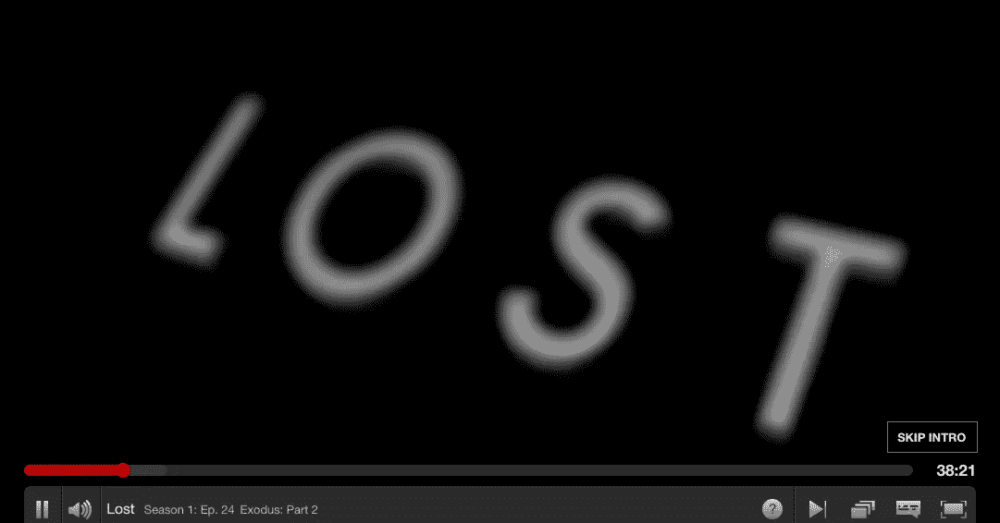
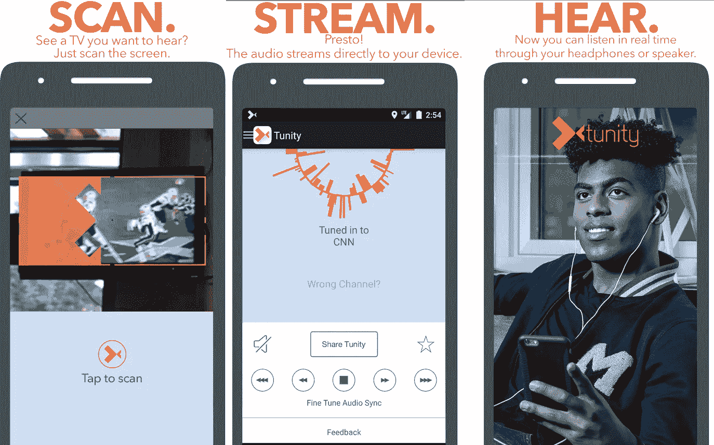

# 功能拆卸:网飞的“跳过介绍”

> 原文：<https://medium.com/swlh/feature-teardown-netflixs-skip-intro-15cac114a136>

网飞推出了一个惊人的功能，允许观众跳过他们最喜欢的节目的介绍。这将为他们节省大约 30 秒，但在疯狂观看的过程中，这一时间会越来越长。有趣的问题是——“他们是如何大规模实现这一目标的？”让我们深入研究几个可能的解决方案。

## 人类标记

也许有一个悲伤的员工会进去看所有的网飞秀，并记下介绍开始和结束的时间。极不可能。截至 2017 年，网飞有[1.1 亿会员](https://expandedramblings.com/index.php/netflix_statistics-facts/)，还有一点点低于 [7k 的头衔](https://www.quora.com/How-many-movies-does-Netflix-have/answer/Oriel-Bawl?srid=uA8s)。那会成为一个非常可悲的实习生，并且可能导致关节炎。

## 机器学习

2009 年，网飞向一个开发团队颁发了 100 万美元的奖金，奖励其将公司推荐引擎的准确率提高了 10%的算法。 [Netflix 奖](https://www.wired.com/2012/04/netflix-prize-costs/)是一项公开竞赛，旨在评选最佳协同过滤算法来预测电影的用户评级，该算法基于之前的评级，而没有任何其他关于用户或电影的信息，即除了为竞赛分配的数字之外，用户或电影都没有被识别。

因为网飞是一家令人惊叹的技术公司，他们会利用群众的智慧来知道介绍何时开始和结束。他们将能够分析每周观看的 10 亿小时的视频，以了解人们何时跳过介绍。基于这一趋势，网飞将能够估计出介绍开始的时间(人们开始擦洗的地方)以及他们放下标记的地方是结束的地方。

## 屏幕抓取

[Tunity](http://www.tunity.com/) ，允许用户收听任何电视节目——即使是静音的。这项神奇的技术会扫描你正在观看的电视，并将其与正在播放的频道声音进行匹配。**神奇的是识别。** Tunity 将您传输到他们服务器的几秒钟视频与所有支持频道的视频进行比较。

The Office’s Opening Frame.

网飞利用 ML 的另一个方法是使用计算机视觉。让我们以精彩的节目《办公室》为例。办公室的[介绍](https://www.youtube.com/watch?v=LrBi4rX3TKg)持续约 30 秒，有着相同的开场画面。

如果算法总是在节目中寻找这一帧，它可以计算出介绍开始的时间，然后知道在 T+30 秒时让这个人下车。

## 音频识别

介绍的另一个组成部分是音乐。引子的音乐总是一样的。算法所要做的就是识别声音指纹。这是 Shazam 的工作方式。下面找到纸牌屋介绍指纹。

[House of Cards Intro](https://www.youtube.com/watch?v=9w-O60x1bYk)

这是办公室介绍。

[The Office Intro](https://www.youtube.com/watch?v=LrBi4rX3TKg)

总之，网飞有几种方法来识别节目介绍的开始和结束。上面提到的所有方法都利用了群体的智慧和/或计算机视觉。

**如果你喜欢这篇文章，你可能也会喜欢:**

 [## 外卖——定价(冰淇淋、Cups 应用程序、Classpass)

### 价格补贴必须 1)看起来是暂时的，2)是信用。补贴需要是暂时的，这样它将…

medium.com](/@Citadines_Group/takeaways-pricing-ice-cream-cups-app-classpass-6c0ae3c37080)  [## 如何成功/失败地制作一个“模仿”应用程序

### 一家成长中的白俄罗斯小公司

medium.com](/@Citadines_Group/how-to-succeed-fail-at-making-a-me-too-app-e8e53ed556c3)  [## 在位者与他们的颠覆者对冲

### 航空旅行中的对冲

medium.com](/@Citadines_Group/incumbents-hedging-with-their-disruptors-8743416c4d2) 

*如果你喜欢这篇文章的整体信息，请随时与我们联系。我们做演讲约会——*

**

## *这篇文章发表在 [The Startup](https://medium.com/swlh) 上，这是 Medium 最大的创业刊物，拥有 282，454+人关注。*

## *在此订阅接收[我们的头条新闻](http://growthsupply.com/the-startup-newsletter/)。*

**