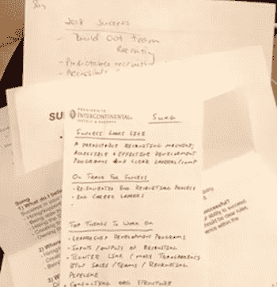
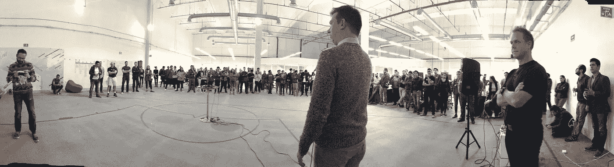

# 对未来的反馈

> 原文：<https://medium.com/swlh/feedback-for-the-future-4207728b231a>

# 如何在不伤害他人的情况下给出有价值的反馈

我 t 的年度计划时间和 [Wizeline](https://www.wizeline.com) 的执行人员组织了一次异地会议，以制定我们的 2018 年业务计划。对于团队建设，我们决定在会议的第一部分互相提供反馈，然后是“如果我是首席执行官，我会怎么做？”会话。

在一年中最重要的会议开始时，高管们互相给予反馈是有风险的，因为这会为一天的剩余时间，甚至可能为业务规划过程设定基调。几年前，我犯了一个错误，与一位顾问一起工作，他促成了一次与高层领导的反馈会议，会上我们使用了“停止-开始-继续”的方法。这个过程暴露出负面情绪，让参与者感到震惊、愤怒、困惑或被背叛。一些人在会议的剩余时间里心不在焉，对收到的一些批评无法释怀。

停止-开始-继续的方法可能就像[表扬三明治](http://lexicon.ft.com/Term?term=praise-sandwich)一样无效。你实际上是在强调两种批评:有人需要*停止*做的事情(因为它们让你或其他人发疯)和有人需要*开始*做的事情(事实上他们还没有开始也让你或其他人发疯)。积极的反馈，或者人们应该继续做的事情，在这种开放式的反馈三明治中丢失了。

我不想再次失败，所以在设计反馈框架之前，我首先考虑了我们会议的目标和期望体验(以及残余情绪)。本次会议的目标是:1)继续建立一个有凝聚力和透明的领导团队，2)让彼此成功(从而帮助我们公司成功)，3)在创造反馈文化方面成为公司的榜样。

我们中的一些人是激进坦诚方法的粉丝，但我感觉我们需要一种更令人振奋的体验和前瞻性的设计，因为我们正在为接下来的一年做计划。此外，我们的角色在过去几个月里发生了变化，我们需要一个机会让每个人在提供反馈之前了解我们的职责。

以下是我们使用的框架，我们为对方回答了三个问题:

***1。我认为 2018 年对你来说，你的成功是什么样的？***

这和“如果我是你，我会怎么做”不是一回事。这个问题提供了一个机会来陈述和阐明对彼此成功的期望和愿景，无论是对个人还是对他们的工作职能。重要的是首先确定*你对什么*提供反馈——或者成功应该是什么样的。想象一下，当你第一次尝试骑自行车时，你从来没有见过这样做，有人说“不是那样，是那样，等等。”直到你骑车成功。理解某人对成功的愿景(并就此达成一致)允许你提供反馈。

**2*。我相信你在哪里走向成功？***

这个问题是关于为了取得成功什么在起作用的积极反馈，而不是一般的或模糊的积极反馈。

***3。我认为要想成功，你最需要努力的是什么？***

这一部分可以指出需要改进的地方，但它的设计方式是，反馈者必须关注这个人从现在开始需要做什么，而不是他们还没有做什么。

请注意，这个框架中没有处理错误的内容。是因为每个人都会犯错，没有人能改变过去。由于我们的管理团队每天都有站立会议，每周都有一对一的会议，所以我们有很多机会互相提供持续的反馈，这样我们就可以快速纠正方向。此次异地会议反馈会议的目的是将我们的努力集中在未来最重要的行动上。

开会前，我要求每个人准备一张纸，上面有对以上三个问题的回答。在两个小时的会议中，我们两人一组，面对面膝盖对膝盖坐着，分享我们写的东西。在任何一群人中，你通常至少会有一个人没有阅读或遵循说明。在我们的小组中，有一个人没有完成他的准备工作，但幸运的是，他是一个快速的心理处理器和反馈爱好者，所以他能够有效地即兴发挥。

Feedback I received from my colleagues

每组会面 10 分钟——第一个反馈者有 5 分钟时间分享他们的笔记，反馈接受者有 5 分钟时间回应并提出澄清性问题。然后两人交换角色。十分钟后，我们轮换并组成新的组合。这个过程一直持续到每个人都有机会和另一个人配对。我们组里有一个奇数成员，所以每次轮换都有一个人担任计时器，这样每个人都扮演十分钟的计时器。

这是如何结束的？对我来说，我特别担心会从一位高管那里得到反馈。在过去的几周里，我可以看出他在会议上对我很失望。我以为这是因为我和他对事情应该如何做有不同的看法。当轮到他给我关于我需要做些什么才能成功的反馈时，他深吸了一口气，说道:“在分享你对我的部门的看法之前，我需要你问我更多的问题。”他本可以谈谈我哪里惹恼了他，但没有必要；我们都知道最近的互动有些不对劲。他的话没有酝酿我在哪里犯了错误，而是激励我专注于我需要做些什么来成功地*和*他，我们公司的一个重要领导。

对于另一个人，在我们浏览了彼此的反馈后，我们有了更多的时间，并开始谈论我们一直面临的个人挑战。这种更深入的对话之所以成为可能，是因为反馈框架建立了一个安全的环境，在这个环境中，我们可以轻松地谈论工作之外可能影响我们工作的事情。

在为期两天的异地活动结束时，我们举行了市政厅会议，并分享了我们 2018 年业务重点以及反馈活动的亮点。一位高管向我们的员工透露，他得到了关于他的组织需要如何与另一个组织更好地沟通的反馈。他用真诚的语气陈述了他解决这一重要需求的责任，这是许多员工在我们的员工参与度调查中已经表达过的一个需求。

像许多公司一样，我们拥有优秀的人才、创新的技术和成熟的发展记录。我们在 2018 年有大量的工作要做，但有了这种相互承诺的文化，我觉得我们已经为成功做好了准备。

Wizeline town hall

## 这篇文章发表在[《创业](https://medium.com/swlh)》上，这是 Medium 最大的创业刊物，有 271，813+人关注。

## 在这里订阅接收[我们的头条新闻](http://growthsupply.com/the-startup-newsletter/)。

