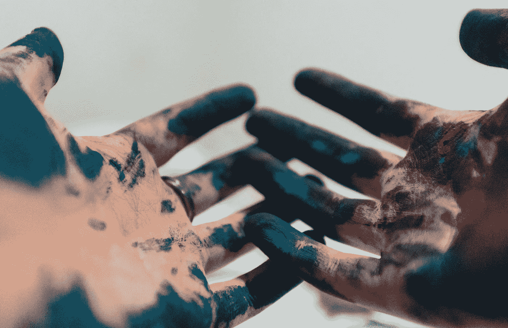
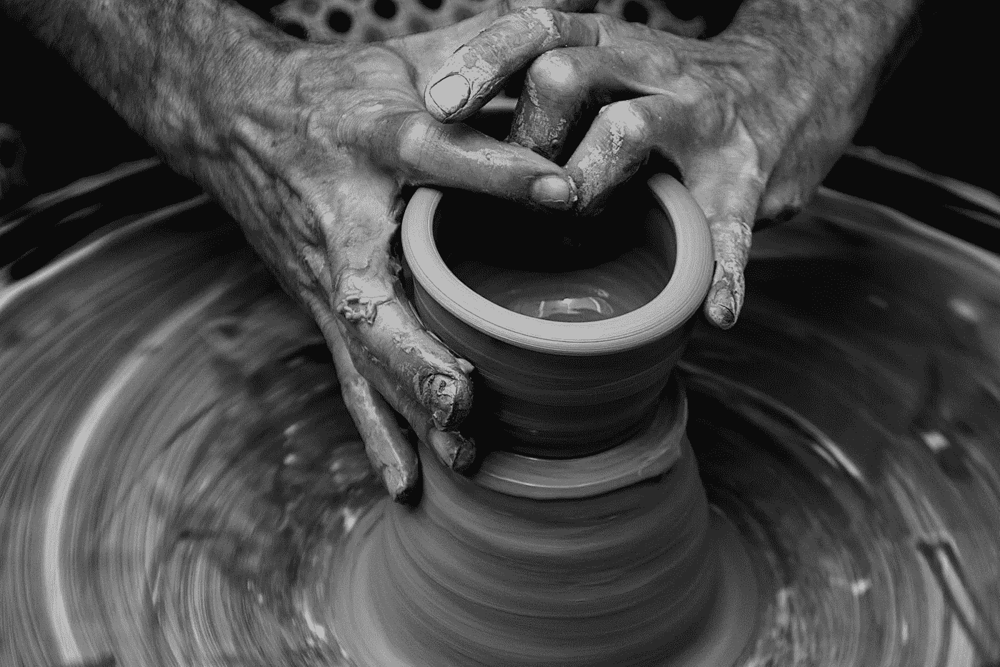

# 感觉没创意了？如何在想象力耗尽前给它加油？

> 原文：<https://medium.com/swlh/feeling-less-creative-43aa1a6e5534>

Photo by [Amaury Salas](https://unsplash.com/photos/IhXrWDckZOQ?utm_source=unsplash&utm_medium=referral&utm_content=creditCopyText) on [Unsplash](https://unsplash.com/search/photos/draw?utm_source=unsplash&utm_medium=referral&utm_content=creditCopyText)

这些天来，我们大部分的创造能量直接从我们身体流出，进入电脑。我们的手能做的远不止打字和点击，但我们几乎总是把它们限制在处理电子设备上。

如果你陷入了创作的窠臼，那可能是因为你被困在了 2D 不自然的光芒中。即使有最先进的艺术家应用程序，使用技术也意味着你的手没有机会像在纸上写字、在速写本上画画、用粘土雕刻等那样与你的艺术作品互动。

当然，从技术上讲，创造力发生在我们的大脑中，但是我们用手进行艺术创作所获得的感觉是独特的。与我们周围的世界互动激发我们去感受——无论是身体上还是情感上。在创造性思维中与物体进行身体上的互动可以磨练你想象力的手眼协调能力。

看起来创造力的秘密是喝你的咖啡，听你的生产力播放列表，然后坐在键盘前。(这可能是事实)但是太多的例行公事意味着你的创造力有变成例行公事的风险。常规创意变成了陈腐的创意，没人想要。

三月的一天，我觉得我的写作不再是一种创造性的努力，而是一件苦差事——就像写一系列公式化的高中论文(坦白地说，我在高中时并不擅长)。我总是因为不遵守规则而被扣分。今年，我花了很多时间阅读成功的博客，试图找出他们成功的公式，而不是享受寻找自己成功的过程。

Photo by [Demi DeHerrera](https://unsplash.com/photos/_AhXImeU0eo?utm_source=unsplash&utm_medium=referral&utm_content=creditCopyText) on [Unsplash](https://unsplash.com/search/photos/cactus?utm_source=unsplash&utm_medium=referral&utm_content=creditCopyText)

一次沙漠之旅帮助我发现了我的问题和解决方法。住在一个没有无线网络的房子里，我们认为我们应该去镇上上网。但是一个特殊的事件吸引了大量的人群，这个小镇成了一个动物园。所以，我们决定不去抢咖啡店的 wifi。

相反，我离开了 wifi 和作为其载体的屏幕。我发现，从技术引发的创造性休眠中醒来，休息一下正是我所需要的。远离屏幕重新激活了我高度敏锐的个性和我在现实空间中创作的欲望。

沙漠中一个下雨的早晨，我坐在窗前，欣赏着窗外的景色。我写下了我所看到的一切，用的是被景色所启发的修饰过的语言。

最终结果不是我能用的任何东西——它太花哨了。但是，我带着一种与自然的重新联系(尽管在暴风雨中被困在里面)和一种我很久没有在写作中感受到的嬉戏离开了。

在旅行的剩余时间里，我用电脑上的时间来代替我的双手——创作一些看起来真实有趣的东西，激发了我写作的新想法。

离开电脑、平板电脑或手机会让人精力充沛。你不必像我一样休息几周，但我会建议你休息一天，看看你感觉如何。

不要为了娱乐而检查你的手机，创造一些东西。使用你能感觉到的材料。写在纸上是好的，但更好的是从你的舒适区中挣脱出来，做一些你没有尝试过或者很久没有做过的事情。

Photo by [Quino Al](https://unsplash.com/photos/xEy9QNUCdRI?utm_source=unsplash&utm_medium=referral&utm_content=creditCopyText) on [Unsplash](https://unsplash.com/search/photos/sculpt?utm_source=unsplash&utm_medium=referral&utm_content=creditCopyText)

# 需要一个激发创造力的活动来让你开始吗？

这些活动的妙处在于，产品不一定非得是杰作！这些事情只是一种延伸和激活你的创造性大脑的方式，当你进行日常的创造性活动时，你的创造性大脑没有得到开发。

## 几乎不需要设备:

*   在房间里跳舞
*   不用菜谱做一些你从来没有做过的东西
*   乱涂
*   用纸和笔，用你不习惯的方式写(例如诗歌或创作短篇小说)
*   用意想不到的色调给图片上色

## 需要一些设备:

*   不用图案编织/钩编某物
*   雕刻一个迷你像
*   用乐高或林肯原木搭建一个建筑
*   用建筑用纸、剪刀和胶棒制作一张卡片
*   画一幅画
*   剪贴簿/写在相册里
*   用人行道粉笔画画
*   用木头建造某物

尝试不同形式的创造力可以拓展你的想象力。这种方法带你走出并挑战你的创造力的常规过程。有无穷无尽的选择，这可能是压倒性的。

## 开始的最佳活动是什么？

跳舞！让你的整个身体发挥创造力，不需要其他供给。不要做例行公事，只是扭动身体，感觉自己很傻/性感/快乐/性感/有联系。你的整个身体越有创造力越好。

Photo by [Javier Allegue Barros](https://unsplash.com/photos/Kr3Ls8Tw8h4?utm_source=unsplash&utm_medium=referral&utm_content=creditCopyText) on [Unsplash](https://unsplash.com/search/photos/dance?utm_source=unsplash&utm_medium=referral&utm_content=creditCopyText)

## 喜欢这个故事？接下来看看这个！

 [## 如何免费支持你的媒体作家

### 媒体作家朋友和家人的共享指南

medium.com](/swlh/how-to-support-your-medium-writer-for-free-71ad94a78787) 

*感谢阅读！我写关于非常规旅行、写作、科学等等的故事！* [*跟随*](/@alishearman) *阅读关于在异国他乡与陌生人一起生活，为石油公司工作，在马背上放羊，在世界上最昂贵的一些国家靠区区 2750 美元生活五个月。*

## 这篇文章发表在 [The Startup](https://medium.com/swlh) 上，这是 Medium 最大的创业刊物，有 312，822+人关注。

## 在此订阅接收[我们的头条新闻](http://growthsupply.com/the-startup-newsletter/)。

