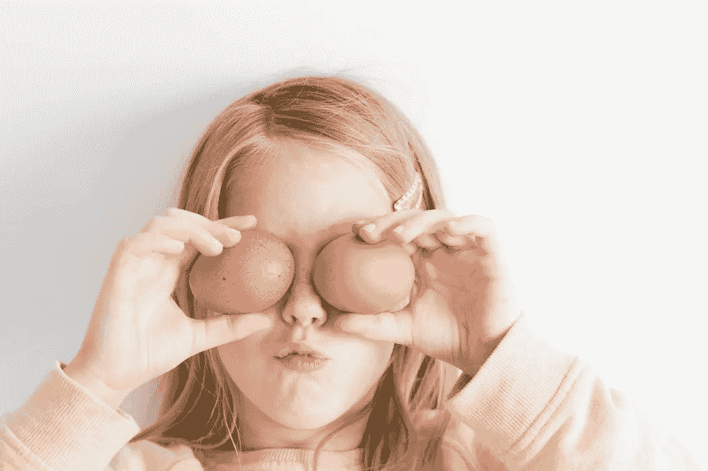

# 感觉卡住了？回答这个问题

> 原文：<https://medium.com/swlh/feeling-stuck-answer-this-question-efd7ad0e7985>

Photo by [Hannah Tasker](https://unsplash.com/photos/ZBkH8G4_yyE?utm_source=unsplash&utm_medium=referral&utm_content=creditCopyText) on [Unsplash](https://unsplash.com/search/photos/child-playing?utm_source=unsplash&utm_medium=referral&utm_content=creditCopyText)

当我 11 岁的时候，我和我的三个朋友创办了一本体育杂志。

我们会在我的阁楼上喝着根汁汽水，用我妈妈的台式电脑写文章。

每个月我们都会把它们打印出来，钉在一起，卖给邻居。我们甚至以折扣价将它们作为月订阅出售(我想我还欠我阿姨几个月的杂志)。

我们一心想把 ESPN 从“世界体育领袖”的位置上拉下来

当我玩体育视频游戏时——比如《劲爆橄榄球 2001》——我总是选择“主人模式”。我更感兴趣的是交易球员，确保门票销售高，而不是实际玩游戏。

我是个古怪的孩子。

詹姆斯·阿尔图切最近经常告诉人们做他们小时候喜欢的事情。我觉得那很有趣。

所以当我采访艾莉·麦基时，我问了她同样的问题。

"你八岁的时候喜欢做什么？"

从很小的时候起，Alli 就喜欢做艺术。她小时候会画米老鼠并创作动画书——这可能是对她父母的一种反叛，她的父母都是律师。

在大学里，她会在弗吉尼亚大学的校园里制作漂亮的杯垫，卖给校友。

但她并不总是追随这种激情。

她在贝恩公司做了多年顾问，然后在南非教授企业家领导力课程。

但是缺少了一些东西。她没有创造力。

她追根溯源，创立了 [Stick.ai](http://www.stick.ai/) ，这是一个公司用来与客户联系的可视化交流平台。

她热衷于通过图像帮助人们联系。

小时候，我喜欢写作。我喜欢有创造力。我喜欢在外面玩。我特别喜欢销售和尝试创业。

这就是我今天要做的。早些时候，我去外面跑步。现在我为你写这篇文章。明天我将去做销售工作。

那么，你小时候做了什么？

列个清单。

你画画了吗？你在外面玩了吗？你用简易烤箱做饭了吗？

今天，在你自己的世界里寻找一种方式去追随那种激情。

如果你得到报酬的话还会有加分。

# 想要加快你的个人发展吗？
[在这里报名我的简讯](http://eepurl.com/c-46aj)

# 关于作者

汤姆·阿莱莫 *是一位充满激情的 B2B 销售专家。他目前是* [*TR Talk 播客*](https://soundcloud.com/ryan-warner-799706255) *的主持人，在这里他帮助千禧一代快速跟踪他们的个人发展。Tom 也是 TechTarget 的客户经理，住在旧金山。*

[网站](http://tomalaimo.com/) | [播客](https://soundcloud.com/ryan-warner-799706255) | [邮箱](mailto:thomasalaimo7@gmail.com) | [推特](https://twitter.com/TomAlaimo_TTGT)|[LinkedIn](https://www.linkedin.com/in/tom-alaimo-573a1878/)|*|*|[脸书](https://www.facebook.com/thomas.alaimo.12) | [Instagram](http://instagram.com/talaimo7) | [媒体](/@TomAlaimo_TTGT) |

## 这篇文章发表在 [The Startup](https://medium.com/swlh) 上，这是 Medium 最大的创业刊物，有 320，131+人关注。

## 在这里订阅接收[我们的头条新闻](http://growthsupply.com/the-startup-newsletter/)。

