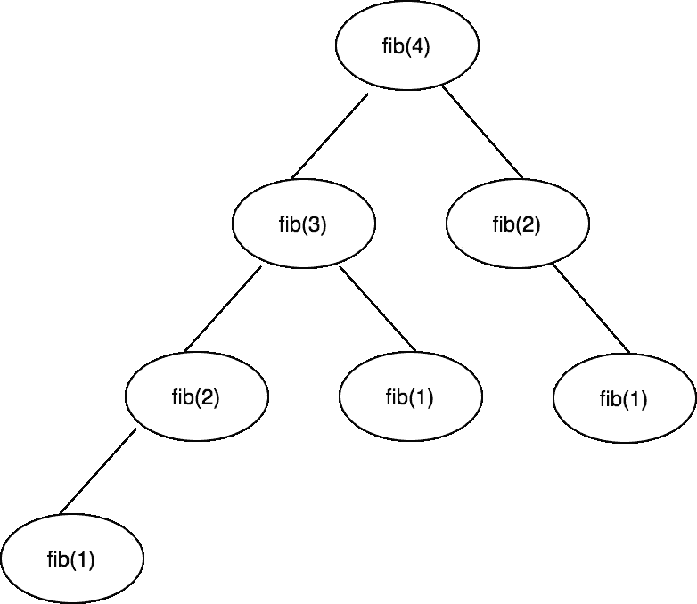
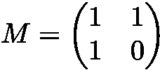
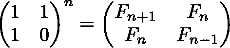

# 斐波那契斯威夫特游乐场

> 原文：<https://medium.com/swlh/fibonacci-swift-playground-f56d1ff3ea99>


Golden Ratio: two quantities are in the [**golden ratio**](https://en.wikipedia.org/wiki/Golden_ratio) if their ratio is the same as the ratio of their sum to the larger of the two quantities

假设你站在一个有`n`级楼梯的楼梯前。你可以一次走一两级楼梯。你能达到顶峰的不同方法总共有多少种？

如果我们知道到达`n-1`和`n-2`的路径数，那么到达点`n`的总路径就是这两个值的和。这实际上与计算斐波纳契数列的第`n`个数字是一样的。在这里，我试图提出不同的方法来解决斐波那契问题，其中包括算法比较，以及围绕时间和空间复杂性的讨论。

## 递归方法

我们可以从递归方法开始。假设我们已经知道所有以前的数字是什么，那么不言而喻，当前数字是最后两个数字的和(自上而下的方法)。

```
func fib(_ n: Int) -> Int {
    guard n > 1 else { return n }
    return fib(n-1) + fib(n-2)
}
```

*时间复杂度:O(2^n)
空间复杂度:O(2^n)*

这种解决方案的问题是我们不断地重复计算同样的子问题。换句话说，我们的算法做了大量重复的工作。这个算法呈指数增长，特别是当`n`很大的时候，它需要很大的努力。



Recursion tree for fib(4)

## 迭代方法

这种方法来源于相同的想法，但稍有改动。如果我们将所有的值存储在一个数组中以备将来使用，我们就避免了冗余工作。每当再次调用该函数时，该函数直接返回来自 *memo* 数组的结果。

```
func fib(_ n: Int) -> Int {
    var fibs: [Int] = [1, 1]
    (2...n).forEach { i in 
        fibs.append(fibs[i - 1] + fibs[i - 2]) 
    }
    return fibs.last!
}
```

*时间复杂度:O(n)
空间复杂度:O(n)*

通过对算法的小小改动，我们做了巨大的优化。举例来说，`n = 45`需要 90 步(而我们的递归方法需要 10 亿步)，大约快了 1000 万倍。

## 迭代方法—优化

我们不需要存储整个数组。我们只需要最后两个值:

```
func fib(_ n: Int) -> Int {
    var a = 1
    var b = 1
    guard n > 1 else { return a }

    (2...n).forEach { _ in 
        (a, b) = (a + b, a) 
    }
    return a
}
```

*时间复杂度:O(n)
空间复杂度:O(1)*

在 *for 循环中，*我们给`a`和`b`赋值(元组的美丽)。如果你注意到等式`(a, b) = (a + b, a)`是黄金比例的精确定义。

## 矩阵方法的力量

让我们假设矩阵`M`为:



为了得到第`n`个斐波那契数，矩阵 M 必须乘以自身的`n-1`倍，并形成`n-1`次方:



Fibonacci closed-form expression, *Binet*’s formula

假设我们有一个很棒的方法`multiply`，它将两个矩阵相乘并返回一个结果矩阵，算法就像这样简单:

```
func fib(_ n: Int) -> Int {
    guard n > 2 else { return n }

    let M = [[1, 1], [1, 0]]
    var result: [[Int]] = M
    (1..<n).forEach { _ in result = multiply(result, M) }
    return result[0][0]
}
```

*时间复杂度:O(n)
空间复杂度:O(1)*

## 矩阵方法的威力—优化

为了形成矩阵`M`的`n`次方，我们不需要将它乘以自身的`n`倍。想法是这样的，假设你想计算 5⁸，最简单的方法是将 5 乘以 8。更好的方法是重复平方并加倍指数:
5 = 25
25 =5⁴= 625
625 =5⁸= 390，625

正如你所看到的，这个[平方方法](https://en.wikipedia.org/wiki/Exponentiation_by_squaring)比原始方法使用了更少的乘法(三对八，换句话说，减少对数)。同样的想法也适用于矩阵:

```
func fib(_ n: Int) -> Int {
    var M = [[1, 1], [1, 0]]
    guard n > 2 else { return n }
    power(&M, n)
    return M[0][0]
}func power(_ matrix: inout [[Int]], _ n: Int) {
    guard n > 1 else { return }
    power(&matrix, n/2)
    matrix = multiply(matrix, matrix)
    if n % 2 != 0 {
        let M = [[1, 1], [1, 0]]
        matrix = multiply(matrix, M)
    }
}
```

*时间复杂度:O(log n)
空间复杂度:O(log n)，因为递归栈*

在上面的代码片段中，`power`函数试图通过平方`(n/2)`的次方来计算`M`的`n`次方。然而，如果 n 是奇数，向下舍入`n/2`并平方`M`的幂得到`(n-1)`的幂，再乘以`M`的一个因子将构成该单个因子。这肯定是我们可以用来得到第`n`个斐波那契数的最快和最优化的算法。

你可能会问`inout`关键字或`&`符号，这些在我们的算法中并没有真正发挥任何重要作用。为了提高性能，他们只是让我们通过递归堆栈传递矩阵引用。如果您有兴趣了解更多信息，请查看 Swift 中的[值类型与引用类型。](/@m.tabrizi/value-types-vs-reference-types-in-swift-87568a56e0e2)

如果你有任何建议，请让我知道，并随时留下您的评论。你可以在这里找到这篇文章的所有代码。

# 进一步研究:

[斐波那契数列](https://www.ics.uci.edu/~eppstein/161/960109.html)
[斐波那契数列程序— GeeksforGeeks](https://www.geeksforgeeks.org/program-for-nth-fibonacci-number/)
[更简单的斐波那契拼图](http://www.maths.surrey.ac.uk/hosted-sites/R.Knott/Fibonacci/fibpuzzles.html)

*这篇文章是写给亚历克斯·斯米尔诺夫的，他总是激励人心*


## 这篇文章发表在[《创业](https://medium.com/swlh)》上，这是 Medium 最大的创业刊物，有 281，454+人关注。

## 订阅接收[我们的头条新闻](http://growthsupply.com/the-startup-newsletter/)。

