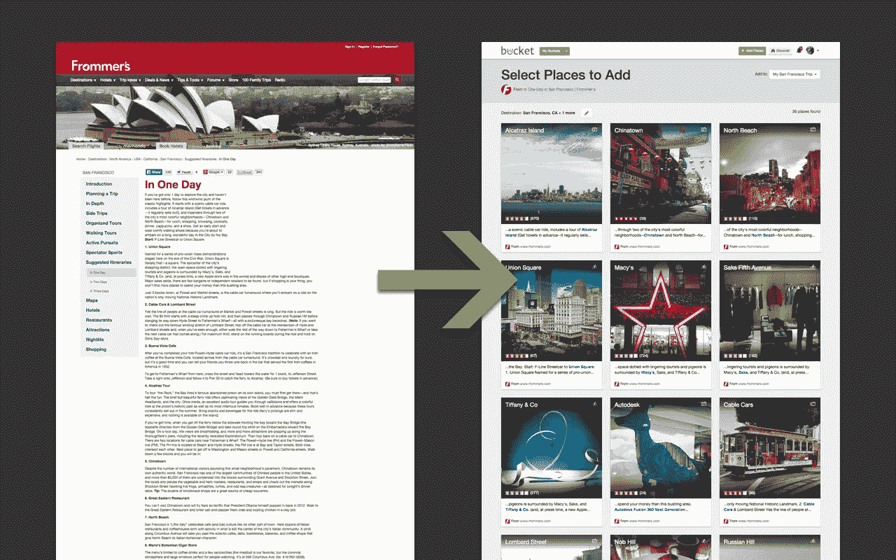
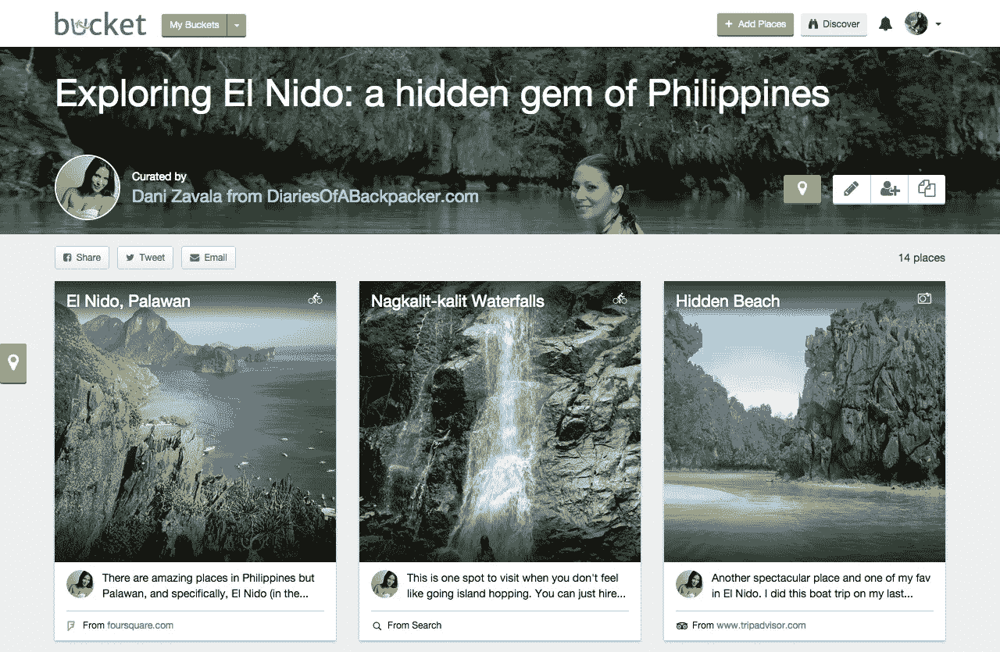
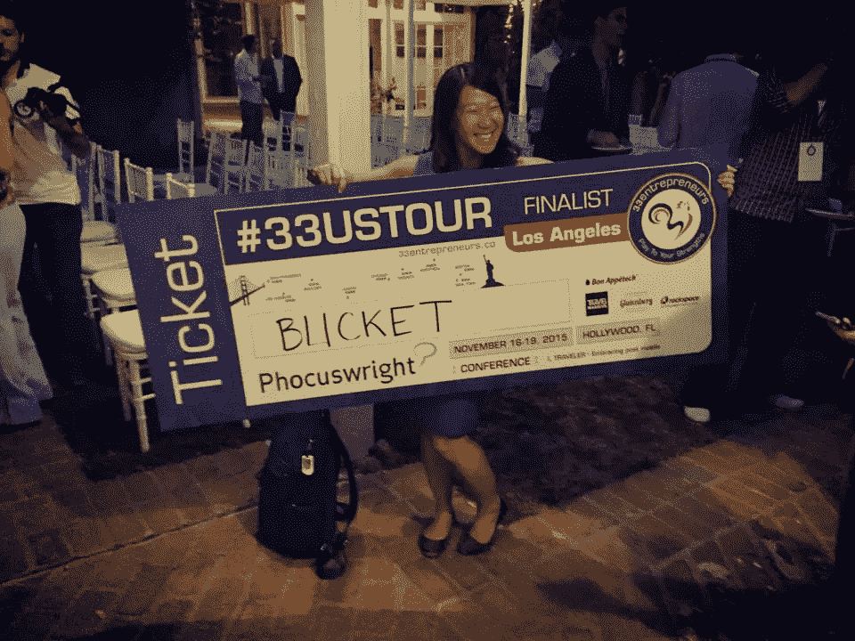
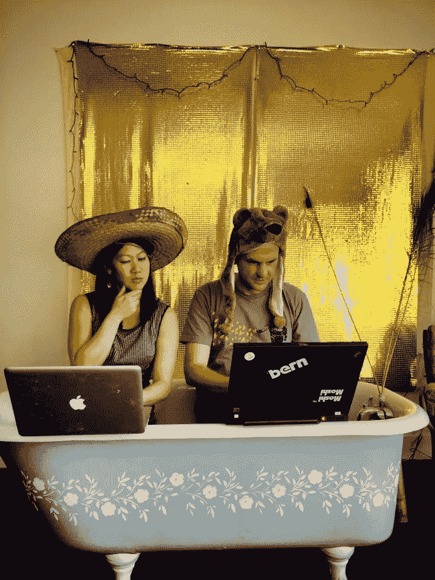

# 和水桶一起努力开灯。

> 原文：<https://medium.com/swlh/fighting-to-turn-the-light-on-with-bucket-2f8a4b7418c8>

## 我们创业经历的回顾。

今天是结束的开始，也是开始的结束。我们[宣布](/@JuliaLam/discontinuing-bucket-3-23-b9d6c34ae126#.lu994wgcb)我们将关闭 [Bucket](http://www.likebucket.com) ，这是一家创新的旅行规划初创公司，我已经为其工作了近三年。

在这样的日子里，我总是认为反思并与其他可能选择类似旅程的人分享我们的经验是有帮助的。*最初是什么激发你产生了这个疯狂的想法？我们是怎么到这里的？发生了什么事？*

Sunset at Nusa Lembongan, Bali

## **想法**

对于那些不熟悉[桶](http://www.likebucket.com)的人，我们允许你从任何文本来源收集旅行想法，将其与任何其他需要做出决定的信息汇总，然后出发。

我们最初的灵感来自朋友们在脸书的帖子，寻求推荐。像这样的帖子:“我要去巴黎一周，我喜欢高端的住宿、表演和漂亮的餐馆。我该怎么办？”了解请求者品味并去过巴黎的人会提供精心策划的建议。这些不是你从《孤独星球》或猫途鹰页面上得到的一般建议。这些建议是个性化的，与众不同的，为接受者量身定做的。他们是最好的建议。

我们想，点击几下鼠标就能获得潜在旅行的所有信息，利用我的社交图，绘制建议，判断它们是否排名靠前，并决定现在就去，这不是很棒吗！

我们建造了它。

我们创造了一种技术，可以扫描任何类型的文本来源，添加你需要决定和前往的所有其他信息(照片、评级和评论)，它在地图上的位置，你可以在任何移动设备上随身携带。

它是小众的，但它是被欣赏的。人们总是向我们索取更多。

## **发生了什么？**

当任何一家创业公司关门时，我想人们总是想知道它发生了什么。以下是我对 Bucket 发生的事情的一些想法，以及如果我再试一次，我们会有什么不同的做法。

人们喜欢这个概念。他们只是没有使用产品。

人们喜欢 Bucket 对我们所做事情的概念。每当我们演示时，人们都会为我们着迷——这种体验是不可思议的。Airbnb 和脸书使用了我们，所有大型连锁酒店都有兴趣进行试点。

我们赢得了竞标，我们得到了资金，我们有了合作伙伴，并赢得了大量的媒体关注。*我们所做的是革命性的。但问题是，当我们查看指标时，人们很少使用我们的解析器。*

人们说他们想要一种简单的方式来收集信息和计划旅行，但我们的使用表明他们真正想要的只是一个通过过滤发现独特旅行想法的地方。

**如果我再来一次:**

我会尽快在市场上推出限量版。我们分散了注意力，因为我们想从任何复杂的文本源中进行解析，即使是在一个小的物理位置——我们最初只在旧金山湾区推出。我们的国际版仅允许您从 Tripadvisor、Foursquare、Airbnb 和脸书购物中心省钱。这对大多数人来说已经足够了，也更容易解释。

我还会优先考虑我们在过去几个月才开始探索的一些工作——使用网络上的内容在我们的网站上创建一系列个性化的入门桶。由于覆盖全国需要很长时间，直到最近，我们才找到一种简单的方法来自动创建这些初始桶。但是如果我能从头再来一遍，我会让我们的团队在很久以前就创造它们。至少那样的话，我们就可以更早地让 Tripadvisor 在搜索引擎优化方面大赚一笔。

我们动作不够快。

我们从 2013 年 5 月就开始研究这个想法，从那年 9 月开始全职工作。当我们开始时，几乎没有人竞争成为你的自动旅行助手，也绝对没有人致力于旅行的文本到视觉翻译。旅游业一直都很拥挤，但是 Google Now 并没有提供太多的信息；Pinterest 没有可操作的数据；Airbnb 也没有试图涉足旅行规划业务。有一个机会。

我们在第一年多的时间里都在自举——部分原因是我可以提高我的设计和产品技能，而我的联合创始人可以专注于他不太熟悉的工程堆栈。也有一些生活上的障碍减缓了我们团队的进度。

Bucket’s founding team in our first co-working space in the Mission.

我们想在 3 个月内筹集资金，但不确定这是否可行，所以根据我更好的判断，我们等到我们的下一个版本上线。

像大多数产品一样，这比我们预期的时间要长。我们的小团队正在努力填补我们没有经验的一些职位，我们也没有资源在我们薄弱的领域招聘员工。

这项技术本身被证明是相当复杂的，测试一个我们伪造技术的异步版本在验证这个想法是否合理方面并不十分有用。

底线是，**我们错过了机会**。我们本可以第一个到这里的。事实上，人们有兴趣将一些基于文本的门房插入到类似 Bucket 的东西中，但我们只是发展得不够快，不够远。

**如果我要再做一次:**

事后看来，我几乎会立即加注，尽可能快地加速，并证明这是否行得通。技术发展很快。如果你不尽快行动，你脚下的风景将会改变。此外，如果你不能在头三个月加注，你很快就会失去加注的机会。

创业时间越长，也会产生磨损。这真的是一种韧性的练习，也是在被击倒后你愿意站起来多少次的练习。你做得越久，被击倒的次数就越多。使用最大量的资源更快地移动将减少这种磨损。

*踩油门，或者回家。*

我们需要一个更高级的团队。

由于我们的资金有限，我们总是试图让它延伸。我和我的联合创始人拿很少甚至没有薪水，当我们可以找到年轻聪明的人加入我们的团队时，我们经常带他们，因为我们觉得我们很难负担得起高级人才(也很难雇用，因为，你知道，硅谷)。尽管我们有许多聪明、年轻、有才华的人，但入职时间太长，需要太多资源。他们有好的想法，但很少有执行的经验。我们需要雇用能立即投入工作的专家。这些限制意味着我们不能按照我们需要的速度和质量进行构建。当我们在游戏后期失去一名高级技术人员时，我们挣扎着前进。

**如果我要再做一次:**

我会不惜任何代价雇佣最聪明、最资深的人。如果有人不在工作，我也会确保早点解雇他们。你想要一年 50 万美元加入我的团队，你很棒吗？是的，再来一次！你当然想要公司 10%的股份！如果你的团队中有资深成员，你将能够继续筹集资金，因为投资者会相信你会继续想办法。有了一个强大的团队，你也将有更好的机会进行收购。此外，如果有人拥有公司 10%的股份，他们会非常积极地让自己的股票增值。他们有激光聚焦，公司有更好的机会做到这一点。

## **我总体学到了什么**

创业是令人难以置信的痛苦，当你不成功的时候更痛苦。然而，它们是*不断教你新技能和了解你周围世界的最有效的工具之一。*创业是旅程，而不是目的地。

过去几年，我一直在琢磨这些关于一般创业经历的想法，所以今天我将分享它们。

**你甚至不认识的人都在为你加油。**

你常常觉得自己在创业中是孤独的——你在没有地图的情况下驾驶一艘船，你希望自己走的方向是正确的。但是我经常惊讶于其他人在给我们时间时是多么的亲切。专家们拿出时间来分享他们的专长并制定战略计划，企业家伙伴们拿出他们的战略、观点和同情，街上的随机人群给我们几分钟时间来帮助验证想法。

在我最需要的时候，我从我的人际网络和其他企业家那里感受到了如此多的同情和善意。几乎每个人都有一个故事，讲述他们在某个时候是如何站在我的立场上的，他们会抽出时间来帮助我，帮助我。

如果没有许多人的帮助，我们不可能建立起这家公司，他们花时间在调查中提出意见，比如《脸书邮报》，并试用我们的产品。

我非常感激过去三年来我们得到的所有支持。人们希望你赢。

**创业很辛苦。对于女性创始人和多元化团队来说就更难了。**

现在流行说你关心多元化，你资助更多元化的团队，雇佣更多元化的队友。在高峰期，我们团队的 7 名员工中有 4 名女性(57%)和 3 名男性(43%)。这种崩溃在科技初创公司中几乎是闻所未闻的。

我喜欢并支持这个想法，但据我所知，这实际上并不是风险投资基金或其他公司的优先选择。作为一名初创公司的女性创始人，是我做过的最艰难的事情之一。根据我的经验，我已经把它缩小到一个因素——作为一个女人，你没有被怀疑的好处。

在早期创业中，你唯一拥有的就是怀疑的好处。你有一个愿景，一个小测试的一些小度量，一个创始团队，以及让它实现的意愿、热血、汗水和泪水。

这就是女人输的地方。在麻省理工学院的一项研究中，他们最近进行了一项实验，参与者评估了一家新公司的视频宣传，其中使用了幻灯片、相同的脚本和男性或女性配音。*男性声音获得资助的可能性高出 40%。*

同样的想法。同样的音高。不同的资助机会。

在很大程度上，这不是有意的性别偏见。以我的经验来看，如果女性创办的创业公司有令人瞩目的指标，投资者会非常愿意为其提供资金。然而，如果投资者不得不大胆地做出判断，这是你在种子基金中经常要做的，这就是女性被欺骗的地方。

作为一名女性，这意味着做同样的工作，你往往会以更少的钱和更少的资源结束，从而减少你成功的机会，完成这个循环。

**未来 5 年，旅游将会被打乱。**

我们三年前看到的机会今天依然存在。有人会扰乱旅行——我认为这很快就会发生。我们正在进入一个几乎每个人都在移动设备上花费 260 亿美元旅行的时代，预计 2018 年将达到 680 亿美元。仅在美国，千禧一代就在旅行上花费了 2170 亿美元，他们将成为未来 5 年内最大的旅行群体。

Wifi、移动和社交将彻底改变旅行。最后，我们将进入这样一个世界:每一项服务都将密切了解旅行者，并根据他们的品味、时间表和愿望推送精心策划的推荐。

在过去的一年里，我们看到许多玩家进入了短信电子商务领域，从[脸书 M](http://www.wired.com/2015/08/facebook-launches-m-new-kind-virtual-assistant/) ，到[运营商，](https://www.operator.com/)到 [Pana](https://pana.com/) 。人们知道有机会在人们外出时联系他们，为他们提供个性化的体验，并让他们购买一些东西。

*我们的长期愿景是打造你的自动化旅行助手——这方面仍有空间。*人们仍然希望有一个基于一系列约束的计划，在旅途中预订，以及专门为你提供的个性化建议。

我仍然相信这将会发生。只是不会由我们来建造。

**那么我的下一步是什么？**

我的创业导师萨姆·奥迪奥曾经说过:“创业就像在漆黑的房间里摸索着寻找光明。你非常想打开它——并找到适合市场的产品——但是你不知道灯是否就在你旁边，或者在房间的另一边。你能做的就是继续尝试。”

对我们来说，这个“启动室”将保持黑暗，这场冒险将结束，但这只是意味着一个新的篇章开始。

这是一个艰难的时刻，但我知道我们已经尽了最大努力，所以我对这个决定感到平静。

我的下一个计划是去旅行几个月(惊喜！)，充值，刷新。我喜欢欠发达的国家，想在它们还相对落后的时候在一些地方呆上一段时间。缅甸、古巴和其他一些地方在我的名单上排在前列。我也接受建议。

现在我有了多余的时间，我还打算发布更多关于创业的博客文章，所以如果你想保持联系，请订阅。

之后又回到更大的公司。虽然我很感谢有机会从零开始建立自己的想法，但我很高兴能在产品、业务或上市方面为别人的想法工作一段时间。我很高兴能在我的强项上工作，并实际上是在一个“房间”里，灯是亮着的，我可以看到*。*

对我们所有的用户和支持者，感谢所有在过去几年里试用过[桶](http://Likebucket.com)的人。我们很感激，希望你喜欢。现在进入下一章。

*** * * 16 年 3 月 23 日更新*****

在我写完这篇文章后，事情发生了激动人心的变化，Bucket 被 Galavantier 收购了。我们在本该关闭的那天宣布了收购。

如果你想了解更多关于这部分旅程的信息，你可以阅读我的续作博文:[一篇关于你失败的创业公司的中等帖子的后果:被 Galavantier 收购的 Bucket。](/female-founders/the-aftermath-of-a-medium-post-about-your-failed-startup-792e3b4c7914#.bk4rznx9e)

感谢所有跟随并帮助实现这一目标的人。

