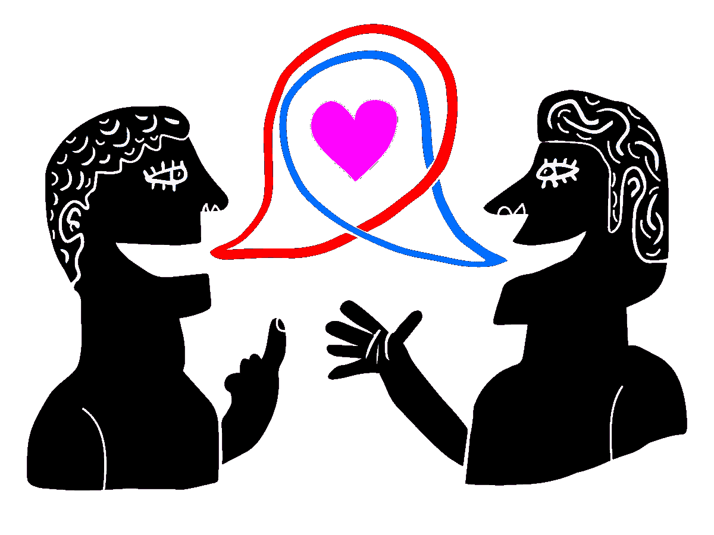
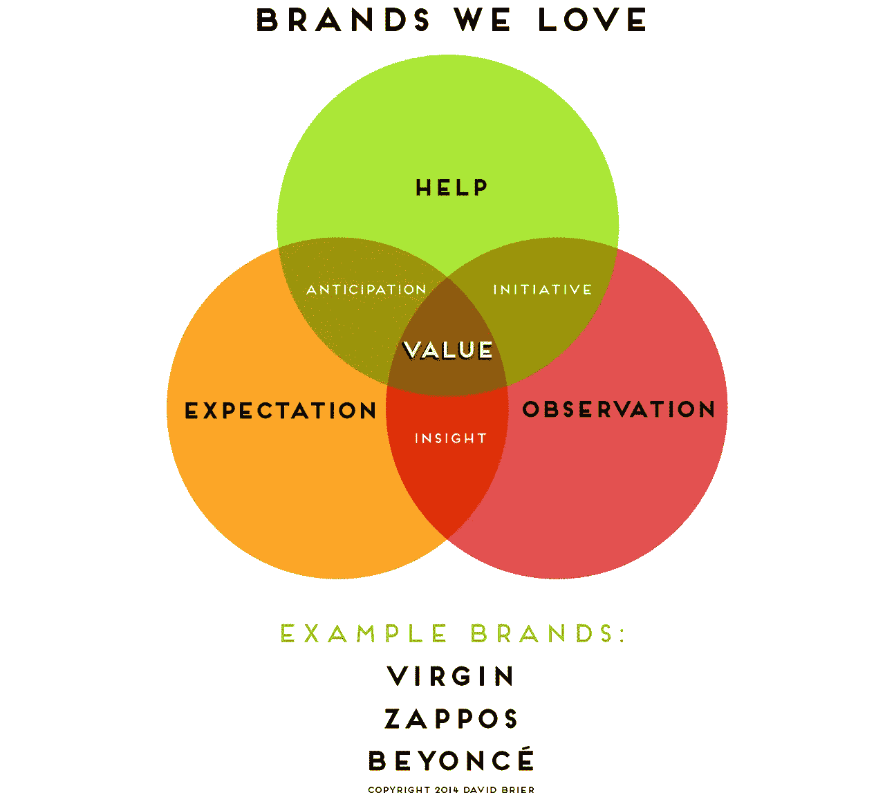
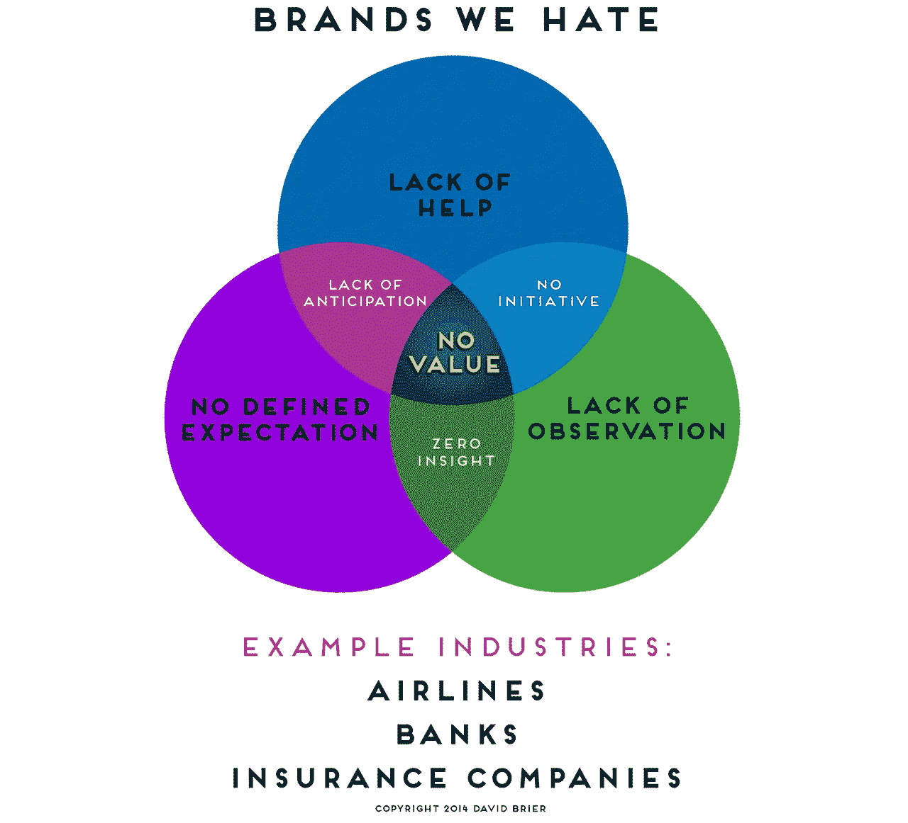

# (最后)破解我们喜欢(和讨厌)的品牌密码

> 原文：<https://medium.com/swlh/finally-cracking-the-code-on-brands-we-love-and-hate-c050928830d9>

*由* [**布瑞尔**](http://www.risingabovethenoise.com)

> Seth Godin 写道，
> “一个品牌的价值仅仅是人们愿意额外支付多少钱的总和，或者他们选择一个品牌的频率、期望、记忆、故事和关系。”

毕竟，有些品牌是我们作为消费者绝对喜爱的。
还有就是我们作为消费者的品牌 ***受不了*** 。

> 那么我们钦佩的人和我们鄙视的人有什么区别呢？

我们能做些什么来监控我们的品牌在这场爱与恨的战争中的走向呢？

以下是一些想法:

## 忙得没时间看

当品牌变得太大，忙于日常需求时，他们往往会得出一些无关紧要、毫无用处的结论。

一个例子是术语“品牌价值”,它经常成为远程管理人员关注的那些有问题的度量之一。它变成了一种测量模糊定义的练习。对一些人来说，这是收入；对其他人来说，这是一些模糊的消费者忠诚度指标，而对其他人来说，这是“这个星期我们有多少标签”…

这个品牌价值的问题是一个品牌衡量标准，同样作为一个品牌衡量标准出现在客户服务中。任何品牌的一个关键部分都是人性化的一面，利用品牌来强化品牌的意义，或者把它变成空洞的炒作，这是没有人喜欢或重视的。

为了帮助分离出对品牌监测其价值有用的东西，让我们看看作为品牌领跑者的客户服务，因为这有助于我们“看到”一个品牌如何真正增加价值，近距离和个性化。

毕竟，这是我们喜欢的品牌和我们讨厌的品牌之间的区别。

从上面我们可以看到，一个受人喜爱的品牌有三个关键组成部分:

> 救命啊，
> 
> 期望，以及
> 
> 观察。

这样的品牌通常会为顾客提供有用的帮助。这样一个品牌有一个明确的期望，员工的表现要满足顾客的期望。最后，这个品牌观察到，保持联系，信息和响应。这些都考虑到了另外三种品质:预期、主动性和洞察力。有了这些，品牌就提升为我们热爱和重视的品牌。

为了更好地理解这一点，下面的附图显示了当这些因素不存在时会发生什么。

上面我们看到一个不被喜欢或重视的品牌展示了三个关键品质:

> 缺乏帮助，
> 
> 没有明确的期望，并且
> 
> 没有观察到(甚至没有足够的兴趣去关心)。

由此产生的品质是缺乏对客户需求的预期，公司或其员工没有主动性，对客户需求一无所知，无论客户是否陈述了需求。

## 评估你的品牌

为了帮助消除非个人因素，给我们每个人一些我们可以控制的东西，试着这样做一周。让你的员工评估以下几点(你也可以问你的品牌):

*   ***今天我以某种方式帮助了多少人(即顾客、客户和潜在客户)？***
*   我接触到的人手中有多少有用的信息？
*   我对同事、同事、客户和供应商说过多少次谢谢？
*   ***今天我超出了多少期望？***
*   我对那些帮助过我的人以及我所依赖的人进行了多少次面对面的致谢？

> 你可以每天或每周记录，但无论哪种方式， ***这样做*** ，你会发现你的注意力集中在你能控制和监控的事情上。

通过这样做，增加满意度、价值、增长、消费者信心、权威和品牌卓越性的其他要点开始发挥作用。

具备上述条件后，拥有一个出色的视觉品牌标识，并使用引人注目的品牌词汇(例如，图像、设计、包装等)。)将做好合法和真实的工作(而不是仅仅粉饰一些伪装或损害客户体验)。

[大卫·布赖尔制作的信息图]

***像这样？*** *我邀请你跟随我上* [***中***](/@davidbrier) *和
也跟随我的新媒体出版:* [***成功品牌+颠覆性策略***](https://medium.com/successful-brands-disruptive-strategies)

*获得超过 320 个国家和国际设计和品牌认可和奖项，* [*大卫·布瑞尔*](http://whywebpr.com/davidbrier/index.php) *是一位获奖的品牌形象设计师，* [*作者*](http://www.risingabovethenoise.com/thebook/) *，以及品牌专家。他的* [*事务所的工作*](http://risingabovethenoise.com/) *赢得了同行和组织的赞赏，但更重要的是，帮助客户以新的和创新的方式启动他们的品牌，即使(尤其是)他们在以前的品牌改造中失败了。*

既然你已经读到这里，你可以免费索取一本 [*【幸运品牌】电子书*](http://risingabovethenoise.com/brand_leadership/) *。*

*原载于*[*www.fastcompany.com*](http://www.fastcompany.com/3024397/cracking-the-code-on-brands-we-love-infographic)

*发表于* **创业、旅游癖和生活黑客**

-