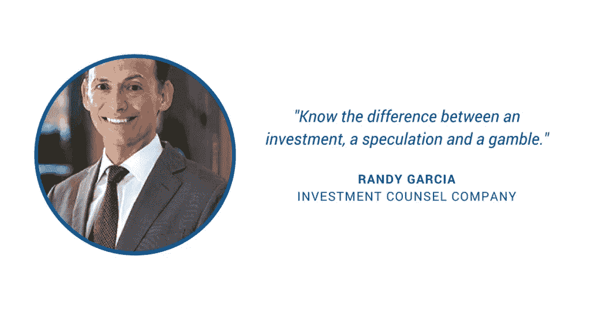
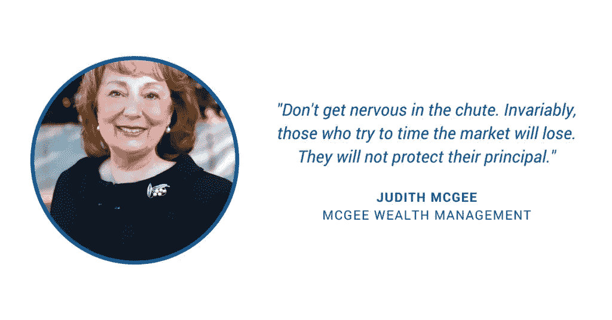
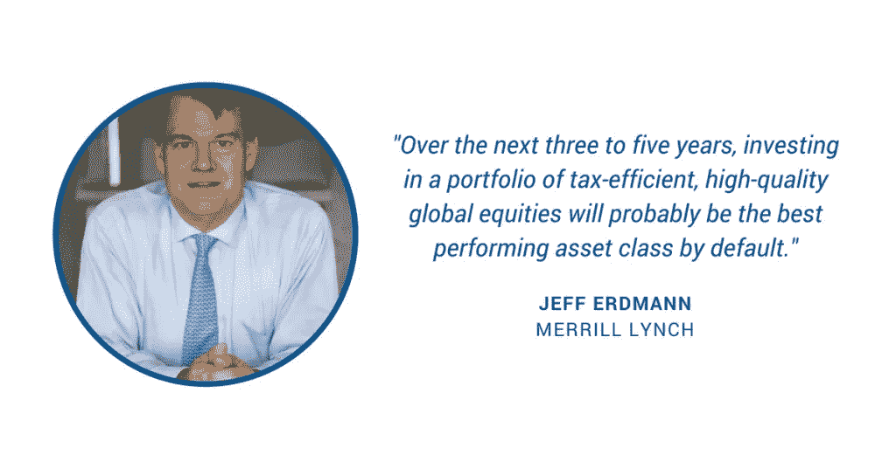

# 顶级财富顾问的理财建议

> 原文：<https://medium.com/swlh/financial-advice-from-top-wealth-advisors-639c197a9b78>

## 由[蜜琪拉·帕里克](/@mikaelaparrick)出版

E 每年，[福布斯](https://www.forbes.com/best-in-state-wealth-advisors/#60bada6a291d)都会发布美国各州前 100 名财富顾问的名单，根据客户维系度、经验、合规性、创收等因素进行排名。

今年的顶级顾问管理着近 7000 亿美元的累计客户资产，并与美国最富有的家族、企业家和名人保持着密切的关系。

在今年早些时候由福布斯和震动研究公司在拉斯维加斯举办的第二届年度顶级顾问峰会上，美国最优秀的财务顾问分享了他们关于明智投资和在日益科技化的环境中保持价值的建议。

总部位于拉斯维加斯的财富顾问兰迪·加西亚是投资顾问公司的首席执行官，他管理着价值近 10 亿美元的客户资产。

加西亚有一套投资规则，他给客户称之为“兰迪规则”，其中包括他在 40 年的职业生涯中积累的一些智慧。

他的第一条建议是:知道投资、投机和赌博之间的区别。

例如，加西亚认为不稳定的加密货币比特币是一种投机，而不是投资。

“我不接待想投机的客户，”他说。

“如果他们在寻求建议，我会告诉他们，这附近有很多赔率更高的赌场。”

俄勒冈州波特兰市的另一位顶级财富顾问 Judith McGee 管理着超过 5 亿美元的客户资产。

McGee 的最佳建议是确保你的“财务生活处于垂死状态”，这意味着保持整洁的记录至关重要。

事实上，McGee 最近从她的一个客户那里获得了 250，000 美元，因为该客户在不知道其价值的情况下带来了一份股息单的存根。

她还建议她的客户不要对投资过于紧张，她说“不要在滑道上紧张。那些试图把握市场时机的人总是会失败。他们不会保护他们的本金。”

[美林](https://www.ml.com/)的高级顾问杰夫·埃德曼管理着近 60 亿美元的客户资产，他认为处理最困难问题的能力是在竞争激烈的市场中取得成功的关键。

“价值在于你没有剧本的事情。这与费用无关，”他说。

对于顶级财富顾问来说，这种价值可以采取不同的形式，比如提供高度技术性的建议和有效处理棘手情况的能力。

谈到投资建议，埃德曼认为，投资于节税、高质量的全球股票组合将是未来三年内表现最佳的资产类别。

要查看今年各州最佳财务顾问的完整名单，点击[这里](https://www.forbes.com/best-in-state-wealth-advisors/#60bada6a291d)。

# 感谢阅读！如果你喜欢这个故事，我们的[博客](https://brownandjoseph.com/blog/)上还有更多。😊

Brown & Joseph 是一家全国性的催收机构，专门从事保险债务的回收。

我们的结果不言自明—我们已经为客户恢复了超过 10 亿美元的额外收入。

请访问我们在 www.brownandjoseph.com 的网站了解更多信息！

## 这篇文章发表在 [The Startup](https://medium.com/swlh) 上，这是 Medium 最大的创业刊物，拥有 338，320 多名读者。

## 在此订阅接收[我们的头条新闻](http://growthsupply.com/the-startup-newsletter/)。

