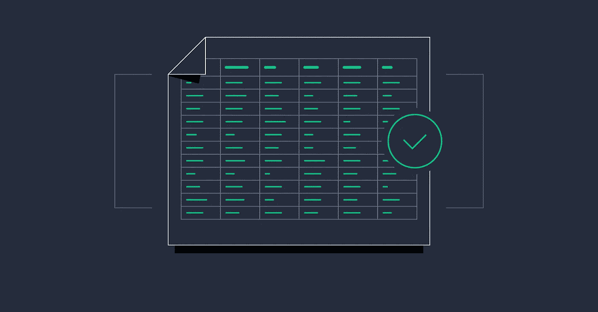
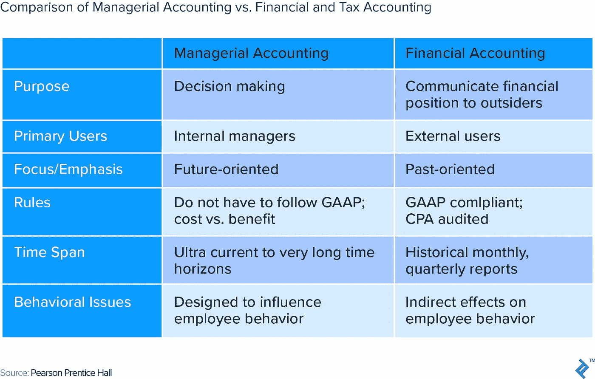
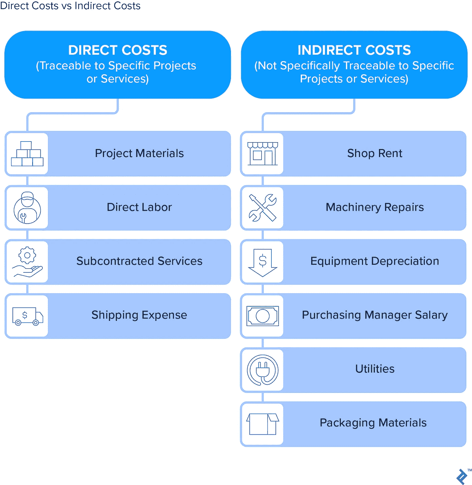
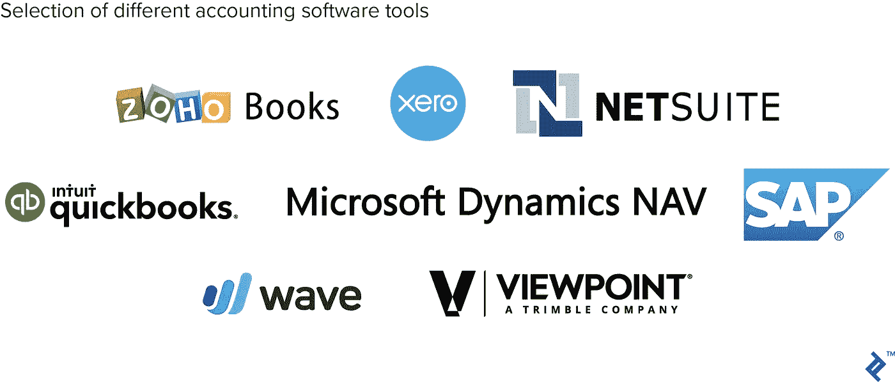

# 最终财务清晰:如何用 7 个步骤重新启动你的会计科目表结构

> 原文：<https://medium.com/swlh/financial-clarity-at-last-how-to-reboot-your-chart-of-accounts-structure-in-7-steps-101dd2aeef55>

Source: [Toptal](https://www.toptal.com/finance/interim-cfos/chart-of-accounts-structure)

> “商品销售成本中的劳动力看起来很疯狂。我知道我们这个月没有支付那么多的车间劳动。你能给我看一下这个数字的明细吗？”
> 
> “我们现在的订阅数量多得数不过来——Slack、Office 365、Xero、Bill.com、Calendly、Zoho CRM、Trello——而且我们每个月都在注册新的订阅！你能给我看看我们每月在这些东西上的总支出吗？”
> 
> “我只想看到一份符合我们预算的损益表。以旅行为例。在我们的预算中，它由住宿、机票、地面交通等费用组成。当我看损益表的时候，我只看到一个数字——旅行，它显示我们超出了预算。我想看细节，所以我知道为什么。”
> 
> “所有这些细节都很好，但我真正想要的是一份一页的报告，显示我们的销售额、毛利润，也许还有 10 类管理费用(会计部门、销售部门等。)都在一个漂亮整洁的总结。”

这些熟悉的词汇，对任何参加过几次金融会议的人来说都是如此。讨论不断进行，不可避免地会有人说“如果我们能看到就好了……”首席财务官脸上露出恼怒的表情，并在记事本上写下了这一请求。“我会看看我能做什么，”他们干巴巴地说。

事实是，他们可能甚至不知道从哪里开始。

财务报告达不到管理层的期望是很常见的。我认为这有两个原因:

1.  会计团队倾向于专注于以“正确的方式”做事，而不是问财务报表的读者他们想看到什么。这就相当于为某人建造一座房子，却不问他们希望如何建造。
2.  会计科目表是财务报告的*基础，但在开发会计科目表方面考虑不够。这相当于在泥土而不是混凝土上盖房子。*

正确执行会计科目表的重新启动将解决这两个问题。令人欣慰的是，即使是全面重启也不需要天文数字般的时间和精力。事实上，我建议**这是将你组织的财务报告提升到下一个水平的最佳和最有效的方法**。

# 什么是会计科目表，为什么它很重要？

最近，我在帮助一家科技公司的老板改进他的财务报告。“打开你的会计科目表，”我告诉他。

“我想我从来没有看过这个，”我们查看他的账目时，他告诉我。当我向他展示他的销售发票行是如何被配置为流向他的会计科目表中的单个销售帐户时，我可以看到灯泡在亮着。由于账户结构过于简单，他的财务报表无法提供五个不同收入来源的详细信息。

会计科目表就像是仓库中货架和储藏箱的框架。想象一下，一家计算机硬件公司收到了源源不断的台式机、笔记本电脑和打印机。如果他们的仓库组织有序，一批到达的戴尔笔记本电脑将被发送到仓库*笔记本电脑区*的*戴尔区*的*特定箱*。这样，当客户订购戴尔笔记本电脑时，仓库工作人员可以快速轻松地取回它。

如果仓库没有箱子或架子，而只是三个巨大的房间——分别放台式机、笔记本电脑和打印机——跟踪或检索任何东西都将是一场噩梦。

账户是保存会计交易的特定“箱”。会计科目表只是所有箱柜和架子的有组织的列表。举例来说，在上面的例子中，当计算机公司记录戴尔笔记本电脑的销售时，会计将转到会计科目表的收入部分，并将销售额放入帐户销售-笔记本电脑，或者如果公司的会计科目表更详细，可能放入销售-笔记本电脑-戴尔笔记本电脑。

月末财务报表(资产负债表和损益表)只是对月末各个账户的余额进行汇总和分组。因此，财务报表不可能比基本的会计科目表结构更详细或信息更多。

我的技术客户有一个很大的“房间”用于销售，没有箱子和架子。他的月末收入报表不可能比那一份账目更详细了。乍一看，他不知道是哪些收入来源导致了这个庞大的月收入。

我很难做出批评，因为 90%的企业主可能从未看过他们的会计科目表。就连许多财务总监和首席财务官也不擅长如何构建一个强大的会计科目表，以便简单明了地提供管理层希望看到的财务信息。

会计软件公司对此负有部分责任。他们知道(尤其是初级供应商)大多数人都很难建立一个高质量的会计科目表。为了解决这个问题，他们将设置部分自动化，并在软件中构建一个预制的会计科目表。

不幸的是，使用预制的会计科目表就像试图在一刀切的混凝土地基上建造一个梦想的房子。这座房子最终会与梦想大相径庭，而且功能也不太实用。

# 构建完美会计科目表的七个步骤

重新启动会计科目表时，需要考虑三个方面:

1.  “箱子”或账户的数量。
2.  进入每个箱子的内容的定义。
3.  垃圾箱的组织方式。

以下是解决上述每一点的步骤，并增强您的会计科目表，以获得您公司所需的财务透明度。

# 1.开除 GAAP 和税。

大多数小企业最初设置他们的会计以适应他们的税务会计师。随着公司的发展，银行、投资者和债券公司等机构需要基于 GAAP 的财务数据。通常，基于 GAAP 的财务是这一过程的终点。

但是还有另外一个层面。这一层是管理会计(T0)和财务报告(T1)，在这里你可以用你想看到的信息(T2)制作财务报告(T3)。无论如何，税务和审计注册会计师会调整你的报告，使之符合他们的目的，所以继续吧，彻底决裂。新的目标是财务报告提供你全年运营所需的指标*。*

一些会计师建议坚持以 GAAP 为导向的会计科目表，并通过定制报告生成以管理为导向的财务报表。这些自定义报表将会计科目表各个部分的数字拼凑在一起，以获得管理层正在寻找的财务报表布局。

只要您拥有定制报告功能，这种方法就可以工作。如果没有，税务和审计注册会计师有自定义的报告软件，可以轻松地将面向管理的会计科目表转换成他们的格式。只要确保将他们需要的任何特殊账户合并到您的改造后的图表账户中，就能让他们感到轻松。

# 2.定义毛利。

毛利润是从销售额中减去直接成本后的利润。什么是“直接成本”？这是一个大问题。大家都同意，直接人工和直接材料永远是直接成本。除此之外，定义是任意的。

例如，在 GAAP 下，设备折旧等固定成本是制造商的直接成本。然而，在一个以管理为中心的环境中，固定成本通常被排除在毛利润之外，以防止其被销售波动所扭曲。

例如，如果折旧为每月 50 美元，销售额为每月 500 美元，则折旧为销售额的 10%。如果一个月的销售额达到 1000 美元，折旧仍然是 50 美元，现在只占销售额的 5%。在这种情况下，销售——而不是生产效率或更好的估计——改变了毛利润。这可能会产生误导，尤其是如果生产主管根据利润指标获得报酬的话。

这里有一个建议:你的管理财务报表上的直接成本应该与你计入报价或定价计算的成本相同。如果你在投标或定价时只考虑直接人工和直接材料，那么这些应该是你每月财务报表上显示的唯一直接成本。这样，您就可以一眼看出您是否实现了报价中的毛利润目标。

或者，如果您在报价中包括折旧和供应品等间接项目，那么您应该在财务报表的毛利计算中包括它们。要做到这一点，仔细看看下面的第 3 点。

不是每个公司都利用毛利润。在某些行业，如广告业、农业或咨询业，大部分成本集中在经营费用的大类下。在这种环境下，可能没有必要将直接/间接成本和运营成本分开，财务上也不会有毛利润。

# 3.仔细考虑间接成本。

间接成本是与销售直接相关的间接费用，但不能直接追溯到具体的产品或工作。例子包括工厂主管工资、附带用品(如胶带、胶水、螺丝)、机械维修、厂房保险等。诸如税务准备费、营销和法律费用等费用不应被视为间接费用，而应视为运营或一般/管理费用。

大多数公司选择一个度量标准，如劳动时间，并估计在一个月或一年的过程中“消耗”这些间接成本的每个劳动小时的比率。例如，考虑一个简单的制造商，他上个月有 1000 美元的制造供应和 1000 美元的车间维修，间接费用总计 2000 美元。那个月生产工人工作了 200 个小时。基于此，该公司决定以每小时 10 美元的比率将间接成本分配给未来的项目(总成本为 2，000 美元/200 个车间工时)。

当每小时的人工成本被过帐到系统时，每小时 10 美元的估计间接成本也被自动过帐。如果工人工作 300 小时，间接费用$3，000 (300 x $10 每小时)将过帐到项目模块和财务报表。

这个概念是有意义的，但当这个条目触及财务时，它就变得混乱了。与真正的工资费用不同，3000 美元是一个项目成本分录，不是以现金支付的。因此，抵销将不是现金，而是-3，000 美元的间接费用账户。

在设计良好的会计科目表中，抵销科目通常与收到实际供应品和修理费用的科目组合在一起。这样，如果该月的实际供应和维修总计为 2，700 美元，您可以一眼看出间接成本被过度应用于项目(应用了 3，000 美元，而实际为 2，700 美元)。

这一点并不意味着是关于项目成本计算的讨论，而是为了让人们意识到会计科目表必须考虑到组织对间接成本的处理方法。这可能是财务报告中最令人困惑的项目之一，尤其是如果方法不是很有条理和简单的话。

间接成本计算适用于面向项目的公司，特别是制造商和建筑承包商。非项目导向的公司，如零售商和餐馆，通常不会将间接成本计算纳入他们的账户结构。

# 4.组织运营费用，以反映所有者的偏好并符合预算的详细程度。

分割数据的方法有很多种。例如，餐费可能是一个独立的账户，也可能分散在与餐费相关的类别中，如营销、会议或旅行。

没有唯一正确的方法，但是会计科目表必须反映财务报表的最终用户想要看到的。从管理团队那里了解他们希望如何处理餐费或技术订阅费等费用是很重要的。他们是希望将它们嵌入到相关的类别中(如营销或金融)，还是希望看到它们独立存在？

顺便说一句，对于受美国税收法规约束的公司来说，餐饮就是一个例子，在这种情况下，你需要一种简单的方法在年末向你的税务会计师提供一个独立的总金额。如果你选择将餐食分散在相关的类别中，你仍然需要将它们保存在每个类别的独立账户中。

最终，会计科目表、预算和管理偏好都必须在一个有效的会计系统中保持一致。

# 5.如果你还没有的话，使用账号。

账号就像仓库里的箱号。五位数的基本账号很好用(四位数用于非常简单的设置)。最佳实践是将 10000 用于资产账户，20000 用于负债账户，29000 用于权益账户，30000 用于销售账户，40000-50000 用于直接/间接成本，60000-70000 用于运营/间接费用，80000-90000 用于非运营账户，如利息和税收。

深思熟虑地摊开你的账户号码，为增长留出空间。例如，如果主业务支票账户是 10000，工资支票账户可能是 10100。之后，你可能会跳到 11000 应收账款(通常是下一个资产类别)。那就剩下 10200，10300 等等。用于将来的现金和支票帐户，并将整个 11000 组留给其他应收款帐户(例如，员工或公司间应收款)。

对于收入和费用账户，建议采用父子式安排，以便同时进行汇总和明细报告。例如，假设一家科技公司有三个收入来源。销售的父级帐户将是 30000 销售。没有交易会过账到那个账户。在它下面可能是子帐户:31000 销售-网页设计，32000 销售-服务器管理，33000 销售-硬件。

避免超过 2 或 3 级的子帐户。例如，33000 个销售硬件可以进一步细分为 33100 个销售硬件计算机和 33200 个销售硬件打印机。硬件打印机可以进一步细分为 33210 硬件打印机-惠普和 33220 硬件打印机-佳能。在这一点上，进一步的细节可能弊大于利，并导致不准确的会计。一般来说，拥有较少的细节并保持准确比拥有过多的细节更好，因为过多的细节往往是不准确的。

为了组织的优雅，保持数字和描述的一致性。将直接成本帐号与相应的销售帐号对齐。例如，要跟踪为转售而购买的硬件的成本，您可以使用帐号 43000 COS-Hardware，它将在数字上与 33000 Sales-Hardware 对齐(子帐户也将对齐)。这种一致性在设计财务报告或制作日记账分录时很方便，对非会计人员也有意义。

与此相关，一些专家(尤其是软件实施人员和 IT 专业人员)建议在会计科目表中只设置几个科目，而在会计软件的各个模块中使用详细的报表。

例如，您可以将所有客户发票放在一个销售帐户中。你的财务报表上不会有任何细节。您可以通过转到销售模块并运行发票报告(如按销售类别销售或按客户销售)来获得详细信息。在某种程度上，这已经完成了。工资模块是另一个通常具有广泛的内置报告功能的模块，它超出了会计科目表所能提供的范围。项目模块是另一个模块。那么，为什么不跳过会计科目表中的所有细节，走这条路呢？

虽然这在理论上听起来很棒，但在实践中，财务报表是每月由管理层如实生成和审核的。来自各种模块的详细报告通常需要一些努力来确保它与财务相联系，并且由于这个原因(以及其他原因)，它不能始终如一地完成。在会计科目表中构建一定程度的细节是确保关键信息始终呈现在管理团队面前的实用方法。

良好的月末财务报告通过大量的非现金日记账分录变得准确。例如，如果在 10 月 18 日至 31 日挣得的工资在 11 月 7 日支付，则必须过帐一个日记帐分录，将 11 月 7 日的现金费用移到 10 月 31 日，以使 10 月的财务数据准确。

如果日记账分录的金额与正常的工资费用账户相混合，就很难看出多少工资费用与现金支付有关，多少是应计的。这同样适用于调整在制品(WIP)值的复杂日记帐分录，或涉及多个月项目的公司的超额/欠额开单分录。

将这些条目集中到不同的账户会有所帮助。例如，您可能有一个母帐户 45000 直接人工和三个子帐户:45100 生产人工、45200 应计人工变动和 45300 人工变动。这种粒度使得向高管团队解释累计劳动力总量变得容易，因为高管团队往往只考虑当月以现金支付的工资。

# 7.最大限度地发挥会计软件的功能。

功能强大的会计科目表的一个好处就是可以延长哪怕是入门级的会计软件的使用寿命。通常，财务报告的挫折可以通过重塑会计科目表来解决，而不是经历非常痛苦的过程，即从 T2 迁移到新软件。

然后，关键的一步是构建会计科目表，以最大限度地发挥软件的功能。像 Microsoft Dynamics NAV 这样的平台仅利用基本账号加标签(“维度”)来将每笔费用编码到特定的位置或部门。像 Vista by view 这样的平台利用客户细分市场。帐户 40000.01.02 可能是位于波士顿地点(01)的混凝土部门(02)的直接材料(40000)。QuickBooks 和 Xero 用了另一种方式。愿意修改你的账户结构以适应软件，而不是相反。

由于财务报告和会计科目表有着千丝万缕的联系，因此在修改或设置会计科目表时，考虑软件的财务报告功能也很重要。例如，如果软件不允许你重新安排财务报表上的账户顺序，那么你如何安排你的会计科目表就变得非常关键。

会计科目表的功能可能是会计软件和财务报告最重要的属性。具有强大 COA 功能的入门级软件可以工作多年。反之亦然。

我最近咨询了一家价值 1000 万美元的定制制造/零售公司，该公司即将将其会计记录(记录，而不是公司本身)拆分为两个独立的“公司”，以便能够获得他们迫切需要的报告清晰度。通过对他们的会计科目表进行战略性调整，并更好地利用他们软件的报告功能，我们能够获得他们所需的财务可见性，而不会让他们陷入可能代价高昂的灾难。

# 良好的会计科目表是基础

有效的会计科目表结构直接或间接推动了几乎所有的财务报告。然而，许多组织忽略了这一基本概念，并带着未满足的期望蹒跚而行。

与一些基础问题不同，会计科目表**可以相对快速地进行优化**。执行良好的改造通常可以在一个月内实施，并立即对财务报告产生显著影响。

因为大多数公司(和首席财务官)可能每十年才建立一次会计科目表，所以外包可能是一个理想的项目。[如果您需要帮助，请联系 Toptal](https://www.toptal.com/finance/interim-cfos/#book-unmatched-finance-advisors) 采取这一简单但极具影响力的步骤，将您的组织提升到新的水平。

【www.toptal.com】最初发表于**。**

**

## *这篇文章发表在 [The Startup](https://medium.com/swlh) 上，这是 Medium 最大的创业刊物，拥有+398，714 名读者。*

## *在此订阅接收[我们的头条新闻](http://growthsupply.com/the-startup-newsletter/)。*

**