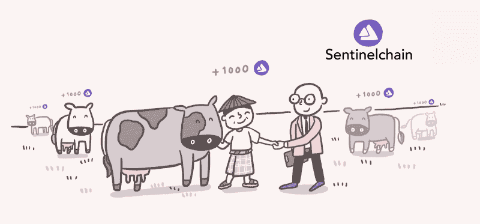

# 金融普惠及其重要性

> 原文：<https://medium.com/swlh/financial-inclusion-and-why-it-is-important-e80e1abbdfec>

虽然世界银行同意金融普惠是减少贫困和促进繁荣的关键因素，但具有讽刺意味的是，世界上仍有一半以上的成年人无法获得基本金融服务。令人惊讶的是，在亚洲和非洲的许多国家，不到 15%的人口拥有银行账户。

金融普惠是指个人获得金融产品和服务以满足其需求的能力。需要满足的需求包括储蓄、交易、付款和收款、接受信贷和保险。产品和服务必须是目标人群负担得起和有用的，这样才能达到预期的目标。

# ***金融包容性差的负面后果***

金融服务不足的人口主要是世界上发展中或不发达地区在非正规经济中经营的人。无法获得金融服务对他们的生活和整体经济产生了重大负面影响。

首先，世界上的贫困人口没有可靠的支付和接受日常付款的手段。这种无法每天进行可靠交易的能力阻碍了他们的向上流动。这使他们走上了失败的道路，并使他们陷入依赖的恶性循环，他们获得资金的唯一途径是不择手段。

其次，缺乏金融产品和服务意味着获得信贷的机会有限。世界上大多数贫困人口在非正规部门工作。他们小规模种植农作物，饲养动物。其他人是向民众出售商品的工匠，而其他人是出售食品和蔬菜等基本物品的小商贩。然而，尽管他们有能力对他们的小企业进行进一步投资并改善他们的生活，但他们缺乏获得信贷的机会，而信贷本来可以帮助他们实现这一目标。

例如，[事实表明，如果能够获得信贷服务，世界上大多数地方的小企业主都有能力对其资产进行进一步投资。这项投资会带来更多利润。如果摊主能够获得信贷，他们还可以增加现有的库存和产品种类。农民可以投资更多的牲畜，生产动物产品，这些产品是全世界肉类和牛奶等基本食品的原料。如果工匠能够获得信贷，他们还可以购买更多的原材料，生产更多的产品。因此，金融包容性差阻碍了来自非正规部门的人发展商业和企业。](http://www.cgap.org/publications/financial-inclusion-and-development-recent-impact-evidence)

第三，世界上的贫困人口无法储蓄，而储蓄可以大大改善他们的生活。储蓄帮助人们积累金融资源，这些资源可用于发展企业或改善总体生活。例如，一个农民可以储蓄以在未来获得更多的牲畜，从而增加他的产量和收入。储蓄还能保护人们在不确定时期免受失败。

> 在一种致命疾病折磨一个农民的牲畜，导致一半人口死亡的情况下，一个有相当积蓄的农民可以渡过这一难关。农民可以用这笔钱来恢复听力，避免失败。尽管发生了灾难，他仍能维持生产和收入。因此，难以获得金融产品限制了穷人的储蓄能力和改善生活的机会。

最后，缺乏金融包容性阻碍了世界贫困人口获得保险。风险和金融冲击是任何业务的重要组成部分。保险帮助个人应对与风险和金融冲击相关的脆弱性。例如，饲养牲畜的农民可以为他们的牲畜购买疾病和自然灾害保险。通过投保，这些农民免于陷入贫困，因为他们通过生产获得的收入流的连续性得到了保证。

# ***为什么金融普惠很重要***

所有人都需要金融普惠，特别是在非正规部门工作的世界贫困人口。这种包容性有助于个人可靠地进行日常支付。这有助于他们获得可投资于其小规模创收活动的信贷。它还帮助人们节省现金，以便他们可以进行未来投资或应对不可预见的风险。

金融普惠改善了获得保险产品和服务的机会，这对于解决任何类型企业的脆弱性都至关重要。

# ***金融普惠努力***

不同的利益攸关方一直在努力将金融产品和服务带给农村地区的贫困人口。在孟加拉国，两家金融技术公司(CloudWell 和 Green Delta Insurance)合作向农村地区的农民提供支付和保险服务。津巴布韦等发展中国家的政府已经颁布法律，允许农民用他们的牲畜作为抵押获得信贷。尽管做出了努力，但信任和透明度问题阻碍了这些项目充分发挥潜力。

# ***哨链***

Sentinel Chain 是一个项目，旨在帮助农村农民获得金融产品和服务，从而改善他们的生活。该项目通过利用区块链技术来识别、量化和验证资产所有权，解决了信任和透明度问题。

世界上的贫困人口往往比他们被描绘的更富有。以[53 亿穷人](https://www.reuters.com/article/us-global-landrights-desoto/property-rights-for-worlds-poor-could-unlock-trillions-in-dead-capital-economist-idUSKCN10C1C1)为例，他们对自己居住的财产和耕种的土地没有完全的权利。据估计，如果这些人获得土地所有权，将释放约 9.3 万亿美元的资产。人们经常看到穷人从事传统活动，拥有牲畜和其他动物，这是他们生活的基础。然而，这种资产被认为是“死资本”，因为它们不被金融机构承认。这些机构在确立和核实所有权以及量化资产方面面临挑战。因此，农民无法利用他们的牲畜和土地获得信贷和保险等金融产品。

Sentinel Chain 通过使用区块链技术来量化、识别和验证牲畜的所有权，从而解决了这个问题。一个防篡改和防盗的 RFID 标签系统被用来标记所有的牲畜。还存在一种智能手机应用程序，用于读取标签并存储关于区块链上每头牲畜的身份和所有权的信息。整个生态系统加强了信任和透明度，这是金融供应商开始向农民提供产品和服务的一个激励因素。

哨兵链使农民能够将他们的牲畜货币化。存储在区块链上的信息使农民有机会提供他们的牲畜作为抵押品，以换取金融机构的信贷。此外，区块链技术使用自己的加密货币形式，称为哨兵链令牌(SENC)。由于其价值与当地货币挂钩，这将有助于农民进行快速便捷的交易。Sentinel Chain 将彻底改变农村农民的生活，使他们能够获得资本和市场，从而改善他们的生活。

# **走进充满希望的未来**

金融包容性可能是全球走向繁荣道路上的最大障碍。我们生活在一个复杂的时代，我们在整个人类历史中的活动在这个我们称之为家园的星球上创造了一个复杂的生态系统。自然灾害和气候变化加剧了本已复杂的全球经济。在这种时候，获得金融服务以及储蓄、投资和对冲风险的能力对每个人都很重要。不仅仅是政府有义务帮助实现金融普惠，每个希望实现持久变革的企业家的参与也很重要。Sentinel Chain 帮助改善金融包容性的努力是使用尖端技术和创造繁荣世界的社会义务的良好结合。

要支持哨兵链或简单地了解它的活动，请在[推特](https://twitter.com/sentinelchain)上关注它或加入它的[电报](https://t.me/sentinelchain)组。

## 这篇文章发表在 [The Startup](https://medium.com/swlh) 上，这是 Medium 最大的创业刊物，有+ 374，685 人关注。

## 订阅接收[我们的头条新闻](http://growthsupply.com/the-startup-newsletter/)。

