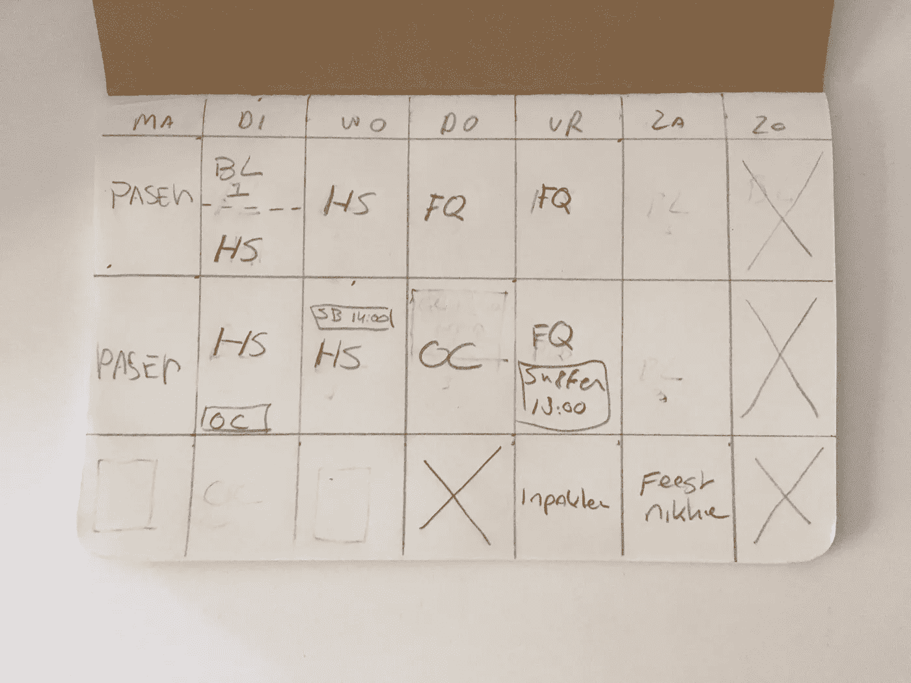
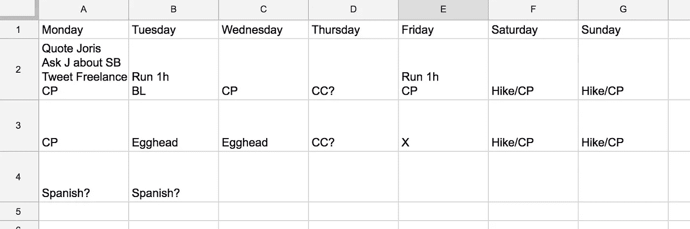
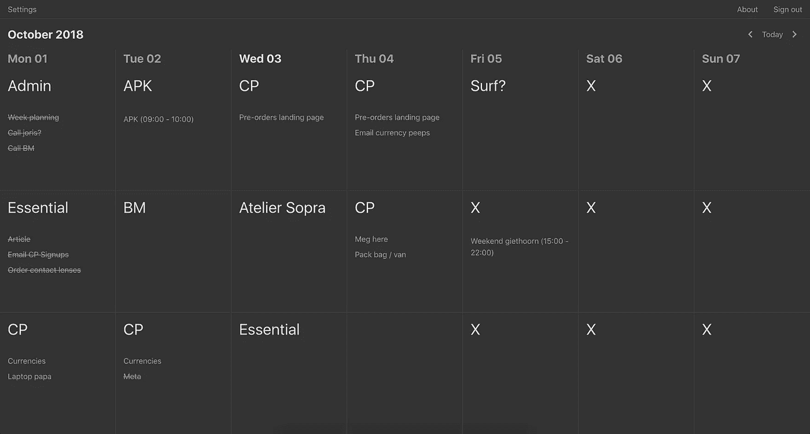

# 作为一个制造者，通过使用计划系统来寻找清晰和焦点

> 原文：<https://medium.com/swlh/finding-clarity-and-focus-as-a-maker-by-using-a-planning-system-9baa96c0e075>

我总是努力集中精力完成任务。我的注意力不断转移。我必须处在一个完美的环境中，有一个明确的任务要专注，并强迫自己不去碰任何分散注意力的东西。这让我很恼火。每隔几周，这种情况就会再次发生。有时几周过去了，却毫无收获。

很多次我寻找、发现并尝试提高注意力的方法。我试着列出清单，写日志，屏蔽网站，奖励，早起，加班，咖啡，不喝咖啡，音乐，不听音乐，大麻，降噪耳机，咖啡馆，共同工作空间，在家工作。这个清单还在继续。

这些变化都产生了一些影响。有些让我的注意力提高了一天，有些提高了一周，有些让它变得更糟(是的，大麻)，但一般来说——某一天有效的，第二天就无效了。

> 虽然很明显，但我花了很长时间才意识到，作为一名制造商、企业家或独立工作者，你没有经理。你需要管理好自己。

今年早些时候，我和我的朋友 Joris de Ruiter 谈论这些斗争。我解释了它是如何让我整个星期都感到忙碌的。这导致我每天工作 10 个小时，因为我没有完成我想要完成的事情。因为我对自己无法集中注意力感到非常恼火，所以我不会注意和欣赏我确实完成的事情。

尤里斯走到自己的房间，拿着笔记本回来说道:

> “我过去常常想在一周内做太多的事情，以至于我永远无法完成所有让我感到不满意的事情。然后，我的心理学家向我推荐了一个系统，在这个系统中，我会把一周分成几个块，提前计划我的一周，并确保我至少留出两个块。这次我可以花在任何事情上。也许这个系统也适合你。你看。”

Joris showed me what his system looked like for a typical week.

这个想法是每天由三个街区组成。早上，下午和晚上。每个块都需要有一个优先级。这是你在那段时间的主要关注点。有时候不可避免的会有一些事情发生在你优先考虑的事情之外，因此你会在星期二早上看到 1 小时的 BL，在星期三下午 2 点有一个会议。对乔里斯来说，关键是他的几个街区是空着的。受阻。比如周四晚上和整个周日。这有助于他创造时间去思考，去做自发的事情，或者去做他低估的事情。

然而，我的问题与过度劳累或感觉一周没有足够的时间无关。我的问题是，我似乎随机地有几天无法集中注意力。我不知道该做什么，每 5 分钟就会分心的日子。

在试用这个系统几周后，事实证明这个计划系统给我带来了清晰和专注。我被卖了。它成功了，现在依然如此。我已经用了几个月了，仍然很满意它对我的帮助。乔里斯已经用了好几年了，同样的故事。

一个小故事——发生在我身上的一件令人惊讶的事情是，当我提前计划我的一周时，我会想到我在这一周中从未抽出时间做的事情。像健身、尝试我找到的食谱、练习一种语言或一种乐器这样的活动。在计划的时候，它们突然出现在我的脑海里，我把它们写下来。不知何故，看到这些事情被写下来，就有时间去做了。在你的脑海中，它们不再是可有可无的，美好的事物，但是它们确实存在，重要到足以让你的计划中包含它们。这是一种你和自己达成的协议。

# 你如何开始使用这个系统？

潜在地，读完这篇文章后，你会受到启发，自己尝试一下，看看它是否对你有用。有几种方法可以开始。你在上面看到的是最简单、最手工的一个——一张纸。

在我使用纸张一段时间后，我很讨厌我总是需要随身携带我的笔记本。我用谷歌工作表创建了一个简单的布局，并每周复制一次。

Simple spreadsheet setup

与此同时，事实证明，乔里斯已经开始把它变成一个网络应用程序。在他用了几个月之后，他终于把它给我看了(在我每周都复制和清理我的电子表格之后，谢谢 Joris)。我们认为它有潜力，至少对我们来说是这样，所以我们一起合作制作了一个新版本，我们把它命名为 [Essential](https://essentialcal.com/) :

 [## 必要的

### 给你的独立生活带来清晰和专注。用 Essential 计划你的一周。

essentialcal.com](https://essentialcal.com) 

# 但是怎么规划呢？

虽然我们认为系统应该是灵活的，因为每个人都是不同的，但这应该是一个好的开始，直到你找到自己的策略:
在周日晚上或周一早上花大约 20 分钟来制定你的一周计划。在你的笔记本里，在你的电子表格的某个地方，或者在 notes 应用程序里，写下你在未来一周的优先事项，你想做什么活动，你有什么约会。

下一步是在一周内划分这些优先事项。有时候把事情的轻重缓急稍微移动一下，直到感觉合适为止，这是有好处的。我通常不会把类似的任务放在同一天，因为我喜欢一些对比(例如，上午编程，下午发邮件)，但同样，这对你来说可能是不同的。请记住，这一切都是为了设定一个优先级。在这些区块中，您将从事什么样的具体任务并不重要。你只是在为你优先考虑的事情预留时间。

一旦你添加了你的优先级，你就万事俱备了！Joris 和我决定在 Essential 中添加一个任务列表和日历集成，因为我们觉得我们需要一些空间来放置便笺，并且因为查看您有哪些约会很方便，但这绝不是必需的。保持主要的事情主要的事情！

这是我们第一次在个人背景之外分享这个系统(也是必不可少的)。如果你尝试了，无论以何种方式，我们都很想听听你的经历。如果你想谈论它或有问题，你可以通过电报和推特联系我。⬇️下面的链接

 [## 磨沙机

### 可以马上联系@sanderfish。

t.me](https://t.me/sanderfish)  [## 桑德·维瑟@🇳🇱(@菲什桑德)|推特

### 桑德·维瑟@🇳🇱(@菲什桑德)的最新推文。使用@CheckoutPage 帮助企业主进行支付💳…

twitter.com](https://twitter.com/fishsander)  [## 必要的

### 给你的独立生活带来清晰和专注。用 Essential 计划你的一周。

essentialcal.com](https://essentialcal.com) 

## 这篇文章发表在 [The Startup](https://medium.com/swlh) 上，这是 Medium 最大的创业刊物，有+ 375，041 人关注。

## 订阅接收[我们的头条新闻](http://growthsupply.com/the-startup-newsletter/)。

