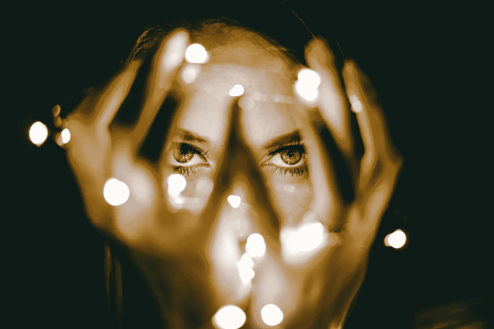

# 为新的一年寻找灵感

> 原文：<https://medium.com/swlh/finding-inspiration-for-the-new-year-b73e1dc7d81b>

Photo by [Rhett Wesley](https://unsplash.com/photos/NQexDDK9P9w?utm_source=unsplash&utm_medium=referral&utm_content=creditCopyText) on [Unsplash](https://unsplash.com/?utm_source=unsplash&utm_medium=referral&utm_content=creditCopyText)

灵感和动力是有趣的东西。

我相信和你一样，我最近一直在努力寻找灵感/动力，走出去，粉碎我的新年目标。

想要对我们在生活中所做的事情感到鼓舞似乎是一件很自然的事情。

## 灵感成瘾

但是灵感有点像糖。当它自然产生时，对你很有好处，但是当它被提炼和制造时，它只是一种温和的甜味毒药。(诚然不是最好的比喻，但和我合作吧。)

我这么说是因为人造灵感可以变成毒品。我知道，因为我是一个灵感上瘾者。

我几乎读过本杰明·哈代在 Medium 上的每一篇文章。

在过去的几年里，我在 Youtube 上看了无数个小时的视频，这些人包括塞思·戈丁、梅尔·罗宾斯、汤姆·比利尤、埃里克·托马斯、托尼·罗宾斯、加里·韦内丘克、蒂姆·费里斯、西蒙·西内克、格兰特·卡尔多内等等。

我也读过/听过这些人的一些书。

每一分钟都感觉很好，我学到了很多东西，但去年我没有粉碎我的很多目标。

也许你能感同身受。

我想澄清的是，使我消费这些内容的人为因素并不是这些人所提供的。我不是指责他们是情绪化的毒贩。他们提供了非常有价值的见解、经验和策略。

让它变得虚假的是我为什么以及如何消费它。

简而言之，我一直在做感觉商品。

当我坐在电脑前试图激发自己去写论文或读研时，我会用励志的内容让自己感觉更好/麻木于我在逃避和失败的事实。

我在自我治疗，想要一种我还没有获得的情感体验。

我怀疑我是唯一一个这样做的人。

这是非常弄巧成拙的，因为看视频已经比做真正的工作更容易了。现在加上你得到的情绪激励作为对这种行为的奖励，你可以假装看这个视频会帮助你改变，选择“获得灵感”而不是“做工作”会很容易

## 还有更多。

这种在情感上方便、有权利、令人上瘾的寻求灵感的方法会有另一个严重的副作用。

这让你开始觉得自己像希腊哲学家柏拉图。

你看，柏拉图有点痴迷于这样一个观点，即在我们的凡人状态中，完美是不可能的，在这种状态中，一切总是在变化和失控。因此，他提出了“形式世界”的概念，在这个抽象的地方，理想的“形式”代表了事物最准确的现实。

例如，这个想法是，在形式的世界里，有一把完美的椅子完美地体现了“椅子性”

这使得完美和理想本质上不同于我们目前所经历的。

当我们有人工的灵感时刻时，我们很容易开始对那些激励我们甚至我们的“理想自我”产生这种感觉。我们开始认为他们不可接近，与我们有着本质的不同。

我们把他们放在一个抽象的世界里，这个世界不能真正触及我们自己的现实。

这并不奇怪，这并不影响我们的变化。

## 该怎么办。

那么还有什么选择呢？

承担起激励自己的责任呢？

如果完美不是抽象的呢？如果完美只是成长、改变和运动呢？

如果“理想的你”不是一个抽象的或假设的“有一天你会怎样？”

也许只是“现在的你”向前迈了一步。

你能得到比这更理想的吗？

你能允许自己被那一步所激励吗？

毕竟， ***那一步体现了人性最好的一面*** *。*

难怪上面列出的所有生产力/商业大师总是恳求我们采取行动，做些事情。

## 我的尝试。

我最近有过一次这方面的经历，帮助我把所有这些都带回家。

我在寻找一个应用程序来帮助我追踪我想要养成的习惯，无意中发现了一个叫做 [*的应用程序。它得到了很多好评，所以我决定试一试。*](https://www.thefabulous.co/)

如果你想的话，它允许你创建自己的习惯/习惯，但是默认情况下，当你早上醒来时，它会以简单的喝水开始。

连多少都没说，醒了就喝水。

在一个罕见的谦卑时刻，我决定放下我最初的感觉，这将是一个愚蠢的时间浪费，我给了它一个尝试。

在成功做到这一点几天后，它增加了吃更健康的早餐(不是麦片或松饼)。我喜欢鸡蛋，所以这对我来说很容易。

然后，它补充说做一些运动。不是很多。只是一些东西。

在我的情况下，这意味着一些俯卧撑，仰卧起坐，或弓步只是为了让事情继续下去。

这些都是愚蠢的小改变，但我坚持了下来。

当我已经做了大约一个星期的时候，我开始感觉到一些动力并且想要更多。因此，我在晚上 10 点睡觉前增加了一项晚间活动，包括拔掉电源插头、写日记和阅读。

这些愚蠢的小变化已经改变了一切。

我开始真正地进入它。

我认为我的日志是毫无意义的，因为它只是一项任务，而不是一种工具。

所以我一直在看关于[写日记](/personal-growth/how-to-write-in-your-journal-to-improve-yourself-and-achieve-your-goals-7a8171aabad3)的文章，不是为了获得灵感(有情感体验)，而是为了接受教育，学习新的策略。

我也开始早起了。

我比以往任何时候都更有动力和灵感。

我从这一切中学到的是，灵感就像爱和幸福。你不能为了追求它而追求它，否则事情会变得不可思议。

相反，你必须以正确的方式生活，灵感、爱和幸福都将成为你所做事情的副产品。

所以现在当我觉得需要“感受灵感”时，我想做点什么，而不是读/看/听什么。

如果我能保持下去，也许 2018 年会变得很特别。

如果你喜欢你所读的，请随意鼓掌、关注、分享和评论！

## 这篇文章发表在[《创业](https://medium.com/swlh)》上，这是 Medium 最大的创业刊物，有 283，454+人关注。

## 订阅接收[我们的头条新闻](http://growthsupply.com/the-startup-newsletter/)。

