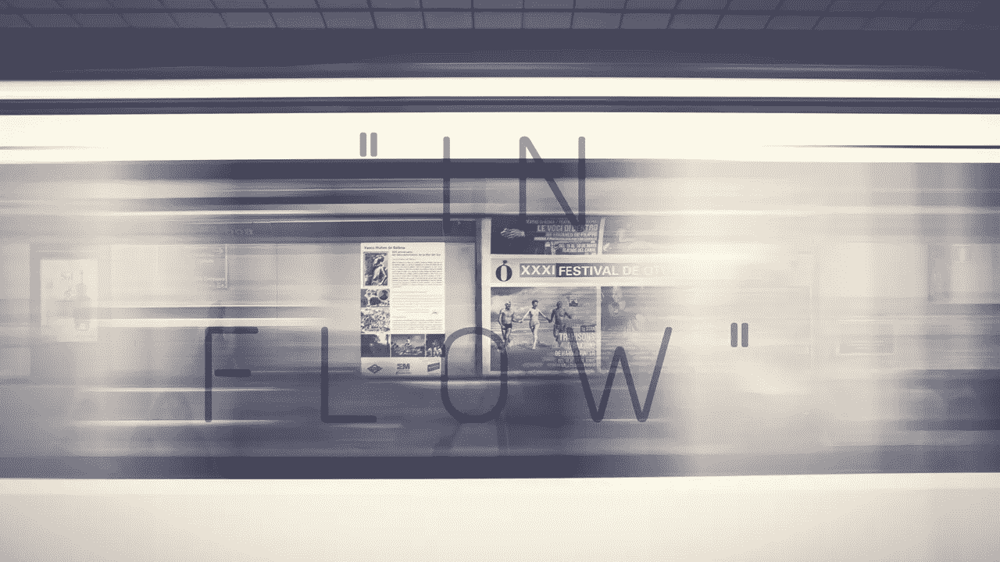
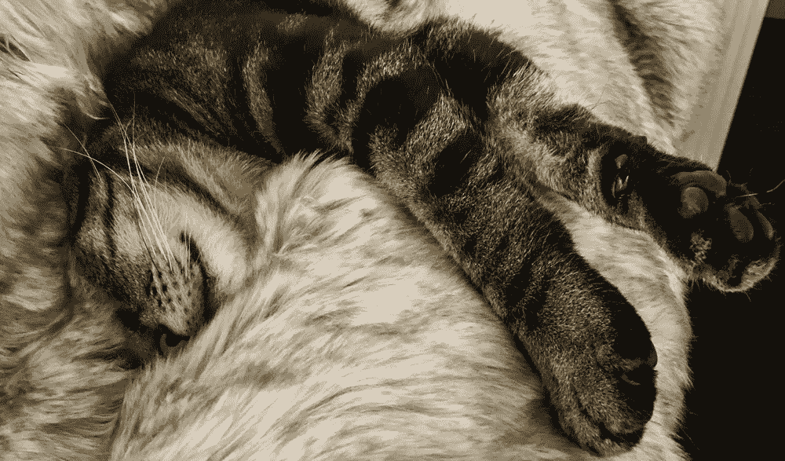

# 在执行创意总监的建议下，像设计师一样寻找你的流程

> 原文：<https://medium.com/swlh/finding-your-flow-like-a-designer-with-advice-from-an-executive-creative-director-97617d0bbf9b>

Written by: Daniel Salcius | “Find Your Flow”

什么是*流量*？心流是什么意思？究竟怎样才能体验到心流？(进步保险商业广告之外)。

在很长一段时间里，当我们在每个项目要求的创造力和需求的海洋中航行时，这些问题在[设计北方工作室](http://www.designingnorth.com/)的团队中徘徊。但那是过去的事了。现在，在我们的执行董事 Lisa Peacock 的指导下，我们的团队已经学会了*如何安排我们的时间表来找到我们自己的心流*。你也可以这样做:跟随我们的领导！

无论“心流”对你来说是一个新术语，还是你之前根本没有时间去探索它，我们都有一些关于从哪里开始以及如何在未来再次使用它的建议。

首先，让我们用 Lisa 的“推销”来介绍一下我们用来理解什么是心流的框架:

> 我必须准备好寻找心流。我没有意识到这一点，但是如果我回头分析我的行为——我会在视觉上更加专注。所以，专注和心流是携手并进的，在我期望感觉到“进入状态”之前，需要专注。
> 
> 我需要首先控制我的环境，这包括我周围的一切都是视觉上令人愉快的——这带来了一种平静的效果(也包括噪音和运动)，以创建一个内部的思想组织。感受平静让我能够跳入心流的风暴中，在那里我沉浸在我正在做的任何事情中，直到我完成我的工作才被注意到。这是关于这个概念的有趣的事情，我从来不知道我在心流中，直到我在它的另一边。就像你睡着了，然后你又清醒过来！在心流中被打断，无异于在睡梦中被突然惊醒。就像我的猫戴夫·梅森每周至少做一次。

Dave Mason ‘in Flow’

# 解释流程

就我们的心理学而言，心流是一种深度专注的状态，让时间“飞逝”——当然，这是一种形象化的说法。

对于我们的工作室成员来说,“心流”是一种精神状态，在这种状态下，我们的行动和认知思维以无缝过渡的方式前进，为我们所做的事情提供难以置信的满足和享受。根据心理学家[米哈里·契克森米哈](https://www.wired.com/1996/09/czik/)，*的说法，心流是一种对节奏感、参与感和期待感的微调。*

在一个项目中寻找流程是确定是什么让你成为一个有创造力的人的巅峰时刻。这个集中注意力的最佳点允许完全沉浸在任何活动中，尽管我们最常把它与工作联系起来。但是就像在你最喜欢的项目上工作一样，它表明了快乐、兴趣和表现之间的相关性。例如，如果你喜欢户外，不喜欢封闭的空间，那么在办公室隔间里就不会感觉到流动(当然，除非你的办公室里充满了狗、朋友、乒乓球和午餐)。

所以当你试图理解这个概念的时候，把心流想象成一个*的地方*，当你要做最好的工作的时候，你会去那里；做最好的自己，与你的召唤相连。简而言之，当机会出现时，*随波逐流*。

观看一位艺术家/运动员如何解释她对心流的看法:

你不能强迫自己找到心流，但是你可以:

1.  用一个放松你思维的仪式来清理你的思维(监控你的日常事务，找出哪些有用，哪些没用)。(对丽莎来说，这是一个完整的咖啡压机和回复邮件的早晨)
2.  **每天组织你的一天**——缓解待办事项清单带来的压力(Lisa 使用一款名为 Swipes 的待办应用程序——它可以追溯到几年前:从当前客户项目的待办事项到购买纸巾以改造主浴室的所有事情。完成“做”的“划水”是令人兴奋的，但感觉压力很小。)
3.  **在杂念之间筑起一道墙**(即把手机收起来；用耳机，关邮箱！)(我们都知道，如果我们没有马上收到 Lisa 的来信，她并没有忽视我们，而是“心流”——这是一个强烈的提醒，提醒我们自己也要去。)
4.  **确定你的理想环境**——你在哪里工作最好？你身边需要什么才能安心？(压倒性的 DN 团队理想环境意味着附近有动物，或者是允许“加州梦”的窗户环境)
5.  **练习你的注意力广度**——减少习惯性的媒体检查！(对于团队来说，我们是空闲的，我们依靠彼此来分享我们#creative channel 中任何真正重要的东西——好消息是，当我们准备好检查它时，它就在那里。)
6.  **记录你心流的瞬间**事后——分析情况并尝试复制它。(在这篇文章的研究过程中，DN 团队决定在 Slack 中创建一个#flow channel，这样我们就可以分享是什么让我们变得有创造力。#stuffworthsharing)

# 流动的常见副作用

对设计职业来说最重要的是，心流可以增加艺术创造力。

当你全神贯注、精力充沛时，创造性的大脑就会活跃起来。随着压力和紧张消耗的思维能力减少，你会有更多的创造力用于自我表达和创造性生产。当然，这都是有科学依据的。

## **心流消除了想法的压制。**

当一个好主意，更好的是一个伟大的想法出现时，你正坐在办公桌前。你的本能是告诉某人，但是当你准备你的话的时候，怀疑爬进来，你最终放弃了这个想法。不幸的是，这种情况经常发生——太经常了。你知道为什么吗？因为你没有进入心流。当你进入状态，做你喜欢做的事情，体验令人满意的结果时，怀疑、恐惧和不确定性就一点机会都没有了。换句话说，你的想法可以自由浮出水面，变得鲜活起来。

## **流能彰显你的天职或**[***理想的工作***](/@designingnorth/we-all-need-to-design-a-life-with-purpose-on-purpose-f8b173fbc26d) ***。***

我们已经知道，寻找心流经常发生在刺激或愉快的活动中。无论是工作还是娱乐，都有足够的兴趣和快乐来忽略世界上的其他事情，为完全专注留出空间。因此，每次经历心流时，写下你在做什么和在哪里；让它成为一种惯例，你可能会开始明白在工作或生活中你应该多做些什么。这一步就是练习和重复。

## 心流会积极地影响你的情绪。

听起来很简单，心流的感觉真的很好。每次你从它中走出来，你都想再做一次，希望每一天都能充满这些时刻。当大脑快乐时，心也快乐，所以你也快乐。

## **心流可以增加你的表现。**

从设计一个网站到跑一场马拉松，心流让你处于最佳状态，做最好的工作。这个概念与专注、动机和驱动力有关；当你被激励去做某事时(通常是被感知到的奖励)，你会专注于完成它，并被驱使去做好它。这不仅仅是理论，如果你知道你喜欢做什么，你可以做更多，并且做好。但是不要只相信我们的话。当你发现你的心流时，将你在这项任务中的表现与一段不太难忘的时光进行比较；用不了多长时间就能“把点连起来”

## 心流激励你设计自己的生活。

设计你的生活并不容易。决定如何以及从哪里开始可能是最难的部分。但是找到你的心流让这个过程更加清晰。在创造你想要过的生活或你梦想过的生活时，你需要知道你对什么感兴趣，你擅长什么，什么对你最重要——心流可以回答所有这些问题。下次你处于“心流”中时，跟着它走，并记下你是如何到达那里的。这些发现将为你指明生活的方向，让你感受到更多的快乐，创造你的目标。

## **心流让你成为一个更有激情的人。**

运用艺术创造力，分享好的想法，做理想的工作，保持积极的情绪，实现更高的业绩，设计你想要的生活，结合起来，有助于让你成为一个非常有激情的人。激情可以应用于任何事情，而不仅仅是工作。当心流以最积极的方式影响生活时，生活的所有其他方面都会一致——生活是美好的。

关键是，所有这些因素最终会设计出一个更好的你，一个对这个世界有更多贡献的你，一个关心社区或团队福祉的你，一个不仅希望看到所有人都有一个更光明的未来，而且愿意为设计可以想象的最佳生活贡献一点额外努力的你*。作为回报，你将过着高于其他人的生活。至少我们是这么看的。*您愿意看到我们的愿景付诸实践吗？**

**

## *这篇文章发表在 [The Startup](https://medium.com/swlh) 上，这是 Medium 最大的创业刊物，有 343，876 人关注。*

## *在这里订阅接收[我们的头条新闻](http://growthsupply.com/the-startup-newsletter/)。*

**