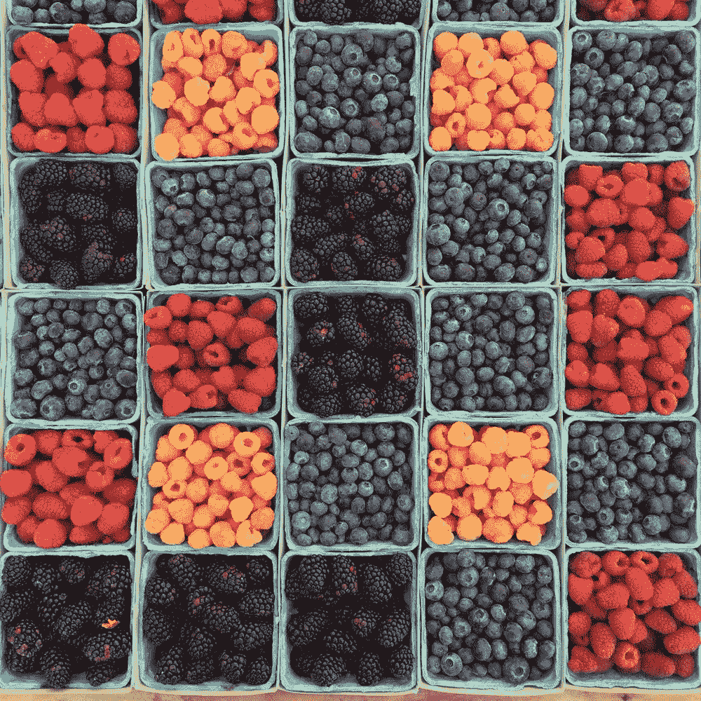

# 你的钩是什么？

> 原文：<https://medium.com/swlh/finding-your-hook-merchandising-the-stallone-way-2e8af946da0a>

NPR 运营着一个名为[星球货币](https://www.npr.org/sections/money/)的流行播客。

我的一个好奇领域是食物——不仅仅是吃和烹饪，还有物流如何运作，以及更广泛地说，世界在 5 年、10 年或 20 年后将如何获得食物。

因此，上周在公园大道散步时，我把《金钱星球》第 813 集(《农产品秀》)放在耳机里。

在参观纽约的一个大型农产品展时,“行星金融”团队遇到了一个叫托尼·史泰龙的人。

> *“和西尔维斯特有什么关系吗？”*
> 
> *“他一直声称有”*

哈——我打赌他已经用这句话 1000 次了，但我还是被它迷住了。

托尼是豌豆荚的农产品采购员，豌豆荚是美国大型杂货配送平台之一，主要关注千禧一代市场。

托尼认为千禧一代不会做饭，所以他在展会上寻找如何向千禧一代提供最新鲜、最即食的产品，让他们可以马上吃到。

他特别关注两样东西:浆果和鳄梨。

为什么？

托尼相信，如果一个杂货商能让他们的浆果和鳄梨保持漂亮和成熟，顾客就会去那家商店买他们剩下的产品。

浆果和鳄梨是诱饵。

托尼知道他需要钩子，今天它比以往任何时候都重要。

这并不是说其他一切都不重要，但在注意力非常重要的情况下，挂钩是必不可少的。

钩子必须适合观众。

它必须引人注目。

它必须是相关的。

你有什么高招？

托尼·史泰龙(和其他人)在农产品展上:

 [## #813:农产品展

### 五名记者去参加纽约农产品展和会议，每个人都有自己的使命。

www.npr.org](https://www.npr.org/player/embed/571222377/571258954) 

*原载于 2018 年 1 月 26 日*[*howardgray.net*](http://howardgray.net/2018/01/26/finding-your-hook-merchandising-the-stallone-way/)*。*

## 这个故事发表在 [The Startup](https://medium.com/swlh) 上，这是 Medium 最大的企业家出版物，拥有 290，182+人。

## 在这里订阅接收[我们的头条新闻](http://growthsupply.com/the-startup-newsletter/)。

