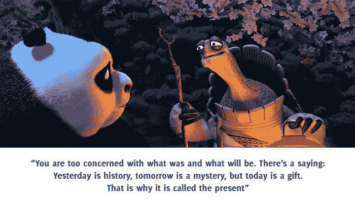
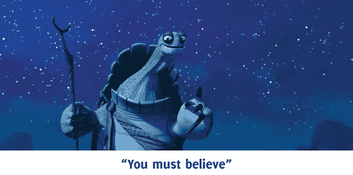

# 找到你的乌龟

> 原文：<https://medium.com/swlh/finding-your-oogway-ce52ddab6b9d>

看着这只又大又胖的熊猫努力跟上他意外获得的“神龙大侠”头衔，我忍不住大笑，但我仍然记得电影中一些不寻常的事情。

乌龟大师。

是的，聪明的乌龟。

没有乌龟的指导，一只除了梦想学习功夫什么也不做的懒惰的熊猫不可能成为神龙大侠。

我记得阿宝被师父拒绝和被盖世五侠嘲笑的场景。自信满满的他决定辞职，并告诉乌龟大师这件事，就在这时，乌龟突然出现，说-

哦天啊！我多么希望我有自己的乌龟，不断提醒我，我不只是我想的那样。如果我相信自己，我就能做到。我只需要再努力一次。如果我们都有人给我们指明正确的道路，那不是很好吗；帮助我们成为更好的我们？帮助我们找到我们的命运，你知道。

一厢情愿，我知道。

像他这样的导师经常出现在电影和故事书的幻想世界中。比如尤达。或者是坏蛋甘道夫。

即使在现实生活中，我们也知道伟大的导师关系和他们创造的非凡影响——想象一下如果亚里士多德没有指导亚历山大大帝，他会是什么样子。想象奥普拉·温弗瑞只是另一个没有邓肯夫人指导的女人。没有托马斯·爱迪生的亨利·福特。

事实上，每一位著名的企业家、运动员、作家、音乐家、商业领袖、歌手或精神领袖都有一位伟大的导师来引领他们走向成功。

所以我的观点是——我们都需要导师。尤其是在企业界。我们需要他们，因为如果指导得当，会对一个人的职业轨迹产生巨大影响。好的导师是一个巨大的共鸣板。他们帮助你摆脱困境。它们上升。他们帮助你对事物有新的看法。

但是，请不要因为我说了就马上接受。在你寻找你的师父乌龟之前，你需要弄清楚你想要实现什么。拿出你内心的知性[西蒙·辛尼克](https://www.linkedin.com/in/simonsinek/)和[从为什么](https://startwithwhy.com/)开始。

根据你的职业和经验，你的理由可能会有所不同。你希望有人帮你缩小知识差距吗？要不要换个职业方向？还是需要有人帮你解锁商机？还是建立商业战略？

一旦你知道了为什么，去*你应该在导师身上寻找什么*
最重要的是，信任和经验(不考虑他们的年龄)。举几个例子，我会说很像 Chak 的卡比尔·汗。或者像空手道小子里的宫城先生。或者像星球大战宇宙中的绝地大师一样。* *是的，我是个电影迷* *

此外，弄清楚一些事情——如果他们有时间指导你，对你的成长有真正的兴趣，可以提出建设性的批评并对你很严厉，也是必须的。如果没有这些，你就会变得像金刚狼一样——总是渴望地看着月亮，却永远也不能得到它。

感觉像是中了大奖？但让我伤透你的心。我撒谎了——找到一个好的导师并不像听起来那么容易。这就像在迷宫中徘徊，寻找你几乎无法描述的东西。然而，一些聪明的行业人士已经想出了[如何找到职业导师](https://www.thebalance.com/how-to-find-a-career-mentor-2059757)。如果需要，请接受帮助。

甚至流行一句话，“学生准备好了，大师就出现了 ”，要求学生做好走那条路的准备。但是，尽管如此，走那条路。踏上寻找良师益友的征途。相信我，当你找到那个会对你说“*我很乐意帮助你*”的人时，那一刻将是不可思议的。

我希望你准备好了，你的乌龟出现了。在你耳边低语-

给你更多的力量。

喜欢你读的书吗？请点击👏下面这样别人就能找到了！

这是我们 [**周讯**](http://blogs.quovantis.com/newsletter/) **的第 18 版。如果你想在注册下面的**之前查看以前的版本，这是我们的[档案](http://blogs.quovantis.com/newsletter/)。

## 这个故事发表在 [The Startup](https://medium.com/swlh) 上，这是 Medium 最大的创业刊物，拥有 305，782+人关注。

## 在这里订阅接收[我们的头条新闻](http://growthsupply.com/the-startup-newsletter/)。

