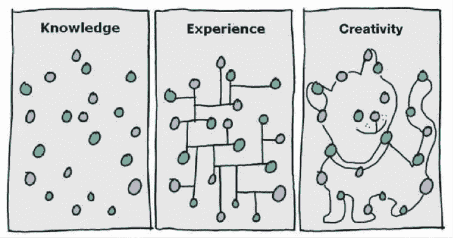

# 找到你的创造力之路

> 原文：<https://medium.com/swlh/finding-your-way-to-creativity-5c66b0ca41b3>

爱因斯坦说“想象力比知识更重要”，因为“知识仅限于我们知道和理解的东西，而想象力包含整个世界，以及所有将要知道和理解的东西”。

Image credit GapingVoid

> 史蒂夫·乔布斯说过“创造力就是把点点滴滴连接起来”

无论是技术、产品还是哲学，都不是凭空产生的。

当你开始把创造力看作是一个组合的过程，把想象力看作是以新的方式连接、延伸和融合事物的能力时，创造力就不那么神秘了。一个有创造力的天才只是比其他人更善于把点点滴滴联系起来。

在你能连接点之前，你需要有点来连接。你在这个世界上接触的材料越多，你的想象工厂就有越多的点。

天才的开始是好奇心。这是变得更有创造力的重要部分。

拓展你的生活兴趣。寻找新的、有趣的经历，不管它们在别人看来是多么平凡或无关紧要。看书，看纪录片，见不同的人，和别人讨论你的想法。你永远不知道你的想象力会在哪里找到拼图。

尼古拉·特斯拉是一个天才的幻想家、发明家和科学家。他的发明是这个现代世界的基础，没有它们我们就无法生存。他完全沉浸在电的世界里。他读了数百本书。他进行了 1000 次实验，并做了大量的笔记。

你的知识和经历越多样化，你就越有可能创造新的联想和新的想法。

你的大脑有一种不可思议的能力，可以交叉授粉不同的事物，以独特的方式解决问题或设想新的创造。

> 马克·吐温说过“所有的想法都是有意或无意地从一百万个外部资源中获得的二手资料”

只有好奇心才能找到你的冒险之旅。步入未知需要勇气。创造你的道路需要想象力。完全按照你的设想去创造它，不管需要多少工作，或者有多少人试图阻止你。

> *如果你觉得这篇文章有用，请随时通过* [*twitter*](https://twitter.com/sureshdsk) *与我联系，了解未来文章的最新动态。*

## 这个故事发表在 [The Startup](https://medium.com/swlh) 上，这是 Medium 最大的企业家出版物，拥有 293，189+人。

## 在这里订阅接收[我们的头条新闻](http://growthsupply.com/the-startup-newsletter/)。

