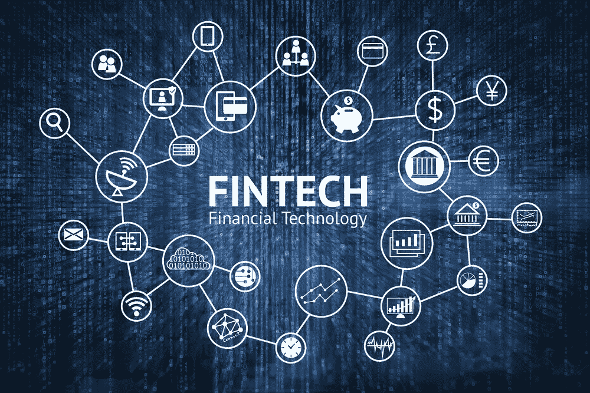

# 金融科技与银行的现实

> 原文：<https://medium.com/swlh/fintech-and-the-reality-at-banks-8148b8940dc2>

在我的收件箱里，我经常收到关于智能金融的电子邮件，生态系统中的数百家金融科技初创公司，一些金融科技初创公司从风投那里筹集了数百万美元，银行展示了他们的最新创新和金融科技中心。

我最近申请了房产再抵押(以资助我的创业之旅)。整个申请过程花了几个星期尽管事实上这是一家我与之有多年关系的银行，包括我的工资单、信用卡和现有的抵押贷款。

最后，**要求我在实体分行**开一个新账户，因为他们的后台不能这么做。因此，我要说，尽管围绕智能/虚拟银行进行了大肆宣传，但实体分行似乎还会存在一段时间。

当我在分行时，我被告知去接待处，因为我通常去的窗口不处理“新账户”，尽管事实上我实际上是一个现有的客户。作为新客户，我必须以某种方式重新开始与他们的关系。

只有一个接待处，排队的人到处都是。

终于轮到我了，一个初级工作人员回答。他真的很有帮助，但是他没有经验，所以他在表格和**影印方面犯了一些错误。**

当我在等的时候，我无意中听到一位女士非常恶毒地抱怨我等了很久。她抱怨说，一旦她签署了她的保险，**付款不应该要求她回到分支机构再次签署**。她等了很久，出去又回来，却发现唯一能帮忙的员工出去吃午饭了(所以不知何故只有一个员工能帮忙)。

我上面提到的那个大三男生一直在道歉。他的举止非常和蔼可亲，我真的很同情他，因为这显然不是他的错。

在这段时间里，一个更高级的工作人员走过，只是假装她什么也没看见。

最后，轮到我在窗口(同一个窗口告诉我先去接待处)，我问他们为什么在接待处安排一名初级工作人员。这位女士告诉我，因为显然没有其他有经验的员工愿意接受这份工作，所以这个可怜的家伙承担了所有的压力，并被天真地卖掉了，这是很好的培训。

前几天我在和另一家银行谈话。那个家伙自豪地说，他们在创新方面的最新成就之一是成为第一家拥有特殊类型指纹 ID 的银行，我忘了它的名字。

我不是一个技术人员，但当我问我的技术朋友时，**这基本上意味着如果有人砍掉我的手指并把它放在 ID 上，它就不会工作**我不会尝试，但假设其他银行的指纹 ID 会工作。

我不完全确定这种情况下的用例，但我认为这种情况非常罕见，所以质疑它的必要性。

鉴于我们在物理分支机构仍有许多工作要做的事实，**将资源用于解决这些问题，而不是率先做一些可能没多少人会用到的事情，不是更好吗？**

我不时会接到银行打来的随机电话，询问我是否需要个人贷款。**我真的希望银行能够利用他们的金融科技中心来更好地过滤这样做的客户，因为大多数时候这真的是在浪费人们的时间，他们只是在破坏他们的客户关系，或者非常努力地表现出他们不在乎。**

无论如何，我实际上有一次试图打电话要求个人贷款，但不知何故我到了信用卡贷款部，经过一些步骤后，他们告诉我，我所追求的是个人贷款，所以我不得不再次打电话给个人贷款部，因为他们不处理这一点。一定有更好的方法来处理暖铅。

我理解迁移系统和相关改革的难度，但如果银行没有能力做到这一点，**我们看到的所有金融科技难道不都是炒作吗？**

更难以想象的是，银行能帮助我们更接近实现财务自由或内心的平静，尤其是那些最需要的人。但这不正是他们向我们推销产品时想告诉我们的吗？

## 这篇文章发表在 [The Startup](https://medium.com/swlh) 上，这是 Medium 最大的创业刊物，有+395，714 人关注。

## 订阅接收[我们的头条新闻](http://growthsupply.com/the-startup-newsletter/)。

