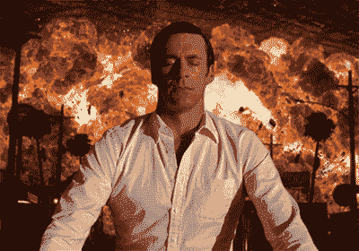

# 首先要做的事情——如何确定优先顺序

> 原文：<https://medium.com/swlh/first-things-first-how-to-prioritize-2eb02186eb80>

## 停止解决错误的问题

The hardest part about building a roadmap, the first problem to solve.

我明白了:你想当产品经理(PM)，但不知道从何下手。没关系，我想没人知道。通往产品的道路并不完美，它没有写在某个地方的教学大纲上或者由某个大师教授(但是如果它是完美的，那不是很酷吗！).这就是为什么来到这里如此令人困惑——**产品经理来自世界各地。**

我曾与来自工程、咨询、MBA 项目、营销、分析和金融的项目经理共事过。我以前是会计。虽然你开始的地方可能到处都是，但擅长的人会把一些事情做得非常非常好。

你准备好行动了吗？需要一些指点吗？你来对地方了。学习基础知识，并确定这是否适合你。

# **但首先要做的是…**

一个好的产品经理的关键是能够区分工作的轻重缓急。句号。结束了。

这不是你唯一需要擅长的事情。项目经理仍然需要计划，了解他们的用户，提供需求，分解标签，了解技术，研究，倾听，迭代，测试，运输，争论人，争论个性，衡量成功等等。

> 但是如果你不能优先考虑你的工作，你就是在浪费时间。

## 为什么分清主次这么难？有时候…

*   这是一笔大交易
*   你现在的客户不开心
*   [组织中的关键利益相关者“刚刚有了一个想法”](/slackjaw/emails-from-a-ceo-who-just-has-a-few-changes-to-the-website-43ccb7b31709#.8vzoralta)
*   你的朋友“刚刚有了一个想法”
*   客户支持部门忙得不可开交🙋
*   技术债务和遗留代码正在拖我们的后腿
*   新技术问题实施
*   在转弯处有一个伙伴关系
*   新的竞争对手让你紧张
*   是时候成长了，我们算规模了吗？
*   我们需要更多的收入

…仅举几个例子

## 好的，深呼吸，放松。这个很多，但是不难。

75,643,659 requests? No problem

在我告诉你答案之前，首先我要告诉你这个秘密，一些我需要你稍微理解的事情。**你不可能全部做到**。(这是不是像一吨砖头一样砸到你了还是怎么的)。你只有 4 个开发人员，一天只有 8 个小时，你要参加 87 个会议——仅仅从逻辑上讲，你不可能全部完成。但是你可以做一些事情，而且这些事情是优先考虑。

我试图将解决方案归结为一个简单而优雅的词，但现实击中了我。我需要两个——专注和平衡。

# **聚焦——什么火了？**

前几天我用了这个类比，它很可怕，但也有一定的道理，所以请原谅我——让我们假设你的脚骨折了，骨头向各个方向移动，这毫无意义。你自然会先做什么:去看医生还是涂脚趾甲？如果你对坏脚趾有意见，也许这不是最好的类比；但最重要的是，我在问你会先解决哪个问题。重要的还是不重要的。

> 一旦你知道了这个窍门，你就可以优先处理任何事情。这件作品是断了脚还是难看的脚趾？

这里有一个问题，不同的人对关键问题有不同的解释，作为项目经理，你的工作就是对此表示同情，但要记住公司的最大利益。这可以以多种形式出现。

*   公司的[北极星](https://blog.kissmetrics.com/alex-schultz-growth/)是什么，你试图鼓励什么样的行为来决定成败
*   这会影响多少用户，如果有的话。
*   公司的战略是什么——高管团队是如何决定他们将如何获胜的，为什么
*   公司处于融资的哪个阶段，进入下一阶段需要达到什么目标

(有许多技术可以帮助解释一个问题是真的大还是真的小，但我会把它留到以后的文章中。)

通过“这很重要吗？”传递想法和要求作为项目经理，sieve 将帮助您优化团队的时间，并帮助您在无止境的请求中导航。

This is how you do it right — illustration [kickpixel.com](http://kickpixel.com/)

# **平衡——理解&沟通权衡**

现在你知道你想解决哪些问题，你必须实际解决它(…并且你认为你的工作已经完成)。不要气馁，这实际上是有趣的部分——你可以解决问题，还有什么比这更有趣的呢？

我从一个可怕的类比开始，所以让我们继续下去。你现在有一只脚骨折了，我们将首先修复它，但是怎么做呢？

## 有几个选择，

*   给它打个石膏，一周之内就能让它发挥作用，但永远不能 100%发挥作用
*   也许你做了手术，你休息了两个月，但是痊愈了
*   或者可能是脚踝下的肌肉有问题，你需要先打电话解决。(*注*我是 PM 不是医生，脚踝下面有没有肌肉？*)

这在软件中同样适用。一旦你选择了你想要解决的问题，不要独自解决它。与你团队中优秀的设计师、开发人员和社区成员(他们被审查，然后再被审查)交谈，找出解决办法。一些解决方案既快又脏，而另一些则需要更多的时间，真正触及问题的核心，检查每一个问题。然后，作为完全负责任的项目经理，你要根据公司的需求权衡解决方案，并从时间、资源和有效性方面对其进行评估。

最好的项目经理会根据公司目标权衡每个选项的利弊，并提出建议。

> 你不会每次都做对，但成功的一半是做出选择，这由你来决定。

# 现在轮到你了！

也许这个类比很糟糕，你现在比以往任何时候都更困惑。或者也许天气像白天一样晴朗，我已经送你微笑着走向夕阳。但如果有一样东西，我希望你能拿走它。

> 作为总理，你的工作是选择要解决的问题，并召集优秀的人来帮助解决它。

花一分钟，了解问题，弄清楚它是否重要，然后找到最适合公司目标和时机的解决方案。简单对吗？

哦，别担心，我预定了这个周末的美甲。

*【好吧，我是这方面的新手，但如果你喜欢这个，我会喜欢你的* ♡ *和反馈，也许会与其他媒体人分享。然后点击* **(跟随)** *按钮保持最新更新。】*